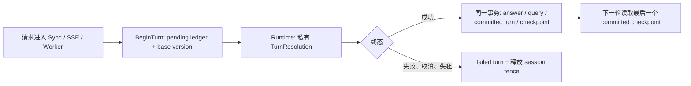

# 多轮会话状态权威、恢复与长会话压缩

- 状态：`P0 已完成本地实现与回归；P1 尚未启动`
- 优先级：`P0：状态权威与恢复；P1：长会话压缩`
- 设计权威：[多轮对话与上下文压缩工程设计](../data_agent_plan/多轮对话与上下文压缩工程设计.md)
- 关联：[上下文工程与Runtime下一步规划](上下文工程与Runtime下一步规划.md)、[低置信度反问协议TODO](低置信度反问协议TODO.md)

## 是什么

多轮会话不是“把更多聊天记录发给模型”。Data Agent 需要在每一轮结束后，明确保存当前分析任务已经确认、修改和等待确认的内容；下一轮从这份已提交的状态开始，而不是猜测历史文本。

系统里有三种不同对象，不能混为一谈：

| 对象 | 保存什么 | 是否权威 |
|---|---|---|
| 原始消息历史 | 用户说过什么、助手答过什么 | 是审计事实；助手历史不能自动当作业务事实 |
| `ConversationState` | 当前 route、产品、国家、时间、指标、限制、纠正、pending、证据引用 | 是本会话当前工作状态的权威 |
| Provider context | 本轮实际发送给模型的历史片段、结构化状态和知识 | 不是权威；每一轮都可重新编译 |

例如，第一轮问“看 Block Blast 美国近七天的 ROI”，第二轮说“改成英国”。正确的结果不是把两句话都塞给模型，而是形成一个新的会话状态版本：国家从 `US` 改为 `UK`，时间和指标保持不变，并留下这次修改对应的 turn 和来源。

“状态权威与恢复闭合”指的是：同步 API、SSE 和异步 Worker 都使用同一套 begin → execute → success/fail 的状态事务。服务重启、任务重试或并发请求之后，系统仍能读到同一份最后成功提交的状态。

## 当前真实情况

当前工程的短会话状态链已经闭合；长会话压缩仍没有进入生产路径。

| 能力 | 当前事实 |
|---|---|
| 历史文本续问 | 可用。Runtime 会读取最近消息；最多保留 8 条，历史正文最多约 6000 字。明确的“改成”“继续”“刚才”等追问常能继续处理。 |
| `TurnResolver` | 回答前生成六类 `TurnKind`、首轮显式 slot patch 和澄清恢复 patch。完整解析结果只在 Runtime 内存中传递。 |
| `ConversationState`、checkpoint、CAS、turn ledger | 每轮开始先写 pending turn，固定 `base_state_version`；成功时写 checkpoint 和 committed turn，失败时只写 failed turn。 |
| sync API、SSE、Worker 的状态提交 | 三条调用链共用 begin → execute → success/fail。回答、query record、turn ledger 与 checkpoint 在同一成功事务中提交。 |
| 并发保护与恢复 | 同一 session 只允许一个执行中的 turn：同步请求返回 409，Worker 任务释放租约后重排队。CAS 或持久化失败不会保留成功答案或推进状态版本。 |
| 澄清等待与恢复 | 等待时写入 durable pending；用户选择经 P3 持久化校验后，恢复轮次清除 pending 并写入已选时间窗口。 |
| Context Compiler 与 reducer | 组件和单测已存在，生产 provider 路径没有调用者。 |

P0 完成后的实际流转如下：

因此，短会话不再只依赖有限历史文本。历史文本仍用于语言理解，但当前分析状态、纠正记录、等待项与并发顺序以 checkpoint 和 turn ledger 为准。

## 为什么先做状态权威与恢复

1. **正确性优先于连贯措辞。** 文本历史可以帮助理解“改成英国”，但不能证明旧值是什么、这次替换是否已提交，或多个请求谁先谁后。
2. **异步路径不能依赖进程内对象。** Worker 重启、重试和扩容后，内存中的上下文会消失；数据库中的已提交 checkpoint 才能恢复。
3. **需要可审计的纠正。** 用户把“实际 ROI”改成“预测 ROI”时，系统应保留旧值、新值、来源 turn 和生效版本，不能只让模型从自然语言里猜。
4. **压缩必须有不被压缩的底座。** 如果先总结历史，再建立结构化状态，摘要一旦遗漏产品、国家、时间或 pending，后续回答就会在错误上下文上继续。

## P0 已完成的构件

### 状态权威与恢复

1. **开始一轮会话**
   - sync API、SSE 和 Worker 统一生成 `turn_id`，并在调用 Provider 前提交 pending turn。
   - 读取 latest committed `ConversationState`，固定 `base_state_version`。
   - 同一 session 的同步请求明确拒绝；Worker 明确重排队，不会默默覆盖。

2. **把完整解析结果带到提交端**
   - 使用服务端私有 `ConversationTurnContext` 和 `TurnResolution` 传递 `turn_id`、`base_state_version` 与完整 patch。
   - 对外 metadata 只保留安全投影，不保存 slot 值、用户原话或业务结果。
   - 不再让提交端从 metadata 猜测状态 patch。

3. **在成功终态原子提交**
   - 回答、query record、turn ledger 和 checkpoint 必须在同一成功事务中提交。
   - checkpoint 使用开始时固定的 `base_state_version` 做 CAS；冲突回滚成功终态，保留 failed turn 或进入受控重试。
   - 只有成功回答才推进版本，例如 `v0 → v1 → v2`。

4. **明确失败和恢复语义**
   - provider 失败、用户取消、Worker lease lost、任务重试、状态损坏和 CAS conflict 不得推进 checkpoint。
   - failed turn 需要写入失败终态；Worker 重启后从最后一个 committed checkpoint 恢复，而不是从空状态或旧内存恢复。

5. **完善状态生产和迁移规则**
   - 首轮要稳定产生产品、平台、国家、时间、指标和限制等基础状态，不能只给短追问生成 patch。
   - correction 必须记录真实旧值和新值；topic switch 必须清理不再适用的状态；clarification 必须绑定 durable pending；cancel/restart 必须执行明确的 `state_clear`。
   - 给下一轮的 prior state 投影覆盖 `topic`、`entities`、`time`、`metrics`、`constraints`、`corrections`、`pending` 和 `evidence_refs`，并加 PII、字段 allowlist 和长度门禁。

6. **用主链验证，而不是只跑组件单测**
   - 已对 sync API、SSE、Worker 分别验证成功提交；验证首轮、续问、纠正、切题、澄清恢复、失败与同 session 竞争的 DB 状态迁移。
   - 验收时直接核对 checkpoint 与 turn ledger；页面能连续对话不能作为结构化多轮完成证据。

### P1：长会话压缩

长会话压缩不是现在的阻塞项。当前 8 条消息和 6000 字的硬边界足以支撑短追问，但不能支撑持续分析、反复纠正或 20 轮以上的会话。

压缩应该在 P0 完成后启动，满足以下任一条件即可排期：

- 真实会话已频繁触及历史字数或模型输入预算；
- 20/50/100 turn 回放出现历史截断导致的参数遗漏；
- 需要在同一 session 内保留多个已完成分析任务的证据引用和纠正记录。

压缩的规则：

- `ConversationState` 中的 topic、slots、corrections、pending、freshness 和 evidence refs 不参与有损压缩；
- 原始消息、query record 和工具事件保留为审计事实；
- reducer 只生成可失效、可重建的派生摘要，并绑定 source turn 范围和 source prefix hash；
- Provider context 由 Context Compiler 按预算选择结构化状态、近期消息、摘要和本轮知识；
- 摘要失败、校验失败或 source hash 不匹配时，保留旧视图或退回确定性裁剪，不能提交半成品摘要；
- 工具调用与工具结果必须成对保留或删除，不能切断关联。

**结论：长会话压缩最终有必要，但不应先于 P0。** P0 解决“状态是否正确、能否恢复”；P1 才解决“在状态正确的前提下，如何控制模型输入预算”。

## 完成定义

### P0 完成（已达成）

- sync API、SSE、Worker 都能从 DB 证明 `v0 → v1 → v2` 的状态推进。
- 失败、取消、lease lost、CAS conflict 和 Worker 重试都不会污染或回退已提交状态。
- 六类 TurnKind 均有状态迁移断言；纠正、切题和澄清不依赖历史文本猜测。
- 对外 trace 和 metadata 不泄漏状态值、用户原话、SQL 或结果行。

### P1 完成

- Context Compiler 真正决定 provider 输入，且记录安全的 segment、预算和压缩决策。
- 20/50/100 turn 回放后，pinned state、corrections、pending、freshness 和 evidence refs 不丢失。
- 压缩失败不覆盖已提交状态或派生摘要；工具消息边界保持完整。

## 不在本任务中做

- 跨 session 长期记忆；
- 编辑历史消息树产品化；
- 整体迁移到 LangGraph、AutoGen 等框架；
- 自动停投、放量、改预算或广告平台写操作。
