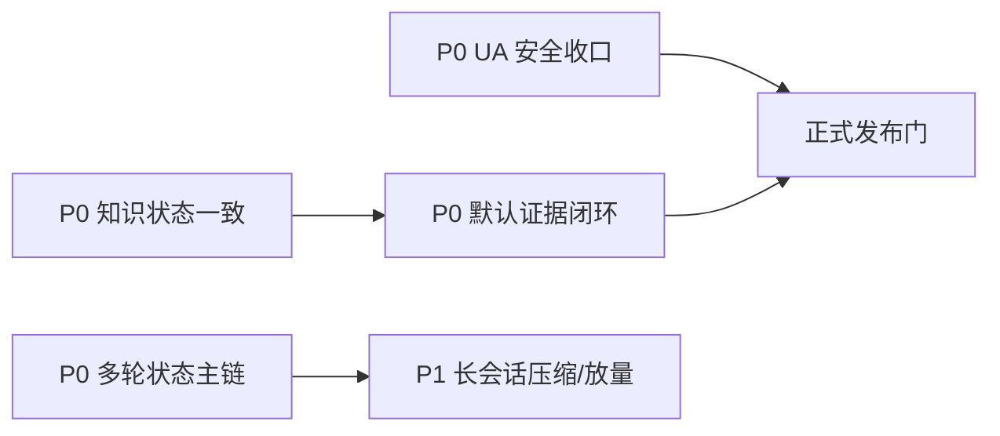

# 工程评审后续收口总表

- 状态：`active_index`
- 更新：2026-08-04
- 范围：收敛本次客观工程评审明确提出的未来事项；不把其他全库 quality gap 追加进来，也不将产品边界误记为缺陷。

## 一、总体结论

179 张表卡、状态分级、语义模型、authority map 和检索策略是强项。本清单不是要重做知识库，而是收口“资产已建成”到“线上默认可信、可审计、可发布”之间的最后几个系统性缺口。

本表只做路由和排序；每项的实施、验证和完成定义以专项文档为准，不在此复制。

## 二、未来 TODO 总表

| 顺序 | 优先级 | 事项 | 当前事实 | 专项文档 | 主要关闭证据 |
|---:|---|---|---|---|---|
| 1 | P0 | 无认证 UA 开发旁路正式上线前收口 | 开发期便捷入口可保留；不能直接进入正式 Ingress | [`UA无认证旁路上线前收口.md`](UA无认证旁路上线前收口.md) | Prod 匿名拒绝、SSO/service auth、CORS、限流/审计、rebuild 异步化和发布 smoke |
| 2 | P0 | 知识状态与 Runtime 授权一致 | 主干已以表卡为状态权威并 fail-closed；尚待下一次 Test/Prod 真实入口验收 | [`知识状态与Runtime授权一致性收口.md`](知识状态与Runtime授权一致性收口.md) | Test/Prod 对普通检索、探索检索和 SQL binding 的一致性验收 |
| 3 | P0 | 证据覆盖与终态裁决生产启用 | route 证据模式、强证据 fail-closed 和本地 Runtime 回归已完成；代码默认仍 `off`，Prod 未默认验证 | [`证据覆盖与终态裁决生产启用收口.md`](证据覆盖与终态裁决生产启用收口.md) | claim 最低证据、Prod route 分档、canary、回滚和错放/误拒指标 |
| 4 | P0/P1 | 结构化多轮状态主链与长会话压缩 | 底层组件/单测已有；完整 TurnResolution、checkpoint 提交和 Context Compiler 未接入真实主链 | [`多轮对话建设.md`](多轮对话建设.md) | API/SSE/Worker `v0→v1→v2`、六类 TurnKind DB 迁移、并发/CAS、Worker 重启和 20/50/100 turn 压缩 |

## 三、依赖与执行顺序

建议顺序：

1. **先安全与授权**：UA 旁路是正式发布硬门；知识状态漂移是证据闭环的前置。
2. **再收口默认证据**：不在错误 eligible asset 上开启终态裁决的 `enforce`。
3. **多轮 P0 可并行**：先闭合 checkpoint/turn/envelope，再做压缩和放量。
4. **5 张 pitfalls 按证据等人回话**：不阻塞其他工作，也不为了降 gap 数猜测回填。

## 四、状态报告口径

后续汇报必须分开：

- `implemented`：代码/文档存在；
- `unit_verified`：组件测试通过；
- `mainline_integrated`：真实 API/SSE/Worker 已接入；
- `test_verified`：Test 环境有可回放证据；
- `production_verified`：Prod 有当前版本、配置和真实行为证据。

任一个 TODO 只有在其专项“完成定义”全部满足后才能关闭；Test 通过、同 SHA、某个 canary 成功或文档写完均不能单独等价为生产完成。

## 五、明确不纳入缺陷

- 不自动停投、放量、改预算或调用广告平台写操作：这是只读分析与预警产品边界。
- 不为了证明知识建设强而把 raw/draft/snapshot/TODO 提升为 verified 事实。
- 不把“179 张表卡中 5 张待补 pitfalls”夸大为表卡体系失败。
