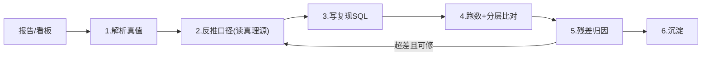

# SOP: 报告/看板数据可信度反查

## 元信息

| 项 | 内容 |
|---|---|
| ID | `sop_20260616_report_data_recon` |
| 状态 | verified（已由 2 个跨类型案例实证） |
| 适用问题 | 任意报告/看板（HTML/xlsx/截图导出）的数据是否可信、能否用数仓复现、与底层口径是否一致 |
| 适用范围 | ClickHouse(分析平台 看板) 与 MaxCompute(cohort 归因) 两类底座均验证可用 |
| 关联案例 | `../../数据资产目录/audit_archive/mi_分析平台_board_recon/`、`../../raw_exports/示例产品_arpu验证/recon_report.md` |

## 分析目标

仅凭一个报告/看板，反推出它依赖的表与 SQL，跑数与报告逐项比对，在分类容差内判定一致；不一致时用证据把残差归因到可解释的口径（而非含糊的"差不多"），区分「口径错误」与「数据客观差异」。

## 核心流程（控制论闭环）

## 分析步骤

1. **解析真值**：把报告内嵌数据提成机器可读真值。HTML 看板找 `<script type=application/json>` 或 echarts `series.data`；xlsx 用 SheetJS/pandas；落成 CSV，记录粒度(维度)与指标列。
2. **反推口径(关键)**：口径不靠猜，按可信度优先级找真理源 —— 生产代码(如 nexus handler) > `knowledge/agent_knowledge/semantic_contract/model.json` > `数据资产目录`/`数据资产目录` 数据资产目录 > verified_sql。拿到「报告字段 → 底层字段 → 计算口径」的精确映射。
3. **写复现 SQL**：按报告粒度 GROUP BY；注意维度对齐(见残差清单)与跨维聚合(报告缺某维度时须 SUM 掉它)；多表(消耗/回收/留存)用 JOIN 或分查后对齐。
4. **跑数 + 分层比对**：
   - L0 全样本求和(总量级先对齐)
   - L1 按关键维度汇总(日期/渠道/campaign)
   - L2 逐行/逐单元格明细
   - 只比对报告有值的单元格。
5. **残差归因(必做)**：超出容差的，用证据定位根因（见残差归因清单），判断是口径可修、还是数据客观差异不可消除。
6. **沉淀**：稳定 SQL → `verified_sql/`；完整现场证据 → 对应知识库 `audit_archive/evidence/`(MC 侧)或 `数据资产目录/audit_archive/`(CK 侧)；订正/补充 → 数据资产目录 `known_pitfalls` + 维度字典；并双向回链。

## 容差标准（分层分类）

| 指标类型 | 标准 | 期望 |
|---|---|---|
| 确定性(计数/留存/注册) | 期望 bit 级一致 | 不一致即 join 或口径错误 |
| 求和类(消耗/展示/点击) | 相对 ≤0.5%；小额加绝对兜底 | 残差多为快照差/长尾 |
| 比率/预测类(ROI/CPI/eCPM) | 绝对 ≤0.005 或相对 ≤2% | 残差多为时间差/数据源口径 |

## 残差归因清单（从案例提炼，优先排查）

| 现象 | 根因 | 判别证据 |
|---|---|---|
| 系统性单向偏差(CK>报告) | 历史快照 vs 当前回填 | 偏差随日期变新而增大；回收/消耗只增不减；不回填指标(留存)一致 |
| 比率对、绝对量偏 | 数据源口径(聚合宽表 vs 明细事件表) | 守恒量一致(如激励ARPU)，分母/分子单口径偏(如 pv 偏大致 eCPM 偏低) |
| 行对不上/少量缺失 | 维度格式差 | CK `country=US` vs 展示 `US-美国`；需取代码段对齐 |
| 行数/数值整体偏大 | 跨维聚合遗漏 | 报告无 media 维度却没 SUM 掉 media |
| 某些单元格永远对不上 | 预测段不可复现 | 来自应用层预测/外部模型，底表无该粒度预测值 |
| 小额行相对误差超标 | 长尾分母效应 | 绝对差极小、占比集中在小额行 |

## 工具

- ClickHouse(`shucang_market`)：`clickhouse-shucang` skill 的只读 helper。
- MaxCompute(`hs_market`)：`maxcompute-dataworks` skill 的 helper。
- 口径真理源：nexus 后端代码、`../../knowledge/agent_knowledge/semantic_contract/model.json`、`../../数据资产目录/agent_knowledge/tables/*.yaml`、`../../数据资产目录/agent_knowledge/metrics/`。

## 判断规则

- 确定性指标(如 count、注册数)100% 一致，是 join 与维度对齐正确的最强信号；先用它兜底再看比率。
- 残差必须归因到具体环节，不可"差不多就算一致"。
- 区分 `verified`(可复现) 与「口径性不可复现」(预测段、明细表缺失、历史快照丢失)，后者如实标注、不强行凑。
- bit 级对齐受限于历史快照可得性；无快照时以分类容差 + 残差归因为准。

## 已验证案例

| 案例 | 报告类型 | 底座 | 复现核心 | 残差根因 |
|---|---|---|---|---|
| `mi_分析平台_board_recon` | 分析平台 看板逐行(14781 行) | ClickHouse | 求和/留存 100%、ROI 实际段 97~98% | 历史快照 vs 当前回填 |
| 示例产品_ARPU 对账 | 首日 ARPU 归因 | MaxCompute cohort | 激励 ARPU 逐日一致、趋势 100% | pv/非激励收入数据源口径 |
