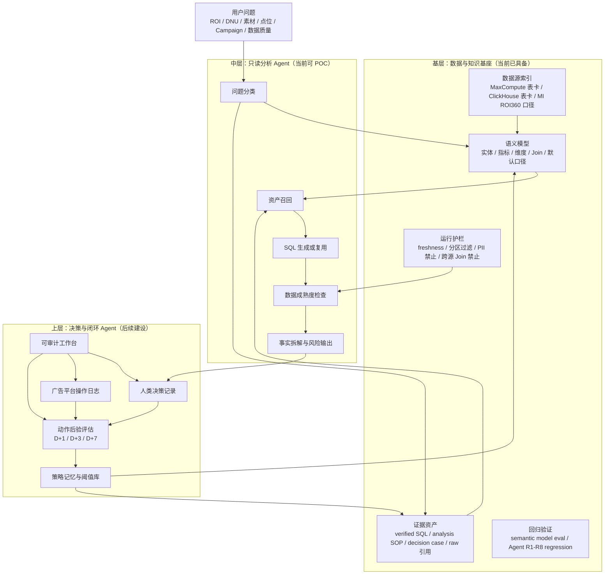
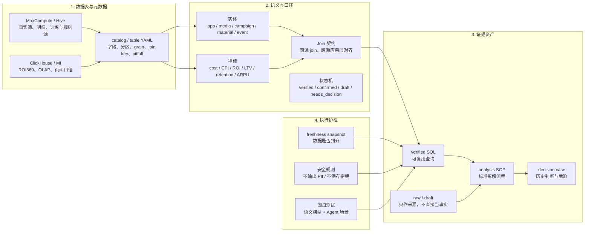
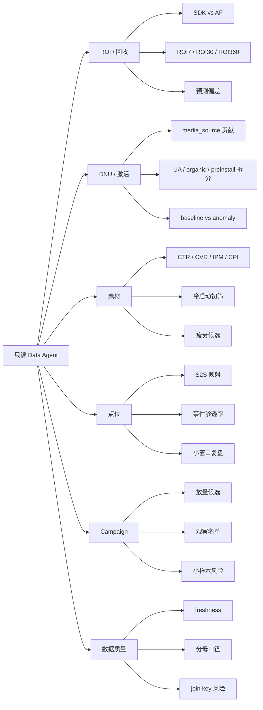
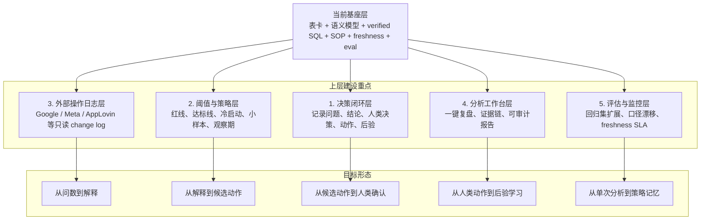
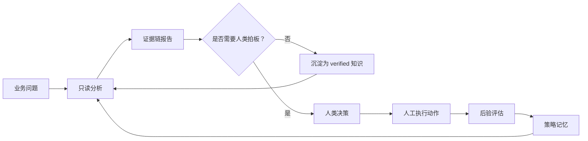

# Data Agent 数据基座框架

> 展示用途：描述当前数仓 Agent 知识库如何支撑“只读分析型 Data Agent”，以及后续上层能力还需要怎么建设。  
> 脱敏原则：只展示架构、能力、状态和抽象流程，不暴露数据库凭据、Token、账号、用户级明细或广告平台操作人。

## 一句话定位

当前目录已经形成一个面向投放分析的 **Data Agent 基座层**：它把数据表、业务口径、语义模型、verified SQL、SOP、case、freshness 和回归测试组织成可被 Agent 召回和验证的知识底座。

现阶段适合启动 **只读 POC**：回答“发生了什么、怎么拆、风险在哪里、还缺什么确认”。  
还不适合启动自动动作：放量、停投、降预算、预算迁移等仍需要人类拍板和后验闭环。

## 总体框架



## 当前基层拆解



## 当前可支持的问题



## 当前质量判断

| 模块 | 当前状态 | 评价 |
|---|---|---|
| 表卡与 catalog | 已覆盖主链路 | 可以支撑 Agent 找表、理解字段、识别分区和 join key |
| 语义模型 | 已有机器可读模型与回归 | 是基座最关键的加分项，减少临场拼口径 |
| verified SQL | 已沉淀一批高频问题 | 能支撑只读问答，但素材 ROI、点位扩窗还要补 |
| SOP / case | 已有流程和草稿 case | SOP 可用，case 还缺动作和后验闭环 |
| freshness | 已有 CK / MC 快照 | 能避免“数据未到当劣化”，但需要持续刷新 |
| 回归验证 | R1-R8 通过 | 具备 POC 入场条件 |
| 自动动作 | 暂未建设 | 正确，当前不应自动停投、放量或改预算 |

## 上层还需要建设什么



## 建设优先级

### P0：先把只读 POC 跑稳

1. 选择 3 条端到端演练：DNU 下滑、首日 ARPU 下滑、Campaign 观察名单。
2. 每条都固定输出：问题识别、口径参数、freshness、使用资产、SQL、主要事实、风险、待确认项。
3. 把演练结果补进 `da_assets/decision_cases/`，即使暂时没有动作，也要记录“为什么不能下动作结论”。

### P1：把人类经验结构化

1. 找 DA 补 SQL、成熟窗口、baseline/anomaly 选择、素材和点位 join 口径。
2. 找 UA 补冷启动、小样本、放量、降预算、停投、继续观察的判断边界。
3. 把确认后的规则迁入 `knowledge/`、`semantic_model/` 或 `da_assets/`，不要长期留在 TODO。

### P2：接入外部只读操作记录

1. 先做 Google Ads / Meta change log 的只读工具。
2. 只记录脱敏摘要：什么对象、什么时间、什么字段发生变化。
3. 不做自动预算调整、自动暂停、自动出价修改。

### P3：形成闭环 Agent

1. 建立标准链路：`question -> SQL -> result -> conclusion -> human_decision -> action -> aftereffect`。
2. 每个动作后补 D+1/D+3/D+7 后验。
3. 让策略从“经验描述”升级为“可审计、可回放、可迭代”的策略记忆。

## 推荐的目标蓝图



## 当前最重要的判断

这个基座现在最大的价值不是“自动替人做投放动作”，而是把 Agent 从临场猜测拉回到一条可控链路：

```text
先识别问题
再召回可信资产
再检查数据是否成熟
再用 verified SQL / semantic model 生成事实
最后输出拆解、风险和待确认项
```

下一阶段的核心，不是继续堆更多文档，而是补 **人类决策 + 操作记录 + 后验评估**。只有这个闭环建立后，Data Agent 才能从“分析助手”升级为“投放治理系统的认知层”。
