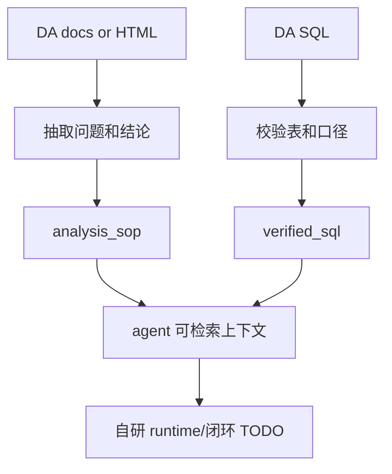
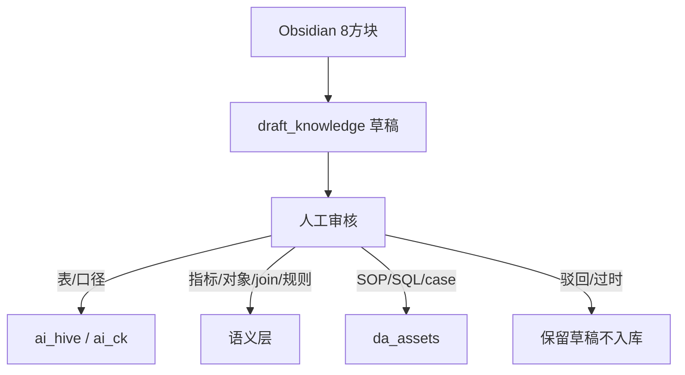

# Data Agent 语义底座推进计划

> 更新日期：2026-06-13  
> 范围：`ai_hive` 口径修复、`ai_ck` ClickHouse 表知识库、语义层待办、DA 报告与 SQL 沉淀。  
> 当前方向：自研开源 DataAgent runtime；闭环层数据库和自动执行投放动作仍暂缓。

<!-- 自动快照：开始 -->

> 自动快照：2026-07-02；生成脚本：`python3 tools/scripts/refresh_data_agent_snapshots.py`；来源：`eval/agent_regression/Agent回归报告.md`、`knowledge/agent_knowledge/semantic_contract/model.json`、`da_assets/index.yaml`。

| 项 | 当前值 |
|---|---|
| 问答回归 | 通过 — 11/11 cases passed, 0 freshness-blocked, knowledge 7/7 routes 17/17 golden 80/80 (门槛 10 pass_or_blocked) |
| 数据新鲜度门禁 | 正常 |
| 语义模型 | 11 个实体、38 个维度、50 个指标、3 条关联规则；16/16 个语义用例通过 |
| 表卡覆盖 | ai_hive 123 张表；ai_ck 27 张表；CK 精选表画像 55 份 |
| DA 资产 | 已验证 SQL 28 条；候选 SQL 2 条；决策记录 9 个；已闭环 1 个 |
| 北极星覆盖 | 约 16/35 个高频场景，概念覆盖率约 46% |

- 数据新鲜度门禁：正常

路线图说明：静态阶段描述保留历史背景；当前状态以上方自动快照为准。

<!-- 自动快照：结束 -->

## 目标

把现有 MaxCompute 表知识库和 ClickHouse/MI 投放数据线索整理成一个可被自研开源 DataAgent runtime 稳定使用的广告投放语义资产底座。

第一阶段的验收口径：

- `ai_hive` 不再出现 安装/激活用户数分母 / 达成率分母冲突。
- `ai_ck/` 有 ClickHouse/MI 投放报表的 P0 表卡和使用护栏。
- 语义层缺口被显式列出，后续能按指标、对象、join、判断规则逐项补齐。
- DA 报告和 SQL 有固定沉淀目录与模板。
- 自研开源 DataAgent runtime 进入只读 POC 路线；闭环层和自动动作不在本阶段展开。

## 当前输入

| 类型 | 路径 / 能力 | 说明 |
|---|---|---|
| MC 知识库 | `../ai_hive/` | MaxCompute 表目录、表卡、口径决策、RAG bundle |
| MC 查询能力 | `maxcompute-dataworks` | 已验证 `SELECT 1` 可执行 |
| CK/MI 代码线索 | `/Users/<dev>/HS/coding/nexus` | MI ROI360 报表字段、聚合口径、表路由 |
| PGP CK 接入线索 | `/Users/<dev>/HS/coding/sibling-platform` | ClickHouse 配置、只读 client、验真文档 |
| PGP CK 文档 | `sibling-platform/docs/03-架构设计/06-CK表结构与验真.md` | P0 CK 表、join 原则、验真 SQL |
| DataWorks 数据专辑 | 用户增长Topic | 55 张增长相关专题表；已生成缺口报告 `用户增长Topic表缺口报告.md` |
| Obsidian 候选知识 | `/Users/<dev>/HS/obsidain/lzyzsere/8方块` | 投放术语、S2S、素材、campaign、AppLovin / partner 语义；先进入草稿区审核 |

## Phase 1：修复 `ai_hive` 口径冲突

### 修复目标

`口径决策记录.md` 是 安装/激活用户数分母 / 达成率最高优先级真理源：

- 安装/激活用户数分母：`ods_appsflyer_all_in_app_events_report_di`，`event_name='install'`，`COUNT(DISTINCT COALESCE(customer_user_id, appsflyer_id))`，按 `dt` cohort。
- A 口径分子：`wide_ha + *_cumulative`。
- `wide_ha` 禁止作为 安装/激活用户数分母，因为仅覆盖 AF install 的 73-82%，会高估达成率。
- `activation_di` 仅作校准表，非默认分母。

### 修复文件

| 文件 | 动作 |
|---|---|
| `../ai_hive/agent_knowledge/tables/dws_market_capi_user_hourly_metrics_wide_ha.yaml` | 去掉“分子分母同源/单表完成”表述 |
| `../ai_hive/discovered_tables.yaml` | 同步 wide_ha 口径 |
| `../ai_hive/agent_knowledge/tables/dwd_market_appsflyer_activation_push_data_di.yaml` | 把 安装/激活用户数分母候选改为校准表 |
| `../ai_hive/README.md` / `../ai_hive/agent_knowledge/catalog.yaml` | 统一表数和层级入口 |
| `../ai_hive/agent_knowledge/tables/dwd_market_s2s_platform_push_log_hi.yaml` | 澄清 push_log 不参与分母/分子 |
| `../ai_hive/agent_knowledge/tables/ods_appsflyer_all_in_app_events_report_di.yaml` | 示例 SQL 统一 COALESCE 去重键 |

## Phase 2：建立 `ai_ck/`

`ai_ck/` 是 ClickHouse/MI 投放报表知识库，不替代 MC 事实源。CK 用于页面高频 OLAP 和投放复盘查询，训练、规则发现、标签校验仍以 ODPS/MC 为准。

### 初始目录

```text
ai_ck/
  README.md
  catalog.yaml
  agent_manifest.yaml
  来源索引.md
  schema/TABLE_TEMPLATE.yaml
  tables/*.yaml
  queries/verified/*.sql
```

### P0 表

| 表 | 用途 |
|---|---|
| `shucang_market.dim_market_campaign_s2s_event_map_da` | `s2s_event` 到 campaign/adset 映射 |
| `shucang_market.tj_ad_spend_active_v2` / `_view` | 消耗、展示、点击、注册、CPI、CPM、CTR |
| `shucang_market.tj_ad_sdk_revenue` / `_view` | SDK 回收收入，ROI360 默认 `revenue_source=sdk` |
| `shucang_market.tj_ad_revenue_v2` / `_view` | AF 回收收入 |
| `shucang_market.af_cohort_user_acquisition_v2` / `_view` | cohort 留存 |

### CK 口径原则

- ROI360 / campaign 当前默认走阿里云 CK view，PGP 文档和 nexus 代码中常见 `_view`。
- PGP 诊断文档也引用物理表，表卡需要同时记录物理表和实际 view。
- campaign 与 MI 交互短期主字段是 `campaign_name`，必须保留原始字符串，不可 trim 后传给 MI。
- 建模稳定性上 `campaign_id` / `adset_id` 更强，但切换需要 MI 支持实证。
- 消耗日期多用 `active_date`，留存需要 `dt >= start_date` 且按 `date_diff` 取指标。

## Phase 3：语义层待补

语义层不再只描述表字段，而要沉淀投放分析判断。

### 分工边界

| 事项 | 用户负责 | Agent 负责 |
|---|---|---|
| 官方口径拍板 | 决定 organic 是否计入、SDK/AF 回收取舍、成本/安装分母、红线/达标线 | 汇总证据、列出冲突、给出可选方案 |
| 指标公式 | 确认业务使用哪套公式 | 从 nexus、MI、MC、CK 中抽取实现口径并验证 |
| 业务阈值 | 决定放量/降预算/停投/观察阈值 | 从周报、DA 报告、SQL 里提取候选阈值并标注风险 |
| 表与 join | 确认业务上哪个对象是主对象 | 建表卡、查 schema、跑小窗口 SQL、写 join 护栏 |
| DA 报告 / 周报 | 提供原始材料、判断哪些结论可用 | 抽问题集、写 SOP、生成 verified SQL、沉淀 case |
| 正式入库 | 审核草稿是否进入正式知识库 | 维护 `ai_hive` / `ai_ck` / `da_assets` / `data_agent_plan` |

### 当前已完成资产

| 类型 | 文件 |
|---|---|
| 语义层(双源+治理) | `knowledge/agent_knowledge/semantic_contract/model.json`(实体/维度/指标/回归数以上方自动快照为准；含 governance/diagnostics) |
| MI ROI 指标实现 | `ai_ck/agent_knowledge/metrics/ROI360指标语义.md` |
| MC ↔ CK/MI 对齐 | `ai_ck/agent_knowledge/metrics/`、`knowledge/agent_knowledge/semantic_contract/model.json`、相关表卡 |
| 设备 / 用户资产对齐 | `da_assets/verified_sql/vsql_20260616_sdk_revenue_dwd_dws_boundary_validation.md`、相关表卡 |
| 周报问题集 | 原 `TODO/周报问题积压清单.md` 已于 2026-07-14 归档，周报问题追踪由 `eval/真实问题验收集/` 接替 |
| DA 入库清单 | `da_assets/下一批入库清单.md` |
| verified SQL | `da_assets/verified_sql/`；数量以自动快照和 SQL 晋升报告为准 |

### 用户增长 Topic 缺口

DataWorks 数据地图「用户增长Topic」共 55 张表，补表前 `ai_hive` 已收录 3 张，缺 52 张且均在线存在。当前已补 P0 的 11 张 MI/ROI 主链路与预估表、P1 的 19 张媒体 API / campaign / 素材 / Meta CAPI 表、P2 的 20 张设备/用户资产表、P3 的 2 张低频 adset / creative 元数据表。缺口报告见：

```text
data_agent_plan/用户增长Topic表缺口报告.md
```

用户增长 Topic 表卡已全部补齐；后续重点转为 MC/CK/MI 口径校准、DA SQL 验证和高频问题 verified SQL 沉淀。

### 指标

- 成本：`total_cost`、`total_cost_zhe`、`reduce_spend`、返点、汇率。
- 转化：AF register、media install、CTR、CVR、IPM、CPI、CPA。
- 回收：`revenue_source=sdk/af`、`revenue_N`、`total_revenue`、ARPU。
- ROI/LTV：`ROI_N`、`ROAS`、`LTV_N`、`LTV_X/Y`。
- 留存：`retention_N`，分母为 `date_diff=0` 的 cohort 用户。
- 点位：安装/激活用户数分母 / A 口径达成率、B 口径应推/实推、S2S 健康。

### 对象与 join

- 游戏 / app / bundle / store。
- media source / account / campaign / adset / ad / material。
- country / cohort date / active_date / revenue_date / event_date。
- `s2s_event` / PGP point event / campaign 映射。
- MC AF ODS 与 CK spend/revenue/cohort 的桥接关系。

### 判断规则

- 放量、降预算、停投、观察。
- 数据延迟 vs 真实劣化。
- 有消耗无回收、消耗有但留存无、映射有但事实表无。
- campaign 映射陈旧、前导空格、campaign_name 与 campaign_id 不一致。
- organic 是否计入官方 KPI，仍需业务签字。

## Phase 4：DA 报告和 SQL 使用方式

DA 的钉钉 docs、HTML、SQL 都可以进入 `da_assets/`。第一阶段先人工沉淀，不追求全自动解析。

### 目录

```text
da_assets/
  raw/
  verified_sql/
  analysis_sop/
  decision_cases/
  index.yaml
```

### 处理流程



每条 `verified_sql` 至少记录：

- 原始业务问题
- 适用场景
- 依赖表
- 时间口径
- 维度和指标
- SQL
- 预期输出
- 风险提示
- 验证状态

## Phase 5：Obsidian 草稿知识审核流

`8方块` 是 PM / 投放视角的知识库，价值高但含工作日志、待确认口径、IM 原文和历史快照。因此不直接进入正式 agent 知识库，先进入 `knowledge/audit_archive/draft_knowledge/`。

### 草稿区

```text
knowledge/audit_archive/draft_knowledge/
  README.md
  INDEX.md
  来源清单.md
  02_投放漏斗指标草稿.md
  03_S2S链路操作模型草稿.md
  05_Campaign素材优化草稿.md
  06_AppLovin与Partner操作草稿.md
```

### 入库流程



### 审核规则

- 草稿默认 `needs_review: true`，正式 agent 不直接召回。
- 与 `ai_hive/agent_knowledge/口径决策记录.md` 或 `ai_ck/agent_knowledge/metrics/ROI360指标语义.md` 冲突时，以已验证知识库为准。
- 只抽业务语义、指标公式、判断规则、SOP、待确认问题和源文档引用。
- 不复制 AK/SK、API key、token、cookie、人名 IM 原文、用户级明细。
- 审核通过后再 promote 到 `ai_hive` / `ai_ck` / `da_assets` / 语义层。

## Phase 6：暂缓 TODO

### 自研开源 DataAgent runtime POC

路线统一为自研开源 DataAgent runtime，不再比较或依赖外部承载框架。

第一版只做只读闭环：

- 任务识别：把自然语言问题标准化为任务类型、产品、端、时间、维度、指标和 freshness 要求。
- 检索路由：消费 `AGENT_RETRIEVAL_MAP.yaml`、catalog、manifest、表卡、semantic contract、verified SQL 和 SOP。
- 门禁执行：强制 freshness / PII / source / owner / raw-draft gate。
- SQL 路径：优先复用 verified SQL；缺口场景只生成带字段证据的 candidate SQL。
- 结果校验：检查分区、行数、空值、指标方向、候选状态和业务动作边界。
- 资产回写：把 candidate SQL、validated SQL、SOP、decision case、待拍板事项写回既有目录。

触发条件：`ai_hive + ai_ck + da_assets` 已至少沉淀 10 条 verified SQL、3 个分析 SOP、1 个端到端复盘 case；`draft_knowledge` 中保留草稿完成审核或明确驳回；`AGENT_RETRIEVAL_MAP.yaml`、表卡质量、SQL 晋升、knowledge consistency 和 agent regression 全部通过或被 freshness gate 明确阻断。

### 闭环层

后续设计 `question -> SQL -> result -> conclusion -> human decision -> action -> aftereffect` 记录结构。第一阶段只在 `da_assets/decision_cases/` 用 markdown 样例沉淀，不建数据库。

## 验收清单

- 全文搜索 `wide_ha/安装/激活用户数分母 / 达成率/分母`，无冲突口径。
- `README.md`、`catalog.yaml`、表卡数量一致。
- `ai_ck` P0 表卡具备 grain、date field、join key、metric fields、pitfalls、example SQL。
- `语义层待补清单.md` 有可执行条目。
- `da_assets` 有模板和 `index.yaml`。
- `draft_knowledge/INDEX.md` 能索引所有草稿，且正式知识库不直接引用未审核草稿作为事实。
- 不出现 secrets、token、AK/SK、ClickHouse 密码。
