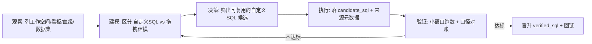

# Quick BI 看板 SQL → verified_sql 收割计划

## 元信息

| 项 | 内容 |
|---|---|
| ID | `plan_quickbi_sql_harvest` |
| 状态 | `plan` / `pending_execution`（未执行，无连通性证据） |
| 创建 | 2026-06-16 |
| 计划执行 | 2026-06-17 |
| owner | 用户 + AI |
| 平台 | 阿里云 Quick BI **国际站 us-east-1**（美东）；endpoint `quickbi-public.us-east-1.aliyuncs.com` |
| 凭据 | 国际站(alibabacloud.com)账号 AK/SK（待确认主账号或 RAM 子账号） |
| 目标看板 | WorksId `3c189a7f-2676-4e00-b243-c8f734c92339`（用户提供，先攻这一个，暂不全量盘点） |
| 关联 | 晋升治理 `../da_assets/SQL晋升治理.md`；复现 SOP `../da_assets/analysis_sop/20260616_报告看板数据可信度反查SOP.md`；范例 `../da_assets/verified_sql/vsql_20260616_mi_roi360_campaign_board_recon.md` |

## 1. 目标与成功标准

把 Quick BI 上**已上线看板**的 SQL 资产，半自动地盘点、抓取、沉淀为 `candidate_sql`，再经小窗口验证晋升为 `verified_sql`，扩充 Agent 可默认召回的可信 SQL 库。

明天 EOD 的成功标准（务实，不贪量）：

| 阶段 | done 定义 |
|---|---|
| P0 连通性 | 个人 AK/SK 能调通 Quick BI OpenAPI，列出组织下工作空间（脱敏打印） |
| P1 盘点 | 产出一份 `看板 × 图表组件 × 数据集 × 是否自定义SQL × SQL片段` 清单，并统计「自定义 SQL 数据集」覆盖率 |
| P2 候选 | 把可直接复用的自定义 SQL 数据集落成 `candidate_sql`，带完整来源元数据 |
| P3 验证 | 至少 1~2 条候选 SQL 走完 Gate B 小窗口验证，达标的升 `verified_sql` |
| P4 沉淀 | 更新 `da_assets/index.yaml`、双向回链，记录本计划执行结论 |

## 2. 关键认知（昨天已对齐，执行时不可忘）

1. **Quick BI 没有「看板背后那一条 SQL」。** 结构是三层：看板(Works/PAGE) → 图表组件(Component) → 数据集(Dataset) → 数据源表/自定义SQL。图表最终下发的查询是引擎按拖拽的维度/度量动态拼的，OpenAPI 不吐这段。
2. **能直接拿到 SQL 文本的，只有「自定义 SQL 数据集」**（`QueryDatasetInfo` → `CubeTableList[].Sql` 且 `Customsql=true`）。拖拽建模的数据集只能拿到表名 + 字段/度量，需按血缘自己重建。
3. **看板在线 ≠ verified。** 看板被业务在用只证明「SQL 能跑」，不证明「口径正确、可被 Agent 直接复用」。抓来的 SQL 一律先落 `candidate_sql`，必须过 Gate B 小窗口验证才升 verified。范例见 `vsql_20260616_mi_roi360_campaign_board_recon`：看板导出还要逐行 14781 行对账才敢标 verified。OpenAPI 只自动化「取看板 + 取 SQL」，验证一步省不掉。

## 3. 控制论闭环



## 4. 前置就绪检查（P0 之前逐项确认，未过不往下走）

| 条件 | 状态 | 说明 / 验证方式 |
|---|---|---|
| Quick BI 版本 | 待确认 | **仅专业版及以上**开放 OpenAPI（国际站同样要求） |
| RAM 权限 | 待确认 | 国际站账号 AK/SK 需有 `quickbi-public` 权限，且能访问目标看板所在空间 |
| region / endpoint | 已确认 | us-east-1 → `quickbi-public.us-east-1.aliyuncs.com`（已写入 env 模板） |
| Quick BI UserId | 待跑 | 多数接口要 Quick BI `UserId`（非阿里云账号 ID），probe 用 `QueryUserInfoByAccount`（传账号名）换取 |
| Python SDK | 已装 | `alibabacloud_quickbi_public20220101` v1.16.0，5 个接口类齐全 |
| 本机 env 文件 | 已建 | `cursor_friend_pack_system_env/fill_quickbi_env_here.zsh`（权限 600，待填值） |

## 5. 安全红线（对齐 `clickhouse-shucang` 技能模式）

- AK/SK **绝不**落盘进 git、**绝不**硬编码进脚本、**绝不**贴进聊天（聊天会进 transcript）。
- env 文件放**仓库外**，建议：`/Users/<dev>/HS/cursor_friend_pack_system_env/fill_quickbi_env_here.zsh`（与现有 `fill_clickhouse_env_here.zsh` 同目录，天然不在本仓）。
- 变量名约定：

```bash
export QUICKBI_AK_ID="..."
export QUICKBI_AK_SECRET="..."
export QUICKBI_ENDPOINT="quickbi-public.cn-shanghai.aliyuncs.com"   # region 待确认
export QUICKBI_ACCOUNT_NAME="..."   # 用于 QueryUserInfoByAccount 换 UserId
```

- 脚本只从环境变量读，从不打印/总结/写入密钥。运行前先 `source` env。
- 抓取产物里的 SQL/表名不是密钥，可入 git；但**不抓任何用户级明细/PII**（本任务只取元数据与 SQL，天然无 PII）。

## 6. 执行阶段

### P0 · 连通性探针

- 动作：`source` env → `QueryUserInfoByAccount(账号名)` 拿 UserId → `QueryOrganizationWorkspaceList(UserId)` 列工作空间。
- 命令：`python3 tools/scripts/quickbi_harvest.py probe`
- 产物：脱敏打印工作空间清单（WorkspaceId/Name），确认 region + 权限 + UserId 三者打通。
- 验收：返回 `Success=true` 且至少 1 个工作空间。失败按 §8 排查（多半是 region 错或权限缺）。

### P1 · 全量盘点

- 动作：对目标工作空间 `QueryWorksByWorkspace(worksType=PAGE)` 列看板 → 逐看板 `QueryWorksBloodRelationship` 拿组件→数据集 → 去重后 `QueryDatasetInfo` 拿每个数据集的 `CubeTableList[].Sql` 与 `Customsql`。
- 命令：`python3 tools/scripts/quickbi_harvest.py dump --workspace <id>`
- 产物：
  - 原始 JSON → `raw_exports/quickbi/`（本地，gitignore）
  - 盘点清单 → `data_agent_plan/quickbi_inventory_20260617.json` + `.csv`，列：`看板名, WorksId, 组件名, DatasetId, DatasetName, 数据源类型, is_custom_sql, sql_snippet`
- 验收：清单生成，且打印「自定义 SQL 数据集占比」——这决定本路线产能上限。

### P2 · 落候选

- 动作：从清单筛 `is_custom_sql=true` 的数据集，按 SQL 去重，逐条落 `candidate_sql`。
- 模板：复用 `da_assets/verified_sql/TEMPLATE.md` 的字段，`promotion_status: candidate_sql`，来源写 `quickbi: workspace=<>/works=<看板名>/dataset=<DatasetId>`。
- 产物：`da_assets/candidate_sql/cand_20260617_quickbi_<topic>.md`
- 验收：每条候选有 Gate A 结构（来源、业务问题、口径、依赖表、风险）。

### P3 · 验证升级

- 动作：挑高价值候选，在底层数据源小窗口跑数对账（CK 用 `clickhouse-shucang`，MaxCompute 用 `maxcompute-dataworks`），按 `sop_20260616_report_data_recon` 的分层比对 + 残差归因。
- 产物：达标的迁到 `da_assets/verified_sql/vsql_20260617_quickbi_<topic>.md`，补 `last_validated_at` / `validation_method` / 验证记录；不达标的留 candidate 或标 `needs_decision`。
- 验收：至少 1~2 条完成验证闭环。

### P4 · 沉淀回链

- 动作：更新 `da_assets/index.yaml`；本计划状态从 `pending_execution` 改为执行结论；如形成稳定抓取流程，补一条 runbook 到 `tools/runbooks/`。

## 7. 工具契约（明天照此创建，今天不建半成品）

- 脚本：`tools/scripts/quickbi_harvest.py`（Python，依赖 `alibabacloud_quickbi_public20220101`）
- 凭据：只读环境变量 `QUICKBI_AK_ID/QUICKBI_AK_SECRET/QUICKBI_ENDPOINT/QUICKBI_ACCOUNT_NAME`
- 子命令：
  - `probe` — 换 UserId + 列工作空间（连通性自检）
  - `list-works --workspace <id>` — 列 PAGE 看板
  - `blood --works <id>` — 看板血缘
  - `dataset --dataset <id>` — 数据集信息（提取 Sql + Customsql）
  - `dump --works <id> [--out path]` — 抓该看板全部数据集 SQL，落盘 `raw_exports/quickbi/works_<id>.json`（已实现）
- 输出：`--out` 指定，原始 JSON 默认进 `raw_exports/quickbi/`，清单进 `data_agent_plan/`
- 连通性探针骨架（明天填充）：

```python
import os
from alibabacloud_quickbi_public20220101.client import Client
from alibabacloud_tea_openapi import models as open_api_models
from alibabacloud_quickbi_public20220101 import models

cfg = open_api_models.Config(
    access_key_id=os.environ["QUICKBI_AK_ID"],
    access_key_secret=os.environ["QUICKBI_AK_SECRET"],
)
cfg.endpoint = os.environ["QUICKBI_ENDPOINT"]
client = Client(cfg)

# 1) 账号名 -> Quick BI UserId
uid = client.query_user_info_by_account(
    models.QueryUserInfoByAccountRequest(account=os.environ["QUICKBI_ACCOUNT_NAME"])
).body.result.user_id

# 2) 列组织下工作空间（无需预先知道 WorkspaceId）
ws = client.query_organization_workspace_list(
    models.QueryOrganizationWorkspaceListRequest(user_id=uid, page_num=1, page_size=100)
)
# 只打印 WorkspaceId / WorkspaceName，绝不打印任何凭据
```

## 8. 风险与陷阱

| 风险 | 应对 |
|---|---|
| UserId 坑 | 多数接口要 Quick BI `UserId` 而非阿里云账号 ID，先 `QueryUserInfoByAccount` 换取 |
| region 错 | endpoint region 不对会直接连不上；P0 失败先换 `cn-shanghai`/`cn-hangzhou` 试 |
| 自定义 SQL 占比低 | 若大多数看板是拖拽建模，本路线产能有限，需转「按血缘重建 SQL」或退回 CK `system.query_log` 抓真实下发 SQL |
| 看板 SQL 口径未必对 | 看板在线 ≠ 口径正确，一律走 Gate B 验证，不得跳过 |
| 主账号 AK 风险 | 个人主账号 AK 权限过大、风险高，建议确认/改用最小权限 RAM 子账号 |
| 分页 / 限流 | 工作空间、看板、数据集均需翻页；批量调用注意限流，必要时加 sleep |
| 凭据泄露 | 严守 §5 红线 |

## 9. 待用户提供 / 待拍板

1. ~~region~~：已确认 us-east-1。
2. **env 填值**：在 `cursor_friend_pack_system_env/fill_quickbi_env_here.zsh` 填 `QUICKBI_AK_ID/SECRET/ACCOUNT_NAME`（国际站账号；你填值，别贴聊天）。
3. **专业版确认**：目标 Quick BI 是否专业版及以上（否则 OpenAPI 不开放，本路线不通）。
4. **AK 类型**：主账号还是 RAM 子账号（影响权限与安全）。
5. **抓取范围**：先攻目标看板 `3c189a7f-...`，跑通后再决定是否全量。
