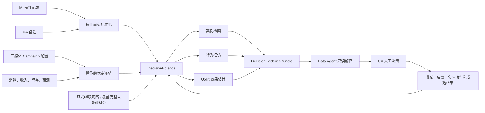

# UA 决策行为沉淀与回测方案

> 状态：`draft_for_review`
>
> 版本：`v0.3`
>
> 日期：`2026-07-22`
>
> 适用范围：Google、Meta、AppLovin 的 Campaign 预算决策
>
> 产品边界：Data Agent 只读分析、风险预警和候选证据；始终由 UA 人工决策，不执行媒体写操作

## 审阅导航

| 审阅角色 | 建议先读 |
|---|---|
| 业务 / UA | 第 2、5、13、14、18 节 |
| 数据 Owner | 第 6、7、8、9 节 |
| 算法 / 数据科学 | 第 10、14、15、16 节 |
| PGP / 产品 | 第 12、13、18 节 |
| Data Agent / 治理 | 第 3、11、12、16、19 节 |

建议所有审阅人先读第 2 节结论摘要和第 18 节已确认口径，再进入各自负责部分。

为避免重复章节被误当成多套合同：第 4—8 节是概念、标签、来源与 Schema 的 canonical 定义；第 14—16 节是评估 / 门禁合同；第 18 节只解释已确认业务选择及待确认项，不另创字段语义。出现表述冲突时必须回到前述 canonical 章节修订，不能在实现侧自行二选一。

## 1. 文档目的

本方案用于把 UA 的 Campaign 操作记录、备注、操作前状态和操作后结果，沉淀为一套可追溯、可检索、可建模、可回测的决策经验系统，并同时支持三类能力：

1. **案例检索**：历史上有哪些相似决策场景，采取过什么动作，后来发生了什么。
2. **行为模仿**：在相同操作前状态下，UA 通常会选择什么动作。
3. **效果 / Uplift 建模**：相对于不操作或其他候选动作，某个动作可能带来多少增量效果。

本方案不是“把全部历史日志灌进一个大模型”，而是先建设统一的时点化决策数据资产，再让规则、检索、传统机器学习、因果模型和大模型分别承担适合的职责。

## 2. 结论摘要

推荐建设“一套 DecisionSubject / DecisionEpisode 底座、三条独立证据链、一个只读投放顾问”：



核心判断如下：

- 业务已确认底座中的原始数据量与质量充足；当前瓶颈不是“再灌一个大模型”，而是把操作、人工判断、当时可见状态、预算控制对象和成熟结果按时间对齐，并量化哪些样本可用于哪一种能力。
- 三类能力共用同一套事实和特征底座，但必须分别训练、分别回测、分别标注证据等级。
- 第一阶段为 Google、Meta、AppLovin 同时定义合同，但按“平台 × 预算控制对象 × 证据等级”独立准入；只聚焦预算动作，不同时铺开状态、出价、素材和定向。
- Google 原生 change event 与 Meta / AppLovin 的 MI history 或快照差分不是同等级证据，不能为了三媒体同发而强行混池。
- 三媒体使用统一核心 Schema，同时保留共享预算、CBO/ABO、国家预算等平台原生语义。
- 第一阶段不需要提供大模型 API Key，也不需要微调大模型。
- 大模型后续只用于备注意图抽取、语义检索和证据表达，不负责身份关联、指标计算、因果估计、安全门禁或最终动作。
- 现有 `pre_3d/post_3d` 只能继续作为描述性复盘，必须标 `candidate_correlation` 或 `not_causal_proof`，不能作为因果回测。
- 历史回测最多证明“复现 UA 行为、检索相关案例、发现观察性 uplift 候选”；要证明 Agent 带来业务增量，最终需要前瞻 Shadow 和随机展示实验。

## 3. 产品边界与非目标

### 3.1 必须保持的产品边界

- 输出事实、风险预警、候选案例、行为概率、效果区间和证据链。
- 数据不足、共同支持不足或结果未成熟时，输出 `abstain`、`effect_not_estimable` 或 `needs_decision`。
- 每个在线结果携带 `as_of_at`、数据版本、模型版本、策略版本和证据引用。
- Data Agent 不持有 Google、Meta、AppLovin 的写权限。
- 不自动停投、放量、降预算、恢复预算或调用媒体平台写接口。
- 不输出操作人姓名、邮箱、用户身份或平台原始敏感 JSON。

### 3.2 第一阶段非目标

- 不建设全动作空间；首期只处理预算相关事实，并把“实际是否变更预算”“UA 明确做了什么判断”“日志是否足以判断”拆成三套标签。
- 不训练跨媒体统一的“万能投放模型”。
- 不做离线强化学习、在线强化学习或自动策略迭代。
- 不把历史 UA 操作直接当作“正确答案”。
- 不因某个历史案例结果好就自动晋升成规则。
- 不以 Agent 建议采纳率替代业务效果评估。
- 不在尚未验证未处理对照、共同支持和结果成熟度前声称因果效果。

## 4. 关键概念

### 4.1 OperationObservation

来源系统中观察到的一条原始证据，例如：

- MI `ua-operates` 中的一条预算操作；
- MI `ua-remarks` 中的一条 UA 备注；
- Google change event 中的一条预算资源变更；
- Campaign 配置快照中两次采集之间的预算差异。

Observation 只表示“看到了某条证据”，不自动表示已经识别出唯一业务动作。快照差分只能说明变更发生在两个观察时点之间，不能伪装成精确操作时间。

### 4.2 CanonicalOperationEvent

将多个来源中能够相互印证的 Observation 归并为统一业务事件。它不是一套新的平行口径：必须首先实现现有
`ai_ck/agent_knowledge/policies/平台操作记录统一变更日志字段规范.md` 的 18 字段合同，再以版本化扩展字段表达决策沉淀所需语义。

现有核心合同包括：

```text
platform, change_at, object_type, object_id, change_type, change_by,
before_after_json, request_id, request_url, commit_hash, change_reason,
bundle_id, customer_id, campaign_id, adset_id, ad_id, creative_id, notes
```

扩展字段至少包含：

- 平台、账户、Campaign 和预算作用层级；
- 精确或区间化的事件时间；
- 修改前值、修改后值、相对幅度；
- 人工操作、平台自动操作或来源未知；
- 来源等级、关联置信度和证据引用。

扩展只能映射和增强现有合同，不能复制出第二个“唯一真实变更日志”。现有规范中的 `change_by` 脱敏方式在真正形成可跨期关联的 operator cohort 前还要单独走治理变更：优先使用由安全 Owner 管理、带 `key_scope/key_version` 的 HMAC 或不可逆 token；不得用普通 SHA256 处理邮箱、工号、低熵文本或原始 payload。治理未批准时只保存 `unknown` / `operator_redacted`，不做个人级行为建模。

### 4.3 DecisionOpportunity

某个真实预算控制对象在某个时点出现的一次“可以做出预算决策”的机会。DecisionOpportunity 不等于已经发生操作，也不永远等于一条 Campaign。

首期建议同时建设两类机会，并分层建模：

1. `scheduled_review`：每日固定时点的 Campaign 复盘机会。
2. `anomaly_triggered`：ROI、消耗、CPI、利润、生命周期或阈值状态触发的异常复核机会。

不能拿异常 Campaign 的操作样本与全部健康 Campaign 的未操作样本直接比较。

### 4.4 DecisionSubject

DecisionSubject 是真实预算控制对象，是操作、机会、Outcome 和效果估计的主单位：

```text
subject_type =
  campaign_budget
  shared_budget
  adset_budget
  country_budget

decision_subject_id
parent_campaign_key
ad_account_key
budget_resource_key
affected_campaign_keys
country
allocation_mode
budget_period
interference_cluster_key
```

只有 `subject_type=campaign_budget` 时，一条决策机会才天然等于一个 Campaign。其他情况必须按真实控制对象处理：

- Google shared budget 的一次修改只能形成一个 shared-budget treatment，不能复制成多个独立 Campaign 样本。
- Meta ABO 的实际决策对象是 Ad Set；上级 Campaign 只用于汇总和展示。
- AppLovin 国家预算的 treatment 与 Outcome 必须限定相同国家预算对象。
- 无法建立资源级身份的 shared/CBO/国家预算只能进入事实时间线；`uplift_eligible=false`。

### 4.5 DecisionEpisode

DecisionEpisode 是一次完整决策案例，而不是一条操作日志：

```text
DecisionOpportunity
+ 操作前可见状态 PreActionSnapshot
+ 实际动作 CanonicalOperationEvent 或可信未处理状态
+ UA 决策意图 Intent
+ 多窗口成熟结果 Outcome
+ 同期干扰和质量状态
= DecisionEpisode
```

同一 Episode 对三种能力的可用性分别判断：

| 字段 | 含义 |
|---|---|
| `retrieval_eligible` | 是否可以进入案例检索索引 |
| `imitation_eligible` | 是否可以用于学习 UA 的历史选择 |
| `uplift_eligible` | 是否满足效果估计的处理、对照、成熟和共同支持要求 |
| `advisor_eligible` | 是否允许进入 Data Agent 在线证据包 |
| `exclusion_reasons` | 每个不合格用途的明确排除原因 |

### 4.6 OutcomeEstimand

OutcomeEstimand 是效果指标唯一可复算合同。D7 / D14“实际利润”的指标方向已经确认，但下列字段未确认前，正式 Uplift 和随机实验保持 Blocked：

```text
estimand_id
estimand_version
decision_subject_type
assignment_ts
eligibility_fixed_at
analysis_population
treatment_effective_ts
treatment_origin
treatment_grace_period
acquisition_enrollment_start
acquisition_enrollment_end
spend_window_start
spend_window_end
revenue_maturity_horizon
revenue_attribution_scope
currency_and_discount_version
partial_day_policy
subsequent_action_strategy
aggregation_unit
cluster_weighting_scheme
missing_outcome_strategy
differential_missingness_guardrail
cooldown_or_repeated_trial_method
```

一条正式利润 Outcome 必须回答：哪些新增获客 cohort 受到了 treatment、取哪段消耗、收入成熟到哪一天、后续操作如何处理、日内 partial-day 如何处理，以及统计单位是否重叠。

对每日机会而言，D14 窗口天然重叠。因此随机实验的确认性统计单位默认应为“随机簇 × 预注册分析周期”；机会级 D7 / D14 只能用于非重叠 target trial、明确冷却期后的 Episode，或明确标注为 opportunity-weighted 的诊断估计。正式公式、分析单位和重叠处理未确认前，只能报告组成项，不能把“D7 / D14 利润方向已确认”误写成“估计量已确认”。

## 5. 第一阶段业务范围

### 5.1 媒体范围

- Google Ads
- Meta Ads
- AppLovin

### 5.2 标签范围

首期不再用一个 `action_type` 混合“实际动作、人工决定、数据缺失”。至少拆成：

```text
observed_treatment =
  no_budget_change
  budget_decrease_large
  budget_decrease_small
  budget_increase_small
  budget_increase_large
  unknown

human_decision =
  continue_observe
  adjust_budget
  need_data
  unobserved

review_status =
  explicit
  inferred
  not_observed
```

`compound_action` 是并发或连续动作质量标记，不是一个可学习的业务动作；`action_unknown` 对应 `observed_treatment=unknown`，也是数据质量 / 排除状态。派生标签进一步区分：

| 派生标签 | 条件 | 可用于什么 |
|---|---|---|
| `reviewed_no_action` | PGP 明确选择继续观察，且标签窗口覆盖完整、没有预算变化 | 案例检索、显式人工决策模仿；满足其他条件时也可作未处理样本 |
| `observed_no_budget_change` | 日志覆盖完整且未观察到预算变化，但没有证据证明 UA 做过复盘 | 事实时间线；满足 eligibility 时可作 Uplift 未处理机会，不可冒充显式行为模仿标签 |
| `action_unknown` | 日志、身份、预算资源或时间窗口不完整 | 仅保留事实与缺口，不进入模仿或 Uplift |

预算幅度分桶需要在真实分布盘点后确认。讨论版可暂用以下候选区间做数据分析，不作为最终政策：

| 动作桶 | 候选定义 |
|---|---|
| `budget_decrease_small` | `-30% < change_pct < 0%` |
| `budget_decrease_large` | `change_pct <= -30%` |
| `no_budget_change` | 决策标签窗口内没有有效预算变化，且来源覆盖完整 |
| `budget_increase_small` | `0% < change_pct <= 30%` |
| `budget_increase_large` | `change_pct > 30%` |

最终分桶应满足：

- 每个媒体分别检查分布；
- 每个动作桶有足够样本；
- 与 UA 实际经营语义一致；
- 不为了模型均衡而扭曲业务意义；
- 分桶版本化，历史结果可复算。

### 5.3 三媒体必须保留的差异

| 平台 | 原生差异 | Canonical 要求 |
|---|---|---|
| Google | Campaign 可能引用共享 `budget_id`，一次预算变更影响多个 Campaign | 保存账户域内的 `budget_resource_key`、`budget_explicitly_shared` 和受影响 Campaign 集合 |
| Meta | CBO / Advantage Campaign Budget 与 ABO 不同，预算可能在 Campaign 或 Ad Set | 保存 `budget_scope=campaign/adset`、`allocation_mode` 和上级 Campaign |
| AppLovin | 可能存在全局预算与国家预算，现有字段可能为字符串或嵌套结构 | 保存 `budget_scope=global/country`、国家和原始安全解析版本 |
| 通用 | 币种、时区、预算周期和自动化来源不同 | 同时保存原生值与标准化值，不丢失来源语义 |

## 6. 当前证据盘点

### 6.1 状态定义

本文对数据资产使用三种状态，避免把静态文档误写成实时事实：

| 状态 | 含义 |
|---|---|
| `repo_confirmed` | 当前仓库表卡、verified SQL、SOP 或 PGP 代码已出现该能力 |
| `live_verification_required` | 需要通过 MC、CK 或 MI 实时只读探测确认覆盖率、最新分区和字段形态 |
| `design_required` | 当前没有形成可训练、可追溯的标准数据产品，需要新增逻辑表或产品埋点 |

### 6.2 已有来源与用途

| 来源 | 当前证据 | 可用于什么 | 主要限制 | 状态 |
|---|---|---|---|---|
| MI `GET /api/boards/reports/campaign-govern/ua-operates` | PGP client 和 MI 模块沉淀文档已接入 | UA 操作 Observation | 当前页面链路以 Campaign 名称查询为主；需确认分页、ID、三媒体覆盖和 before/after 完整度 | `repo_confirmed` + `live_verification_required` |
| MI `GET /api/boards/reports/campaign-govern/ua-remarks` | 已接入，样本字段包含时间、描述、记录类型和用户字段 | 备注和决策意图候选 | 含 PII 风险；备注可能在动作后填写，不能直接作为同次行为预测输入 | `repo_confirmed` + `live_verification_required` |
| MI Campaign changelog | PGP 存在独立只读 client | 候选辅助证据 | 当前 PGP `/history` 主链只合并 `ua-remarks + ua-operates`，没有调用 changelog；覆盖、去重和分页均需另验 | `repo_confirmed_client_only` + `live_verification_required` |
| PGP `/v1/campaign-overview/history` | 当前代码主链并发读取 `ua-remarks` 与 `ua-operates` | 页面级复盘和人工核验 | `ua-operates` 当前只按 Campaign 名称过滤；整体有限量、缓存和字段压平，不适合作为训练事实源 | `repo_confirmed` |
| `hungry_studio.ods_market_google_ads_config_wide_hi` | 表卡和 verified SQL 已存在 | Google 原生 change event 候选 | change-event 行拼接的是各配置表 `MAX_PT` 最新快照；历史 before/after 只能来自 change event 的 old/new，最新配置列不得回填历史操作前状态 | `repo_confirmed` |
| `hungry_studio.ods_market_google_campaign_da` | Campaign 表卡已存在 | Google 配置、预算、共享预算、状态 | 需要实时 freshness 和历史覆盖验证 | `repo_confirmed` + `live_verification_required` |
| `hungry_studio.ods_market_meta_campaign_da` | Campaign 表卡已存在 | Meta Campaign 配置、日预算、总预算、状态 | Campaign 与 Ad Set 预算层级、币种和历史快照完整度待确认 | `repo_confirmed` + `live_verification_required` |
| Meta Ad Set：`ods_market_api_adset_facebook_da` 表卡 | 表卡已存在，含 Campaign / Ad Set ID 与 daily / lifetime budget | Meta ABO 决策对象、预算配置候选 | 这是配置表，不是 change log；历史快照、最小货币单位和变更时间仍需 live 验证 | `repo_confirmed` + `live_verification_required` |
| `hungry_studio.ods_market_applovin_campaign_da` | Campaign 表卡已存在 | AppLovin 配置、预算、国家、状态 | 预算字段类型和国家预算语义需校准 | `repo_confirmed` + `live_verification_required` |
| `hungry_studio.ads_market_tj_ad_spend_active_v2` | 表卡和 verified SQL 已存在 | Campaign 消耗、展示、点击、注册、媒体安装 | 需按一致粒度预聚合；折后美元消耗需处理汇率 | `repo_confirmed` + `live_verification_required` |
| `hungry_studio.ads_market_tj_ad_revenue_v2` | 表卡和 verified SQL 已存在 | AF 累计收入 Outcome | 增量分区与 `date_diff` 成熟窗口需要正确处理 | `repo_confirmed` + `live_verification_required` |
| `hungry_studio.ads_market_tj_ad_sdk_revenue_attributed_di` | 表卡已存在 | SDK 累计收入 Outcome | 回填时点和成熟状态必须保留 | `repo_confirmed` + `live_verification_required` |
| `hungry_studio.ads_market_af_cohort_user_acquisition_v2` | 表卡和 MI 对账 SQL 已存在 | Campaign 留存 Outcome | 必须保留 D0 分母和成熟窗口 | `repo_confirmed` + `live_verification_required` |
| ROI 预测结果表 | 当前已知表主要为 `bundle × media × country` 粒度 | 操作前预测特征候选 | 不能直接冒充 Campaign 粒度 point-in-time 预测；需确认 MI 应用层是否保存历史版本 | `live_verification_required` |

### 6.3 当前明确的工程缺口

以下项目是“标准表示或链路缺口”，不等于底座一定没有原始数据：

1. 三媒体 history 的全量、分页、增量、幂等落地；现有 PGP 页面 history 不是离线事实采集链。
2. 跨 MI、MC、CK、平台原生数据的 Campaign 身份历史映射。
3. 操作前 `as-of` 特征快照和 `available_at` 时间。
4. `reviewed_no_action`、`observed_no_budget_change` 与 `action_unknown` 的可验证区分。
5. 同一决策窗口内多次操作的 Episode 聚合规则。
6. UA 备注的脱敏、意图抽取和人工复核状态。
7. D1/D3/D7/D14/成熟结果的版本化回填。
8. 复合操作、同期素材/状态/出价变化和账户内干扰标记。
9. Agent 建议曝光、UA 查看、采纳、修改、拒绝与真实动作的分离记录。
10. 案例、行为模型、Uplift 模型各自的资格门禁和排除原因。

当前仓库证据只确认 Google 有原生 change-event 示例。Meta / AppLovin 同粒度 change log 的表名、采集频率和覆盖仍是明确阻塞；如果只能用配置快照差分，必须标 `inferred_only`，最多进入事实时间线或带来源等级的检索，不能生成可信未处理标签、行为模仿真值或 Uplift treatment。

## 7. 实时数据盘点清单

正式建表和建模前必须执行只读盘点。涉及 MC、CK、MI 的实时结论要遵守各自读取技能和 freshness 协议。

### 7.1 MI history 盘点

- 三媒体分别能否过滤 `media_source`、账户和稳定 Campaign ID。
- 最早可用日期、最新可用日期、数据延迟和缺口日期。
- 分页参数、最大 limit、总行数和幂等游标。
- 是否存在稳定事件 ID；若没有，哪些字段可生成事件哈希。
- `event_time/create_time/date` 的时区和精度。
- `field/before/after` 的结构化覆盖率。
- 备注与操作能否通过事件 ID、Campaign ID 或时间窗口关联。
- 人工操作、平台自动操作、规则引擎操作是否可区分。
- 删除、暂停、恢复和重复修改的语义。
- 操作人字段的 PII 处理和授权边界。

### 7.2 Campaign 身份盘点

- MI Campaign 名称与 MC/CK `campaign_id` 的命中率。
- 同名 Campaign 在不同账户、包体、媒体和历史时段的冲突率。
- Campaign 改名、复制和删除后的历史映射。
- Google `customer_id + campaign_id + budget_id` 的关联。
- Meta `account_id + campaign/adset id` 的预算层级。
- AppLovin `account_id + campaign_id + country` 的预算层级。
- 名称兜底匹配的覆盖率和误配率。

### 7.3 操作前特征盘点

- 每个源字段的 `event_at`、`available_at`、`ingested_at` 是否可获取。
- Campaign 配置是否有历史快照，而非只有当前值。
- 决策时点能否重建过去 1/3/7/14 天趋势。
- ROI、预测 ROI、目标线、生命周期和 forecast version 是否 point-in-time 可复现。
- 国家、素材结构等高维特征是否有稳定历史快照。
- 数据回填会不会覆盖历史“当时可见值”。

### 7.4 Outcome 与共同支持盘点

- 每媒体预算上调、下调、不操作的样本量和比例。
- 操作幅度分布和每个候选分桶的有效样本量。
- D3/D7/D14/成熟 Outcome 覆盖率。
- 操作后 24 小时、3 天、7 天内再次操作的比例。
- 同期状态、出价、素材、定向或活动变化的比例。
- 相似场景下是否同时存在操作和不操作样本。
- propensity overlap、协变量平衡和极端处理概率。

## 8. 推荐逻辑表

以下是推荐逻辑表名。最终物理表名、分区、Owner、SLA 和准入状态需要走仓库 `skills/table-intake/SKILL.md` 的表准入流程。

### 8.1 `dim_market_ad_account_scd`

用途：保存平台账户在有效期内的币种、预算小数位和业务时区，避免跨账户金额与日界线误算。

```text
ad_account_key
platform
account_id_safe
account_token_key_scope
account_token_key_version
currency_code
minor_unit_exponent
account_timezone
valid_from
valid_to
source_row_ref
record_version
```

`account_id_safe` 必须由治理后的稳定 token / HMAC 生成；密钥 Owner、用途域、版本和轮换方式要登记，但密钥本身不入仓。账户币种、时区不能从某一日 Campaign 快照永久推断。

### 8.2 `dim_market_fx_rate_asof_da`

用途：提供可复算的时点汇率，不把某次查询的临时换算值写成永久事实。

```text
rate_date
base_currency
quote_currency
fx_rate
rate_source
available_at
fx_version
```

汇率源、日界线、迟到修订和冻结版本必须由财务 / 数据 Owner 确认。所有美元标准化金额同时保留原生金额、币种和 `fx_version`。

### 8.3 `dim_market_campaign_identity_scd`

用途：统一三媒体和各内部系统的 Campaign 身份，并记录有效期。

建议字段：

```text
campaign_key
platform
media_source
account_id_safe
native_campaign_id
native_parent_id
bundle_id
campaign_name
valid_from
valid_to
identity_source
match_method
match_confidence
identity_version
```

规则：

- ID 是主键，名称只作展示和兜底。
- 名称匹配必须携带账户、媒体、包体和有效时间。
- 事后改名映射不能覆盖历史当时名称。
- 不保存操作人姓名或邮箱。

### 8.4 `bridge_market_budget_resource_campaign_scd`

用途：表达共享预算资源与 Campaign 的多对多、带有效期关系；不把预算资源关系塞进 Campaign 身份表。

```text
budget_resource_key
ad_account_key
native_budget_resource_id
platform
budget_scope
campaign_key
country
allocation_mode
valid_from
valid_to
relationship_source
source_watermark
bridge_version
```

Google shared budget、Meta CBO/ABO 和 AppLovin 国家预算都必须按真实资源关系建模。一次共享预算变更只生成一个 treatment，`affected_campaign_keys` 由该桥表按事件时点展开用于归因和展示。

原生预算资源 ID 不假设跨账户全局唯一。canonical key 固定为版本化确定性映射：

```text
budget_resource_key = H(
  platform,
  ad_account_key,
  native_budget_resource_id,
  budget_scope,
  country_if_applicable
)
```

`H` 的算法和版本进入合同；不得把原始账户 ID 拼进可展示 key。

### 8.5 `dim_market_decision_subject_scd`

用途：把平台预算资源投影为统一 DecisionSubject。

```text
decision_subject_id
subject_type
platform
ad_account_key
budget_resource_key
parent_campaign_key
country
allocation_mode
budget_period
affected_campaign_keys
interference_cluster_key
valid_from
valid_to
subject_version
```

所有 OperationEvent、Opportunity、Outcome、Episode 和模型样本都使用 `decision_subject_id`。仅在 `subject_type=campaign_budget` 时允许把 `campaign_key` 当同义键。

### 8.6 `dwd_market_operation_source_coverage_run_hi` 与 `dwd_market_operation_source_coverage_page_hi`

用途：证明某个来源在给定对象和时间窗内确实被完整读取，是认定“未观察到操作”的前置证据。

Run manifest 保存窗口级完整性：

```text
coverage_run_id
source_endpoint
platform
scope_type
scope_id_safe
request_filter_safe
source_window_start
source_window_end
scope_inventory_version
expected_resource_count
covered_resource_count
fetch_started_at
fetch_completed_at
source_watermark
completed_page_count
terminal_cursor_seen
final_completeness_status
latency_ms
error_code_safe
collector_version
```

Page fact 保存逐页审计：

```text
coverage_page_id
coverage_run_id
page_no
request_cursor_or_offset
response_next_cursor
response_success
row_count
page_started_at
page_completed_at
latency_ms
error_code_safe
```

`final_completeness_status=complete` 需要 inventory、全部页、terminal cursor、全部预算资源和完整标签窗口同时通过；成功返回空页与请求失败必须是不同状态。Opportunity 只能引用最终完整的 `coverage_run_id`，不能引用零散 page fact 或一个无证据布尔值。

### 8.7 `ods_mi_campaign_operation_observation_hi`

用途：安全落地 MI 操作 Observation。

建议字段：

```text
observation_id
source_endpoint
source_event_id
source_row_ref
platform
account_id_safe
native_campaign_id
campaign_name_at_event
event_at_raw
event_at_utc
event_at_shanghai
source_time_precision
operation_type_raw
field_raw
before_value_safe
after_value_safe
source_operation_kind
raw_payload_hash
payload_hash_key_scope
payload_hash_key_version
pii_redaction_status
ingested_at
parser_version
```

规则：

- 不复制操作人姓名、邮箱或 raw JSON 到 Agent 可访问表。
- 原始敏感内容保留在来源系统，派生表只保存安全字段和引用。
- 没有稳定事件 ID 时，用版本化、带密钥域的 HMAC / token 生成去重键；普通 hash 不得用于低熵 PII、备注或可枚举 payload。
- 接口请求失败不能生成“无操作”事实。
- `source_row_ref` 只用于授权审计回查；`raw_payload_hash` 不允许被反推或当作展示字段。

### 8.8 `ods_mi_campaign_remark_observation_hi`

用途：安全落地备注 Observation 和结构化抽取引用。

建议字段：

```text
remark_observation_id
source_row_ref
platform
account_id_safe
native_campaign_id
campaign_name_at_event
remark_at
remark_text_redacted
remark_text_hash
text_hash_key_scope
text_hash_key_version
pii_redaction_status
redaction_version
text_access_class
ingested_at
```

规则：

- Agent 和案例库不得输出完整原始备注或操作人身份。
- 备注内容进入 embedding 或 LLM 前必须完成脱敏。
- 如果备注是在动作发生后填写，不能作为预测本次动作的输入特征。
- 自由文本默认不进入 Data Agent 表与默认召回；只有 `pii_redaction_status=passed` 且权限允许的派生摘要可进入受控索引。

### 8.9 `dwd_market_platform_change_log_hi`

用途：物理实现现有 18 字段“平台操作记录统一变更日志”唯一共享合同。

必含现有合同字段，并增加不改变业务语义的审计字段：

```text
platform, change_at, object_type, object_id, change_type, change_by,
before_after_json, request_id, request_url, commit_hash, change_reason,
bundle_id, customer_id, campaign_id, adset_id, ad_id, creative_id, notes,
source_observation_ids, coverage_run_ids, source_row_ref, source_watermark,
ingested_at, contract_version, redaction_status
```

`before_after_json` 在安全层解析为预算字段；原始敏感 JSON 不进入 Agent serving。对 Google 历史事件，只能使用 change event 自带的 old/new；宽表拼接的 `MAX_PT` Campaign 配置只能用于“当前参考配置”，不能伪造历史 before/after 或 PreActionSnapshot。

基础合同表按受限数据资产管理；面向 Agent 的 projection 把 `customer_id/change_by/notes/change_reason` 等字段替换为安全 token、脱敏摘要或受控引用。不得为了方便检索把受限基础表直接加入默认 RAG。

### 8.10 `dwd_market_decision_operation_event_hi`

用途：在统一变更日志之上生成与 DecisionSubject 关联的 CanonicalOperationEvent；这是派生扩展，不是平行的基础变更日志。

建议字段：

```text
operation_event_id
decision_subject_id
ad_account_key
budget_resource_key
affected_campaign_keys
platform
budget_scope
event_at_start
event_at_end
event_time_precision
observed_treatment
budget_before_native
budget_after_native
currency_code
budget_before_usd
budget_after_usd
change_amount_native
change_pct
fx_rate_asof
fx_version
operation_origin
evidence_tier
source_observation_ids
canonical_request_ids
coverage_run_ids
source_watermarks
association_confidence
canonicalization_version
```

`operation_origin` 候选值：

```text
human_ua
platform_automation
internal_rule
unknown
```

只有某个“平台 × DecisionSubject”已经通过来源合同与事件链接门禁时，事件才能作为模仿或 Uplift 的 treatment；快照差分事件固定 `evidence_tier=inferred_only`。

### 8.11 `dws_market_decision_opportunity_hi`

用途：生成预算变化、显式人工决定和来源覆盖状态的共同决策母体。

建议字段：

```text
opportunity_id
decision_subject_id
platform
opportunity_type
as_of_ts
label_window_end
eligible_action_set
trigger_reason_codes
dedupe_group_id
observed_treatment
human_decision
review_status
reviewed_no_action
observed_no_budget_change
compound_action
log_coverage_status
coverage_run_ids
campaign_active_status
source_health_status
interference_cluster_key
decision_closed_at
opportunity_version
```

#### 未处理与未决认定规则

只有以下条件全部成立时才能标 `observed_no_budget_change=true`：

1. 决策标签窗口、全部分页和全部相关预算资源都有最终 `complete` 的 `coverage_run_id`。
2. 没有生效的 Campaign、共享预算、Ad Set 或国家预算变化。
3. 没有会直接改变该 DecisionSubject 供给的并行动作。
4. 对象未因删除、失访、采集失败或接口异常消失。
5. 自动动作和人工动作的来源能够识别或明确标记未知。

`reviewed_no_action=true` 还必须同时满足 `human_decision=continue_observe`、`review_status=explicit`。否则即使日志完整，也只能说“观察到未变预算”，不能说 UA 已经复盘并决定不动。覆盖不完整则 `observed_treatment=unknown`，不能把“没有查到记录”当作未处理。

大量未处理机会可在训练时按规则下采样，但评估必须恢复真实权重和真实基准率。行为模仿只使用显式人工决定；Uplift 可在其他 eligibility 满足时使用未处理机会作为 comparator。

### 8.12 `dws_market_decision_feature_asof_hi` 与 `dwd_market_decision_feature_lineage_hi`

用途：宽表冻结决策时点已经可见的输入特征，长表保存每个特征的来源与可见时间。两者通过 `feature_snapshot_id` 关联。

宽表主键字段至少包含：

```text
feature_snapshot_id
opportunity_id
decision_subject_id
as_of_ts
source_watermarks
feature_contract_version
```

建议字段组：

| 字段组 | 示例 |
|---|---|
| 身份与阶段 | platform、bundle、country、lifecycle、active_days |
| 预算配置 | budget、budget_scope、currency、shared/CBO/ABO/country mode |
| 规模趋势 | cost、shows、clicks、registers、media_installs 的 1/3/7/14 天值和变化率 |
| 效率趋势 | CPI、CTR、CVR、实际成熟 ROI、留存 |
| 预测状态 | forecast ROI、forecast version、预测生成时间、预测成熟度 |
| 经营状态 | threshold_status、目标 ROI、gap、预估利润候选 |
| 结构特征 | 国家集中度、素材集中度、Top 项变化 |
| 历史动作 | 最近动作方向、幅度、距离上次操作时间、近 7/14 天操作数 |
| 数据质量 | freshness、maturity、missingness、sample_size、source coverage |

长表中的每个特征必须至少携带：

```text
feature_snapshot_id
feature_name
feature_value
event_at
snapshot_at
available_at
ingested_at
source_table
source_row_ref
source_watermark
feature_version
```

硬规则：`available_at <= opportunity.as_of_ts`。

`event_at` 是业务事件时间，`snapshot_at` 是状态快照时间，`available_at` 是当时可被决策系统读取的时间，`ingested_at` 是本流水线到仓时间；四者不可互换或用分区时间批量代填。

Google change-event 宽表里的最新 Campaign 配置列不能作为历史 as-of 特征。PreActionSnapshot 必须来自当时版本化快照或 change event 自带 old/new，并同时保存 `snapshot_at`、`available_at` 与源 watermark；无法 point-in-time 重建时固定 `point_in_time_reconstruct=false`。

### 8.13 `dwd_market_decision_intent_hi` 与 `dwd_market_decision_intent_revision_hi`

用途：保存备注或结构化反馈中沉淀出的 `DecisionIntent` 候选，并把机器结果与人工修订分开。

建议字段：

```text
intent_id
opportunity_id
episode_id
operation_event_id
remark_observation_id
intent_recorded_at
available_at
intent_timing
usable_as_pre_action_feature
objective_code
hypothesis_code
expected_metric_codes
expected_window_days
constraint_codes
intent_text_summary_safe
extraction_method
model_name
prompt_version
extraction_confidence
created_at
```

`operation_event_id`、`episode_id`、`model_name` 和 `prompt_version` 均可为空：意图可能先于实际动作记录，也可能完全由确定性模板产生。`intent_timing=pre_decision/post_hoc/unknown`；只有 `pre_decision` 且当时已可见的字段才允许进入行为模型。

人工修订表使用追加式记录：

```text
intent_revision_id
intent_id
revision_no
supersedes_revision_id
human_decision
reason_codes
revised_summary_safe
review_status
reviewed_at
```

候选 `objective_code`：

```text
scale_volume
control_loss
protect_roi
reduce_cpi
stabilize_delivery
cold_start_test
activity_period
data_wait
unknown
```

机器抽取结果不可变；人工修订必须追加新 revision，不得覆盖原始机器输出。

### 8.14 `dws_market_decision_episode_outcome_da`

用途：回填多窗口结果及干扰状态。

建议字段：

```text
episode_id
opportunity_id
decision_subject_id
estimand_id
estimand_version
outcome_window
outcome_available_at
treatment_effective_at
outcome_exposure_start
outcome_exposure_end
acquisition_cohort_start
acquisition_cohort_end
revenue_maturity_horizon
spend_window_start
spend_window_end
cost_zhe_usd
registers
media_installs
shows
clicks
cpi
actual_revenue
actual_roi
actual_profit_candidate
retention_metrics
budget_delivery_ratio
subsequent_action_count
subsequent_action_strategy
overlapping_treatment
interference_flags
censoring_status
analysis_unit_id
forecast_only
outcome_maturity_status
sample_status
outcome_version
```

候选窗口：

```text
24h
D3
D7
D14
matured
```

预测值只能作为操作前特征或单独预测结果，不能冒充实际 Outcome。

`actual_profit_candidate` 在利润合同确认前只能是候选列；正式评估必须引用 `estimand_id`。后续动作不能默认简单删失，因为这通常是信息性删失：要么限定“单次孤立动作 + washout”的支持人群，要么使用 IPCW / 动态 treatment 方法。共享预算或竞价外溢无法归属单对象时，改做簇级 Outcome 或标 `effect_not_estimable`。

### 8.15 `ads_market_decision_episode_da`

用途：形成供检索、行为模型、Uplift 和在线 Agent 共用的一行一 Episode 数据集。

建议字段：

```text
episode_id
opportunity_id
decision_subject_id
platform
as_of_ts
observed_treatment
human_decision
review_status
reviewed_no_action
observed_no_budget_change
action_band_version
operation_event_ids
feature_snapshot_id
intent_id
outcome_ids
compound_action
retrieval_eligible
imitation_eligible
uplift_eligible
advisor_eligible
exclusion_reasons
evidence_hash
episode_version
case_review_status
decision_closed_at
case_close_time
advisor_available_at
behavior_policy_era
agent_assigned_before_decision
agent_rendered_before_decision
source_contract_version
drift_report_version
```

`case_close_time` 是案例能进入历史索引的时间，必须晚于所展示 Outcome 的 `available_at`；`advisor_available_at` 是在线证据包真正可读的时间。三者不得用 ETL 分区时间替代。

### 8.16 Agent 生成、实验分配、曝光、反馈与真实动作表

#### `dwd_agent_experiment_assignment_hi`

```text
assignment_id
experiment_id
randomization_unit_id
ownership_component_id
unit_token_key_scope
unit_token_key_version
assigned_arm
assigned_at
eligibility_snapshot_id
randomization_version
```

ITT 以 `assigned_arm` 为准，不以是否成功渲染、查看或采纳为准。

`randomization_unit_id` 与 `ownership_component_id` 只保存治理后的安全 surrogate，记录 token scope / version，不保存原始 UA 身份。

#### `dwd_agent_assignment_opportunity_hi`

```text
assignment_opportunity_id
assignment_id
opportunity_id
decision_subject_id
eligibility_fixed_at
linked_at
bridge_version
```

#### `dwd_agent_recommendation_generation_run_hi`

```text
generation_id
opportunity_id
generated_at
generation_status
episode_context_hash
policy_version
model_versions
case_index_version
provider_nullable
prompt_version_nullable
evidence_hash
abstain_status
```

Shadow 只写 generation，不写 exposure。

#### `dwd_agent_recommendation_exposure_hi`

只有 PGP 实际渲染给 UA 时才写：

```text
exposure_id
generation_id
assignment_id
opportunity_id
exposed_at
surface
render_status
```

#### `dwd_agent_recommendation_view_hi`

查看行为是独立 append-only 事件，不能回写 exposure：

```text
view_event_id
exposure_id
viewed_at
view_type
client_event_id_safe
```

#### `dwd_agent_human_decision_feedback_hi`

PGP 使用追加式事实：

```text
feedback_id
supersedes_feedback_id
opportunity_id
interaction_mode
assignment_id
generation_id
exposure_id
human_decision
reason_codes
expected_window_days
budget_direction_candidate
budget_band_candidate
recorded_at
feedback_revision
```

#### `dwd_agent_observed_operation_link_hi`

```text
operation_link_id
opportunity_id
feedback_id
operation_event_id
link_method
link_confidence
linked_at
link_version
```

被 Agent 影响后的 UA 动作不能继续无标记地作为“原始 UA 行为”训练真值。PGP 先把 assignment、真实渲染和人工反馈写入产品 DB / transactional outbox，再由 ETL 追加同步到 MC；不能由页面直接写 MC，也不能用覆盖更新抹掉历史 revision。

### 8.17 `dwd_market_capability_admission_manifest_da`

用途：逐个记录“平台 × DecisionSubject × 能力 × 可选组件”的准入状态，作为离线任务和在线 envelope 的唯一能力开关。

```text
platform
subject_type
capability
component
action_band
estimand_version
admission_status
admission_version
gate_evidence_refs
blocker_codes
valid_from
valid_to
approved_by_role
approved_at
```

`capability` 至少包括 `FACTUAL / OUTCOME / RETRIEVAL / IMITATION_DATA_READY / IMITATION / UPLIFT / SHADOW`；`IMITATION` 的 `component` 至少区分 `human_decision / intended_direction_band`，`SHADOW` 至少区分 `advisor_bundle / imitation_human_decision / imitation_intended_direction_band`，其他能力按合同为空或使用自己的版本维度；`admission_status=go/hold/blocked/not_applicable`。在线组件必须读取 manifest，不得从“模型文件存在”或空返回猜测已准入。

MC append-only manifest 是准入事实源，CK 只保存安全 serving projection。正式状态必须依次经过人类批准、MC 新 revision、MC→CK projection 和双边只读核验；任一环失败都保持 candidate/HOLD，不能让 CK 缓存旧状态或空值推断 `go`。

### 8.18 每张物理表的准入合同

上述只是逻辑设计。每张实际落地表都必须逐表补齐并验证：

```text
grain / primary identity
partition fields and partition semantics
Owner and escalation path
freshness SLA and live probe
upstream lineage and production SQL/task
PII classification and redaction policy
must_filter / scan bound
join keys and known pitfalls
safe bounded example query
schema baseline and drift policy
```

新增 MC / CK 表后必须同步表卡、catalog、数据地图、RAG 召回包、CK profile / INDEX、schema baseline 与 freshness snapshot，并跑 `check_table_card_quality.py`。准入要求是 `hard_errors=0` 且 `warnings=0`；证据不足的 join、SLA 或 schema 进入 `TODO/`，不得靠猜测补齐。

## 9. 沉淀流水线

这里的“沉淀”不是特指大模型微调，而是把高维、重复、带噪的原始轨迹压缩为可追溯的决策单元，再按用途筛选成案例、显式行为标签、候选规则和效果估计样本。每一步都保留来源与排除原因，不能只留下“成功操作”。

### Stage A：源证据采集

1. 由通过 credential gate 的服务身份、上游审计导出或 DataWorks 受控数据源分页读取 MI `ua-operates`、`ua-remarks` 和独立 changelog；当前 PGP client 依赖请求上下文中的 MI 用户 token，不能直接充当离线全量 collector。
2. 读取 Google 原生 change event 和三媒体 Campaign 配置快照；Meta / AppLovin 若只有快照差分，明确标 `inferred_only`。
3. 对每个 endpoint、scope、分页和时间窗写入 source coverage，记录 watermark、延迟、失败和重试状态。
4. 只落安全字段、来源引用和带治理版本的 payload token，不扩散敏感原文。

若当前只有用户 Bearer、cookie 或 SSO，上述全量 / 增量采集保持 `BLOCKED_CREDENTIAL`；不得持久化、转发或重放用户凭证。Data Agent runtime 不持有 MI 用户 token、不承担采集、不调用媒体写接口。产出：`OperationObservation`、`RemarkObservation`、`SourceCoverage`。

### Stage B：身份与操作标准化

1. 使用平台、账户、稳定 Campaign ID 和有效时间匹配身份，同时构建账户 SCD、预算资源桥与 DecisionSubject。
2. 名称只作兜底；所有名称兜底匹配保存置信度。
3. 按账户有效期解析原生金额、币种、预算层级、相对幅度和操作来源，汇率按 as-of 版本换算。
4. 先映射到现有 18 字段统一变更日志，再将 MI、平台事件和配置差分关联为派生 CanonicalOperationEvent。

产出：`AdAccountSCD`、`CampaignIdentity`、`BudgetResourceBridge`、`DecisionSubject`、`CanonicalOperationEvent`。

### Stage C：决策机会与 Episode 聚合

1. 每日固定复盘与异常触发机会分开生成。
2. 在标签窗口内分别关联 `observed_treatment`、显式 `human_decision` 和 `review_status`。
3. 对短时间内连续调整标记 `compound_action`；首期 Uplift 默认排除。
4. 日志覆盖完整且没有任何预算供给变更时，只能标 `observed_no_budget_change`；还需 PGP 显式继续观察才标 `reviewed_no_action`。
5. 同时按预算资源 ownership graph 冻结干扰簇，不能只按 Campaign 复制样本。

产出：`DecisionOpportunity`、Episode anchor。

### Stage D：操作前状态冻结

1. 仅使用 `available_at <= as_of_ts` 的特征。
2. 保存当时的 forecast version、阈值版本和数据成熟度。
3. 保存 1/3/7/14 天趋势，而非只保存单日值。
4. 保存 wide snapshot 与 long lineage、source watermark、`snapshot_at` 和 `available_at`。
5. 禁止用 Google change-event 宽表拼接的最新配置回填历史快照，并执行未来信息泄漏检查。

产出：`PreActionSnapshot`。

### Stage E：意图沉淀

优先级：

```text
结构化原因码
→ 确定性关键词/模板解析
→ LLM 候选抽取
→ 人工抽样或重点案例审核
```

LLM 只生成候选意图，不确认动作有效性。备注如果在动作后填写，不能作为行为模仿的输入特征，只能作为历史案例解释或 treatment metadata。

产出：`DecisionIntent` 与追加式人工 revision。

### Stage F：结果成熟与干扰标记

1. 回填 24h、D3、D7、D14 和成熟结果。
2. 区分实际收入和预测收入。
3. 记录后续预算、状态、出价、素材、定向和活动变化，并按预注册策略做 washout、IPCW / 动态 treatment 或 `effect_not_estimable`。
4. 记录 partial day、低样本、forecast only 和 source missing。
5. 不删除失败、无变化、误判或拒绝案例。

产出：`EpisodeOutcome`。

### Stage G：用途资格门禁

| 用途 | 最低条件 |
|---|---|
| 检索 | 身份可信、上下文可解释、来源可追溯；若展示结果，结果必须在查询时已经成熟；`inferred_only` 必须显式展示来源等级 |
| 行为模仿 | 显式人工决定、操作前快照完整、无未来泄漏、动作当时可选；仅“日志没有变化”不够 |
| Uplift | treatment 定义清楚、存在覆盖完整的未处理对照、OutcomeEstimand 已确认、结果成熟、重复 treatment 处理正确、共同支持充分 |
| Agent 展示 | 证据可追溯、符合治理政策、没有越权动作或敏感信息 |

门禁按“平台 × DecisionSubject × 能力 × action × Outcome”独立运行。不合格 Episode 继续保留，但必须携带 `exclusion_reasons`；一个平台可 `GO_FACTUAL` 不代表它能进入检索、模仿或 Uplift。

### Stage H：知识与模型产出

```text
DecisionEpisode
├── 版本化案例索引
├── 行为模仿训练集和模型
├── Uplift 训练集和效果模型
├── 人工复核案例
├── 候选规则
└── DecisionEvidenceBundle
```

## 10. 三类能力设计

### 10.1 案例检索

回答：**以前遇到类似情况时，发生过什么？**

首期采用混合检索：

1. 硬过滤：平台、预算层级、生命周期、动作类型、数据成熟度。
2. 数值相似度：规模、ROI、CPI、趋势、预算利用率、国家/素材集中度。
3. 文本相似度：经过脱敏的意图和备注摘要。
4. 重排：证据完整度、结果成熟度、人工审核状态和时间距离。

检索结果必须同时允许出现：

- 结果改善案例；
- 结果恶化案例；
- 结果不明确案例；
- `reviewed_no_action` 案例；只有来源覆盖完整时才可补充 `observed_no_budget_change` 事实案例。

没有合格案例时必须返回 `no_eligible_similar_case`，不能用低相似度案例填满 Top-K。

MVP 不依赖 LLM 或向量数据库；可先用结构化过滤和标准化距离上线验证价值。

### 10.2 行为模仿

回答：**UA 在这种操作前状态下通常会怎么选择？**

行为模仿只学习“UA 明确做过的判断”，建议采用两级形式：

```text
P(human_decision | point-in-time pre_action_state, eligible_action_set)
P(intended_direction_or_band | human_decision=adjust_budget, pre_action_state)
```

建议首期使用可解释的分类或排序模型，例如树模型或线性基线，而不是微调大模型。

输出示例：

```json
{
  "continue_observe": 0.52,
  "adjust_budget": 0.39,
  "need_data": 0.09,
  "conditional_intended_budget_direction": {
    "decrease": 0.61,
    "increase": 0.39
  },
  "status": "imitation_only"
}
```

边界：

- 该结果表示历史行为概率，不代表哪个动作有效。
- 备注不得泄漏本次实际动作。
- 所有 UA 历史不能自动视为专家标签。
- 可以按数据完整度、人工复核和政策年代加权，但不能用当前 Episode 的未来 Outcome 作为输入。
- 被 Agent 建议影响后的行为需要单独标记。
- 没有显式 PGP 反馈或经审计的结构化人工决定时，`observed_no_budget_change` 不能当“继续观察”的行为标签。
- 二级方向 / 幅度只使用 UA 明确填写的 `budget_direction_candidate / budget_band_candidate`；未填写时只训练一级三分类，不从后续操作反填意向。

意向到执行的关系单独做诊断模型或报表：

```text
P(observed_execution | stated_decision, pre_action_state)
```

它回答“表达的判断后来是否以及如何执行”，不与意向模型共用标签；`observed_treatment` 继续只服务事实时间线和效果估计。

因此，PGP 反馈上线前的历史日志最适合先做案例检索、预算变化事实和“已调整样本中的方向 / 幅度”模型；只有备注能被可靠判定为当时的显式决定时，才补入三分类人工决策模型。完整的 `continue_observe / adjust_budget / need_data` 标签会主要由 PGP 前瞻积累。

### 10.3 Uplift / 效果估计

回答：**相对于覆盖完整的未处理机会或另一个动作，该动作可能多带来多少结果？**

证据等级固定分为：

1. `descriptive_pre_post`：操作前后描述。
2. `matched_observational`：匹配同包、同媒体、同生命周期、同规模的未处理对照。
3. `adjusted_observational_candidate`：共同支持充分后使用 AIPW、因果森林或多 treatment uplift。
4. `quasi_experimental`：只有满足预注册的自然实验 / 准实验识别假设时使用。
5. `experiment_verified`：前瞻随机分配与分析合同通过后使用。

前三层统一标 `not_causal_proof`。模型名称里出现“因果森林”或“双重稳健”不会自动把观察数据升级为因果证明。

Uplift 输出必须包括：

```text
treatment_definition
comparator_definition
support_population
treatment_count
control_count
propensity_overlap
covariate_balance
effect_point_estimate
confidence_interval
placebo_status
sensitivity_status
causal_level
```

超出共同支持范围时固定返回：

```text
effect_not_estimable
```

媒体竞价存在账户内 Campaign 相互影响。聚类标准误只能处理误差相关，不能消除共享预算、竞价和 spillover 偏差：应按预算 ownership graph 构建簇级 treatment / Outcome；无法隔离时固定返回 `effect_not_estimable`。

## 11. 大模型使用边界

### 11.1 第一阶段是否需要 API Key

**不需要。**

以下能力可以完全用 SQL、Python 和确定性代码完成：

- MI history 落地和分页；
- Campaign 身份映射；
- 事件去重和聚类；
- 预算数值、币种和幅度标准化；
- DecisionOpportunity 与三类未处理 / 未决标签生成；
- point-in-time 特征冻结；
- Outcome 回填；
- 资格门禁和泄漏检测；
- 结构化案例检索；
- 行为模仿基线；
- Uplift 可行性和历史回测。

### 11.2 后续适合使用大模型的环节

- 从脱敏备注中抽取目标、假设、预期指标、观察窗口和约束。
- 为历史案例生成安全、可审核的摘要。
- 计算备注和意图的语义向量。
- 比较多个相似案例的共同点和差异。
- 将结构化 EvidenceBundle 组织成用户可读解释。

### 11.3 不应交给大模型的环节

- Campaign 身份、join、事件去重和时间窗口。
- 指标公式、freshness、成熟度、样本量和置信区间。
- `reviewed_no_action` / `observed_no_budget_change` 认定和未来信息泄漏检查。
- 行为模型、Uplift 和因果等级。
- 阈值授权、安全、PII 和媒体写权限。
- 最终预算动作或具体执行指令。

### 11.4 若后续启用 API 的工程要求

- API Key 只进入密钥管理或运行环境，不写入仓库。
- 输入备注先脱敏；禁止发送操作人身份和平台 raw JSON。
- 请求按文本 hash 缓存，避免重复付费。
- 保存 provider、model、prompt version、输入 hash、输出、置信度和人工修订。
- 先抽样评估，再批量处理；设置单批和总成本上限。
- LLM 失败时允许回退规则抽取，不阻断事实流水线。
- 不在第一阶段进行 fine-tuning；先证明结构化抽取或 embedding 确有增量。

LLM 不是默认路径。先用结构化 reason code、规则模板和普通检索形成可运行基线；只有离线盲测优于最强确定性基线后才启用对应环节。启用门禁至少包括：

```text
structured_extraction_accuracy
new_fact_or_hallucination_rate
evidence_factuality
pii_leakage_count
unsupported_conclusion_rate
cost_per_eligible_case
fallback_success_rate
```

`new_fact_or_hallucination_rate`、PII 泄漏和越权动作必须为 0。没有调用 LLM 的记录中，provider、model 和 prompt version 必须允许为空，不能填虚假默认值。

推荐控制链：

```text
代码生成证据和允许集合
→ LLM 生成候选解释
→ 代码执行事实、因果、PII 和越权校验
→ Data Agent 输出
```

## 12. 代码与服务架构

以下为逻辑模块，不代表立即新增同名顶层目录。实际目录归属需遵守 `knowledge/agent_knowledge/governance/知识库三层结构规范.md`。

```text
ua_decision/
├── contracts          # Schema、枚举和版本
├── sources            # MI、MC、CK、平台配置适配
├── identity           # 账户、Campaign、预算资源与 DecisionSubject SCD
├── observations       # 原始安全证据
├── events             # CanonicalOperationEvent
├── opportunities      # 决策机会、人工决定和未处理覆盖
├── features           # point-in-time 特征
├── intent             # 规则 / LLM 意图抽取
├── outcomes           # 结果成熟和干扰标记
├── episodes           # DecisionEpisode 构建
├── eligibility        # 四类用途资格门禁
├── retrieval          # 案例检索
├── imitation          # 行为分类 / 排序
├── uplift             # 效果估计
├── evaluation         # 历史回放、泄漏和回测
├── serving            # 只读 EvidenceBundle
└── governance         # PII、安全、审计和版本
```

`ua_decision/` 只是逻辑包视图，不批准新增顶层目录。落地时映射到现有分层：表卡进入 `ai_hive/` / `ai_ck/`，稳定口径进入 `knowledge/agent_knowledge/semantic_contract/` 或 `policies/`，评估代码与证据进入 `eval/`，采集 / 校验脚本进入 `tools/scripts/`，审核案例和 SOP 进入 `da_assets/`，方案与阶段台账留在 `data_agent_plan/`；需要跨仓采集或 PGP 产品代码时，由对应 owning service 承担。

### 12.1 系统边界

| 系统 | 责任 |
|---|---|
| MI / Nexus | 只读操作审计、备注和 Campaign 治理来源；证明接口语义；由授权 collector 采集 |
| MC / DataWorks | 追加式事实、特征、Episode、Outcome、离线索引 / 训练 / 批量评分和质量门禁 |
| CK | 承载已通过门禁的 serving projection 和离线评分结果，不作为训练真理源 |
| Data Agent | 通过 typed read-only API 检索三类证据、执行输出门禁、生成只读分析与 `needs_decision`；不持有 MI 用户 token |
| PGP | 页面、BFF、鉴权、证据渲染、人工反馈 DB 与 transactional outbox；不另建独立决策 Prompt，不调用媒体写接口 |
| UA / 业务 Owner | 确认动作语义、结果指标、案例审核、阈值和试点门槛 |

首期推荐双向链路：

```text
MI / MC sources
  -> authorized collector / DataWorks
  -> MC opportunity and append-only facts
  -> offline index / model scoring
  -> CK opportunity / evidence projection
  -> EvidenceReadContract -> Data Agent
  -> DecisionAdviceAPI / PGP BFF -> PGP render and feedback UI

PGP feedback DB / outbox
  -> ETL / DataWorks
  -> MC append-only feedback facts
```

Opportunity 的唯一生成 Owner 是 DataWorks / MC 的版本化 deterministic builder；PGP 从 CK minimal opportunity projection 取得 `opportunity_id + decision_subject_id`，不得自行生成第二套 ID。先做离线批量评分入 CK，避免在在线请求中临时读取 MI、拼大表或训练模型。

### 12.2 在线合同

Data Agent 上游读取合同命名为 `EvidenceReadContract`，PGP 调用的下游只读接口命名为 `DecisionAdviceAPI`，避免把同一个“typed API”同时理解为上下游。核心 envelope 为：

```text
DecisionEvidenceBundle
├── opportunity_id
├── decision_subject_id
├── as_of_at
├── bundle_version
├── source_watermarks
├── capability_admission_status
├── component_status
├── component_versions
├── component_exclusion_reasons
├── generated_at / available_at
├── CurrentStateSnapshot
├── SimilarCaseSet
├── ImitationPolicyScore
├── UpliftEstimate
├── DataQualityAndSupport
├── PolicyAndSafetyStatus
└── EvidenceReferences
```

每个组件状态必须是 `available / not_admitted / blocked / not_enough_data` 之一；不能用空对象、零效果或全零概率伪装“该能力可用”。

PGP 的 Campaign 页面可以把它展示为 Campaign evidence，但合同主键仍是 `decision_subject_id`。最终 `DecisionAdvice` 只允许包含：

- 当前事实和风险预警；
- 相似案例及差异；
- 历史行为概率，标 `imitation_only`；
- 效果估计及置信区间，标因果等级；
- 数据不足和模型拒答；
- `needs_decision=true`。

## 13. 最终产出

最终产出分两类：统一 Schema、治理规则和 admission manifest 是全局合同产物；案例索引、行为模型、Uplift 和在线组件是实例产物，只对 manifest 已准入的“平台 × DecisionSubject × 能力”生成。

### 13.1 数据产物

- 三媒体账户、Campaign Identity、预算资源桥和 DecisionSubject SCD。
- 来源覆盖事实与 governed FX as-of 表。
- 安全的 MI operation / remark Observation。
- CanonicalOperationEvent。
- DecisionOpportunity，以及 `reviewed_no_action` / `observed_no_budget_change` / `action_unknown` 的分离标签。
- Point-in-time PreActionSnapshot。
- 多窗口 EpisodeOutcome。
- 版本化 DecisionEpisode 数据集。
- Agent 生成、实验分配、真实曝光、追加式 UA 反馈和真实动作关联数据。

### 13.2 检索和模型产物

- 对 `GO_FACTUAL` 组合生成仅供离线评估的候选案例索引、评估集和人工相关性标签；通过回测与人工 Gate 后再发布 `GO_RETRIEVAL` 对应的版本化 serving 索引。
- 对 `IMITATION_DATA_READY` 组合生成行为模仿训练集、候选模型、校准报告和 Model Card；离线回测通过后再签发 `GO_IMITATION`。
- 对已取得 `GO_FACTUAL + GO_OUTCOME` 且 treatment / comparator 来源门禁通过的组合，生成 Uplift 候选数据集、overlap 报告、观察性效果模型和评估；独立审阅与人工批准后再形成 `GO_UPLIFT_CANDIDATE`。
- 规则基线、模型基线和完整对比报告。

### 13.3 知识资产

全量 Episode 留在数据底座，不进入 Git。仓库只沉淀：

- 经过人工审核的代表性案例：`da_assets/decision_cases/`；每个案例必须保留来源、周期、脱敏状态、人工审核人角色、成熟度、状态和回链，不能把 raw Episode 批量写入 Git；
- 稳定分析流程：`da_assets/analysis_sop/`；
- 经业务确认的规则：`knowledge/agent_knowledge/policies/`；
- 指标和 join 口径：`knowledge/agent_knowledge/semantic_contract/`；
- 经过门禁晋升的 SQL：`da_assets/verified_sql/`。

可后续建设 `ua-operation-case-distillation` Skill，负责抽取、校验、送审、晋升和回归编排。Skill 只是可复用流程说明；事实落 MC / CK，稳定口径落 semantic contract / policy，确定性 gate / CI 才有准入裁决权。Skill 不能自行确认效果或跳过 Schema、门禁、CI 和人工审批。

实施阶段一旦修改对应资产，必须执行仓库现有强制门禁：

```bash
python3 tools/scripts/check_knowledge_consistency.py   # 修改 knowledge/
python3 tools/scripts/check_authority_map.py          # 修改 knowledge/ 或 da_assets/
python3 tools/scripts/check_metric_layer_boundary.py  # 修改跨表指标合同
python3 tools/scripts/check_agent_retrieval_map.py     # 新增召回路径或 route
python3 eval/agent_regression/run_regression.py
```

硬错误和要求清零的 warning 必须清零；若回归只因真实 freshness blocker 失败，应保留 Blocked 证据，不得通过放宽校验或伪造快照强行改绿。

### 13.4 用户可见结果示例

```text
当前状态：
该 Campaign 已进入成熟期；近 3 日消耗增长，实际 ROI 和 CPI 状态如下。

相似案例：
找到 8 个同平台、同阶段、同规模案例，其中包括预算上调、预算下调和继续观察案例。

行为模仿：
同类历史决策的动作分布为 ...；status=imitation_only。

效果估计：
当前样本对预算小幅上调存在共同支持，效果区间为 ...；
status=adjusted_observational_candidate + not_causal_proof；
或因缺少可比且覆盖完整的未处理样本返回 effect_not_estimable。

风险与限制：
数据成熟度、样本支持、同期干扰和因果等级如下。

needs_decision：
由 UA 结合当前业务目标和约束做最终判断。
```

三条证据发生冲突时必须展示冲突，不强行压成一个动作答案。

## 14. 成功指标框架

三类能力不能共用一个“UA 沉淀准确率”。成功指标分为数据质量、检索、行为模仿、效果估计、产品价值和安全六组。

### 14.1 数据质量指标

| 指标 | 定义 | 初始门禁 |
|---|---|---|
| `identity_exact_match_rate` | 使用稳定 ID 完成身份匹配的 Episode 占比 | 盘点后按媒体设门槛；名称兜底单独报告 |
| `decision_unit_accuracy` | DecisionSubject 与真实预算控制对象一致的抽样准确率 | 分平台 × subject 冻结门槛 |
| `operation_event_link_precision` | CanonicalOperationEvent 与来源操作的链接 precision | 分平台冻结门槛 |
| `structured_budget_change_coverage` | 预算事件具有结构化 before/after 的占比 | 盘点后按媒体设门槛 |
| `budget_before_after_accuracy` | 预算 before/after、币种与幅度的抽样准确率 | 分平台冻结门槛 |
| `source_window_complete_rate` | 标签窗口所有 endpoint / 页 / 预算资源覆盖完整的占比 | 分平台报告 |
| `reviewed_no_action_precision` | 显式继续观察且确无预算变化标签的抽样 precision | 行为模仿前冻结门槛 |
| `observed_no_budget_change_precision` | 覆盖完整未处理标签的抽样 precision | Uplift 前冻结门槛 |
| `point_in_time_reconstruct_rate` | 能冻结完整操作前快照的机会占比 | 盘点后设门槛 |
| `mature_outcome_coverage` | 具有目标窗口实际 Outcome 的 Episode 占比 | 按 D3/D7/D14 分开报告 |
| `evidence_traceability_rate` | 输出可回溯到来源、查询和版本的占比 | 100% |
| `future_leakage_count` | 任何未来字段进入训练或检索 | 0 |
| `pii_leakage_count` | Agent 或评估产物泄漏 PII | 0 |

以上非零阈值必须在查看最终测试集和实验结果前，按“平台 × DecisionSubject”基于盲审样本冻结。没有通过相应门槛的组合只能降级到更低能力，不能用整体平均值掩盖某一媒体失败。

### 14.2 案例检索指标

- Precision@3
- Recall@5
- nDCG@5
- MRR
- 有效证据案例占比
- 来源可追溯率
- future-case leakage count
- 结果改善、恶化、不明确与未处理案例的多样性
- 双人评审一致性 `κ`

讨论版候选门槛：

```text
Precision@3 >= 0.80
nDCG@5 >= 0.75
reviewer_kappa >= 0.60
evidence_traceability_rate = 100%
future_case_leakage = 0
```

这些门槛需要在首轮盲审后校准，不应在没有基线时直接固化为长期 SLA。

### 14.3 行为模仿指标

基线至少包括：

- 永远 `continue_observe`；
- 按媒体和生命周期的历史多数动作；
- 当前确定性规则；
- 上一次动作延续。

模型指标：

- macro-F1、balanced accuracy；
- 上调/下调各自 precision、recall；
- 有序动作分桶 weighted kappa；
- 方向正确条件下的预算幅度 MAE；
- Brier score、ECE 概率校准；
- abstain coverage；
- 按媒体、包体、生命周期和账户的最差组表现。

讨论版 Go 条件：模型必须显著优于最强基线，且提升不能仅由 `continue_observe` 类贡献。通过后只能标 `behavior_imitation_validated`，不能标 `recommendation_effective`。

策略漂移必须按平台 × DecisionSubject 报告：动作 / 人工决定基准率、特征分布、来源覆盖和概率校准。阈值在训练前预注册；`pre-Agent` 行为与 `agent_assigned_before_decision=true` 或 `agent_rendered_before_decision=true` 的行为不得无标记混池训练或评估。

### 14.4 Uplift 指标

- treatment / control 样本数；
- propensity overlap 与 trimming 比例；
- 加权前后协变量平衡；
- ATE / CATE 与 cluster bootstrap 置信区间；
- AUUC / Qini，仅在处理概率和共同支持可信时使用；
- event-study 前趋势；
- pre-period placebo effect；
- 未观测混杂敏感性；
- 分媒体、动作幅度和支持人群的稳定性。

历史观察性 Uplift 通过后最高只标：

```text
adjusted_observational_candidate
not_causal_proof
```

### 14.5 最终产品价值指标

已确认最终随机展示实验以 D7 / D14 实际利润为主要效果指标；确认性分析不能对重叠的每日机会简单求和：

```text
D14：随机化簇 × 预注册分析周期的实际增量利润
D7：同一估计单位的早期实际增量利润
```

为避免双主指标带来的多重检验和解释冲突，建议采用分层口径：

- `D14_actual_profit_per_randomized_cluster_period`：最终确认性主指标；
- `D7_actual_profit_per_randomized_cluster_period`：更快得到的早期效果指标；
- D14 Outcome 未成熟前只能报告阶段性结果，不能提前宣布实验成功。
- 非重叠 Episode 可另报 opportunity-level 诊断结果，但不能替代确认性 ITT。

精确利润公式仍需要由业务和语义层确认。候选公式为：

```text
actual_profit_DN
= cumulative_actual_revenue(
    acquisition_cohort in enrollment_window,
    date_diff <= N-1
  )
- discounted_spend_usd(enrollment_window)
```

利润分子和成本必须对应同一个获客 / 消耗 enrollment window，不能把新消耗与窗口外老 cohort 的收入混算。操作 Uplift 的 `enrollment_window` 由 treatment 生效和 washout 合同定义；Advisor 随机实验则使用被分配随机簇的预注册分析周期，并包含该 arm 下所有 eligible 结果，不能按反馈或实际调预算再筛选。D7 / D14 的成熟时间从 `acquisition_cohort_end` 计算，并叠加来源 SLA。

其中 SDK / AF 收入源、折后消耗、汇率版本和其他应计成本必须版本化。在公式确认前，分别报告：

- 实际收入；
- 折后美元消耗；
- 实际 ROI；
- 注册和 CPI；
- 不把未确认公式生成的“利润”当正式主指标。

驱动指标：

- 决策完成时间；
- 有证据支持的决策占比；
- Agent 证据包查看率；
- UA 反馈完成率。

Guardrails：

- ROI 非劣；
- CPI 非劣；
- 成本超支率不恶化；
- 红线触发率不恶化；
- 错误高风险意见率；
- UA 撤销或纠错率；
- 媒体写操作数始终为 0。

Guardrail 不是“没有统计显著变差”即可通过。实验前必须冻结：公式、统计聚合单位、非劣界值、单侧置信区间、检验方向、family / 多重比较校正、alpha spending 与安全停止规则。ROI 和 CPI 必须按分子分母聚合后计算，例如 `SUM(revenue)/SUM(spend)`、`SUM(spend)/SUM(installs_or_registers)`，不能平均 Campaign 比率。

采纳率只作诊断指标，不能作为产品效果主指标。

## 15. 回测与验证方案

### 15.1 Level 0：Episode 重建验收

目标：证明数据事实可以准确重建。

方法：

1. Google、Meta、AppLovin 分别按操作类型和时间分层抽样。
2. 与 MI history、平台证据和 Campaign 配置人工核对。
3. 检查身份、时间、预算前后值、币种、层级、意图、Outcome 和同期动作。
4. 重点复核名称兜底、共享预算、Meta Ad Set 预算和 AppLovin 国家预算。

硬门禁：

```text
future_leakage_count = 0
pii_leakage_count = 0
untraceable_online_evidence = 0
```

同时按媒体 × DecisionSubject 报告并冻结抽样门槛：

```text
operation_event_link_precision
budget_before_after_accuracy
decision_unit_accuracy
reviewed_no_action_precision
observed_no_budget_change_precision
point_in_time_reconstruct_rate
source_window_complete_rate
```

任一“平台 × DecisionSubject”进入 `GO_RETRIEVAL`、`IMITATION_DATA_READY`、`GO_UPLIFT_CANDIDATE` 或 `GO_SHADOW` 前，必须先冻结与该用途相关的 Level 0 门槛；测试集结果不得用于下调门槛。

### 15.2 Level 1：案例检索时间旅行回测

目标：证明查询时只能检索到当时已完成、已成熟的相关案例。

方法：

1. 以未来时间窗中的 DecisionOpportunity 作为查询集。
2. 检索索引只允许包含 `case_close_time < query_as_of` 的案例。
3. 测试 Campaign 和对应 Episode 不进入索引或 Prompt 示例。
4. 由非原动作执行者进行盲审，至少双人标注相关性、可迁移性和风险。
5. 分媒体报告 Precision@3、nDCG@5 和覆盖率。

通过只能说明“检索相关且无未来泄漏”，不能把相似案例 Outcome 当成当前动作的反事实。

### 15.3 Level 2：行为模仿离线回测

目标：预测 UA 在决策窗口内显式记录的人工决定；对 `adjust_budget` 再预测明确填写的意向方向 / 幅度条件分布。后续真实执行只作独立一致性诊断。

标签：

```text
显式 human_decision；以及同次反馈明确填写的 intended direction / band
```

不是“正确动作”或“有效动作”。

切分：

1. Forward holdout：连续时间 60% / 20% / 20% train / validation / test。
2. Cold-start holdout：按账户或 Campaign 分组隔离，验证新对象泛化。
3. 按最大标签和 Outcome 窗口设置 purge / embargo。
4. 特征变换、归一化和 target encoding 只在训练集 fit。

测试集永久冻结，不能进入案例索引、Prompt 示例或人工 Good Case。

### 15.4 Level 3：历史 Uplift 回测

采用 target-trial emulation：

| 元素 | 定义 |
|---|---|
| Eligibility | 决策时点前满足生命周期、配置和数据完整性条件 |
| Treatment | 按实际 `treatment_effective_at` 和 `treatment_origin` 定义的某档预算上调或下调；24 小时标签窗只用于行为标签 |
| Comparator | 同一 eligibility 下、coverage 完整的 `observed_no_budget_change`；若研究人工决策策略则限定 `reviewed_no_action` |
| Outcome | 实际成熟的 D3/D7/D14 收入、消耗、ROI、CPI 和候选利润 |
| Censoring | 预注册 washout / 隔离人群，或 IPCW / 动态 treatment；不得默认简单删失 |
| Clustering | 按预算 ownership graph 与竞价外溢构建干扰簇 |

如果 treatment 允许在决策后 24 小时内任意时点发生，不能把“未来 24 小时是否发生动作”直接当作 time-zero treatment。必须选择以下一种预注册方案：

1. 使用精确 `action_at` 重新定义 index time，并构造同期未处理 landmark。
2. 使用固定 landmark，只纳入 landmark 前已经确定的 treatment。
3. 把 24 小时作为 treatment grace period，并使用 clone-censor-weight 等 target-trial 方法。

否则会产生 immortal-time bias 和错误的 treatment / control 比较。

最低方法要求：

- propensity overlap 和 trimming；
- pre-treatment covariate balance；
- AIPW 或其他双重稳健估计；
- event-study 前趋势；
- pre-period placebo；
- cluster bootstrap CI；
- 未观测混杂敏感性分析；
- 媒体和动作幅度分别报告。

后续动作往往由表现驱动，简单删失会造成信息性删失；cluster bootstrap 只修正方差，不解决 treatment spillover。共享预算、同账户竞价或跨 Campaign 资源干扰无法隔离时，改估簇级效果或返回 `effect_not_estimable`。

首期研究 UA 人工预算动作时只纳入 `treatment_origin=human_ua`；`platform_automation` 与 `internal_rule` 分层单独报告，`unknown` 固定 `uplift_eligible=false`。不同 assignment policy 的动作不得混池后解释为 UA 行为效果。

历史回测不能声称“Agent 建议会提升利润”或“预算动作导致 ROI 改善”。

### 15.5 Level 4：Prospective Shadow

对所有 eligible opportunity 实时生成结果，但暂不向 UA 展示：

1. 在决策时点冻结 Evidence hash。
2. 保存数据、规则、模型、Prompt 和案例索引版本。
3. 记录候选证据输出、abstain、证据引用和规则冲突。
4. 后续关联真实 UA 动作和成熟 Outcome。
5. 独立抽样审核事实、因果措辞、缺数据拒答和安全性。

讨论版 Shadow Go gate：

```text
future_leakage = 0
unauthorized_or_executable_media_write = 0
unsupported_causal_claim = 0
evidence_reproducibility >= 99%
correct_abstain_when_required >= 95%
unexplained_policy_conflict = 0
```

Shadow 周期不机械规定为两周；结束条件由事实准确率、来源覆盖、abstain、安全错误率等门禁的置信区间精度决定。成熟 D7 / D14 只作诊断，Shadow 没有真实随机曝光，不能据此进入 `GO_ADVICE`。

行为一致率只作诊断，不是业务价值证明。

### 15.6 Level 5：随机展示实验

真正评估 Data Agent 产品价值时，随机的是“是否展示 Agent 证据与意见”，不是强制 UA 执行动作。

```text
Control：现有页面或规则预警
Treatment（首轮建议）：现有页面或规则预警 + 可追溯事实 + 案例检索 + 风险 / 缺数据提示
```

首轮不必一次捆绑行为模仿和观察性 Uplift；先验证低风险 advisor package 的产品价值。后续加入行为或 Uplift 组件时，用分层 rollout、消融或 factorial 设计识别组件增量。随机展示实验验证的是“被分配的顾问包”是否有业务价值，不会把某个历史 Uplift 模型自动升级为因果有效。

要求：

- 所有真实预算动作仍由 UA 决定。
- 主分析采用 assignment-based ITT：所有已随机分配且 eligible 的单位按 `assigned_arm` 分析，不能按是否渲染、查看或采纳筛选。
- eligibility 与 analysis population 必须在 assignment 前冻结；随机后删除、失访或来源中断造成的 Outcome 缺失不能直接删行，需按预注册策略处理并分 arm 报告缺失率。
- 先根据 shared budget、账户 ownership 和 UA 管理关系构建连通分量，再把互不重叠的连通分量随机分组；不能机械采用 `UA × account` 后忽略跨单元污染。
- 预注册主指标、MDE、样本量、Guardrails 和停止规则。
- 可以使用 CUPED 或前周期指标提高统计功效。

Go 条件：

- D7 / D14 利润合同、随机化单位和确认性分析周期已冻结，D14 已成熟；
- assignment-based ITT 主指标达到预注册 MDE，且 95% CI 下界大于 0；
- 所有业务 Guardrails 的单侧非劣置信区间通过预注册界值与多重检验策略；
- randomization integrity、分配 / 渲染日志和适用平台 × subject 门禁通过；
- cluster weighting scheme 已预注册，且 differential missingness guardrail 通过；
- 安全和证据门禁没有硬错误。

如果置信区间同时覆盖明显收益和明显伤害，应 `HOLD_EVAL` 并继续采样，不能直接 Go。

### 15.7 Stepped-wedge 备选

如果业务要求最终所有 UA 都获得能力，可按 ownership graph 的不重叠连通分量随机安排分批切换周：

- 所有 cluster 先处于 Control；
- 按随机顺序永久切换到 Treatment；
- 模型包含 period fixed effect 和 cluster effect；
- 提前估算 ICC、cluster 数量和 MDE；
- 曝光会造成学习外溢，不使用普通 crossover。
- Outcome 按 acquisition / enrollment 时点所属的 assigned arm 归属，不按收入成熟时或查询时的当前 arm 归属。
- 每个切换点预注册 transition / buffer；跨臂 cohort 无法唯一归属时不进入确认性分析。

## 16. Stop / Hold / Go 门禁

| 状态 | 条件 |
|---|---|
| `STOP_EVAL` | 系统性未来泄漏、合同错位、随机化破坏、PII 泄漏、出现媒体写能力或把观察结果表述为因果；停止受影响评估并修复根因 |
| `HOLD_DATA` | 抽样错误率超门槛、来源窗口不完整、Outcome 未成熟、样本不足、共同支持差、CI 太宽或策略漂移超限 |
| `HOLD_EVAL` | 随机实验尚未达到精度、D14 未成熟或置信区间同时覆盖有意义收益与伤害；保持盲态并按预注册规则继续 |
| `GO_FACTUAL(platform, subject)` | 该组合的事实时间线、来源等级和描述性 pre/post 通过 |
| `GO_OUTCOME(platform, subject, estimand)` | 组成项、正式 OutcomeEstimand、成熟与重复窗口合同通过 |
| `GO_RETRIEVAL(platform, subject)` | 该组合的案例检索盲审和时间旅行回测通过 |
| `IMITATION_DATA_READY(platform, subject)` | 显式人工标签、as-of 特征、Level 0、时间 / 冷启动切分和冻结测试集合同通过，可以开始训练 |
| `GO_IMITATION(platform, subject, component)` | 在 `IMITATION_DATA_READY` 后完成训练与离线回测，并按 `human_decision / intended_direction_band` 分组件显著优于各自冻结基线 |
| `GO_UPLIFT_CANDIDATE(platform, subject, action, outcome)` | 观察性可行性门禁通过，仍标 `not_causal_proof` |
| `GO_SHADOW(platform, subject, component)` | 对应 `advisor_bundle / imitation_human_decision / imitation_intended_direction_band` 组件的离线 serving、安全、PII、降级和 generation-only 合同通过；只在后台生成，不产生曝光 |
| `GO_PILOT` | 前瞻 Shadow 的事实、安全、覆盖精度门禁通过，进入随机展示 |
| `GO_ADVICE` | 正式利润合同、成熟 D14、assignment ITT、随机化完整性和所有 Guardrail 非劣门禁通过；仍保持 `needs_decision=true` |
| `NO_GO_UPLIFT` | 只有历史观察性 uplift 为正，不足以进入用户可见建议 |

单个脏行应隔离、重建并重跑，不必让整个项目永久 STOP；但若抽样错误说明合同或流水线系统性失真，则升级为 `STOP_EVAL`。某一平台或 subject 的 `HOLD_DATA` 不阻断其他已经独立通过门禁的组合。

执行模型和审阅模型只能提交 gate candidate；正式 `GO_*` 必须由指定的人类业务 / 数据 / 安全 / 算法 Owner 审批后写入 capability admission manifest。一个平台、subject、estimand 或 component 的准入不能借给另一个组合。

## 17. 分阶段实施路线

### Phase 0：源盘点与数据契约

产出：

- 三媒体 MI history 字段和覆盖报告；
- Campaign Identity 映射报告；
- DecisionOpportunity、OperationEvent、DecisionEpisode Schema；
- action 分桶候选和样本分布；
- Outcome 主指标候选和语义待确认项；
- PII、freshness、版本和泄漏门禁。
- collector credential 方案与审计结论：批准的服务身份 / 审计导出 / DataWorks source 三选一；只有用户 token 时保持 Blocked。

Go 条件：完成三媒体统一合同和“平台 × DecisionSubject × 能力”的适用矩阵。无需等待三媒体同时齐套；无法可靠覆盖的平台 / subject 必须降级标注，不能混入已准入组合。

Phase 1 由 1A、1B、1C 组成：三媒体都在同一阶段合同内，但按证据成熟度独立推进，不为“同时上线”牺牲标签可信度。

### Phase 1A：Google 预算事实与 Episode

产出：

- Google 原生 change event adapter 与 MI 辅助证据；
- 账户 SCD、Campaign Identity、shared-budget bridge 和 DecisionSubject；
- OperationObservation 和 CanonicalOperationEvent；
- 来源 coverage、决策机会、分离的未处理标签和 as-of 特征；
- D3/D7/D14 的实际收入、消耗、注册、CPI 等可复算组成项，并标 `estimand_status=unconfirmed`；
- `actual_profit_candidate` 仅用于口径核验，在 `GO_OUTCOME` 前不得作为模型标签或 Go Gate；
- Episode 重建抽样报告。

本阶段不使用付费 LLM。

### Phase 1B：Meta / AppLovin 证据补齐

产出：

- Meta CBO / ABO 与 AppLovin global / country budget 的 DecisionSubject 映射；
- 与 Google 同合同的原生或审计级 change log adapter；
- 各自的来源覆盖和 Level 0 准确率报告；
- 分平台能力准入结论。

1B-Meta 与 1B-AppLovin 是可独立关闭、独立验收的子任务。在同粒度 change log 未确认前，快照差分固定 `inferred_only`，可做 `GO_FACTUAL` 和受限检索，但不得生成可信未处理标签、行为模仿训练集或 Uplift treatment。

### Phase 1C：PGP 轻量反馈先行

与 1A / 1B 并行开发最低成本的三选项反馈：继续观察、调整预算、补数据。正式采集前，对应平台 × subject 的 Opportunity projection 必须已经可用；PGP 通过 minimal read API 获取 `opportunity_id + decision_subject_id`，不得自己生成 ID。先写 PGP 产品 DB / outbox，再追加同步 MC；同时建设真实曝光、反馈 revision 与实际操作关联。这样无需等待模型完成，就能开始积累未来最有价值的显式人工决定标签。

本阶段只收集判断和原因，不在 PGP 或 Data Agent 中执行任何媒体动作。

Phase 2—5 只对 capability admission manifest 已取得相应 GO 状态的组合执行；不存在“三媒体无条件同时产出模型”的承诺。

### Phase 2：案例检索 MVP

产出：

- 结构化检索和数值相似度；
- 结果改善、恶化、不明确与未处理案例的多样性控制；
- 时间旅行评估集；
- UA 双人盲审报告；
- Data Agent 只读案例证据输出。

### Phase 3：行为模仿训练与 Shadow

Phase 3A 仅对 `IMITATION_DATA_READY` 组合训练和离线回测：

- 各准入平台 × DecisionSubject 的行为基线和模型；
- 概率校准和最差组报告；
- 与规则和历史多数动作的对比。

一级和二级模型分别显著优于各自冻结基线并经人类 Owner 批准后，才按组件签发 `GO_IMITATION`；二级失败不阻断一级，但必须保持 `not_admitted`。随后必须逐组件验证离线 serving、PII、安全降级、审计血缘、abstain 和 `generation-only` 语义；通过并经批准后分别签发 `GO_SHADOW(component=imitation_human_decision|imitation_intended_direction_band)`。Phase 3B 只加载同时取得对应 `GO_IMITATION + GO_SHADOW` 的组件，生成 `imitation_only` 静默在线证据对象；训练本身不等于已获在线准入。

### Phase 4：Uplift 可行性与观察性候选

入口：对应组合已取得 `GO_FACTUAL + GO_OUTCOME`，且 treatment / comparator 来源门禁通过。

产出：

- treatment/control 定义；
- overlap、balance、placebo 和敏感性报告；
- 双重稳健或因果森林观察性候选；
- `adjusted_observational_candidate + not_causal_proof` 或 `effect_not_estimable`。

共同支持不满足时停止 Uplift 外推，但不阻断事实时间线、检索或行为模仿。

### Phase 5：Advisor Prospective Shadow

产出：

- `DecisionEvidenceBundle`；
- 结构化安全输出和 abstain；
- 证据可复算报告；
- Shadow generation run 日志；此阶段没有 exposure；
- Shadow 安全与事实验收。

### Phase 6：小范围随机展示

产出：

- 预注册实验方案，并在本阶段生成唯一的 `advisor_experiment_estimand_version`；历史操作 Uplift estimand 不能顶替；
- 经人工批准、append-only manifest revision 和写后核验生效的 `GO_OUTCOME(platform, subject, advisor_experiment_estimand_version)`；
- PGP assignment/exposure 与数仓 assignment/opportunity/outcome bridge 使用同一 `experiment_environment_id`、合同和 estimand version 成对发布并验收；两边未对齐前不能开启真实实验 flag；
- Control / Treatment 曝光；
- ITT 和 Guardrail 报告；
- GO / HOLD / STOP 审批结论。

## 18. 需要业务和同事审阅的决策

### 18.1 已确认口径（2026-07-22）

1. 决策机会采用“每日固定复盘 + 异常触发”双入口，两类分层建模。
2. 主要效果指标方向采用 D7 / D14 实际利润，ROI、CPI、消耗作为 Guardrails；正式 OutcomeEstimand、收入 / 成本口径、分析单位和缺失处理仍是 `GO_PILOT` 前 blocker。
3. PGP 增加轻量决策反馈：继续观察、调整预算、补数据。

### 18.2 已确认口径详细说明

#### A. 每日固定复盘 + 异常触发

两类机会解决不同问题：

| 机会类型 | 解决的问题 | 主要价值 |
|---|---|---|
| `scheduled_review` | 全体 eligible DecisionSubject 在正常经营节奏下是否需要人工判断 | 形成稳定机会母体和显式“继续观察”，避免样本只来自异常对象 |
| `anomaly_triggered` | DecisionSubject 或其受影响 Campaign 出现 ROI、CPI、消耗、利润、生命周期或数据质量异常时如何处理 | 聚焦高价值、高风险决策，服务预警和快速复盘 |

两类样本必须分层建模和评估，原因是：

- 异常触发样本天然更差、更紧急，动作率也更高；
- 固定复盘样本包含大量正常对象和继续观察；
- 如果直接混合，模型会把“触发机制”误学成“动作效果”；
- Uplift 不能用健康对象的未处理机会去对照异常对象的预算调整。

建议落地规则：

1. 每个活跃且满足最低数据条件的 DecisionSubject 每日生成一个固定复盘机会；具体 cutoff 在 live 盘点后确定。
2. 异常检测发生时，以异常首次可见时间生成独立机会，并保存 trigger rule 和 threshold version。
3. 同一 DecisionSubject 的异常机会与固定机会过近时，不生成两个相互重叠的 treatment 样本：保留一个主 Episode，同时记录多个 `trigger_reason_codes` 和去重关系。
4. 首期动作标签窗口建议为 24 小时；窗口内发生的预算动作关联到该机会。
5. PGP 点“继续观察”只确认 `human_decision=continue_observe`；只有标签窗口结束、操作日志覆盖完整且没有其他预算供给动作时，才派生 `reviewed_no_action=true`。
6. 没有页面反馈但日志完整且无动作时是 `observed_no_budget_change`；日志失败或覆盖不全是 `action_unknown/source_unavailable`，三者不能合并。

回测时必须分别报告：

```text
scheduled_review performance
anomaly_triggered performance
combined weighted performance
```

24 小时标签窗口只用于定义“UA 在决策机会后选择了什么”，不能直接当作 Uplift 的 treatment 生效窗口。Uplift 必须使用精确 `action_at`，或对允许在 24 小时内开始 treatment 的 grace period 使用预注册的 landmark / clone-censor-weight 方法，避免 immortal-time bias。

#### B. D7 / D14 实际利润 + ROI / CPI / 消耗 Guardrails

采用利润作为主效果，是因为预算决策同时影响量级和效率；只看 ROI 容易奖励“缩量保 ROI”，只看消耗容易奖励“无约束放量”。

建议指标层级：

| 层级 | 指标 | 用法 |
|---|---|---|
| 最终主指标 | D14 随机化簇 × 预注册分析周期的实际利润 | 随机展示实验的确认性业务结果，避免每日机会窗口重叠计数 |
| 早期效果指标 | 同一统计单位的 D7 实际利润 | 更快发现方向和安全问题，但不替代 D14 最终结论 |
| 效率 Guardrail | D7 / D14 实际 ROI | 防止利润或规模改善由不可接受的回收恶化换来 |
| 获客 Guardrail | CPI | 防止预算调整显著抬高获客成本 |
| 规模 Guardrail | 实际消耗、预算利用率、成本超支率 | 防止利润改善只是被动大幅缩量，或放量造成超支 |

候选实际利润公式：

```text
actual_profit_D7
= actual_revenue(enrollment_window, date_diff <= 6)
- discounted_spend_usd(enrollment_window)

actual_profit_D14
= actual_revenue(enrollment_window, date_diff <= 13)
- discounted_spend_usd(enrollment_window)
```

上式中的收入和消耗都限定在同一个 `enrollment_window` 对应的新增获客 cohort。操作 Uplift 用 treatment 后预注册窗口；Advisor 随机实验用随机簇的分析周期，不能按是否实际调整预算筛选。首期若只有日粒度数据，建议把动作当日的 partial-day 结果仅作为诊断，主分析使用下一个完整业务日或预注册的完整日期窗口；最终以 live 数据粒度验证结果为准。

最终需要业务确认：

- 默认收入源使用 SDK 还是 AF，是否需要双口径敏感性分析；
- 折后消耗、汇率和其他成本的正式语义；
- Campaign 跨天预算动作的归属和 partial-day 处理；
- D7 / D14 未成熟、收入回填和数据迟到时的冻结版本。

实验评价采用 assignment-based ITT：按 `assigned_arm` 统计全部已分配且 eligible 的随机单元，不能按是否渲染、查看或采纳筛选。Guardrail 必须通过预注册的单侧非劣检验；“没有显著变差”不等于非劣。任一 Guardrail 未通过，即使利润点估计为正，也不能进入 `GO_ADVICE`。

#### C. PGP 轻量决策反馈

PGP 反馈不是媒体操作入口，而是“UA 看过证据后做了什么人工判断”的记录入口。三个主选项定义为：

| 选项 | 业务含义 | 后续标签处理 |
|---|---|---|
| `继续观察` | 当前不准备立即调整，等待数据或业务窗口成熟 | 先记录显式人工决定；标签窗口结束且日志完整、无实际预算动作后，才派生 `reviewed_no_action` |
| `调整预算` | UA 认为需要调整预算 | 记录意图、方向/幅度候选；最终执行事实仍以 MI / 平台操作日志为准 |
| `补数据` | 当前证据不足，无法形成可靠决策 | 记录缺失原因，Agent 应 abstain；不能当未处理对照或预算动作 |

建议交互保持低负担：

1. 一级只显示三个选项。
2. 选择后可选填原因码，例如 ROI、CPI、规模、利润、冷启动、活动期、数据未成熟。
3. `调整预算` 可选方向和幅度桶，但不在 PGP 或 Data Agent 中执行媒体写操作。
4. `继续观察` 可选预期观察窗口，例如 1、3、7 天。
5. `补数据` 可选择缺失项，例如历史操作、预测、国家、素材、成熟回收或数据 freshness。
6. 自由备注为可选项，进入沉淀前必须脱敏。

最低反馈合同：

```text
feedback_id
supersedes_feedback_id
opportunity_id
interaction_mode
assignment_id
generation_id
exposure_id
human_decision
reason_codes
expected_window_days
budget_direction_candidate
budget_band_candidate
recorded_at
feedback_revision
```

`interaction_mode` 区分 `organic / advisor_experiment`。原生复盘反馈的 `assignment_id / generation_id / exposure_id` 均可为空，不得制造虚假实验分配；实验模式引用真实 assignment，`exposure_id` 仍只引用真实 PGP 渲染。Shadow generation 没有 exposure。后续通过单独的 `observed_operation_link` 追加关联真实执行，不能回写覆盖反馈。必须区分：

```text
实验分配到了什么 arm
后台生成了什么
PGP 实际渲染了什么
UA 是否查看
UA 选择了什么
UA 实际执行了什么
成熟结果是什么
```

这七层不能互相覆盖。否则系统会把 Agent 自己影响后的动作重新当作原始 UA 专家行为，形成自我强化偏差。

### 18.3 仍待确认

1. 标签窗口首期是否采用 24 小时。
2. 预算幅度分桶应按哪些业务区间定义。
3. Meta 的首期预算对象是否同时包含 Campaign CBO 和 Ad Set ABO。
4. AppLovin 的国家预算是否纳入首期。
5. D7 / D14 实际利润的正式公式、收入源和成本口径。
6. 自动操作与人工操作能否在 MI history 中稳定区分。
7. 是否允许经过治理审批的匿名 operator cohort；默认方案不使用个人身份。
8. 随机展示实验的随机单位、试点 UA 和账户范围。

### 18.4 其余推荐默认值

| 决策 | 推荐默认值 |
|---|---|
| 决策机会 | **已确认**：每日固定复盘 + 异常触发，分层建模 |
| 动作标签窗口 | 24 小时，后续做敏感性分析 |
| 媒体 | Google、Meta、AppLovin 同时建设合同；能力按平台 × DecisionSubject 独立准入，Phase 1A 先 Google |
| 标签 | 实际预算变化、显式人工决定、review status 分离；复合动作先排除 Uplift |
| 结果窗口 | 24h、D3、D7、D14、成熟 |
| 业务效果指标 | **已确认方向**：D7/D14 实际利润，待确认公式和指标层级 |
| Guardrails | **已确认**：ROI、CPI、消耗 |
| PGP 反馈 | **已确认**：继续观察、调整预算、补数据 |
| 检索上线顺序 | 先结构化和数值检索，后加 embedding |
| LLM | 首期不使用；意图抽取通过基线后再引入 |
| Agent 输出 | 事实、三类证据、风险、abstain、`needs_decision` |

## 19. 审阅清单

### 数据 Owner

- [ ] MI history 三媒体字段、覆盖、分页和时区已经确认。
- [ ] 每个未处理标签都能回溯到完整 source coverage ID。
- [ ] 账户币种 / 时区、Campaign Identity 和预算资源桥有稳定 ID 与时间有效性。
- [ ] 操作前特征具备 `available_at` 或可靠 point-in-time 重建方式。
- [ ] Outcome 的实际值、预测值和成熟状态严格分开。
- [ ] `reviewed_no_action` 与 `observed_no_budget_change` 已分开，且都不由“没查到日志”直接生成。

### UA / 业务 Owner

- [ ] 预算作用层级和动作分桶符合实际操作语义。
- [ ] 决策机会和标签窗口符合日常工作节奏。
- [ ] 意图分类和观察窗口可理解、可填写。
- [ ] 主 Outcome、驱动指标和 Guardrails 已确认。
- [ ] 案例展示同时包含成功、失败和不操作案例。

### 算法 / 数据科学

- [ ] 行为标签与效果标签严格分离。
- [ ] 时间切分、Campaign/account 隔离和 purge/embargo 已定义。
- [ ] 所有特征满足 `available_at <= as_of_ts`。
- [ ] Uplift 具备共同支持、平衡、placebo 和敏感性报告。
- [ ] 24 小时 grace period、重复 treatment、信息性删失和 interference 有预注册处理。
- [ ] D7 / D14 的 cohort、spend window、成熟期和确认性分析单位已冻结。
- [ ] 历史观察性结果没有被表述为因果证明。

### PGP / 产品

- [ ] PGP 只展示 Data Agent 统一证据合同，不另建独立决策逻辑。
- [ ] 实验分配、generation、真实曝光、查看、人工决定和实际执行分别记录。
- [ ] 能低负担记录“继续观察”，且不会直接把它覆盖成实际未操作事实。
- [ ] UI 清楚区分案例、行为概率和效果估计。
- [ ] 所有投放动作仍由 UA 手工完成。

### Data Agent / 治理

- [ ] 每个输出均携带证据、查询、数据、模型和策略版本。
- [ ] PII、安全、因果表达和媒体写操作门禁已自动化。
- [ ] `candidate_correlation`、`not_causal_proof`、`imitation_only` 和 `effect_not_estimable` 使用正确。
- [ ] Skill 只负责编排，不能绕过 Schema、门禁、CI 和人工审批。
- [ ] 未通过随机展示实验前不声称 Agent 带来业务增量。

## 20. 参考资产

### 当前仓库

- `knowledge/agent_knowledge/policies/第一层分析Agent协议.md`
- `knowledge/agent_knowledge/policies/Campaign全览分析协议.md`
- `ai_ck/agent_knowledge/policies/平台操作记录统一变更日志字段规范.md`
- `TODO/平台操作记录与素材能力待办.md`
- `da_assets/analysis_sop/20260707_Campaign异动与UA操作联动SOP.md`
- `da_assets/analysis_sop/20260706_MI模块级知识沉淀v2.md`
- `da_assets/source_derivation/mi_backend_sources.yaml`
- `da_assets/verified_sql/vsql_20260618_google_ads_config_change_monitoring.md`
- `da_assets/verified_sql/vsql_20260616_mi_roi360_campaign_board_recon.md`
- `da_assets/verified_sql/vsql_20260720_roi360_campaign_cost_roi29_retention6.md`
- `ai_hive/agent_knowledge/tables/ods_market_google_campaign_da.yaml`
- `ai_hive/agent_knowledge/tables/ods_market_meta_campaign_da.yaml`
- `ai_hive/agent_knowledge/tables/ods_market_api_adset_facebook_da.yaml`
- `ai_hive/agent_knowledge/tables/ods_market_applovin_campaign_da.yaml`
- `ai_hive/agent_knowledge/tables/ods_market_google_ads_config_wide_hi.yaml`
- `ai_hive/agent_knowledge/tables/ads_market_tj_ad_spend_active_v2.yaml`
- `ai_hive/agent_knowledge/tables/ads_market_tj_ad_revenue_v2.yaml`
- `ai_hive/agent_knowledge/tables/ads_market_tj_ad_sdk_revenue_attributed_di.yaml`
- `task_routes/roi_or_campaign_analysis.yaml`
- `knowledge/agent_knowledge/governance/知识库三层结构规范.md`
- `skills/table-intake/SKILL.md`

### PGP 静态代码证据

- `server/internal/clients/mi/campaign.go`
- `server/internal/http/controllers/campaignoverview/controller.go`
- `frontend/src/views/pgp/campaign-overview/components/CampaignDataOverview.vue`

PGP 代码证据只用于确认当前接口和页面行为；正式数据可用性仍需 live probe。
当前静态代码确认：`queryMICampaignHistory` 只并发读取 remarks 与 operates；changelog 虽有独立 client / helper，但没有进入这条页面主链；operates helper 当前只发送 Campaign name。本文据此把 changelog、ID scope、分页与三媒体覆盖保留为 live / engineering blocker。

## 21. 本方案可声称与不可声称的结论

完成历史回测后，最多可以声称：

> 在 point-in-time 可重建的历史样本上，系统能够以可量化准确率复现 UA 行为、检索相关且当时可用的历史案例，并识别满足明确假设的观察性 uplift 候选。

完成前瞻随机分配实验、正式利润合同和 Guardrails 后，才可以声称：

> 向 UA 展示 Data Agent 证据与意见，相对于现有页面或规则基线，在预注册人群和窗口内带来了可量化的业务增量。

任何阶段都不能声称：

- 历史 UA 操作天然是正确答案；
- 简单操作前后变化证明因果；
- 行为模仿准确等于业务效果好；
- 相似案例结果就是当前 Campaign 的反事实；
- Agent 可以代替 UA 自动执行预算动作。
