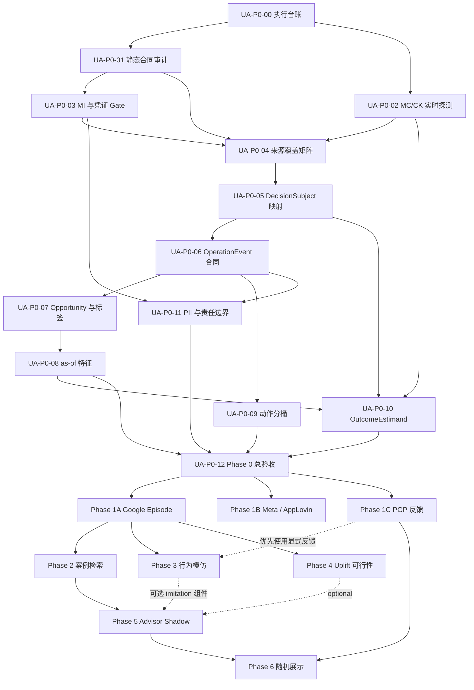

# UA 决策行为沉淀执行任务书

> 状态：`draft_ready_for_commit`；形成可访问的 `PLAN_COMMIT / TASKBOOK_COMMIT` 后才可派发
>
> 版本：`v0.2`
>
> 日期：`2026-07-22`
>
> 权威方案：`data_agent_plan/UA决策行为沉淀/UA决策行为沉淀与回测方案.md`
>
> 原始批准方案提交：`2bdbe69a6cfced1c4f30a1576053adb8a2924ac4`
>
> 派发锚点：每次派发必须显式填写 `CONTROL_REPO / PLAN_COMMIT / TASKBOOK_COMMIT / TARGET_REPO / BASE_COMMIT / TARGET_UPSTREAM_COMMITS / READ_ONLY_DEPENDENCIES`，不得把跨仓 SHA 当作同一提交域
>
> 用途：将已批准方案拆成可分别交给其他 AI 模型执行、审阅和集成的原子任务

## 1. 使用方式

本任务书不是让一个模型一次完成整个项目。正确用法是：

1. 每次只选择一个 `Task ID`。
2. 将第 4 节“通用执行前缀”和该 Task 的“任务卡”一起复制给执行模型。
3. 一个实现任务使用一个目标仓库、一个隔离 worktree、一个任务分支、一个明确 commit；只读验收任务不创建 commit。
4. 上游任务没有人工验收、没有可复核 commit 时，不启动下游任务。
5. 每个实现 commit 再交给另一个模型做只读 Review；Review 与部署许可分开。
6. `BLOCKED / HOLD` 是有效结果，不允许通过猜字段、降低门槛或删除失败样本强行改绿。

当前共享 checkout 已知存在用户 WIP：

```text
ai_ck/engineering_artifacts/freshness_snapshot.json
```

所有执行模型必须先重新检查当前状态，并且不得在共享 checkout 中修改、暂存、恢复、stash、清理或覆盖该文件。

## 2. “行为模型”到底是什么

本文的“行为模仿模型”不是大模型，也不是 Uplift 模型，更不要求使用深度学习。

它学习历史 UA 决策策略：

```text
π_UA(a | x)
= P(
    human_decision = a
    | 决策时点已经可见的状态,
      当时实际可选的动作集合
  )
```

### 2.1 两级目标

一级模型：

```text
continue_observe
adjust_budget
need_data
```

二级模型仅在 UA 明确选择 `adjust_budget` 且填写意向时预测：

```text
intended_direction = increase / decrease
intended_budget_band = 版本化幅度桶
```

它回答“UA 在类似状态下通常怎么判断”，不回答“哪个动作效果最好”，输出必须标 `imitation_only`。

### 2.2 推荐算法顺序

1. 基线：始终继续观察、分层历史多数类、确定性规则、延续上一次决定。
2. 线性基线：带类别权重的多项 Logistic Regression。
3. 首选候选：LightGBM、XGBoost 或 CatBoost 等表格树模型，并做概率校准。
4. 二级模型：方向分类 + 有序幅度分桶；首期不直接预测精确预算金额。
5. 高不确定性、显式标签支持不足、可选动作覆盖不足或分布外时必须 abstain。

首期不建议使用 Transformer、RNN、强化学习、离线策略学习或微调大模型。现有输入主要是结构化表格特征，简单、可解释、可校准的模型应先作为最强基线。

“深度学习”是算法架构类别，不是第四种业务目标：LLM 本身属于深度学习；行为模仿和 Uplift 理论上也能采用深模型，但首期结构化表格任务没有必要这样做。

### 2.3 与其他模型的区别

| 类型 | 学习目标 | 标签 / 输入 | 首期技术 |
|---|---|---|---|
| 行为模仿模型 | UA 历史上会怎么判断 | 显式 `human_decision` + point-in-time 特征 | Logistic / LightGBM / XGBoost / CatBoost |
| 执行一致性诊断 | UA 表达意向后是否实际执行 | stated decision + observed operation | 分类 / 统计诊断，与行为意向分模 |
| Uplift 模型 | 某动作相对未处理可能增加多少结果 | treatment、comparator、D7/D14 Outcome | 匹配、AIPW、因果森林等观察性方法 |
| 大模型 | 理解和表达文本 | 脱敏备注、审核案例、EvidenceBundle | 后续可选 API；不负责因果、门禁或最终动作 |

### 2.4 为什么现在暂不训练

Phase 0 / 1 当前先建立可信的 DecisionSubject、Opportunity、显式人工标签、as-of 特征和泄漏门禁。在以下条件满足前，无论是 Logistic、树模型、深度学习还是大模型，都不应拿现有日志直接训练行为分类器：

```text
GO_FACTUAL
→ IMITATION_DATA_READY candidate + 人工批准
→ Phase 3A 训练与离线回测
→ GO_IMITATION candidate + 人工批准
→ UA-P3-05 离线 serving / 安全验收
→ GO_SHADOW(component=imitation_*) candidate + 人工批准
→ UA-P3-05R / 05V 受控发布与初始验收
→ UA-P3-06 imitation-only 在线静默 Shadow
```

`IMITATION_DATA_READY(platform, subject)` 至少要求：

- DecisionSubject、Opportunity 和操作前 as-of 特征可重建；
- Level 0 门槛已预注册并通过；
- `future_leakage_count=0`、`pii_leakage_count=0`；
- 标签来自 PGP 显式反馈或经审计的当时人工决定；
- `reviewed_no_action` 精度通过；
- Agent 影响前后的行为已经隔离；
- Forward、账户冷启动切分和冻结测试集已经确定；
- 样本量通过标签盘点、学习曲线和置信区间判断，不预先拍固定数量。

行为模型不需要等待 D14 或 `GO_OUTCOME`，因为未来 Outcome 不应进入行为模型；Uplift 才必须等待 `GO_FACTUAL + GO_OUTCOME`。

## 3. 总体任务图



`UA-P0-00` 台账任务验收并集成后，第一批可同时派给两个模型：

- 模型 A：`UA-P0-01` 静态合同审计；
- 模型 B：`UA-P0-02` MC / CK 实时只读探测；

`UA-P0-01` 集成后再派 `UA-P0-03` MI 接口与 collector credential gate。三者全部集成后，才执行 `UA-P0-04`，不能让多个模型各自发明来源合同。

## 4. 所有任务必须附带的通用执行前缀

将下列文本与对应任务卡一起交给执行模型：

```text
你正在执行“UA 决策行为沉淀”项目中的一个原子任务。

派发人必须先填写；任一值为空则停止：

TASK_ID=<任务 ID>
TASK_TYPE=<IMPLEMENTATION|READ_ONLY_VALIDATION|RELEASE_OPERATION|HUMAN_GATE|INTEGRATION>
CONTROL_REPO=/Users/lidongyuan/hungrystudio/点位/数仓
PLAN_COMMIT=<包含当前权威方案的提交>
TASKBOOK_COMMIT=<包含当前任务书的提交>
TARGET_REPO=<唯一写入或发布仓库；纯只读/HUMAN_GATE 写 NONE>
BASE_COMMIT=<TARGET_REPO 基线；无目标仓库写 NONE>
TARGET_UPSTREAM_COMMITS=<仅列 TARGET_REPO 内提交；无则写 NONE>
READ_ONLY_DEPENDENCIES=<repo@sha:path1,path2;repo@sha:path3；无则写 NONE>
ALLOWED_PATHS=<IMPLEMENTATION/INTEGRATION 在 TARGET_REPO 内允许的路径；其他类型写 NONE>
AUTHORIZATION_REF=<RELEASE_OPERATION 必填已批准引用；HUMAN_GATE 输入写 PENDING 并输出裁决引用；其余写 NONE>

权威方案：
CONTROL_REPO@PLAN_COMMIT:data_agent_plan/UA决策行为沉淀/UA决策行为沉淀与回测方案.md

执行任务书：
CONTROL_REPO@TASKBOOK_COMMIT:data_agent_plan/UA决策行为沉淀/UA决策行为沉淀执行任务书.md

原始批准方案提交仅用于追溯：
2bdbe69a6cfced1c4f30a1576053adb8a2924ac4

开始前必须：

1. 在 `CONTROL_REPO` fetch 并分别验证 `PLAN_COMMIT`、`TASKBOOK_COMMIT`；从对应 detached worktree 读取权威方案和任务书，不能读取共享 checkout 的可变副本。
2. 校验所有派发变量均已填写；`NONE` 是显式空值，不得留空。每个 SHA 只在它所属的仓库解析。
3. `IMPLEMENTATION / INTEGRATION / RELEASE_OPERATION`：fetch `TARGET_REPO`，验证 `BASE_COMMIT` 和每个 `TARGET_UPSTREAM_COMMITS`；上游提交必须满足 `git merge-base --is-ancestor <upstream> <BASE_COMMIT>`。
4. `IMPLEMENTATION / INTEGRATION`：严格从 `BASE_COMMIT` 创建隔离 worktree 和 `codex/ua-<task-id>-<date>` 分支。`RELEASE_OPERATION` 从固定 `BASE_COMMIT` 的只读/隔离 checkout 运行，不新建代码 commit。
5. `READ_ONLY_VALIDATION`：`TARGET_REPO / BASE_COMMIT / ALLOWED_PATHS` 均写 NONE；对 `READ_ONLY_DEPENDENCIES` 中每个 `repo@sha` 分别 fetch、验证并创建 detached worktree，不执行名为 READ_ONLY_MULTI_REPO 的伪仓库。
6. `HUMAN_GATE`：AI 只整理候选证据；指定人类 Owner 作出批准/拒绝并生成 `AUTHORIZATION_REF`，AI 不代签、不改代码。通过后只能进入 `UA-GATE-PERSIST` 的 RELEASE_OPERATION，再经 PROJECT 与只读 VERIFY；不得用 IMPLEMENTATION/INTEGRATION 直接改准入状态。
7. 完整阅读 CONTROL_REPO、TARGET_REPO 和只读依赖中所有适用 AGENTS.md，以及命中的 Mandatory Skill / first-read 文件。
8. 记录各共享 checkout 的 `git status --short`，但不得修改、暂存、恢复、stash、清理或覆盖任何共享 WIP。
9. 任务书生成时已知 CONTROL_REPO 共享 WIP 为 `ai_ck/engineering_artifacts/freshness_snapshot.json`；执行时必须重新核对并保护当前所有 WIP。
10. 禁止 `git reset --hard`、`git clean`、`git checkout --`、强推，以及任何清理他人工作区的操作。
11. 一个 IMPLEMENTATION 任务只允许一个明确范围的 commit；只允许修改 `ALLOWED_PATHS`。不要 push main、不要 merge、不要部署、不要删除 worktree。

产品与安全边界：

- Data Agent 只读分析、风险预警、案例、证据和 `needs_decision`。
- 不自动停投、放量、降预算或调用 Google、Meta、AppLovin 写接口。
- 本任务默认无部署、无数据库 DDL/DML、无数据回填、无付费模型调用；只有 `TASK_TYPE=RELEASE_OPERATION` 且任务卡与 `AUTHORIZATION_REF` 同时明确授权时才可执行对应外部写。
- 数据探测只允许有界、只读查询。
- 不保存或输出 MI token、cookie、SSO、AK/SK、操作人姓名/邮箱、用户级明细或原始敏感 JSON。
- 不使用请求上下文中的用户凭证建设离线 collector。
- 不把旧 freshness snapshot、旧报告、旧表卡日期或任务成功描述成当前实时事实。
- 不猜字段、join、SLA、利润口径、平台语义或 GO 状态；证据不足时标 `BLOCKED / HOLD / TODO`。
- 不放宽校验、伪造数据、删除失败样本或降低冻结门槛来获得绿色结果。
- 不调用外部 coding agent 或下游代理替你完成任务。

数据能力要求：

- 查询 MC 必须使用 `maxcompute-dataworks`，先 `SELECT 1`，再做目标表轻量分区探测。
- 查询 CK 必须使用 `clickhouse-shucang`，先 `SELECT 1`，再做目标表轻量分区探测。
- 查询 MI 必须使用 `mi-curl`，只做安全、有界、脱敏的只读探测。
- 修改或新增表必须完整执行 `skills/table-intake/SKILL.md`。
- 修改 knowledge/、da_assets/、指标合同或召回路径时，执行对应 consistency、authority、metric boundary、retrieval map 与 regression 门禁。
- freshness blocker 必须保留真实退出语义，不得强行改绿。

执行顺序：

1. 先做只读现状与合同核验。
2. 明确区分 `repo_confirmed / live_verified / design_required / blocked`。
3. 固定 grain、主键、事件时间、snapshot 时间、available 时间、ingested 时间和 source watermark。
4. 完成本任务最小产物，不顺手实施下游阶段。
5. 做正例、负例、边界样本和失败路径验证。
6. 运行适用测试与门禁，保留原始退出码。
7. IMPLEMENTATION/INTEGRATION 检查最终 diff 只包含 `ALLOWED_PATHS`；IMPLEMENTATION 只暂存本任务文件并创建一个语义明确的 commit。
8. READ_ONLY_VALIDATION 不修改；RELEASE_OPERATION 只执行授权范围并保存运行证据；HUMAN_GATE 等待真人裁决，三者均不得伪造代码 commit。

只读验收任务不创建分支改动和 commit；它必须固定被验收的 candidate SHA，从 `CONTROL_REPO@TASKBOOK_COMMIT` 读取任务卡，并从各 `repo@sha` detached worktree 读取代码。

原始或敏感探测输出只能进入受控或 gitignored 目录；Git 中只提交脱敏、可审阅的聚合结论、代码和合同。

提交前必须展示：

- `git status --short`
- `git diff --check`
- `git diff --name-only`
- `git diff --stat`
- 所有测试 / 门禁命令和退出码

最终交接必须使用以下结构：

1. Outcome：完成 / 部分完成 / BLOCKED
2. Task ID / Branch / Worktree / Base SHA / Commit SHA
3. 改动摘要
4. 当前实时证据：探测时间、环境、表或 endpoint、时间窗、水位
5. 测试与门禁及退出码
6. 正例、负例、边界样本和抽样方法
7. 未验证假设、失败项和 blocker
8. 是否触碰共享 WIP：必须为否；隔离分支若生成同路径 freshness 文件，要单独声明 merge collision risk
9. 下一任务所需输入
10. 建议审阅文件与重点
11. 明确声明实际执行过的外部操作；非 RELEASE_OPERATION 必须是未部署、未执行 DDL/DML/回填/媒体写、未调用付费模型，RELEASE_OPERATION 必须逐项引用授权

任何命令未运行、权限不足、数据未成熟或只读探测失败时，结论必须是 BLOCKED/HOLD，不得写 PASS。

若本任务生成了与共享 WIP 同路径的 freshness diff，后续集成任务不得自动 merge，也不得用 checkout/reset 选边；必须由人工比较探测时间、来源水位和语义后，明确选择保留、合并或重新探测。
```

### 4.1 Task Type 执行合同

| `TASK_TYPE` | 分支 / commit | 允许的外部写 | 完成条件 |
|---|---|---|---|
| `IMPLEMENTATION` | 隔离分支；一个任务一个 commit | 默认无 | 代码/文档、测试、Review 候选齐全 |
| `READ_ONLY_VALIDATION` | detached worktree；无 commit | 无 | 固定 SHA 的可复核 verdict |
| `RELEASE_OPERATION` | 固定已审阅 SHA；无代码 commit | 仅任务卡 + `AUTHORIZATION_REF` 的精确范围 | 发布/DDL/DML/小窗口运行证据与恢复状态 |
| `HUMAN_GATE` | 无 AI commit | 人类批准/拒绝本身 | Owner 裁决与 `AUTHORIZATION_REF`；manifest 修改另开任务 |
| `INTEGRATION` | 每仓一个隔离集成分支；可新增一个 manifest commit | 默认无 | 批准 commits、跨任务门禁和新 base SHA |

### 4.2 串行集成任务模板

每组上游实现均通过独立 Review 后，必须先执行 `UA-INT-<批次>`，再派发下游任务。Review PASS 只表示候选 commit 可进入集成，不表示它已经存在于下游基线。

将下面字段与第 4 节前缀一起派发；任一字段为空则停止：

```text
TASK_ID=UA-INT-<批次>
TASK_TYPE=INTEGRATION
TARGET_REPO=<本次唯一集成仓库>
INTEGRATION_BASE=<该仓库集成起点>
APPROVED_COMMITS_IN_ORDER=<同仓库 commit 有序列表>
HUMAN_ACCEPTANCE_REFS=<逐 commit 人工接收证据>
ALLOWED_PATHS=<所有 approved commit 路径并集 + integration manifest；不得临时扩大>
REQUIRED_CROSS_TASK_GATES=<必须重跑的命令及退出语义>
INTEGRATION_MANIFEST_PATH=<目标文件>
FRESHNESS_COLLISION_DECISION_REF=<无冲突写 NONE；有冲突必须是人工决议引用>
INTEGRATION_REF=<下游可解析的非 main ref>
REF_VISIBILITY=<shared_local|remote>
```

字段关系固定为：`BASE_COMMIT = INTEGRATION_BASE`；`TARGET_UPSTREAM_COMMITS` 只列已经包含在 `INTEGRATION_BASE` 中、需要验证祖先关系的提交；`APPROVED_COMMITS_IN_ORDER` 才是本次准备纳入、尚可不是 BASE 祖先的候选提交。不得把候选 commit 错填进 `TARGET_UPSTREAM_COMMITS`。

集成任务在新的隔离 worktree 中从 `INTEGRATION_BASE` 开始，只按序纳入同一 `TARGET_REPO` 的批准 commit；跨仓成果只作为 `READ_ONLY_DEPENDENCIES`，不能把别仓 SHA 当本仓提交。Integration 禁止语义冲突修复：任何 cherry-pick、合同或 freshness 冲突都必须停止，并退回新的 IMPLEMENTATION → Review → Human Accept；不得现场改代码后直接集成。

无冲突纳入后，运行跨任务门禁并提交仅包含 integration manifest 的 commit，记录实际纳入/未纳入 commit、测试退出码、freshness 决议和候选新 `BASE_COMMIT`。manifest commit 还需独立只读 `INTEGRATION_REVIEWED`，通过后才可标 `INTEGRATED(base_sha)`。未经授权不 push main、不部署；若 `REF_VISIBILITY=remote`，发布非 main integration ref 也必须有 `AUTHORIZATION_REF`。下游模型必须实际 fetch/resolve `INTEGRATION_REF`，仅存在于某台机器对象库的裸 SHA 不算 `INTEGRATED`。

任务状态必须按以下顺序推进，不能从 Review 直接跳到下游派发：

```text
EXECUTED
→ REVIEWED
→ HUMAN_ACCEPTED
→ INTEGRATION_CANDIDATE
→ INTEGRATION_REVIEWED
→ INTEGRATED(base_sha)
→ DOWNSTREAM_DISPATCHABLE
```

### 4.3 能力门禁批准模板

执行模型和审阅模型只能产出 `gate_candidate`，不能自行签发 `GO_*`。`UA-GATE-<capability>-<platform>-<subject>` 固定为 `TASK_TYPE=HUMAN_GATE`：由任务书指定的业务、数据、安全或算法 Owner 审阅证据并产生裁决引用；裁决通过后，严格进入 `UA-GATE-PERSIST` RELEASE_OPERATION，再执行 PROJECT 与只读 VERIFY。

`UA-GATE` 必须记录候选证据 commit、Review verdict、Owner、批准时间、有效期、适用平台/subject/estimand/component 和批准或拒绝理由。`IMITATION` 至少区分 `human_decision / intended_direction_band`，`GO_SHADOW` 至少区分 `advisor_bundle / imitation_human_decision / imitation_intended_direction_band`；一个组件的准入不能借给另一个组件。

正式状态采用唯一可执行链，缺一环都仍是 candidate：

```text
UA-GATE-<scope>                 # TASK_TYPE=HUMAN_GATE
→ UA-GATE-PERSIST-<scope>       # TASK_TYPE=RELEASE_OPERATION
→ UA-GATE-PROJECT-<scope>       # TASK_TYPE=RELEASE_OPERATION
→ UA-GATE-VERIFY-<scope>        # TASK_TYPE=READ_ONLY_VALIDATION
→ admission_version 生效
```

`UA-GATE-PERSIST` 固定从 CONTROL_REPO 已审阅的 manifest writer 版本运行，使用人类裁决引用和单独的 MC append-only DML 授权，向 `dwd_market_capability_admission_manifest_da` 追加新 revision；禁止 update/delete 旧状态。写入字段至少包含 platform、subject、capability、component、action/estimand version、status、evidence refs、blockers、validity、approved role/time 和 admission version。

`UA-GATE-PROJECT` 使用已审阅并发布的 MC→CK admission projection job，只投影该次新 revision 的安全字段；必须有 CK 写入/刷新授权，失败不能用缓存旧状态代替。

`UA-GATE-VERIFY` 必须用 `maxcompute-dataworks` 只读核对新 revision 唯一、scope 准确、证据可达、旧 revision 仍保留，再用 `clickhouse-shucang` 核对 CK serving projection 的 admission version、状态和有效期完全一致。只有核验通过后，下游才可把该状态视为正式 `GO_*`；写入、projection 或读取失败必须 HOLD。

## 5. Phase 0 原子任务

### UA-P0-00：建立执行台账与证据模板

**目标**：建立后续模型共同使用的任务状态、依赖和交接格式，不实施业务逻辑。

**前置**：无。

**执行**：

1. 核对当前 `origin/main`、方案文件和适用 AGENTS 规则。
2. 建立实施台账，至少记录 Task ID、Owner/模型、base SHA、branch、commit、状态、依赖、证据路径、blocker 和人工审阅结论。
3. 建立统一 evidence manifest 模板，字段包含 source、probe_at、as_of、window、watermark、query hash、row count、PII status 和 conclusion maturity。
4. 记录当前已知 dirty WIP 和不得触碰列表。

**产物**：

- `data_agent_plan/UA决策行为沉淀/UA决策行为沉淀实施台账.md`
- 可复用的 evidence manifest Schema 或模板。

**验收**：范围明确；Phase 0 标记为只读；默认无部署、回填、付费 LLM 和媒体写；没有擅自签发任何 `GO_*`。

**非目标**：不查询业务数据，不建表，不修改 PGP，不训练模型。

### UA-P0-01：静态合同与来源证据审计

**目标**：只读核对当前仓库与 PGP 代码中已经存在的 MI、MC、CK、Google/Meta/AppLovin 证据，形成 live probe 前的静态来源注册表。

**前置**：`UA-P0-00` 已验收。

**必须核对**：

- PGP `/history` 当前是否只合并 `ua-remarks + ua-operates`；
- changelog client 是否存在、是否进入页面主链；
- `ua-operates` 当前过滤维度；
- Google change-event 宽表的 old/new 与 `MAX_PT` 最新配置边界；
- Meta Ad Set、Meta Campaign、AppLovin Campaign 表卡；
- 现有 18 字段统一变更日志合同与 Meta/AppLovin TODO。

**产物**：`data_agent_plan/UA决策行为沉淀/UA决策行为沉淀Phase0静态来源审计.md`。

**验收**：每项结论标 `repo_confirmed / live_verification_required / design_required` 并引用文件与行号；不得把 PGP 页面接口写成训练 collector。

**非目标**：不调用 live 数据，不改 PGP，不新增表。

### UA-P0-02：MC / CK 实时连通性与 freshness 探测

**目标**：建立 Phase 0 当前实时数据能力证据。

**前置**：`UA-P0-00` 已验收。

**执行**：

1. 按 Mandatory Skill 分别完成 MC、CK `SELECT 1`。
2. 对方案涉及的目标源表做轻量 `max(dt)` / `SHOW PARTITIONS` / 等价 bounded probe。
3. 成功后在隔离 worktree 运行 `tools/scripts/probe_freshness.py`。
4. 区分实时探测与旧 snapshot；记录 source watermark、时区、允许滞后和失败原因。

**产物**：`data_agent_plan/UA决策行为沉淀/UA决策行为沉淀Phase0实时数据能力报告.md`，以及由规范要求生成的隔离分支 freshness 证据。

**验收**：MC、CK 分别有当前退出码和目标表水位；任一失败则对应结论 `HOLD_DATA / connectivity_unverified`，不能引用旧快照替代。

**特别边界**：隔离分支产生的 freshness 文件与共享 checkout WIP 视为 merge collision risk，交由人工单独协调。

### UA-P0-03：MI history 与 collector credential gate

**目标**：验证 MI 三类 history 接口的字段、分页、过滤与时间覆盖，并关闭或明确 collector 凭证阻塞。

**前置**：`UA-P0-00`、`UA-P0-01` 已验收。

**接口**：

```text
ua-operates
ua-remarks
campaign changelog
```

**执行**：

1. 使用 `mi-curl` 做小 limit 安全摘要，不保存 raw 文本、操作人和用户凭证。
2. 分别核对 campaign name / ID、account、media、日期、offset/cursor、limit、终止分页和空结果语义。
3. 记录最早 / 最新可用日期、时区精度、稳定事件 ID、before/after、人工/自动来源可分性。
4. 评估离线 collector 只能使用以下路径之一：批准的服务身份、上游审计导出、DataWorks 受控 source。
5. 若只有请求上下文中的用户 Bearer/cookie/SSO，固定输出 `BLOCKED_CREDENTIAL`。

**产物**：`data_agent_plan/UA决策行为沉淀/UA决策行为沉淀Phase0_MI接口与凭证报告.md`。

**验收**：probe 凭证与 collector 凭证明确分开；不持久化或重放用户 token；无法证明全量分页时不能认定 source complete。

**非目标**：不实现 collector，不修改 PGP，不把空结果变成未操作标签。

### UA-P0-04：三媒体来源覆盖与证据等级矩阵

**目标**：整合静态和 live 证据，形成平台 × endpoint × DecisionSubject 的唯一来源合同。

**前置**：`UA-P0-01`、`UA-P0-02`、`UA-P0-03` 均已人工验收。

**执行**：

1. 合并而不是重做三个上游报告。
2. 对 Google、Meta、AppLovin 分别记录事件 ID、时间、before/after、分页、资源 inventory、延迟、覆盖和 credential 状态。
3. 证据等级固定为 `native / audit / inferred_only / unknown`。
4. 给出每个平台可进入 `FACTUAL / OUTCOME / RETRIEVAL / IMITATION / UPLIFT` 的候选状态及 blocker，但不签发正式 Go。

**产物**：`data_agent_plan/UA决策行为沉淀/UA决策行为沉淀Phase0来源覆盖矩阵.md`。

**验收**：Meta/AppLovin 快照差分不得伪装成审计级事件；接口空返回不得推出 no-action；所有结论可回溯上游证据。

### UA-P0-05：账户、Campaign、预算资源与 DecisionSubject 映射验收

**目标**：证明真实预算控制对象可以在历史时点唯一表示。

**前置**：`UA-P0-02`、`UA-P0-04` 已验收。

**执行**：

1. 盘点 `ad_account_key`、账户币种、时区和有效期。
2. 验证 Campaign ID/name 改名、复制、删除与历史映射。
3. 验证 Google campaign budget / shared budget、Meta CBO / ABO、AppLovin global / country budget。
4. 使用账户域内 `budget_resource_key`，名称只作带置信度兜底。
5. 分层抽样冲突、缺失和多对多关系。

**产物**：`data_agent_plan/UA决策行为沉淀/UA决策行为沉淀Phase0_DecisionSubject映射报告.md`。

**验收**：共享预算不复制成多个独立 treatment；映射准确率与冲突率有盲审样本，阈值候选在查看最终测试集前冻结。

**非目标**：不创建生产 SCD，不签发 GO_FACTUAL。

### UA-P0-06：统一变更日志与 CanonicalOperationEvent 合同

**目标**：冻结 Observation → 现有 18 字段统一变更日志 → CanonicalOperationEvent 的单一映射。

**前置**：`UA-P0-04`、`UA-P0-05` 已验收。

**执行**：

1. 为三媒体列出字段映射与 evidence tier。
2. 冻结事件去重、区间时间、old/new、币种、预算范围、operation origin 和 source watermark。
3. 明确 Google 历史 before/after 只使用 change event old/new，不能用 `MAX_PT` 最新配置回填。
4. 明确快照差分 `inferred_only`，不能进入可信 treatment。
5. 设计正例、重复事件、连续调整、自动操作、未知来源和失败请求测试样本。

**产物**：`data_agent_plan/UA决策行为沉淀/UA决策行为沉淀Phase0_OperationEvent合同.md`。

**验收**：只有一个基础变更日志真相源；PII 安全 projection 与受限基础表分开；事件可追溯到 observation 和 coverage run。

### UA-P0-07：DecisionOpportunity 与标签合同

**目标**：冻结每日复盘、异常触发、去重、候选 24h 标签窗口和三套标签。

**前置**：`UA-P0-05`、`UA-P0-06` 已验收。

**必须区分**：

```text
observed_treatment
human_decision
review_status

reviewed_no_action
observed_no_budget_change
action_unknown
```

**执行**：

1. 定义 scheduled/anomaly opportunity 的生成时点与 trigger version。
2. 定义同一 DecisionSubject 重叠机会的 dedupe group。
3. 定义 coverage run 完整性与标签关联。
4. 定义 compound action、source unavailable 和不合格用途的 exclusion reason。

**产物**：`data_agent_plan/UA决策行为沉淀/UA决策行为沉淀Phase0_Opportunity与标签合同.md`。

**验收**：三类未处理 / 未决状态互斥可验证；“没查到日志”永远不能直接生成继续观察或未处理真值。

### UA-P0-08：point-in-time 特征可重建性审计

**目标**：验证操作时点能够重建当时已经可见的输入状态。

**前置**：`UA-P0-02`、`UA-P0-05`、`UA-P0-07` 已验收。

**执行**：

1. 盘点 1/3/7/14 天规模、效率、预测、阈值、生命周期、历史操作和数据质量特征。
2. 对每个字段区分 `event_at / snapshot_at / available_at / ingested_at`。
3. 验证 forecast version、阈值版本、回填和迟到数据不会覆盖历史当时值。
4. 构造 future leakage 正负例测试。

**产物**：`data_agent_plan/UA决策行为沉淀/UA决策行为沉淀Phase0_asof特征审计.md`。

**验收**：候选特征均能证明 `available_at <= opportunity.as_of_ts`；不能证明者进入排除清单；`future_leakage_count=0`。

### UA-P0-09：预算动作分桶候选

**目标**：根据真实分布形成分平台的预算方向和幅度桶候选。

**前置**：`UA-P0-04`、`UA-P0-06` 已验收。

**执行**：

1. 有界统计 budget change pct、原生金额、币种和 subject 类型分布。
2. 分平台报告上调、下调、连续动作、极端值和样本支持。
3. 提出候选桶及版本，不为类别均衡扭曲业务意义。
4. 生成供 UA Owner 审阅的边界案例。

**产物**：`data_agent_plan/UA决策行为沉淀/UA决策行为沉淀Phase0_预算动作分桶报告.md`。

**验收**：候选桶有真实分布与边界样本；AI 不能替业务 Owner 最终确认。

### UA-P0-10：OutcomeEstimand 与 Guardrail 合同

**目标**：把已确认的 D7/D14 利润方向冻结为可复算、可实验的正式候选合同。

**前置**：`UA-P0-02`、`UA-P0-05`、`UA-P0-07`、`UA-P0-08` 已验收并集成；需要业务、数据、算法 Owner 参与。

**必须决策**：

- SDK / AF 收入源及敏感性分析；
- acquisition enrollment window；
- spend window、折后消耗、汇率与其他成本；
- D7/D14 成熟、迟到和冻结版本；
- partial-day；
- 重复机会、后续动作、washout / IPCW；
- 随机簇 × 分析周期；
- 缺失 Outcome、cluster weighting；
- ROI、CPI、消耗的非劣界值和多重检验。

**产物**：`data_agent_plan/UA决策行为沉淀/UA决策行为沉淀OutcomeEstimand决策单.md`。

**验收**：AI 只整理候选与分歧；正式签认来自业务和数据 Owner。未签认时固定 `estimand_status=unconfirmed`，不能生成正式利润标签或 `GO_OUTCOME`。

### UA-P0-11：PII、安全、凭证与系统责任设计

**目标**：关闭 operator、账户、备注、payload、凭证和系统写入责任边界。

**前置**：`UA-P0-03`、`UA-P0-06` 已验收。

**执行**：

1. 逐字段定义 PII 等级、HMAC/token scope/version、密钥 Owner 和轮换。
2. 低熵备注、邮箱、工号和 payload 不得使用普通 hash。
3. 定义受限基础表、Agent 安全 projection 和默认 RAG 禁止项。
4. 冻结 collector、MC、CK、Data Agent、PGP 的责任和禁止写路径。
5. 明确 PGP DB/outbox → ETL → MC append-only，Data Agent 不持 MI 用户 token。

**产物**：`data_agent_plan/UA决策行为沉淀/UA决策行为沉淀安全与责任边界.md`。

**验收**：`pii_leakage_count=0` 设计可验证；不存在媒体写能力；只有用户凭证时 collector 仍为 Blocked。

### UA-P0-12：Phase 0 总验收与能力矩阵

**目标**：整合 P0-01 至 P0-11，形成唯一 Phase 0 结论和后续实施基线。

**前置**：P0-01 至 P0-11 全部达到 `REVIEWED → HUMAN_ACCEPTED → INTEGRATED(base_sha)`，且 P0-12 的 `BASE_COMMIT` 包含同仓全部前置 commit；跨仓证据使用固定 `repo@sha:path`。

**执行**：

1. 合并现有报告，不重新发明合同或重复 live 探测。
2. 为每张拟建表补 grain、分区、Owner、SLA、lineage、PII、must_filter、freshness 与安全示例查询候选。
3. 形成 `platform × subject × capability` admission 候选矩阵。
4. 区分 `go_candidate / hold / blocked / not_applicable`，列明 blocker 和所需证据。
5. 输出 Phase 1A / 1B / 1C 的可启动任务及 base commit。

**产物**：

- `data_agent_plan/UA决策行为沉淀/UA决策行为沉淀Phase0总验收报告.md`
- `data_agent_plan/UA决策行为沉淀/UA决策行为沉淀能力准入候选矩阵.md`

**验收**：三方审阅通过；不能在 Phase 0 提前把设计合同写成已实现能力；正式 `GO_FACTUAL / GO_OUTCOME` 只能在对应数据产品和 Level 0 验收后，由 `UA-GATE` 人工批准任务签发。

## 6. Phase 1A：Google 预算事实与 Episode

### UA-1A-01A：三媒体统一基础组物理合同与 Google 映射

**目标**：设计账户、FX、Campaign Identity、预算资源桥、DecisionSubject、coverage run/page。

**前置**：`UA-P0-12` 已验收并集成；只使用其明确允许的 subject 和 source。

**执行**：完整执行 `skills/table-intake/SKILL.md`；为本组补齐 grain、分区、Owner、SLA、lineage、PII、must_filter、join、pitfall、安全 example query、catalog、数据地图、RAG、profile/INDEX、schema baseline 和 freshness 定义。DDL / 生产 SQL 只作为候选。

**验收**：表卡质量门禁 hard errors 和 warnings 为 0；未确认字段进入 TODO；没有执行 DDL/DML。

### UA-1A-01B：三媒体统一事件组物理合同与 Google 映射

**目标**：设计 operation/remark observation、现有 18 字段 change log 和 CanonicalOperationEvent。

**前置**：`UA-1A-01A`、`UA-P0-06` 已验收并集成。

**执行与验收**：复用 `UA-1A-01A` 的 table-intake 和零 warning 要求，但只修改事件组允许路径；不得重复建立第二张基础 change log。

### UA-1A-01C：三媒体统一决策组物理合同与 Google 映射

**目标**：设计 Opportunity、feature snapshot/lineage、Outcome 组成项、Episode 和 capability manifest。

**前置**：`UA-1A-01A`、`UA-1A-01B`、`UA-P0-07`、`UA-P0-08`、`UA-P0-10` 已验收并集成。

**执行与验收**：复用 `UA-1A-01A` 的 table-intake 和零 warning 要求，但只修改决策组允许路径；设计状态不得写成已实现能力。

### UA-1A-02：Google/MI 追加式采集与 coverage 审计

**目标**：实现已批准来源的 append-only Observation 与可证明完整的 coverage run/page。

**前置**：`UA-1A-01A`、`UA-1A-01B` 已验收并集成；collector credential gate 已通过。若仍 `BLOCKED_CREDENTIAL`，本任务只能交付实现设计和测试夹具，不能上线采集。

**执行**：

1. 实现分页、terminal cursor、资源 inventory、窗口、重试和幂等。
2. 成功空页、失败页、部分页和完整 run 状态严格分开。
3. 只落安全字段、source row ref 和治理后的 token/hash。
4. 用 fixture 和有界只读样本验证重跑不重复、失败可恢复。

**产物**：collector/ETL 代码、coverage run/page 代码、测试、脱敏运行证据。

**验收**：所有未处理标签未来都能引用最终 complete run；不保存用户 token；无 PII/raw JSON；未获写入授权时只做 dry-run。

### UA-1A-03：账户、Identity、预算资源桥与 DecisionSubject SCD

**目标**：实现 Google campaign budget 与 shared budget 的历史身份和真实决策对象。

**前置**：`UA-1A-01A`、`UA-P0-05` 已验收并集成。

**执行**：

1. 实现账户币种/时区有效期、Campaign SCD、预算资源多对多桥。
2. 生成账户域内 `budget_resource_key`。
3. 处理改名、复制、删除、shared budget 影响集合和有效时间。
4. 对稳定 ID、名称兜底、冲突和缺失做分层抽样。

**验收**：`decision_unit_accuracy` 达到 P0 冻结门槛；shared budget 一次变化只形成一个 treatment；无法资源级定位者只进事实时间线。

### UA-1A-04：统一 change log 与 CanonicalOperationEvent

**目标**：实现现有 18 字段唯一基础 change log，并生成与 DecisionSubject 关联的派生事件。

**前置**：`UA-1A-01B`、`UA-1A-02`、`UA-1A-03` 已验收并集成。

**执行**：

1. 实现 Observation → change log → CanonicalOperationEvent。
2. 保存 event time precision、before/after、native/USD 金额、fx version、origin、evidence tier 和 source watermark。
3. 连续调整标 compound，平台自动、内部规则、人工、unknown 分开。
4. 用 change event 自带 old/new；禁止 `MAX_PT` 最新配置伪造历史状态。

**验收**：operation event link precision、before/after accuracy 达到冻结门槛；unknown origin 不进入 Uplift；全链可追溯。

### UA-1A-05：双入口 DecisionOpportunity builder

**目标**：实现每日固定复盘与异常触发机会，生成唯一 Opportunity ID。

**前置**：`UA-1A-01C`、`UA-1A-03`、`UA-P0-07` 已验收并集成。

**执行**：

1. 实现 scheduled/anomaly 两类生成器和 trigger version。
2. 对近邻重叠机会生成 dedupe group，不重复 treatment。
3. 固定 eligible action set、label window、interference cluster 和 source health。
4. 生成面向 CK / PGP 的 minimal opportunity projection 合同。

**验收**：每个机会有唯一 `opportunity_id + decision_subject_id`；PGP 不需要、也不能自行生成 ID；异常和固定复盘可分层评估。

### UA-1A-06：预算事实与三类未处理 / 未决标签

**目标**：把 OperationEvent、coverage 和显式反馈映射为分离标签。

**前置**：`UA-1A-02`、`UA-1A-04`、`UA-1A-05` 已验收。

**执行**：

1. 分别生成 `observed_treatment / human_decision / review_status`。
2. 仅 complete coverage run 可生成 `observed_no_budget_change`。
3. 仅显式继续观察 + complete coverage + 无实际动作可生成 `reviewed_no_action`。
4. 尚无显式反馈样本时，只用 fixture 验证 `reviewed_no_action` 派生规则，真实指标记 `not_applicable/no_samples`；不得为取得 `GO_FACTUAL` 伪造标签。
5. coverage 不全、资源缺失、复合动作等进入 unknown/exclusion。

**验收**：observed no-budget-change precision 达到冻结门槛；reviewed no-action 有真实样本时才评 precision，无样本时按上述 N/A 处理；没有把“没查到”当真值。

### UA-1A-07：point-in-time 特征快照与长血缘

**目标**：生成不含未来信息的 feature snapshot 和逐字段 lineage。

**前置**：`UA-1A-01C`、`UA-1A-05`、`UA-P0-08` 已验收并集成。

**执行**：

1. 建宽特征快照与长 lineage，使用 `feature_snapshot_id` 关联。
2. 保存 event/snapshot/available/ingested 时间、source row ref、watermark 和 feature version。
3. 重建 1/3/7/14 天趋势、阈值、forecast version、生命周期、历史动作和数据质量。
4. 建 leakage test，专门覆盖迟到回填、最新配置误用和 target encoding。

**验收**：`future_leakage_count=0`；无法 point-in-time 重建的字段不会静默填当前值；snapshot 可复算。

### UA-1A-08：D3/D7/D14 Outcome 组成项

**目标**：回填收入、消耗、注册、CPI、ROI 和成熟状态，不提前生成正式利润标签。

**前置**：`UA-1A-01C`、`UA-1A-05`、`UA-P0-10` 已验收并集成；正式 estimand 可能仍未签认。

**执行**：

1. 严格区分实际与预测、cohort window、spend window、available_at、maturity。
2. 记录 subsequent action、overlap、interference、censoring 和 partial-day。
3. estimand 未确认时只写组成项和 `actual_profit_candidate`，标 `estimand_status=unconfirmed`。
4. 用一致 cohort 校验收入与成本，不混入旧 cohort 收入。

**验收**：实际/预测分离；组成项可复算；未获 `GO_OUTCOME` 前不被下游当正式利润标签。

### UA-1A-09：DecisionEpisode、资格和 capability manifest

**目标**：形成一行一 Episode 及检索、模仿、Uplift、Advisor 的独立资格。

**前置**：`UA-1A-01C`、`UA-1A-06`、`UA-1A-07`、`UA-1A-08` 已验收并集成。

**执行**：

1. 关联 Opportunity、Subject、events、features、intent、outcomes 和 evidence hash。
2. 保存 case close time、advisor available time、policy era 和 Agent exposure flags。
3. 为每种用途生成 eligibility 和 exclusion reasons。
4. capability manifest 只读取真实门禁证据，不从“模型文件存在”猜状态。
5. 实现 append-only admission revision writer/reader 的 dry-run 与幂等测试；writer 必须要求人类 Gate 引用和 DML 授权，禁止 update/delete 旧 revision。

**验收**：任一资格可追溯到事实、特征、Outcome 和合同版本；不合格 Episode 仍保留但不会进入错误用途。

### UA-1A-09P：capability admission MC→CK serving projection

**任务类型**：`IMPLEMENTATION`。

**目标**：实现正式 Gate revision 从 MC manifest 到 CK 在线只读投影的唯一链路。

**前置**：`UA-1A-09` 已验收并集成。

**执行**：实现按 platform/subject/capability/component/action/estimand 选择最新有效 admission version 的幂等 job、CK Schema/read contract、刷新与回退；覆盖重复 revision、迟到、过期、撤销、hold/blocked 和 source unavailable。任何空值/失败默认 fail closed，不能猜 `go`。

**验收**：fixture 与本地集成测试证明 MC revision 和 CK projection 一致；旧版本可审计；无授权时不写真实 MC/CK。

### UA-1A-09R：受控发布与小窗口 materialization

**任务类型**：`RELEASE_OPERATION`。

**目标**：把已审阅的数据产品、append-only manifest writer 和 MC→CK admission projection job 发布到批准环境，并只对批准的 Google 小窗口生成真实 Episode。

**前置**：`UA-1A-02` 至 `UA-1A-09` 及 `UA-1A-09P` 全部 REVIEWED、HUMAN_ACCEPTED、INTEGRATED；另有明确的 MC/CK 表与任务发布、DDL/DML、目标环境、日期窗口、成本上限和恢复方案授权。

**执行**：按授权创建或更新表/任务，运行幂等小窗口 materialization；记录 resolved commit、任务实例、分区、行数、水位、重跑和回滚证据。授权缺一项即 `BLOCKED_AUTHORIZATION`，不得以 fixture 代替真实发布。

**验收**：只影响授权环境和窗口；没有媒体写；失败可恢复；未扩成历史全量回填。

### UA-1A-09V：真实数据对账与 freshness 验收

**任务类型**：`READ_ONLY_VALIDATION`。

**目标**：在 Level 0 前确认小窗口数据真实、完整、可重算。

**前置**：`UA-1A-09R` 成功。

**执行**：只读核对 source→observation→event→opportunity→snapshot→outcome→episode 的数量、主键、分区、水位、迟到和失败页；验证 manifest writer/projection job 已部署、默认 fail closed、读取合同可用；重跑规范 freshness 门禁。

**验收**：对账与 freshness 达到预冻结门槛；任何失败保持真实 BLOCKED/HOLD，不得删除失败样本改绿。

### UA-1A-10：Level 0 抽样重建与准入候选

**目标**：人工核对 Google Episode，形成每个 subject 的 GO 候选证据。

**前置**：`UA-1A-09V` 已验收。

**必须报告**：

```text
operation_event_link_precision
budget_before_after_accuracy
decision_unit_accuracy
reviewed_no_action_precision
observed_no_budget_change_precision
point_in_time_reconstruct_rate
source_window_complete_rate
future_leakage_count
pii_leakage_count
```

**执行**：按 action、subject、时间、名称兜底和边界类型分层抽样；盲审阈值在查看冻结测试集结果前确定。

**产物**：Level 0 报告、表准入证据和 capability admission candidate；不直接修改正式 GO 状态。

**验收**：只对通过组合提出 `GO_FACTUAL(google, subject)` 候选；正式 OutcomeEstimand 同时通过时才可提出 `GO_OUTCOME` 候选。`reviewed_no_action_precision` 无真实显式反馈样本时必须报 `not_applicable/no_samples`，它不阻断事实准入；实际精度留到 `IMITATION_DATA_READY`。Episode 表存在不等于 Go；正式状态由 `UA-GATE` 人工批准任务写入 manifest。

## 7. Phase 1B：Meta 与 AppLovin 独立支线

1B 任务继承 1A 卡片时，必须替换平台本地依赖，不能引用 Google 实现 commit。令 `<PFX>` 为 `UA-1B-M02` 或 `UA-1B-A02`：

```text
<PFX>-02  → 三媒体统一 01A/01B + 本平台 source/credential gate
<PFX>-03  → 三媒体统一 01A + 本平台 DecisionSubject mapping
<PFX>-04  → <PFX>-02 + <PFX>-03 + 统一 01B
<PFX>-05  → <PFX>-03 + 统一 01C
<PFX>-06  → <PFX>-02 + <PFX>-04 + <PFX>-05
<PFX>-07  → <PFX>-05 + 统一 01C
<PFX>-08  → <PFX>-05 + 统一 01C + P0-10
<PFX>-09  → <PFX>-06 + <PFX>-07 + <PFX>-08
<PFX>-09R → <PFX>-02...09 + 发布授权
<PFX>-09V → <PFX>-09R
<PFX>-10  → <PFX>-09V
```

P0 合同、三媒体统一 01A/B/C、共享 admission projection `UA-1A-09P` 保持跨平台公共依赖；除此之外，卡片中的 `UA-1A-*` 实现依赖一律替换成本平台 `<PFX>-*`。

### UA-1B-M01：Meta change log 与 CBO / ABO 核验

**目标**：核验 Meta 原生或审计级 change log、Campaign CBO 和 Ad Set ABO 的真实 DecisionSubject。

**前置**：`UA-P0-12` 已验收。

**产物**：Meta source coverage、预算对象映射、before/after、事件时间、credential 和 blocker 报告。

**验收**：若只有配置快照，固定 `inferred_only`；不能生成可信未处理标签、模仿标签或 Uplift treatment。

### UA-1B-M02：Meta adapter、Episode 与 Level 0 任务族（Epic，不可直接派发）

**前置**：`UA-1B-M01` 已确认具备对应证据等级；`UA-1A-01A/B/C` 三媒体统一物理合同已集成；复用统一合同，只增加经审阅的 Meta mapping/extension，不另造平行 Schema。

**原子任务映射**：

| Meta Task ID | 继承的原子任务卡 |
|---|---|
| `UA-1B-M02-02` | `UA-1A-02` collector / coverage |
| `UA-1B-M02-03` | `UA-1A-03` identity / DecisionSubject |
| `UA-1B-M02-04` | `UA-1A-04` CanonicalOperationEvent |
| `UA-1B-M02-05` | `UA-1A-05` Opportunity |
| `UA-1B-M02-06` | `UA-1A-06` 分离标签 |
| `UA-1B-M02-07` | `UA-1A-07` as-of 特征 |
| `UA-1B-M02-08` | `UA-1A-08` Outcome 组成项 |
| `UA-1B-M02-09` | `UA-1A-09` Episode / manifest |
| `UA-1B-M02-09R` | `UA-1A-09R` 受控发布 |
| `UA-1B-M02-09V` | `UA-1A-09V` 真实对账 |
| `UA-1B-M02-10` | `UA-1A-10` Level 0 candidate |

每张卡必须叠加 `UA-1B-M01` 已确认的 Meta subject/source 差异，并使用独立分支、commit、Review 和集成；不得把整个 Epic 交给一个模型。

**验收**：能力按 Meta × campaign_budget/adset_budget 形成独立 gate candidate，再由 `UA-GATE` 人工批准；不得借用 Google 的 Go。

### UA-1B-A01：AppLovin global / country budget 核验

**目标**：核验 AppLovin 预算字段形态、全局/国家对象、事件来源和 coverage。

**前置**：`UA-P0-12` 已验收。

**产物**：字段安全解析、国家预算 DecisionSubject、来源等级和 blocker 报告。

**验收**：字符串/嵌套预算解析有版本和失败样本；无法确认事件时只标 `inferred_only`。

### UA-1B-A02：AppLovin adapter、Episode 与 Level 0 任务族（Epic，不可直接派发）

**前置**：`UA-1B-A01` 已确认具备对应证据等级；`UA-1A-01A/B/C` 三媒体统一物理合同已集成；只增加经审阅的 AppLovin mapping/extension。

**原子任务映射**：

| AppLovin Task ID | 继承的原子任务卡 |
|---|---|
| `UA-1B-A02-02` | `UA-1A-02` collector / coverage |
| `UA-1B-A02-03` | `UA-1A-03` identity / DecisionSubject |
| `UA-1B-A02-04` | `UA-1A-04` CanonicalOperationEvent |
| `UA-1B-A02-05` | `UA-1A-05` Opportunity |
| `UA-1B-A02-06` | `UA-1A-06` 分离标签 |
| `UA-1B-A02-07` | `UA-1A-07` as-of 特征 |
| `UA-1B-A02-08` | `UA-1A-08` Outcome 组成项 |
| `UA-1B-A02-09` | `UA-1A-09` Episode / manifest |
| `UA-1B-A02-09R` | `UA-1A-09R` 受控发布 |
| `UA-1B-A02-09V` | `UA-1A-09V` 真实对账 |
| `UA-1B-A02-10` | `UA-1A-10` Level 0 candidate |

每张卡必须叠加 `UA-1B-A01` 已确认的 AppLovin subject/source 差异，并使用独立分支、commit、Review 和集成；不得把整个 Epic 交给一个模型。

**验收**：global/country budget 分别形成 gate candidate 并走 `UA-GATE`；`inferred_only` 不进入行为模仿或 Uplift。

## 8. Phase 1C：PGP 三选项反馈

Phase 1C 跨两个 owning repo，但每个实现任务只允许一个目标仓库：

- PGP：`/Users/lidongyuan/hungrystudio/coding/pgp-platform`
- 数仓/Data Agent：`/Users/lidongyuan/hungrystudio/点位/数仓`

派发时必须为每张卡填写唯一 `TARGET_REPO` 和精确 `ALLOWED_PATHS`；另一个仓库只能作为固定 SHA 的只读合同依赖。默认不部署。

### UA-1C-01：PGP 产品、API 与事件合同

**目标**：冻结继续观察、调整预算、补数据的交互、原因码和事件语义。

**前置**：`UA-P0-07`、`UA-P0-11` 已验收。

**目标仓库**：PGP。

**必须定义**：`interaction_mode=organic|advisor_experiment`、generation、assignment、exposure、view、feedback revision、observed operation link。原生复盘的 `assignment_id / generation_id / exposure_id` 都可空；实验模式才要求真实 assignment，禁止制造虚假 ID。

**产物**：PGP 产品/API/Schema 设计文档和 typed contract。

**验收**：产品、数据、UA Owner 审阅；“调整预算”只记录意向，不存在媒体执行接口。

### UA-1C-02：PGP append-only DB 与 transactional outbox

**目标**：实现 feedback、assignment、exposure、view 的追加式产品事实和 outbox。

**目标仓库**：PGP。

**前置**：`UA-1C-01` 已验收；数据库变更授权单独确认。

**执行**：实现 idempotency、supersedes revision、失败重试、outbox 对账和脱敏；不得覆盖旧 feedback。

**验收**：单元/集成测试覆盖重复提交、修改反馈、无曝光 Control、失败重试；不直接写 MC，不调用媒体接口。

### UA-1C-03A：数仓 Opportunity projection 与 minimal read API

**目标**：让 PGP 获取数仓唯一生成的 `opportunity_id + decision_subject_id`。

**目标仓库**：数仓/Data Agent。

**前置**：`UA-1A-05` 合同已验收；真实采集要求对应组合取得 `GO_FACTUAL`。

**执行**：建设 CK minimal projection、freshness/缺失状态和 typed read API；不修改 PGP BFF。

**验收**：read contract 固定；source unavailable 显式降级；Data Agent 不在线拼 MI 大表。

### UA-1C-03AR：数仓 Opportunity projection / API 受控发布

**任务类型**：`RELEASE_OPERATION`。

**目标仓库**：数仓/Data Agent。

**前置**：`UA-1C-03A` 已 REVIEWED、HUMAN_ACCEPTED、INTEGRATED；对应平台 × subject 已取得正式 `GO_FACTUAL`；另有 CK 写入、目标环境、Data Agent 发布、恢复和验证窗口授权。

**验收**：指定环境能读取唯一 `opportunity_id + decision_subject_id`、freshness 和 source-unavailable 状态；resolved commit/服务版本一致；无授权则 `BLOCKED_AUTHORIZATION`。

### UA-1C-03B：PGP Opportunity BFF consumer

**目标**：让 PGP 只消费数仓的 minimal read API，不复制 Opportunity 生成逻辑。

**目标仓库**：PGP。

**前置**：`UA-1C-01`、`UA-1C-03A` 的已集成合同提交。

**验收**：PGP 不生成第二套 Opportunity ID；source unavailable 显式降级；不在线读取 MI 或拼数仓大表。

### UA-1C-04：三选项 UI 与 BFF

**目标**：低负担呈现继续观察、调整预算、补数据及可选 reason code。

**目标仓库**：PGP。

**前置**：`UA-1C-01`、`UA-1C-02`、`UA-1C-03B` 已验收并集成。

**执行**：实现方向/幅度意向、观察窗口、缺数据类型、可选脱敏备注和 revision UX。

**验收**：无媒体写入口；继续观察不直接覆盖成实际未操作；补数据触发 abstain；organic 模式不伪造 assignment/generation/exposure，实验模式的 assignment/render/view/feedback 分离记录。

### UA-1C-05A：PGP outbox 安全导出与对账合同

**目标**：从 PGP transactional outbox 提供可幂等消费的追加式、脱敏反馈 feed。

**目标仓库**：PGP。

**前置**：`UA-1C-02` 已集成；本任务先实现合同，不要求已经发布。

**执行**：实现 cursor、重试、schema version、supersedes、PII projection 和对账指标；不写 MC。

**验收**：重复读取不改变事实；原始自由文本和身份信息不进入 feed；失败页可恢复。

### UA-1C-04R：PGP 统一受控发布与 organic 反馈启动

**任务类型**：`RELEASE_OPERATION`。

**目标**：在明确授权的 Test/目标环境一次发布 PGP DB、outbox feed、Opportunity BFF 和三选项 UI，先以 organic 模式积累反馈。

**目标仓库**：PGP。

**前置**：`UA-1C-01`、`UA-1C-02`、`UA-1C-03B`、`UA-1C-04`、`UA-1C-05A` 已 REVIEWED、HUMAN_ACCEPTED、INTEGRATED；`UA-1C-03AR` 已验收；对应组合正式 `GO_FACTUAL`；另有数据库迁移、部署环境、恢复方案和验证窗口授权。

**验收**：仅对正式 `GO_FACTUAL` 组合展示并采集；原生复盘可产生真实 render/view/feedback/outbox feed；assignment/generation/exposure 可空且语义明确；没有媒体写。无授权则 `BLOCKED_AUTHORIZATION`。

### UA-1C-05B：数仓 MC append-only ingestion

**目标**：将产品反馈安全、幂等、追加同步到 MC。

**目标仓库**：数仓/DataWorks。

**前置**：`UA-1C-05A` 的已集成导出合同与 Phase 0 表合同已验收。

**执行**：实现 ingestion、迟到、重试、supersedes、对账、schema version 和 PII projection；默认只用 fixture/dry-run，不修改 PGP。

**验收**：代码和合同可验证；无覆盖更新；原始自由文本不进入 Agent 默认层；未授权时不声称真实 MC 已对账。

### UA-1C-05R：数仓同步发布与小窗口对账

**任务类型**：`RELEASE_OPERATION`。

**目标**：在明确授权后发布 ingestion，并用小窗口真实反馈验证 PGP outbox → MC。

**目标仓库**：数仓/DataWorks。

**前置**：`UA-1C-04R`、`UA-1C-05A`、`UA-1C-05B` 已验收并集成；另有 DataWorks 发布、MC DDL/DML、窗口、成本和恢复授权。

**验收**：PGP DB/outbox 与 MC append-only 事实可对账；无覆盖更新；失败可重跑；无授权则 `BLOCKED_AUTHORIZATION`。

### UA-1C-06：显式决定与实际 OperationEvent 关联

**目标**：追加建立 stated decision → observed operation link，不回写覆盖原反馈。

**目标仓库**：数仓/DataWorks。

**前置**：`UA-1C-05R`、对应平台 CanonicalOperationEvent 已验收。

**执行**：按 Opportunity、Subject、时间和来源构建 link method/confidence；保存未执行、修改执行和未知。

**验收**：意向与执行严格分开；行为意向模型不能用未来实际动作反填二级标签。

### UA-1C-06R：Operation link 受控发布与小窗口 materialization

**任务类型**：`RELEASE_OPERATION`。

**目标仓库**：数仓/DataWorks。

**前置**：`UA-1C-06` 已 REVIEWED、HUMAN_ACCEPTED、INTEGRATED；另有 DataWorks 发布、MC append-only DML、日期窗口、成本和恢复授权。

**验收**：只对授权窗口追加 link；未匹配与未知保留；写后只读对账通过；不覆盖 feedback 或 operation；无授权则 `BLOCKED_AUTHORIZATION`。

### UA-1C-07：PGP 反馈端到端验收与标签积累启动

**目标**：只读验证 `opportunity → organic render/view → feedback → operation link`，启动未受 Agent 建议影响的显式标签积累。

**任务类型**：`READ_ONLY_VALIDATION`；`TARGET_REPO=NONE`，PGP 与数仓以 `READ_ONLY_DEPENDENCIES=repo@sha` 固定。

**前置**：`UA-1C-03AR`、`UA-1C-04R`、`UA-1C-05R`、`UA-1C-06R` 已验收。

**验收**：只有取得 `GO_FACTUAL` 的组合正式采集；organic 记录不含伪造 assignment/generation/exposure；覆盖、迟到、重复、缺失和 PII 监控可用；没有媒体写。实验 assignment/exposure 完整链留到 Phase 5/6 验收。

## 9. Phase 2：案例检索 MVP

### UA-P2-01：检索合格案例集

**目标**：从成熟 Episode 生成带 `case_close_time`、来源、脱敏和排除原因的候选案例集。

**前置**：对应组合 `GO_FACTUAL`；若展示结果，Outcome 已成熟且在 query as-of 前可见。

**验收**：测试 Episode 不进入索引；全量 Episode 不进 Git；代表性案例进入知识层前走人工审核、脱敏、来源、周期和成熟度门禁。

### UA-P2-02：结构化 + 数值检索基线

**目标**：实现平台/subject/阶段等硬过滤和规模、ROI、CPI、趋势等标准化距离。

**前置**：`UA-P2-01` 已验收。

**验收**：没有合格案例时返回 `no_eligible_similar_case`；不以低相似度案例强行补足 Top-K；首版无需向量库或 LLM。

### UA-P2-03：时间旅行与双人盲审

**目标**：验证当时只能看到已经关闭、成熟的历史案例。

**前置**：`UA-P2-02` 已验收。

**产物**：Precision@3、nDCG@5、MRR、覆盖率、两名 UA/业务人类评审者的一致性 κ 和 future-case leakage 报告；两个 AI Review 不能替代这项人工门禁。

**验收**：达到预冻结门槛；`future_case_leakage=0`；通过只证明检索相关，不证明反事实。

### UA-P2-04：SimilarCaseSet 只读接入

**目标**：把通过门禁的案例作为 `DecisionEvidenceBundle` 可降级组件服务。

**前置**：`UA-P2-03` 已验收。

**验收**：形成 `GO_RETRIEVAL(platform, subject)` gate candidate；组件状态显式为 available/not_admitted/blocked/not_enough_data；每个案例可回链。正式状态由 `UA-GATE` 人工批准任务写入 manifest。

## 9.1 Phase 2N：备注意图沉淀可选支线

这条支线不是首个里程碑的硬依赖，也不阻断结构化案例检索或行为模型。只有确认备注能提供结构化 reason code 之外的增量价值时才启用。

### UA-P2N-01：脱敏备注、人工标签与确定性基线

**目标**：先证明备注的时间、PII 和人工语义标签可信，并建立不调用大模型的最强基线。

**前置**：对应备注 Observation 已通过事实与 PII 验收；`remark_at`、decision/opportunity as-of 关系可证明。

**执行**：冻结 DecisionIntent Schema、脱敏规则、人工标注指南、规则/词典/结构化 reason code 基线和盲测集；区分动作前备注、动作后解释和无法定时备注。

**验收**：原始备注、操作人和 raw payload 不进入 Git 或模型输入；动作后备注不能作为本次行为预测特征；基线指标和错误类型已冻结。

### UA-P2N-02：LLM DecisionIntent 抽取器实现

**任务类型**：`IMPLEMENTATION`。

**目标**：实现可评估的大模型结构化抽取器，但只用 mock/fixture，不发起付费调用。

**前置**：`UA-P2N-01` 已验收。

**执行**：实现脱敏输入合同、prompt/version/provider/model 配置、request hash、结构化响应、abstain 和规则回退。LLM 只能产出 `DecisionIntent candidate`，不能确认动作、事实、Outcome、因果或 GO 状态。

**验收**：mock 测试覆盖正常、拒答、格式错、超时、PII 阻断和规则回退；未调用真实 provider。

### UA-P2N-02R：LLM 脱敏盲测受控调用

**任务类型**：`RELEASE_OPERATION`（授权的离线付费评估，不是线上发布）。

**目标仓库**：数仓/Data Agent。

**前置**：`UA-P2N-02` 已 REVIEWED、HUMAN_ACCEPTED、INTEGRATED；另有 provider/model、API Key 安全注入、调用预算上限、脱敏数据范围和付费调用授权。缺少任一项则 `BLOCKED_AUTHORIZATION`。

**验收**：在冻结盲测集上显著优于最强确定性基线；`new_fact_or_hallucination_rate=0`、`pii_leakage_count=0`、越权动作数为 0；报告成本、延迟、失败率和 abstain，不保存密钥或原始备注。

### UA-P2N-03：人工复核与 DecisionIntent 启用裁决

**目标**：由 UA/业务人类评审候选抽取是否可进入案例解释或 treatment metadata。

**前置**：`UA-P2N-02R` 完成，或决定长期使用确定性基线。

**验收**：只保存机器候选与追加式人工 revision；未通过时回退规则基线；动作后备注只能用于历史案例解释或 treatment metadata。是否启用备注抽取与是否训练行为模型是两个独立决定。

## 10. Phase 3：行为模仿训练与 Shadow

### UA-P3-01：显式标签与 `IMITATION_DATA_READY` 验收

**目标**：确认是否已经具备训练行为模型的可信标签和切分合同。

**前置**：对应组合 `GO_FACTUAL`；并且 `UA-1C-07` 已积累 PGP 显式反馈，或历史显式人工决定已通过同等级审计。没有任何一种可信显式标签来源时保持 HOLD。

**执行**：

1. 盘点 `continue_observe / adjust_budget / need_data` 的数量、时间、策略年代和分层分布。
2. 只使用显式反馈或经审计的当时人工决定。
3. 不把 `observed_no_budget_change` 冒充继续观察。
4. 隔离 Agent assignment/render 前后行为。
5. 冻结 Forward、账户 cold-start、purge/embargo 和最终测试集。
6. 用学习曲线与置信区间判断样本是否足够，不拍固定数量。

**验收**：Level 0、泄漏、PII、标签 precision 和数据切分全部通过后形成 `IMITATION_DATA_READY(platform, subject)` candidate，经数据/算法 Owner 审批和 manifest revision 后才生效；否则 HOLD。

### UA-P3-02：行为基线冻结

**目标**：建立行为模型必须超过的最强简单基线。

**前置**：`IMITATION_DATA_READY` 已经完成 HUMAN_GATE、PERSIST、PROJECT、VERIFY，成为正式状态。

**基线**：始终继续观察、平台×阶段历史多数类、确定性规则、上一次决定、多项 Logistic Regression。

**验收**：基线代码、特征、切分、概率校准方法和指标在训练候选模型前冻结；测试集不用于调参。

### UA-P3-03：行为候选模型训练

**目标**：训练可解释的一级三分类与可选二级意向模型。

**前置**：`UA-P3-02` 已验收。

**候选**：LightGBM / XGBoost / CatBoost；二级只预测显式填写的 intended direction/band。

**禁止**：不使用未来 Outcome；不从实际执行反填意向；不做强化学习；不微调大模型；不直接输出精确预算金额。

**产物**：模型、feature contract、概率校准、abstain、训练/验证报告和 Model Card 草案。

### UA-P3-04：Forward / cold-start 回测与 `GO_IMITATION` 候选

**目标**：在冻结测试集上验证模型是否真正优于最强基线。

**前置**：`UA-P3-03` 已验收。

**一级指标**：macro-F1、balanced accuracy、各类 precision/recall、Brier、ECE、abstain coverage、最差平台/阶段/账户组表现。

**二级条件指标**：若训练 intended direction/band，分别报告 increase/decrease precision、recall 与校准；有序幅度桶报告 weighted kappa，并在适用时报告档位距离 MAE。

**验收**：提升不能只来自继续观察多数类。一级形成 `GO_IMITATION(..., component=human_decision)` candidate；二级独立形成 `component=intended_direction_band` candidate。二级未通过不阻断一级，但必须 `not_admitted`，不能随一级进入 serving。正式状态由 `UA-GATE` 人工批准任务写入 manifest；两者都只表示历史行为模仿有效，不表示业务效果好。

### UA-P3-05：imitation 离线 serving 与 `GO_SHADOW` 候选

**目标**：在任何在线 generation 前验证模型封装、安全和降级语义。

**前置**：对应组件正式 `GO_IMITATION`。本卡按 `human_decision` 与 `intended_direction_band` 分成两个独立派发实例；未准入二级组件不进入本任务。

**执行**：验证离线 serving 可复现、PII=0、feature/version 血缘、超时/缺字段/漂移降级、abstain、审计日志和 generation-only 合同；证明没有 exposure 或媒体写路径。

**验收**：分别形成 `GO_SHADOW(..., component=imitation_human_decision|imitation_intended_direction_band)` gate candidate；正式状态由 `UA-GATE` 人工批准任务写入 manifest。

### UA-P3-05R：imitation serving 受控发布

**任务类型**：`RELEASE_OPERATION`；每个已准入组件独立派发。

**目标仓库**：数仓/Data Agent。

**前置**：对应组件正式 `GO_IMITATION + GO_SHADOW`；模型/serving commit 已 REVIEWED、HUMAN_ACCEPTED、INTEGRATED；另有目标环境、Data Agent 发布、generation projection 写入、恢复和观察窗口授权。

**验收**：只加载 manifest 准入组件；resolved commit/model/version 一致；未准入二级组件不会被隐式加载；没有 exposure 或媒体写；无授权则 `BLOCKED_AUTHORIZATION`。

### UA-P3-05V：imitation generation-only 初始验收

**任务类型**：`READ_ONLY_VALIDATION`。

**前置**：`UA-P3-05R` 成功。

**验收**：固定部署版本核对 generation、零 exposure、PII、abstain、降级、source coverage 和审计血缘；失败立即停用对应组件并 HOLD。

### UA-P3-06：imitation-only 在线静默 Shadow

**目标**：生成不展示给 UA 的行为概率，检查漂移、校准和 abstain。

**任务类型**：`READ_ONLY_VALIDATION`（按预注册窗口持续监测）。

**前置**：对应组件 `UA-P3-05V` 通过。

**验收**：只有 generation run，没有 exposure；输出始终标 `imitation_only`；策略漂移、source coverage 和 calibration 按平台×subject 监控。

## 11. Phase 4：Uplift 可行性与观察性候选

### UA-P4-01：共同支持与干扰盘点

**目标**：判断某个 action/outcome 组合是否存在可信 treatment 与 comparator。

**前置**：对应组合 `GO_FACTUAL + GO_OUTCOME`。

**执行**：报告 treatment/control 数量、propensity overlap、coverage、成熟度、重复 treatment、shared budget/竞价干扰和 origin。

**验收**：支持不足直接 `effect_not_estimable`；首期 UA 动作只纳入 `origin=human_ua`。

### UA-P4-02：target-trial emulation 预注册

**目标**：冻结 eligibility、index time、actual/pseudo effective time、24h grace period、washout/IPCW、OutcomeEstimand 和 cluster。

**前置**：`UA-P4-01` 支持可行。

**验收**：无 immortal-time bias；后续动作不被简单信息性删失；spillover 无法隔离时改做簇级或 `effect_not_estimable`。

### UA-P4-03：匹配 / AIPW / 因果森林候选

**目标**：运行观察性调整与异质性候选。

**前置**：`UA-P4-02` 已审阅冻结。

**产物**：balance、overlap、trimming、placebo、前趋势、敏感性、CI、分层稳定性和可复算代码。

**边界**：AIPW/因果森林仍只能标 `adjusted_observational_candidate + not_causal_proof`。

### UA-P4-04：独立因果审阅与 admission candidate

**目标**：由未参与建模的模型只读审阅识别假设、代码和结论措辞。

**前置**：`UA-P4-03` 已提交。

**验收**：形成 `GO_UPLIFT_CANDIDATE` gate candidate 或固定 `effect_not_estimable`；正式状态由 `UA-GATE` 人工批准，历史结果不能声称 Agent 会提升利润。

## 12. Phase 5：Advisor Prospective Shadow

### UA-P5-01：DecisionEvidenceBundle 与降级 envelope

**目标**：组合事实、案例、风险、缺数据和可选 imitation/uplift 组件。

**前置**：至少 `GO_FACTUAL + GO_RETRIEVAL`；Uplift 不是首轮硬依赖。

**验收**：每个组件显式 available/not_admitted/blocked/not_enough_data；没有空对象或零值伪装可用；始终 `needs_decision=true`。

### UA-P5-02：离线评分、CK projection 与只读 API

**目标**：离线构建索引/评分，写入 CK serving projection，通过 `EvidenceReadContract` 和 `DecisionAdviceAPI` 服务。

**前置**：`UA-P5-01` 已验收。

**边界**：不在在线请求中训练模型、临时拼大表或直接读取 MI 用户接口。

### UA-P5-03：Advisor pre-shadow 安全与 `GO_SHADOW` 候选

**目标**：在真实后台 generation 前验证 bundle serving、事实血缘、PII、降级、abstain 和 generation-only 语义。

**前置**：`UA-P5-02` 已验收。

**必交预注册**：eligible opportunity 定义、指标分母、事实/安全/abstain 指标、目标 CI 精度、最小样本、最大观察窗口、安全停止规则和超时后的 HOLD 语义。

**验收**：形成 `GO_SHADOW(platform, subject, component=advisor_bundle)` gate candidate；正式状态由 `UA-GATE` 人工批准。没有该状态不能发布 Prospective Shadow。

### UA-P5-03R：Advisor Shadow 受控发布

**任务类型**：`RELEASE_OPERATION`。

**目标仓库**：数仓/Data Agent。

**前置**：正式 `GO_SHADOW(component=advisor_bundle)`；P5-01/02 实现 commit 已 REVIEWED、HUMAN_ACCEPTED、INTEGRATED；另有目标环境、全服务或明确单服务发布范围、CK generation projection、schedule、恢复和观察窗口授权。

**验收**：resolved commit/服务/任务版本一致；只对 eligible 组合启用 generation；没有 exposure 或媒体写；无授权则 `BLOCKED_AUTHORIZATION`。

### UA-P5-03V：Advisor generation-only 初始验收

**任务类型**：`READ_ONLY_VALIDATION`。

**前置**：`UA-P5-03R` 成功。

**验收**：固定部署版本核对 generation、零 exposure、evidence hash、PII、降级、abstain、freshness 和审计可复现；失败立即停用并 HOLD。

### UA-P5-04：Prospective Shadow

**目标**：对 eligible opportunity 生成证据但不向 UA 展示。

**任务类型**：`READ_ONLY_VALIDATION`（按 P5-03 预注册窗口持续监测）。

**前置**：`UA-P5-03V` 通过；若包含 imitation，只加载分别取得正式 `GO_IMITATION + GO_SHADOW(component=imitation_human_decision|imitation_intended_direction_band)` 的组件。

**验收**：只写 generation，不写 exposure；保存数据、规则、模型、案例索引和 evidence hash；关联后续动作与成熟结果只作诊断。

### UA-P5-05：安全、事实与 abstain 盲审

**目标**：验证 reproducibility、PII、因果措辞、缺数据拒答和 policy conflict。

**前置**：`UA-P5-04` 样本达到预注册精度。

**验收**：达到冻结安全/事实门槛后形成 `GO_PILOT` gate candidate；Shadow Outcome 不能直接证明业务 uplift。正式 `GO_PILOT` 只能由业务、UA、数据、安全 Owner 通过 `UA-GATE` 人工批准后写入 manifest。

## 13. Phase 6：小范围随机展示实验

### UA-P6-01：实验预注册与专用 OutcomeEstimand 候选

**目标**：冻结随机簇、ownership connected component、eligibility、MDE、样本量、D14 主指标、D7 早期指标、Guardrails、停止规则，并生成本次实验唯一的 `advisor_experiment_estimand_version`。

**前置**：正式 `GO_PILOT`；P0-10 利润合同与生产 Outcome 组成项已经验证；业务、UA、数据、算法共同参与。历史操作 Uplift estimand 只能作为只读参考，不能顶替本任务产物。

**产物与 Gate**：本任务是 `GO_OUTCOME(platform, subject, advisor_experiment_estimand_version)` 的唯一 producer，先形成 candidate；经 `UA-GATE → PERSIST → PROJECT → VERIFY` 后才成为正式实验前置。

**首轮 Treatment 建议**：事实 + 案例检索 + 风险/缺数据提示；不必一次捆绑行为模仿和观察性 Uplift。

### UA-P6-01A：PGP 实验 assignment 与曝光埋点实现

**任务类型**：`IMPLEMENTATION`。

**目标仓库**：PGP。

**前置**：`UA-P6-01` 已审阅并集成；专用 `GO_OUTCOME` 已正式生效。

**执行**：实现确定性 assigner、ownership cluster 输入、assigned arm、Control、generation 选择、render/exposure/view/feedback 事件和幂等；不调用媒体写。

**验收**：assignment 与 render/view 分表；Control 不制造 exposure；失败重试不重随机；未部署。

### UA-P6-01B：数仓 assignment / opportunity / outcome bridge 实现

**任务类型**：`IMPLEMENTATION`。

**目标仓库**：数仓/DataWorks。

**前置**：`UA-P6-01` 已审阅并集成；专用 `GO_OUTCOME` 已正式生效；读取固定 PGP 事件合同 SHA。

**执行**：实现 assignment ingest、assignment-opportunity bridge、ownership component、generation/exposure/view/feedback 事实、Outcome 关联、ITT 分析集与随机化完整性检查；默认 fixture/dry-run。

**验收**：assigned arm 是 ITT 唯一分组；后验 render/view/feedback 不过滤样本；未发布、未写生产。

### UA-P6-01AR：PGP 实验 instrumentation 受控 Test 发布

**任务类型**：`RELEASE_OPERATION`。

**目标仓库**：PGP。

**前置**：`UA-P6-01A` 已 REVIEWED、HUMAN_ACCEPTED、INTEGRATED；另有 Test 环境、数据库迁移、feature flag 默认关闭和恢复授权。

**验收**：代码已部署但真实实验 flag 关闭；synthetic assignment 可隔离运行；无媒体写；无授权则 BLOCKED。

### UA-P6-01BR：数仓实验 bridge 受控 Test 发布

**任务类型**：`RELEASE_OPERATION`。

**目标仓库**：数仓/DataWorks。

**前置**：`UA-P6-01B` 已 REVIEWED、HUMAN_ACCEPTED、INTEGRATED；另有表/任务发布、MC DDL/DML、synthetic window、成本和恢复授权。

**验收**：只处理隔离 synthetic/test 数据；assignment→Outcome 可对账；生产实验尚未启动；无授权则 BLOCKED。

### UA-P6-02：assignment / exposure / view dry-run

**目标**：验证 assignment-based ITT 所需的所有事实和随机化完整性。

**任务类型**：`READ_ONLY_VALIDATION`；`TARGET_REPO=NONE`，PGP 与数仓使用固定 `READ_ONLY_DEPENDENCIES`。

**前置**：`UA-P6-01AR`、`UA-P6-01BR` 成功；`UA-1C-07` 已证明 organic 反馈链可用。

**验收**：assigned arm、generation、render、view、feedback、operation、Outcome 分表；无跨臂污染；随机后缺失不直接删行。

### UA-P6-02AR：PGP 真实试点版本受控发布

**任务类型**：`RELEASE_OPERATION`。

**目标仓库**：PGP。

**前置**：`UA-P6-02` 通过；另有目标试点环境、`experiment_environment_id`、experiment/contract/estimand version、eligible scope、恢复方案和发布授权。

**执行**：把已通过 dry-run 的 PGP 版本发布到真实试点环境，但保持实验 flag 关闭。

**验收**：版本、配置、数据库迁移和只读健康检查一致；未产生真实 assignment/exposure；无媒体写。

### UA-P6-02BR：数仓真实试点 bridge 受控发布

**任务类型**：`RELEASE_OPERATION`。

**目标仓库**：数仓/DataWorks。

**前置**：`UA-P6-02` 通过；必须使用与 `UA-P6-02AR` 完全相同的 `experiment_environment_id`、experiment/contract/estimand version、eligible scope 和窗口；另有 MC/CK 表任务发布、DML、成本和恢复授权。

**执行**：发布能处理真实试点 assignment/opportunity/outcome 的 bridge 与监控，但在 flag 打开前不生成真实 assignment。

**验收**：真实试点环境的消费、Outcome maturity、ITT 分区和安全停止监控均 ready；未混入 synthetic/Test 数据。

### UA-P6-02V：真实试点双边就绪验收

**任务类型**：`READ_ONLY_VALIDATION`；`TARGET_REPO=NONE`，固定 PGP、数仓部署版本与运行配置。

**前置**：`UA-P6-02AR`、`UA-P6-02BR` 成功。

**验收**：两边 `experiment_environment_id`、commit、contract、estimand、eligible scope、时间窗和恢复开关完全一致；任一不一致即 deployment drift，禁止开 flag。

### UA-P6-03：小范围随机展示

**目标**：按预注册方案运行 Control / Treatment。

**任务类型**：`RELEASE_OPERATION`，目标仓库为 PGP；它只启用已经发布的实验 flag，不改代码。

**前置**：`UA-P6-02V` 通过；实验启动获得单独的人类授权，且安全停止 Owner 在线。

**边界**：所有预算动作仍由 UA 手工完成；安全停止独立于业务显著性。

### UA-P6-04：等待成熟并执行 assignment-based ITT

**目标**：先报告 D7 阶段结果，等待 D14 成熟后执行确认性分析。

**任务类型**：`READ_ONLY_VALIDATION`。

**前置**：`UA-P6-03` 完成并保持盲态。

**验收**：按 assigned arm，不按 rendered/viewed/feedback/accepted 筛选；Guardrail 使用预注册单侧非劣 CI 和多重检验。

### UA-P6-05：人工 GO / HOLD / STOP 裁决

**目标**：基于正式证据决定 advisor package 的产品准入。

**任务类型**：`HUMAN_GATE`。

**前置**：`UA-P6-04` D14 完整报告。

**验收**：只有正式利润合同、成熟 D14、随机化完整性、assignment ITT、安全和全部 Guardrail 通过时，人工裁决才可形成 `GO_ADVICE` candidate；随后仍必须执行 `UA-GATE-PERSIST-GO_ADVICE → UA-GATE-PROJECT-GO_ADVICE → UA-GATE-VERIFY-GO_ADVICE`，核验通过才正式生效。能力始终保持只读与 `needs_decision=true`。

## 14. 每个实现任务对应的只读 Review Prompt

实现模型交付 commit 后，将以下文本与它的交接证据一起发给另一个模型：

```text
你是【<TASK_ID>】的独立只读审阅者。

派发人必须同时提供 CONTROL_REPO、PLAN_COMMIT、TASKBOOK_COMMIT、TARGET_REPO、BASE_COMMIT、CANDIDATE_COMMIT、TARGET_UPSTREAM_COMMITS、READ_ONLY_DEPENDENCIES 和 ALLOWED_PATHS；任一为空则停止，适用的空值写 NONE。

只审阅指定 base commit、candidate commit、任务卡与交接证据。从 `CONTROL_REPO@TASKBOOK_COMMIT` 读取任务书，从 `TARGET_REPO@CANDIDATE_COMMIT` 读取候选代码，并分别验证每个只读依赖的 `repo@sha`；不要假设跨仓 SHA 能在 TARGET_REPO 解析。不要修改文件、不要提交、不要 push、不要部署、不要运行媒体写操作。

要求：

1. 重新读取适用 AGENTS.md、权威方案和执行任务书。
2. 验证 candidate diff 是否严格在任务范围内，是否触碰共享 WIP 或无关文件。
3. 复跑安全且适用的测试/门禁；无法运行时明确标 evidence gap。
4. 攻击关键边界：时间泄漏、PII、空结果误标、最新快照回填历史、标签混淆、观察性因果误读、媒体写路径。
5. 区分：允许进入下一隔离集成任务、允许 merge、允许部署；后两者不能由本 Review 自动推导。
6. 逐条输出任务验收项 verdict：PASS / PASS_WITH_FIXES / BLOCK，并给文件/行号和证据。
7. 不因纯风格问题阻断；功能、数据、统计、安全和治理缺陷才是 blocker。

最终输出：

- Overall verdict
- Reviewed base/candidate SHA
- P0/P1/P2 findings
- 验收项逐条结果
- 实际复跑命令与退出码
- 未验证证据
- 是否允许进入下一任务
- 明确声明未修改、未部署、未执行媒体写
```

## 15. 推荐的实际派发顺序

### 派发前准备：尚未完成时不得启动 P0-00

1. 将权威方案修订与本任务书提交为可访问的 dispatch SHA。
2. 记录 `PLAN_COMMIT / TASKBOOK_COMMIT`，确认目标模型能够 fetch。
3. 指定 integration owner 和首个 `BASE_COMMIT`。

### Phase 0 严格派发顺序

每个箭头都表示前序任务已经 `REVIEWED → HUMAN_ACCEPTED → INTEGRATED(base_sha)`：

```text
UA-P0-00
→ (UA-P0-01 || UA-P0-02)
→ UA-P0-03
→ UA-P0-04
→ UA-P0-05
→ UA-P0-06
→ (UA-P0-07 || UA-P0-09 || UA-P0-11)
→ UA-P0-08
→ UA-P0-10
→ UA-P0-12
```

`UA-P0-10` 和 `UA-1C-01` 可以提前做不带正式 Task ID 的讨论草稿，但不能提前标任务完成或验收。

### Phase 1 起点

Phase 0 人工验收并集成后，按 `1A-01A → 1A-01B → 1A-01C` 建设 Google 表合同，再推进 1A 实现、受控小窗口 materialization、真实对账和 Level 0。`UA-1C-01` 在 `P0-07 + P0-11` 集成后可启动；Meta/AppLovin 只按各自 evidence gate 展开原子任务族。Phase 2—6 不提前启动。

## 16. 当前预期的第一个里程碑

第一阶段不要把“训练出一个模型”作为里程碑。第一个真正有价值的里程碑是：

```text
GO_FACTUAL(google, campaign_budget)
```

如果 shared budget 的身份、coverage 和 Episode 同时通过，再增加：

```text
GO_FACTUAL(google, shared_budget)
```

这一里程碑表示：Google 预算决策事实、操作前状态、来源覆盖和 Episode 已经可复算。此后案例检索、PGP 显式反馈积累、行为训练和 Uplift 才有可信起点。
