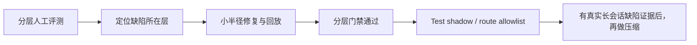

# Data Agent 分层人工评测与质量晋级计划

- 状态：`planned`
- 优先级：`下一主任务`
- 更新：`2026-08-04`
- 范围：Data Agent 对真实业务问题的理解、检索、查询、证据、终态和回答质量。
- 不包含：长会话压缩、自动投放、广告平台写操作、改变现有生产默认配置。
- 关联：[`Runtime语义质量晋级待办`](../TODO/Runtime语义质量晋级待办.md)、[`知识状态与Runtime授权一致性收口`](../TODO/知识状态与Runtime授权一致性收口.md)、[`证据覆盖与终态裁决生产启用收口`](../TODO/证据覆盖与终态裁决生产启用收口.md)、[`路由质量监控与迭代闭环`](../TODO/路由质量监控与迭代闭环.md)。

## 1. 要解决什么问题

Data Agent 的回答质量不能用一个总分概括。一个回答可能路由正确、语言通顺，却漏掉用户真正要的指标；也可能查询成功，却使用了不具备证据资格的资产；还可能证据不够，却把回答标为“完成”。这些问题属于不同层，修复位置也不同。

本计划建立一套由人工参与、可回放、可仲裁的评测体系。每个问题都拆成独立判定，不让“回答看起来不错”掩盖关键缺陷。

评测的目标不是让模型在题库上拿高分，而是回答四个工程问题：

1. Runtime 是否理解了用户真正要确认的事实和限制？
2. Runtime 是否只读取并执行了被授权的知识、表和 SQL？
3. 每个业务结论是否由合格证据支持？
4. 用户看到的终态和回答表述，是否与实际完成程度一致？

## 2. 为什么现在做，而不是先做长会话压缩

P0 已把短会话的状态提交、恢复和并发边界闭合。下一步最大的未知数不是“能装下多少轮历史”，而是“单轮和短追问是否在每一层都判断正确”。

当前 B1 冻结集的 protected required-claim recall 为 `51.56%`，protected silent claim drop 为 `109`。这说明系统可能在理解阶段就遗漏了用户明确要求的关键事实。若此时先做压缩，只会把未被识别的内容更高效地传递下去。

因此顺序固定为：



## 3. 评测边界和基本原则

### 3.1 不用单一总分替代分层结论

每层分别记录 `pass`、`fail`、`not_applicable`、`evidence_gap`。只有当一项不适用时才可跳过；不能用其他层的高分抵消硬失败。

### 3.2 人工决定业务真值，系统提供可复核证据

- 人工 reviewer 决定用户问题包含哪些 required claim、业务口径是否成立、证据是否足以支持结论。
- Runtime reviewer 决定路由、资产授权、查询记录、状态机和终态是否符合系统协议。
- 自动化只负责组包、脱敏、回放、差异计算和门禁；不替代人工作业务裁决。

### 3.3 先盲评，再看系统结果

业务 reviewer 先阅读问题和允许的业务背景，写出 required claim、限制条件和最低证据；之后才能看 Runtime 的 route、工具记录、答案和终态。这样可避免 reviewer 被系统的答案锚定。

### 3.4 保存最小必要材料

永久评测索引只保存 case ID、hash、枚举、计数、版本和裁决理由码。题干、业务原文、SQL、结果行和凭证仅在受控评审包中按权限短期保存，不进入普通 trace、公开报告或默认知识召回。

### 3.5 评测结论必须能回流到唯一责任层

每个失败都必须填写 `owner_layer` 和 `repair_target`。例如：

| 失败现象 | owner_layer | 常见 repair_target |
|---|---|---|
| 漏掉“预测 ROI360” | L1 问题合同 | observer / resolver / reducer / vocabulary |
| 把 ROI360 路由到通用 SQL | L2 路由 | trigger、signal、route contract |
| 选择未授权表卡 | L3 授权 | table card、catalog projection、registry |
| SQL 粒度错误 | L4 数据语义 | semantic contract、verified SQL、query guard |
| 没有执行证据却回答数值 | L5 证据与终态 | ClaimCoverage、attribution、TerminalDecision |
| 明知 incomplete 仍说“已查到” | L6 回答发布 | finalizer、用户输出模板 |

## 4. 六层评测模型

### L1：问题理解与 QuestionContract

**评什么**：用户显式提出和必需隐含的 required claim、对象、时间、口径、比较关系、限制条件，以及是否需要澄清。

**人工输入**：问题文本、允许的上下文、业务定义说明。

**人工判定**：

- required claim 是否完整；
- 产品、平台、国家、时间、指标、预测/实际、归因口径是否正确；
- 何时必须等待用户补充，而不是猜测。

**硬失败**：protected required claim 漏失、把用户明确限制改成其他限制、应澄清而擅自补全。

**主要产物**：`required_claims`、`constraints`、`clarification_expected`、`gold_revision`。

### L2：路由、检索和知识资产授权

**评什么**：任务 route 是否正确；检索到的政策、表卡、语义合同和 verified SQL 是否属于该问题且具备可读/可执行资格。

**系统证据**：route decision、asset ID、content hash、registry revision、DataContractView receipt、拒绝 reason code。

**人工判定**：

- route 是否覆盖 L1 的 required claim；
- 使用的资产是否是该类事实的权威来源；
- 被拒绝的资产是否应被拒绝。

**硬失败**：越权读取 raw/draft/TODO、catalog/card 状态冲突被静默放行、错误 route 导致关键 claim 无法完成。

### L3：数据语义、选表与查询计划

**评什么**：指标定义、表选择、字段、join、粒度、时间窗口、分母、预测/实际和新鲜度条件是否正确。

**系统证据**：DataContract、SQL AST/安全摘要、执行记录、表卡版本、semantic contract revision、freshness 状态。

**人工判定**：

- SQL 是否回答了 L1 中的 claim，而不是只“跑出一条结果”；
- 数值口径是否与业务定义一致；
- 结果为空、数据未成熟、freshness 不足时是否被正确解释。

**硬失败**：错误表、错误粒度、错误 join、把 forecast 当 actual、把 0 行当业务零、用探活结果支撑 KPI。

### L4：证据资格与 claim 覆盖

**评什么**：每条 required claim 是否有来源合法、类型匹配、归因已验证且 freshness 合格的证据。

**系统证据**：ClaimCoverage、TypedOutcome、evidence binding、query record、政策/代码资产 revision。

**人工判定**：

- 证据能否支持该 claim；
- 证据是否只支撑部分 claim；
- 缺口是无数据、无授权、无知识、未澄清还是执行失败。

**硬失败**：无执行证据的业务数值、用 SQL 文本或表名替代结果证据、把 freshness probe 当 KPI 证据、一个 claim 的证据覆盖整题。

### L5：终态裁决与发布边界

**评什么**：`complete`、`partial`、`incomplete`、`waiting_clarification`、`failed`、`unknown` 是否与 L1–L4 的事实一致；候选答案是否被正确发布或拦截。

**系统证据**：TerminalDecision、P3 持久化回读、wait/resume revision、API/SSE/Worker 终态事件。

**人工判定**：

- 是否存在漏 claim 却标 `complete`；
- 是否把可完成的任务误拒为 `incomplete`；
- `waiting_clarification` 是否只在确实缺用户输入时发生。

**硬失败**：强证据业务问题无合格证据仍 `complete`；`unknown` 被映射成 `complete`；被拒绝的候选业务结论漏到用户输出。

### L6：回答表达、限制说明与用户可用性

**评什么**：回答是否直接回应问题、正确区分事实/推断/限制、清楚说明 partial 或等待原因，并且不承诺自动投放行为。

**人工判定**：

- 用户能否看懂已完成什么、尚缺什么、下一步需要提供什么；
- 结论是否超出证据边界；
- 是否出现虚构数字、虚构来源、强行确定归因；
- 投放类问题是否只给预警和人工决策信息，不越界给出自动执行承诺。

**硬失败**：把不确定内容说成确定事实、掩盖失败/限制、泄漏敏感内容、越过只读分析产品边界。

## 5. 评审角色与仲裁

| 角色 | 负责内容 | 不负责内容 |
|---|---|---|
| 业务 reviewer | L1 的业务真值；L3 的口径合理性；L4 的证据是否足够；L6 的业务可用性 | 改代码、替 Runtime 选择 route |
| Runtime reviewer | L2 授权、L3 执行边界、L4 归因、L5 终态、运行证据完整性 | 改写业务真值 |
| 仲裁 reviewer | 处理双审分歧，冻结 gold revision 和失败原因码 | 用平均意见覆盖 hard failure |
| 评测维护者 | 组包、脱敏、回放、统计、回归门禁和版本管理 | 单独决定业务事实 |

业务 reviewer 与 Runtime reviewer 可以由同一人承担，但不能在未盲评前查看系统答案。涉及关键生产 route、预测/实际口径和证据资格时，必须保留双审与仲裁。

## 6. 题集设计

### 6.1 第一批规模与抽样

第一批建立 30 个 case，不追求覆盖所有 179 张表，而是覆盖高风险决策分支：

| 类型 | 数量 | 必含场景 |
|---|---:|---|
| ROI / 投放数值分析 | 8 | actual vs forecast、成熟窗口、国家/媒体拆分、0 行、freshness 不足 |
| 用户/增长/行为分析 | 4 | 指标分母、留存窗口、实验或埋点限制 |
| 素材与变现分析 | 4 | 素材粒度、归因、结果延迟、表卡 pitfalls |
| 表 / schema / SQL 说明 | 4 | 合法表卡、当前 schema、候选表拒绝、SQL 只给 candidate |
| 政策 / 语义 / 架构说明 | 3 | 不该要求业务 SQL 的可完成问题 |
| 澄清与不确定性 | 3 | 缺时间、缺对象、多种合理解释、waiting/resume |
| 多轮短追问 | 2 | follow-up、correction、topic switch |
| 安全与授权拒绝 | 2 | raw/draft 拒绝、无权限资产、只读边界 |

每个 case 记录风险标签。一个 case 可以覆盖多层，但必须明确每层是否适用。

### 6.2 题目来源

按优先级取样：

1. 现有 B1 Gold 中的 protected claim 漏失和事故 fixture；
2. 已有 route golden、agent regression、P3 exit gate、表卡 pitfalls；
3. 最近 trace 中的低置信度、近并列 route、partial/incomplete、人工反馈 case；
4. 业务 reviewer 提交的高价值真实问题。

不可把 TODO、raw、历史截图或未经确认的候选 SQL 当成 case 的业务真值。它们最多是发现问题的线索。

### 6.3 Case 卡片

每个 case 使用一个稳定 ID，例如 `LHE_202608_001`。受控评审包至少包含：

```yaml
case_id: LHE_202608_001
case_family: roi_actual_vs_forecast
risk_tags: [protected_claim, executed_data, forecast_actual]
context_mode: single_turn # 或 follow_up / correction / clarification_resume
question_ref: encrypted_or_controlled_reference
gold_revision: human_r1
applicable_layers: [L1, L2, L3, L4, L5, L6]
expected_terminal: partial
required_claim_ids: []
minimum_evidence_classes: []
review_status: draft
```

公开或长期索引只保留 `case_id`、hash、枚举和统计，不保存 `question_ref` 指向的原文内容。

## 7. 单 case 的评测流程

### 阶段 0：冻结环境

- 固定 Runtime commit、模型、配置 revision、知识 registry revision、表卡/semantic contract revision 和评测日期；
- 明确运行环境是 local、Test 还是 Prod；不得把 Test 结果写成 Prod 结论；
- 记录数据新鲜度。无法实时验证时，标 `snapshot_only` 或 `evidence_gap`。

### 阶段 1：业务盲评

业务 reviewer 在不看系统答案的情况下填写：

- required claim；
- 对象、时间、指标、口径、比较与限制；
- 是否需要用户澄清；
- 每个 claim 的最低证据类别；
- 允许的终态集合。

### 阶段 2：运行与证据组包

评测维护者运行一次无重试请求，收集受控 review pack：

- question contract 与 resolver 输出；
- route、资产 receipt、DataContractView 和拒绝记录；
- SQL 安全摘要、query record、freshness 和证据绑定；
- TerminalDecision、TypedOutcome、SSE/Worker 终态；
- 最终用户回答。

发生基础设施失败时，不重试洗绿；将本次标为 `execution_blocked`，另行记录可重试条件。

### 阶段 3：逐层判定

reviewer 按 L1 至 L6 顺序判定。后一层不能修正前一层的业务真值；例如 L6 的好表达不能修复 L4 的证据不足。

每层填写：

```yaml
layer: L4
verdict: fail
reason_codes: [required_claim_without_executed_evidence]
claim_ids: [claim_revenue]
owner_layer: L5
repair_target: claim_coverage_binding
evidence_refs: [query_record_hash, terminal_decision_id]
reviewer: reviewer_b
```

### 阶段 4：双审与仲裁

- 双审一致：进入 frozen result；
- 双审不一致：只比较结构化 verdict、reason code、claim ID 和证据引用；
- 仲裁 reviewer 给出最终裁决和 `adjudication_revision`；
- hard failure 不允许以多数投票或平均分自动消除。

### 阶段 5：回流与复测

修复必须绑定 failure cluster，而不是“看起来相关”的大改。复测时保持 case、Gold、模型、配置和环境边界可比；如果必须变更其中任一项，创建新的评测 run，不覆盖旧结论。

## 8. 判定规则与晋级门

### 8.1 先看 hard gate

以下任一项失败，case 不得被“总体通过”掩盖：

1. L1 漏掉 protected required claim；
2. L2 使用未授权或状态冲突资产；
3. L3 出现错误表、错误粒度、错误口径或不成熟数据冒充业务事实；
4. L4 没有合格证据却支持关键业务结论；
5. L5 将不完整任务标为 `complete`；
6. L6 虚构事实、掩盖限制或越过只读产品边界。

### 8.2 指标分层，不混算

| 层 | 核心指标 | 不能替代它的指标 |
|---|---|---|
| L1 | protected claim recall、silent drop、澄清正确率 | 回答流畅度 |
| L2 | route accuracy、授权拒绝正确率、状态一致性 | route confidence 分数 |
| L3 | 口径正确率、选表正确率、SQL/粒度错误率 | SQL 是否执行成功 |
| L4 | required claim evidence coverage、错绑率 | 是否有任意 SQL |
| L5 | terminal match、错放率、误拒率 | 最终文本长度 |
| L6 | 限制说明准确率、事实/推断区分、用户可用性 | 模型偏好分 |

### 8.3 晋级顺序

```text
L1 hard gate
  → L2/L3/L4 人工通过
  → L5 terminal 与发布边界通过
  → L6 回答质量通过
  → local replay
  → Test shadow
  → Test internal enforce / route allowlist
  → 生产小流量观察
```

任何层发现 hard failure，都回到对应 repair target，不进入下一档。B2/B3 的既有晋级条件继续有效：B1 protected fact 保存必须达到 100%，silent drop 必须为 0，并通过事故 fixture 与稳定重放。

## 9. 第一轮交付物

第一轮不改生产配置，交付以下材料：

1. **评测协议**：本文件中的分层、角色、判定规则和数据处理边界；
2. **30 个 case 的受控评审包**：每个 case 有盲评表、运行证据和层级 verdict；
3. **评审标注 schema**：机器可校验的 JSON/YAML 结构；
4. **仲裁记录**：所有双审分歧都有最终 reason code；
5. **分层质量报告**：分别报告每层 hard failure、`evidence_gap`、失败 cluster 和修复建议；
6. **修复 backlog**：每项只指向一个 owner layer 和最小 repair target；
7. **复测基线**：冻结 case manifest、Gold revision、环境和比较器版本。

首轮报告不输出“总体成熟度分数”。结论只允许写为：哪些层可用、哪些层阻塞、哪些问题缺证据、哪些修复可进入下一轮。

## 10. 实施阶段

| 阶段 | 工作 | 完成证据 |
|---|---|---|
| A. 定协议 | 冻结 case schema、六层 reason code、角色与数据边界 | reviewer 能拿同一份空白卡独立标注 |
| B. 建首批题集 | 选出 30 个 case，完成业务盲评与 Gold 审核 | case manifest、双审和仲裁记录齐全 |
| C. 组运行证据 | 在固定环境逐题运行一次，生成 review pack | 每个 case 都有版本、终态和证据索引 |
| D. 人工分层评审 | L1–L6 分开判定，收敛分歧 | 分层 verdict 和 failure cluster |
| E. 小半径修复 | 每批只修一个 cluster，补回归 | 修复前后对照和无回归证据 |
| F. 晋级决策 | 依据硬门决定是否进入 Test shadow/enforce | 明确批准、拒绝或继续观察的决策记录 |

## 11. 与现有 TODO 的关系

| 现有事项 | 本计划提供什么 | 本计划不替代什么 |
|---|---|---|
| Runtime 语义质量晋级 | L1 的人工 Gold、失败归因和复测基线 | B1/B2/B3 的实际修复和晋级决定 |
| 知识状态与 Runtime 授权一致 | L2 的交叉入口人工抽检 | 表卡/catalog 的权威映射实现 |
| 证据覆盖—终态裁决 | L4/L5 的错放、误拒和 route 分档证据 | Prod enforce、canary 和回滚 |
| 路由质量监控 | L2 的人工正确性标签，供周报聚类回流 | 日常 trace 聚合和运营节奏 |
| 多轮对话 | follow-up、correction、clarification 的 case | 长会话压缩建设 |
| Runtime SLA / 发布溯源 | L5 的运行终态证据和环境记录 | shared-Test/Prod 运维验收 |

## 12. 明确不做

- 不用生成式模型给自己的答案打最终分；
- 不因样本小或成本高降低 protected claim、授权和证据 hard gate；
- 不把结果行、SQL、题干和凭证写进普通 trace 或公开报告；
- 不把 local/Test 的评测结论写成生产质量证明；
- 不因评测发现长上下文问题就直接启动压缩工程；先统计问题是否真由历史截断或 token 预算造成。
