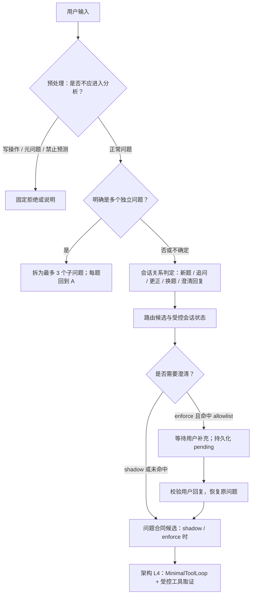
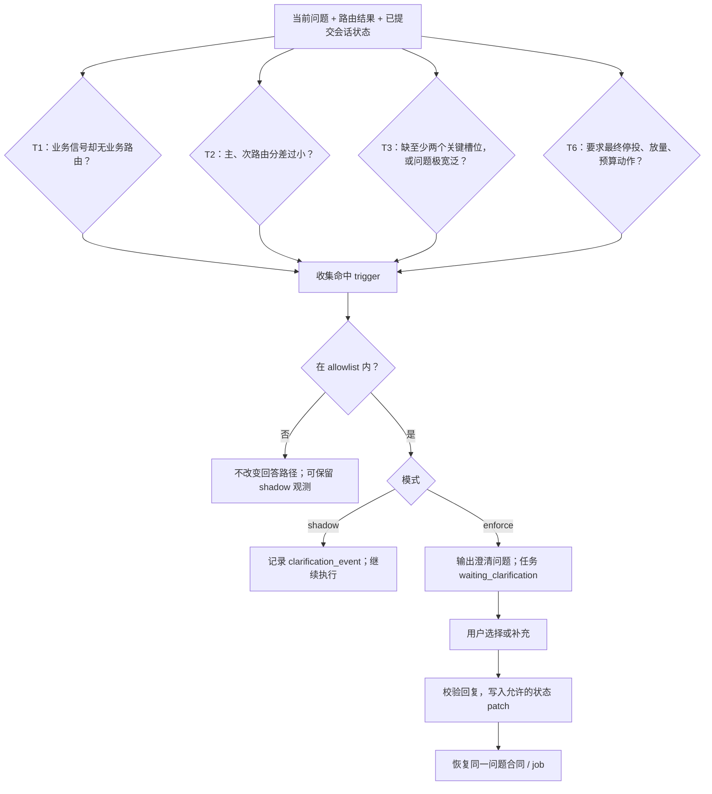
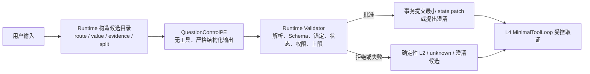

# L2 用户问题控制、澄清与受控 PE 结构化输出设计

> 状态：当前实现盘点 + 目标设计 + 实施计划。本文提出的模型调用、协议和灰度均未改变当前 Runtime 行为，也不表示任何环境已启用 `enforce`。
>
> 适用范围：架构 L2「用户问题控制层」。这里的 L2 不等于评测体系的 L2。

## 0. 先统一命名与裁决

本文将“轻量 PE”统一改称为**受控 PE（Controlled Prompt Engineering）**。

这里的“轻”应指**任务、调用次数、上下文和权限轻**，而不是模型一定要弱或只能做关键词分类。

术语上需要分两层说：

- **模型侧是纯 PE**：一条固定 prompt，输入为当前问题、受限会话摘要和 Runtime 下发目录；一次无工具调用，使用严格结构化输出。没有 RAG、工具、ReAct 循环、子 Agent 或模型自行写入记忆。
- **整个 L2 不是纯 PE**：预处理、候选目录构造、Schema/证据/状态/权限校验、事务提交、澄清恢复、trace 与 fallback 都是确定性 Runtime 逻辑。它们不能交给 prompt。

因此，“纯 PE”描述的是这次模型推理的形态；“受控”描述的是它在系统中的权力边界：

- 它是一个无工具、无循环、无状态写权限的单次候选理解调用；正常路径只需一次 `question_control` 调用。
- 它可使用足够强的模型来理解复杂中文省略、纠正、多轮指代与语义并列；模型选择应由 shadow 质量、延迟和成本验证，不由“轻量”一词预先限制。
- `contract_proposal` 是 route 和词表已确定后的独立第二阶段，先保持 shadow；它不应和基础问题控制一起强制上线。
- Runtime 仍决定 state patch、拆分、澄清 gate、合同、SQL 授权和终态。模型只能提交候选意见。

因此，这不是 L2 内再建一个自治 Agent，也不接入架构 L4 的 `MinimalToolLoop`。它是一个受结构、证据目录和 Runtime 审核约束的 LLM 调用。

## 1. 当前 L2 控制流与适用边界



拆分是分叉，不是共享同一个未经验证上下文的多问合答：一旦成为两个子问题，每题重新经历预处理、L2、L3、L4。受控 PE 的作用是提出 `split/composite` 候选；是否真的分叉仍由 Runtime 的锚定、上限与事务规则裁决。

## 2. 澄清：触发器、状态与边界



| Trigger | 含义 | 当前状态 |
|---|---|---|
| T1 | 业务问题未命中可信业务 route，或 route 分数过低 | 已实现；默认 shadow allowlist |
| T2 | 主 route 与 runner-up 分差过小 | 已实现；默认 shadow allowlist |
| T3 | 产品、时间、指标缺失至少两项，或问题宽泛 | 已实现；默认不在 allowlist |
| T4 | 依赖 candidate / 未验证证据 | 计划态；应由 L3/L4 取证后触发，不是输入时关键词判断 |
| T5 | 跨表/跨源 join 的 key、粒度、新鲜度不成立 | 计划态；应由 L5 合同与执行证据触发 |
| T6 | 最终投放动作需要业务 owner 决策 | 已实现；默认不在 allowlist |
| T7 | 保留编号 | 配置层允许，但当前没有定义或运行分支 |

`shadow` 不表示“通过”或“失败”，而是“计算并记录候选，绝不改变用户路径”。当前默认策略为 `shadow`，默认 allowlist 是 T1/T2；实际环境覆盖值需要读取对应环境配置确认。

## 3. 多轮、trace 与当前可观察性缺口

L2 不只使用上一轮，而是结合：

1. `ConversationState`：已提交的产品、时间、指标、维度、更正、pending 与证据引用；
2. 最多最近 8 条的短历史文本：只在高置信追问/更正时辅助解释指代；
3. 当前用户输入：优先级最高，明确更正不会被历史助手文本覆盖。

| 对象 | 当前内容 | 读取方式 |
|---|---|---|
| assistant message metadata | `turn_resolution`、`clarification_event`、route、限制说明 | 会话消息/数据库审计 |
| ConversationState checkpoint | state version、patch、更正、pending、证据引用 | 会话状态审计 |
| AgentTrace | route、置信度、澄清事件、工具摘要、阶段 trace identity | `GET /api/sessions/{session_id}/trace` |
| job events / SSE | waiting、clarification、resume、terminal 事件 | `GET /api/jobs/{job_id}/events` |

当前缺口是这些信息尚未收敛为一条面向人的 L2 决策时间线。目标展示为：

```text
原输入摘要
→ 规则候选 / 受控 PE 候选
→ 校验结论与拒绝原因
→ state_version: N → N+1
→ route、clarification、contract、恢复或终态
```

## 4. 受控 PE 的职责与调用形态

| 调用 | 何时 | 模型提出什么 | Runtime 保留什么权力 |
|---|---|---|---|
| PE-1 `question_control` | 预处理后、知识读取前 | 多轮关系、可继承/可清除槽位、route 候选、`split/composite`、澄清候选 | state patch、route 生效、拆分生效、澄清 gate |
| PE-2 `contract_proposal` | route 与词表候选已确定后 | claim、指标、维度、筛选、时间歧义、完成条件候选 | canonical ID 校验、合同创建、持久化、完成判定 |

预处理、T4/T5 的证据判断、SQL 授权、会话提交和终态都不需要且不得依赖模型。当前已有的自然语言追问兜底、低置信 route 选择、双峰 `split/composite` 判别应逐步收敛为 PE-1，而不是继续叠加多个小模型调用。

## 5. 结构化输出方案：一页结论

选择：**Provider 原生 Structured Output（严格 JSON Schema） + 服务端独立校验 + 确定性回退**。

不选择把 YAML、自由 JSON、Line Protocol 或自定义 DSL 作为第一条主路径。它们看似让模型少写括号，但把解析、兼容和安全成本转移给 Runtime，且不能解决“值和用户原话是否一致”的核心风险。

严格 JSON Schema 能显著消除逗号、括号、漏字段、未知字段等格式错误；但它不能保证模型理解正确。因此接口应同时满足三件事：

1. 模型只能从 Runtime 下发的枚举、候选 ID、证据 ID 中选择；
2. Runtime 以 Schema、原文锚定、状态、权限和业务上限五层逐层否决；
3. 任意失败均变成 `TypedFailure + deterministic fallback`，**不写状态、不崩解析器、不猜测修复后的业务含义**。

这是一份 `QuestionControlPE` 候选器协议；它的“受控”来自结构与授权边界，不来自把模型能力人为降级。

## 6. 目标、非目标与不可改变的边界

### 6.1 目标

- 对“追问/更正/换题/澄清回复”“route 候选”“槽位 patch 候选”“拆分或复合判断”“澄清建议”给出一个固定、机器可读的候选；
- 使正常模型调用不会因手写 JSON 的格式问题导致下游异常；
- 让每一次模型意见、拒绝、回退和最终 Runtime 决定都可以按 turn 回放；
- 在 `shadow` 中比较规则、PE 候选、最终裁决，逐项建立可上线证据。

### 6.2 非目标

- 不让模型产生 SQL、表名、工具调用、指标口径、投放动作或最终业务答案；
- 不让模型直接修改 `ConversationState`、`QuestionContract`、Job 或 Outbox；
- 不用模型替代 T4（证据可用性）、T5（join/粒度/新鲜度可行性）、L5 SQL 授权；
- 不以“能返回合法 JSON”作为正确性或可上线证据；
- 不新建第二条 Runtime 主链。

### 6.3 权力分配



模型像提交一份 PR；Runtime 像审查、合并和执行该 PR 的系统。模型不是 API，也没有提交权限。

## 7. 推荐的 JSON 协议：`question_control.v1`

### 7.1 设计原则

为了让模型更不容易出错，v1 刻意做得小且“笨”：

| 原则 | 协议做法 | 避免的问题 |
|---|---|---|
| 固定形状 | 所有根字段都必填；无值使用 `unknown`、`none` 或空数组 | 有时有字段、有时没字段的分支解析 |
| 禁止自由 key | `additionalProperties: false`；没有任意 map | 拼错字段名、隐式扩展字段 |
| 只选 ID | route、槽位值、证据、拆分方案都由 Runtime 预先编号 | 自由文本值和用户原话不一致 |
| 小而有界 | patch 最多 5 个、证据最多 3 个、拆分最多 3 段 | 一次输出修改过多状态、token 膨胀 |
| 单一表达 | `clear` 也使用 `value_id: "none"`；数组始终是数组 | `null`、字符串/数组混用、`oneOf` 复杂度 |
| 由服务端重建 | 模型不回传原始用户文本、不计算字符 offset | 漏字、错位、敏感文本复制和锚点歧义 |

`protocol_version` 只解决协议演进，不是模型生成的随机 ID。请求 ID、turn ID、模型版本、prompt hash、原始响应 hash 均由 Runtime envelope 生成。

### 7.2 Runtime 下发的候选目录

调用模型前，Runtime 从**当前用户输入与已提交状态**构造只读 `QuestionControlCatalog`。模型可看见 label 和极短上下文，但只能在返回时选择 ID。

```json
{
  "route_candidates": [
    {"id": "roi_or_campaign_analysis", "label": "ROI/投放分析"},
    {"id": "unknown", "label": "无法确认"}
  ],
  "value_candidates": [
    {"id": "v-us", "slot": "country", "canonical_value": "US"},
    {"id": "v-last-week", "slot": "time_range", "canonical_value": "last_week"}
  ],
  "evidence_catalog": [
    {"id": "e-1", "kind": "country", "text": "美国"},
    {"id": "e-2", "kind": "time", "text": "上周"},
    {"id": "e-3", "kind": "metric", "text": "ROI"}
  ],
  "split_candidates": [
    {"id": "none", "relation": "none"},
    {"id": "s-1", "relation": "joint_breakdown", "segment_evidence_ids": [["e-2"], ["e-3"]]}
  ]
}
```

目录不是模型真相来源：它只是受控的“可引用清单”。如果目录无法覆盖用户表达，模型应返回 `unknown` 或 `ask`；不能发明 ID。Runtime 必须保留目录的版本和摘要，以便将来重放同一判断。

### 7.3 模型唯一允许的成功返回

以下是完整对象；没有省略字段、没有注释、没有 Markdown 代码块。这里的 ID 仅为示例，真正允许的值每轮由目录决定。

```json
{
  "protocol_version": "question_control.v1",
  "turn": {
    "kind": "correction",
    "evidence_ids": ["e-1"]
  },
  "route": {
    "candidate_id": "roi_or_campaign_analysis",
    "evidence_ids": ["e-3"]
  },
  "patches": [
    {
      "op": "replace",
      "slot": "country",
      "value_id": "v-us",
      "evidence_ids": ["e-1"]
    }
  ],
  "question_shape": {
    "kind": "single",
    "relation": "none",
    "split_candidate_id": "none"
  },
  "clarification": {
    "recommendation": "none",
    "missing_slots": [],
    "evidence_ids": []
  }
}
```

`confidence` 不进入 v1 决策对象。模型的自报置信度既不可校验也易被误用为阈值；如确有模型研究价值，应作为不可授权的 telemetry 字段独立记录，不能参与 Runtime 分支。

### 7.4 Schema 的关键约束（示意）

以下展示实现时必须具备的约束。实际 JSON Schema 可使用 `$defs` 消除重复，但不得放宽这些规则。

```json
{
  "type": "object",
  "additionalProperties": false,
  "required": ["protocol_version", "turn", "route", "patches", "question_shape", "clarification"],
  "properties": {
    "protocol_version": {"const": "question_control.v1"},
    "turn": {
      "type": "object", "additionalProperties": false,
      "required": ["kind", "evidence_ids"],
      "properties": {
        "kind": {"enum": ["standalone", "follow_up", "correction", "topic_switch", "clarification_answer", "cancel_or_restart", "unknown"]},
        "evidence_ids": {"type": "array", "maxItems": 3, "items": {"type": "string", "pattern": "^e-[0-9]{1,2}$"}}
      }
    },
    "route": {
      "type": "object", "additionalProperties": false,
      "required": ["candidate_id", "evidence_ids"],
      "properties": {
        "candidate_id": {"type": "string", "maxLength": 80},
        "evidence_ids": {"type": "array", "maxItems": 3, "items": {"type": "string", "pattern": "^e-[0-9]{1,2}$"}}
      }
    },
    "patches": {
      "type": "array", "maxItems": 5,
      "items": {
        "type": "object", "additionalProperties": false,
        "required": ["op", "slot", "value_id", "evidence_ids"],
        "properties": {
          "op": {"enum": ["replace", "clear"]},
          "slot": {"enum": ["product", "time_range", "metric", "country", "media", "campaign", "dimension"]},
          "value_id": {"type": "string", "maxLength": 80, "pattern": "^[A-Za-z0-9._:-]+$"},
          "evidence_ids": {"type": "array", "minItems": 1, "maxItems": 3, "items": {"type": "string", "pattern": "^e-[0-9]{1,2}$"}}
        }
      }
    },
    "question_shape": {
      "type": "object", "additionalProperties": false,
      "required": ["kind", "relation", "split_candidate_id"],
      "properties": {
        "kind": {"enum": ["single", "composite", "split", "unknown"]},
        "relation": {"enum": ["none", "comparison", "causal_hypothesis", "joint_breakdown", "unknown"]},
        "split_candidate_id": {"type": "string", "maxLength": 40}
      }
    },
    "clarification": {
      "type": "object", "additionalProperties": false,
      "required": ["recommendation", "missing_slots", "evidence_ids"],
      "properties": {
        "recommendation": {"enum": ["none", "ask"]},
        "missing_slots": {"type": "array", "maxItems": 3, "items": {"enum": ["product", "time_window", "metric", "dimension"]}},
        "evidence_ids": {"type": "array", "maxItems": 3, "items": {"type": "string", "pattern": "^e-[0-9]{1,2}$"}}
      }
    }
  }
}
```

Schema 只能检验“像不像正确对象”。动态约束——例如 `v-us` 是否确实是本轮 `country` 的候选、`e-1` 是否支持该 patch、`s-1` 是否是非重叠且完整的拆分——必须由 Runtime 的下一层校验。

## 8. 运行时处理：从不可信字节到批准决定

### 8.1 分层对象，禁止跨层直连

```text
Provider response bytes
    ↓
RawPEOutput                 （原始字节只受限留存）
    ↓ parse + schema
ParsedQuestionControlProposal（只代表结构合法）
    ↓ grounding + state + authority + limits
AuthorizedQuestionControlDecision（唯一允许提交的最小决定）
    ↓ transaction/CAS
ConversationState / Job event / Message metadata
```

任何下游服务都不得接受 `RawPEOutput` 或 `ParsedQuestionControlProposal` 作为可执行参数；只允许读取最终的 `AuthorizedQuestionControlDecision`。

### 8.2 六道校验与处理方式

| 层 | 检查 | 不通过时 | 能否修改状态 |
|---|---|---|---|
| 1. Transport | 超时、长度、MIME、provider refusal、schema capability | `pe_provider_unavailable`；走确定性 L2 | 否 |
| 2. Syntax | JSON 解码（只防不合规网关或 fallback） | `pe_protocol_invalid`；走确定性 L2 | 否 |
| 3. Schema | 必填字段、enum、未知字段、数组上限、版本 | `pe_schema_invalid`；走确定性 L2 | 否 |
| 4. Grounding | 所有 ID 在本轮目录内；value/slot/evidence 一致；拆分无重叠且不丢原文 | `pe_grounding_rejected`；走确定性 L2 或澄清候选 | 否 |
| 5. State & authority | 前序状态、pending 澄清、CAS revision、允许的 turn transition、route 不是授权 | `pe_state_rejected`；重新读取或走确定性 L2 | 否 |
| 6. Business limits | 最多 5 patch/3 子题；禁止多槽位隐式 reset；不影响 SQL、工具、完成状态 | `pe_limit_rejected`；走确定性 L2 | 否 |

校验顺序不可跳过。比如合法 Schema 的 `country=Japan` 仍会在 Grounding 层被拒绝；模型建议“重置会话”仍会在 State & authority 层被拒绝。

### 8.3 事务与回退规则

- 调用失败、格式失败、Schema 失败：**不做 JSON 修复对话**，直接回退。原生 Structured Output 正常情况下不应产生格式错误；出现时应被视为 provider/网关兼容性问题，而不是由模型再猜一次。
- Grounding、权限、上限失败：不采纳部分字段。默认整份 proposal 原子拒绝，避免“模型半对半错”污染会话状态。
- CAS 冲突：重新读取已提交状态后，重新走当前 turn 的确定性决策；不得把旧 proposal 合并到新状态。
- 任何回退都必须带 `decision_source=deterministic_fallback` 和 reason code；`fallback` 不等于成功，也不是“假装模型同意”。
- 最终写入继续复用既有状态提交和 Job 事务边界；不得为 PE 引入旁路写库。

## 9. Provider 与客户端设计

### 9.1 优先级

1. **首选：明确声明支持严格 JSON Schema 的 provider**。请求中启用其原生约束输出能力，并把 `question_control.v1` 作为响应 schema；温度固定为低值，禁止工具。
2. **兼容 provider：不调用 PE**。若网关只支持普通 chat completion，默认走确定性 L2，而不是让模型“请只输出 JSON”。
3. **实验性降级（后续单独批准）**：若业务必须兼容普通 provider，才能增加受限文本解析器；仍需先按 JSON Schema 校验。这不是 v1 的默认路径，也不得替代首选路径。

因此，当前只会产生 raw text completion 的模型客户端不能直接承载该方案。应新建一个范围明确的 PE transport / capability 配置，不把 `response_format` 悄悄塞进通用 `MinimalToolLoop`，以免影响 L4 的工具调用协议。

### 9.2 请求边界

`QuestionControlPE` 请求只含：当前用户输入的脱敏摘要、有限会话状态、route/value/evidence/split 目录、固定指令和 schema。它不含：完整工具结果、原始数据行、SQL、密钥、长期聊天全文或未授权知识正文。

模型的输入和输出都应设置大小上限；目录过大时由 Runtime 缩小候选或不调用 PE，而不是扩大模型上下文。

## 10. 可观测性与隐私

现有 trace 能分别看到部分 route、澄清、消息 metadata、状态 checkpoint 与 job event；PE 接入必须将其收敛成同一个 L2 决策时间线。

每个 turn 至少记录：

```text
turn_id / state_revision_before / catalog_version+hash
→ deterministic_candidate（可选）
→ pe_attempt：provider capability、model/prompt/schema version、耗时、结果类型、raw hash
→ parsed proposal hash（不可作为执行输入）
→ validation stages + reason codes
→ authorized decision（或 deterministic fallback）
→ revision_after / clarification wait-resume / terminal 关联
```

原始 PE 输出默认不进入普通 `AgentTrace`、消息 metadata 或 SSE；只保存脱敏后的摘要、hash、受权限保护的审计引用和必要保留期。这样既能定位“网关是否违反 schema”，也不会把用户问题或可能的敏感片段复制到所有日志面。

## 11. 分阶段实施计划

### Phase 0：冻结协议与能力清点（只读/设计）

**工作**

- 审核当前 L2 的 turn resolver、澄清、拆分、QuestionContract observer 与模型客户端；列出谁能读写 state；
- 将本文 JSON Schema 固化为版本化工件，确定 provider 是否真实支持 strict JSON Schema；
- 定义 `QuestionControlCatalog` 的字段、大小上限、证据切片与脱敏规则；
- 确定失败码、审计保留与 trace 展示字段。

**交付与验收**

- schema 示例、反例和 compatibility matrix 已评审；
- 没有 provider 能力被“假定支持”；
- 确认现有 Python `DataAgentRuntime + MinimalToolLoop` 仍是唯一主链；
- 不改 Runtime 行为、不产生模型流量。

### Phase 1：协议库与 Validator（不接主链）

**工作**

- 建立不可变的 `RawPEOutput`、`ParsedQuestionControlProposal`、`AuthorizedQuestionControlDecision` 类型；
- 用 Pydantic / JSON Schema 生成与服务端再次校验，启用 `extra=forbid`；
- 实现目录成员、证据锚定、slot/value、一致性、拆分完整性、状态 transition 与业务上限校验；
- 为每个失败层产出明确 `TypedFailure`，并确保 proposal 无法被直接传入状态提交函数。

**最低测试集**

- 漏字段、额外字段、错误 enum、数组超限、错误版本；
- 不在目录的 ID、合法但错 country、错误 slot/value、重复/重叠 split；
- stale state revision、pending clarification 期间非法 reset、超过 patch/子题上限；
- 每一种失败均断言 `ConversationState`、Job、Outbox 未改变。

**退出门槛**

- 负例全部 fail-closed；
- 无效/被拒 proposal 的状态写入数为 0；
- 现有 L2 回归不受影响。

### Phase 2：隔离 PE transport 与可观测性（开关关闭）

**工作**

- 新建只供 L2 使用的 `QuestionControlPE` transport，显式 capability 配置 `native_json_schema`；
- 严格输出可用时发送 schema；不可用时返回 typed unavailable，不发送自由 JSON prompt；
- 接入受限 Raw audit、proposal hash、验证阶段与统一 L2 时间线；
- 加 kill switch、单次调用 token/超时预算和按 route/环境的 allowlist。

**退出门槛**

- provider 拒绝、超时、断连、返回非预期字节均转为确定性 L2；
- trace 可从一个 `turn_id` 关联状态前后、目录 hash、校验结果和最终决定；
- 不写主会话状态、不改用户路径、不发起 L4 工具调用。

### Phase 3：Shadow 评测与人工裁决

**工作**

- 在冻结的 L2 / QuestionContract 基准集与新增多轮、澄清、并列问题集上运行规则与 PE 双轨；
- 对每例记录：规则候选、PE proposal、被拒原因、Runtime 最终决定、人工标注；
- 单独统计 turn relation、patch、route、澄清、拆分五类任务；不将“JSON 格式成功”混入语义指标；
- 特别检查：更正被当成新题、旧状态错误继承、无关拆分、并列问题漏 claim、澄清过拦/漏拦。

**硬门槛**

- `invalid_output_commit = 0`；
- `proposal_direct_state_write = 0`；
- `unanchored_patch_accept = 0`；
- 每个 PE 失败有可读 reason code 和 deterministic fallback；
- 拆分只作为 shadow 结论，不能由“模型说 split”直接改变一次用户请求的执行数量。

### Phase 4：受限生效（先一致、后增益）

**原则**：第一批生效不追求覆盖率，而是先证明 PE 不能突破确定性安全边界。

1. 先仅接受“PE 与既有确定性决定一致，且全部校验通过”的候选；此时 PE 主要验证端到端协议与审计，而不是改写行为。
2. 再按独立能力逐项评审不一致样本：`turn_kind`、单槽位 correction、route、澄清、拆分、合同候选必须分别开关，不能打包上线。
3. 拆分最后评审。它只有在候选目录提供完整、非重叠的用户原文覆盖，且人工评测证明没有遗失独立 claim 时，才允许从 shadow 进入受限生效；否则保持 `composite` 或澄清。

**回滚**

- 一键关掉该 capability / route 的 PE 调用，回到当前确定性 L2；
- 不需要迁移状态，不依赖模型完成正在等待的澄清；
- 发生错误时保留安全审计摘要，禁止重新解释或覆盖已提交的状态。

### Phase 5：合同候选的独立试点

`contract_proposal` 不与 PE-1 同时强制上线。它仅在 route 与 canonical 词表已确认后运行，且产生的仍是候选合同；现有 QuestionContract 的 canonical vocabulary、签名、证据绑定和完成判定继续由 Runtime 执行。

试点通过后，才能讨论“合同候选能否减少人工补全”；不能由它放宽 L3/L5 的资产、SQL、证据或完成授权。

## 12. 交付物、职责与建议顺序

| 顺序 | 交付物 | 负责人性质 | 是否改变行为 |
|---|---|---|---|
| 1 | `question_control.v1` JSON Schema、catalog 协议、失败码表 | 架构/后端 | 否 |
| 2 | schema + grounding + authority validator 与负例测试 | 后端 | 否 |
| 3 | isolated PE transport / provider capability matrix | 平台/后端 | 默认否 |
| 4 | L2 decision timeline、受限审计与回放工具 | 后端/可观测性 | 否 |
| 5 | shadow dataset、人工标注、分能力报表 | 产品/算法/业务评审 | 否 |
| 6 | 一致样本受限生效、分项灰度和回滚演练 | Runtime owner | 是，逐项 |

建议先完成 1–4，再决定是否值得购买/调用模型能力。若 Shadow 显示 PE 在目标子集没有明显减少错误或澄清成本，可以停止在“可观测候选”层，不强行把模型放到主路径。

## 13. 最终验收清单

- [ ] provider 的 strict JSON Schema 能力经真实集成测试确认，而不是仅来自产品文档或 prompt 假设；
- [ ] JSON 所有根字段必填、无未知字段、无自由对象 key、无自由文本 state/value；
- [ ] 每个被采纳 patch、route、split 均能追溯到本轮目录和用户证据 ID；
- [ ] 全部校验失败、超时、断连、CAS 冲突均不改变状态，并留下 typed reason；
- [ ] PE 无法调用工具、产 SQL、修改 Job/Outbox、越过 L5 或宣布完成；
- [ ] L2 决策时间线可按 turn 回放，原始内容按权限与脱敏边界处理；
- [ ] 先完成 shadow 与人工裁决，再按独立 capability 灰度；
- [ ] 回滚到确定性 L2 的演练通过，且不会破坏 pending clarification 的恢复。

## 14. 需要产品确认的两项选择

本计划不需要在开始 Phase 0 前决定模型厂商，但在进入 Phase 2 前需要明确：

1. 哪个实际 provider/网关可以承诺 strict JSON Schema；若没有，Phase 2 保持关闭，而不是退回自由 JSON。
2. L2 PE 的首个价值目标是“降低错误澄清”还是“提高复杂多轮/拆分识别”。两者的基准集、人工标注和灰度指标不同，建议先选一个。
