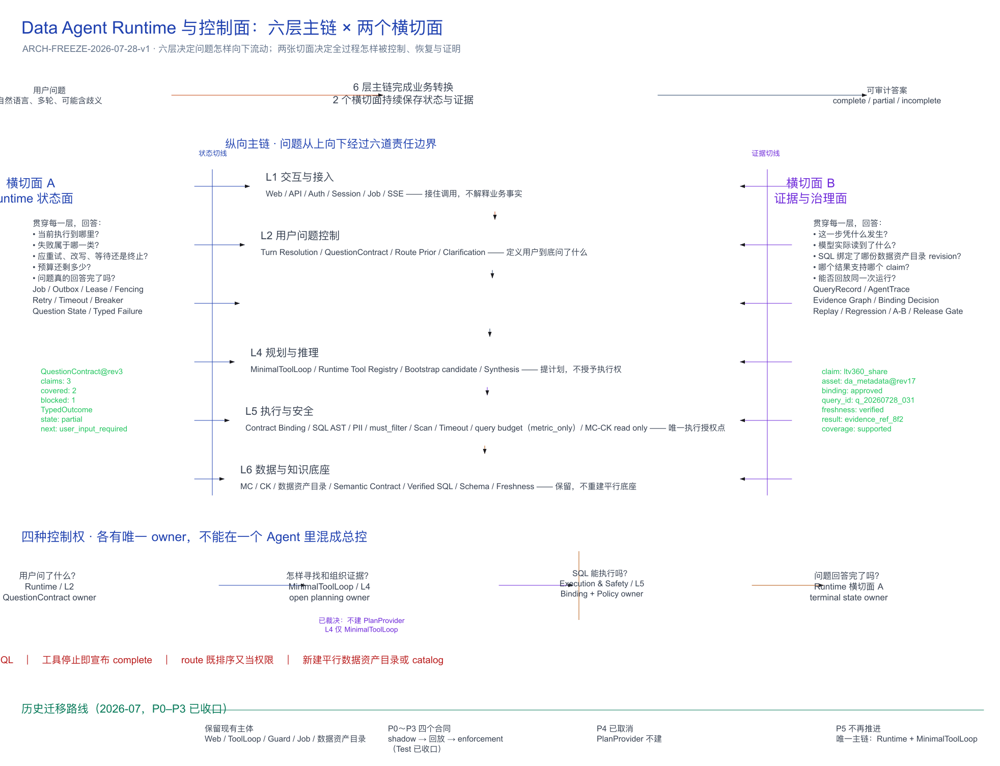
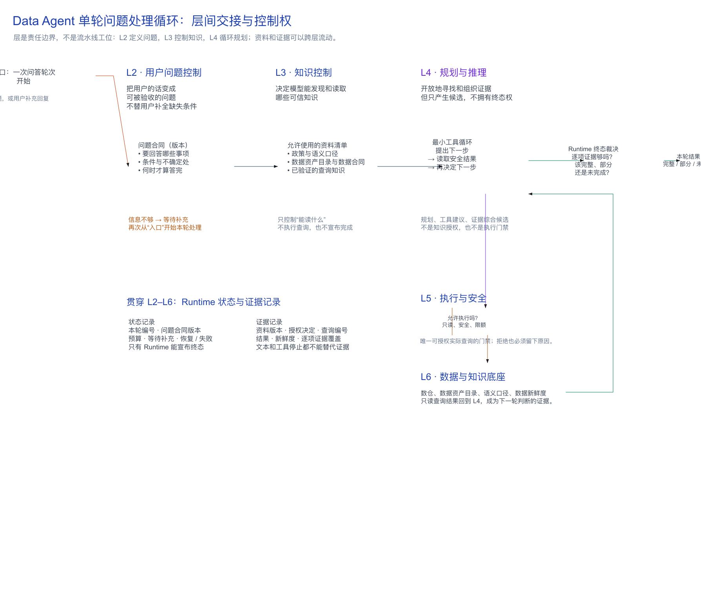
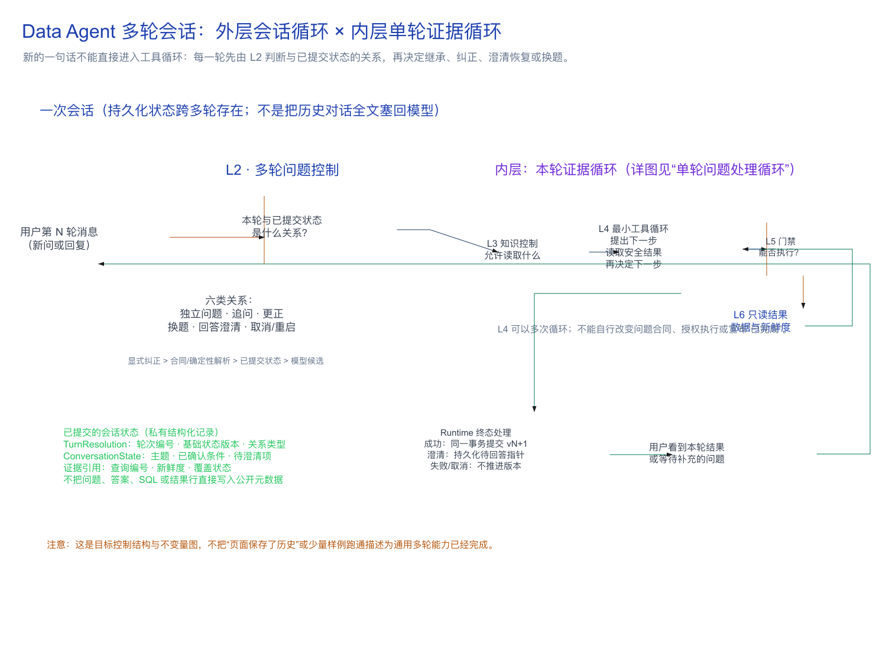
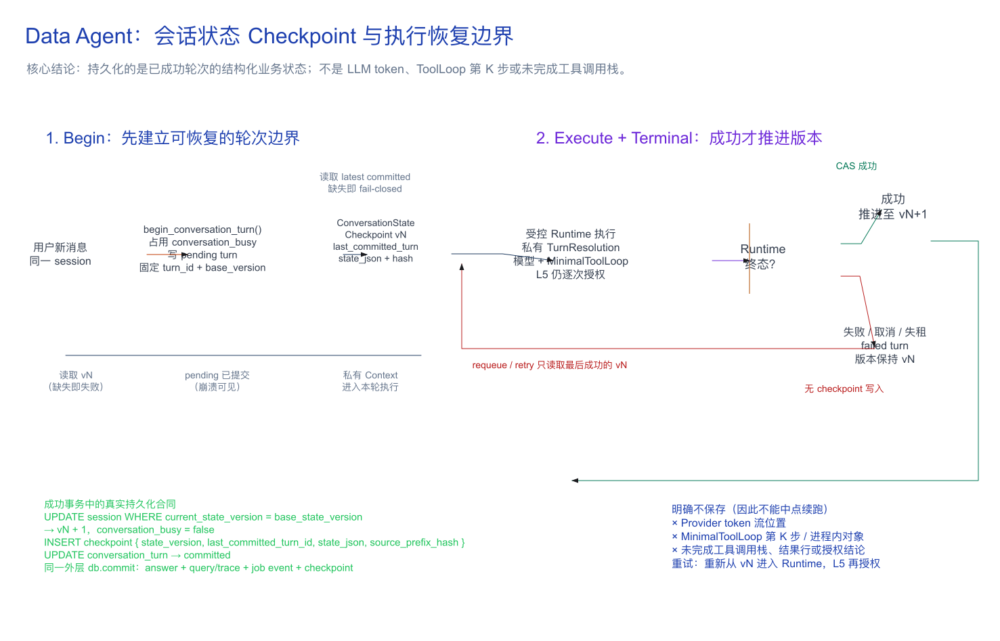

# Runtime 与控制面直观架构图阅读指南

> 图示基线：`ARCH-FREEZE-2026-07-28-v1`
>
> 文档状态：`reader_guide / architecture_boundary_frozen`
>
> 修订：2026-07-31 — L4 采用进程内 `MinimalToolLoop`；读图方法不变
>
> 归位：2026-08-02 — 随权威架构从 TODO 提升到 `data_agent_plan`
>
> 命名：2026-08-06 — 评测层统一为 E1–E6；架构层保持 L1–L6（见映射图 / 映射说明）
>
> 权威架构定义：[`../架构分层与冻结边界.md`](../架构分层与冻结边界.md)
>
> 边界：本文件解释“怎样读图”，不新增或改变架构裁决

## 一、文件夹内容

| 文件 | 用途 |
|---|---|
| [`Runtime与控制面分层切面图.png`](Runtime与控制面分层切面图.png) | 架构 L1–L6 主链图：直接查看、评审和分享 |
| [`Runtime与控制面分层切面图.excalidraw`](Runtime与控制面分层切面图.excalidraw) | 同上，可编辑源 |
| [`评测六层与Runtime六层映射图.excalidraw`](评测六层与Runtime六层映射图.excalidraw) | **评测 E1–E6 ↔ 架构 L1–L6** 映射（命名已统一为 E / L） |
| [`评测六层与Runtime六层映射图.png`](评测六层与Runtime六层映射图.png) | 映射图预览；若与 excalidraw 不一致，以 excalidraw 为准并请重新导出 |
| [`评测六层与Runtime六层映射说明.md`](评测六层与Runtime六层映射说明.md) | 映射读图说明 |
| [`单轮问题处理循环与层间交接.png`](单轮问题处理循环与层间交接.png) | 单轮处理怎样进入 L2、经 L3/L4 循环、穿过 L5 并依据证据收口 |
| [`单轮问题处理循环与层间交接.excalidraw`](单轮问题处理循环与层间交接.excalidraw) | 同上，可编辑源；层的框表示责任边界，跨框箭头表示资料与证据流动 |
| [`多轮会话循环与单轮证据循环.png`](多轮会话循环与单轮证据循环.png) | 会话的下一条消息怎样先经 L2 多轮控制，再进入一轮受控证据循环 |
| [`多轮会话循环与单轮证据循环.excalidraw`](多轮会话循环与单轮证据循环.excalidraw) | 同上，可编辑源；表达目标状态控制结构与不变量，不作为线上能力完成证明 |
| [`会话状态Checkpoint与执行恢复边界.png`](会话状态Checkpoint与执行恢复边界.png) | 已实现的会话 checkpoint 提交、失败恢复与“不能中点续跑”的边界 |
| [`会话状态Checkpoint与执行恢复边界.excalidraw`](会话状态Checkpoint与执行恢复边界.excalidraw) | 同上，可编辑源；对应多轮设计的 as-built P0 口径 |
| [`eval/question_control_e1/评测E1技术方案、输入输出与优化路径.md`](../../../../eval/question_control_e1/评测E1技术方案、输入输出与优化路径.md) | 评测 E1（问题理解）技术方案 |
| [`eval/question_control_e1/README.md`](../../../../eval/question_control_e1/README.md) | E1 跑法与产物说明 |
| [`README.md`](README.md) | 当前阅读指南 |

**读图分工**：架构图看 **结构**（层、切面、控制权）；评测 **数字与跑分** 见 `eval/` 报告，不固化在 PNG 里。

**命名硬规则**：说「L1–L6」只指 Runtime **架构**层；说「E1–E6」只指 **评测**层。禁止再写「评测 L2」这类撞名说法。



## 二、先用 30 秒看懂整张图

按以下顺序看，不要一开始钻进每个组件名：

1. **看最上面**：用户问题经过整个系统，最后得到 `complete / partial / incomplete` 的可审计答案。
2. **看正中央**：问题从 L1 向下经过六道责任边界。这是业务主链。
3. **看左右两侧**：Runtime 状态面和证据治理面逐层切入六层。这是两个横切面。
4. **看中下部**：四种控制权分别属于 Runtime、MinimalToolLoop、执行安全层和 Runtime，任何一方都不是“全能总控”。
5. **看红框**：这里列出了绝对不能穿透的边界。
6. **看最下面**：历史迁移路线（P0–P3 已收口；P4/P5 已裁决不再推进）。当前唯一主链是 Runtime + MinimalToolLoop。

整张图真正要表达的不是“系统有很多模块”，而是：

> **一次用户问题必须同时沿业务主链向下推进，并在状态面留下可恢复状态、在证据面留下可证明证据。**

只有主链，没有两个横切面，系统可能“回答了”，但不知道是否完整、为什么允许执行，也无法可靠恢复和复盘。

## 三、中央六层：问题怎样变成答案

中央六个横向层板表示六类逻辑责任，不表示六个微服务，也不等同于六支团队。

### L1 交互与接入

它回答：**谁在调用、怎样建立任务、结果怎样传回去？**

典型内容：Web、API、SSO、machine auth、session、job、SSE、job event。这里负责接住调用，不负责理解业务事实。

### L2 用户问题控制

它回答：**用户到底问了什么，什么条件下才算回答完成？**

典型内容：多轮追问 / 纠正 / 换题、问题拆分、route 和 clarification、`QuestionContract`、claims / dimensions / filters / ambiguity / completion rule。route 提供检索先验并收窄模型可见工具面，不能替代完整的问题合同或授权 SQL。

### L3 知识控制

它回答：**模型能发现和读取哪些可信知识？**

典型内容：KnowledgeRouter、Registry、Allow/Deny/Status、catalog/search、数据资产目录 / policy / semantic contract / verified SQL 的受控读取、`DataContractView`、model-visible context。这里决定知识怎样进入模型，但不执行 SQL，也不宣布问题完成。

### L4 规划与推理

它回答：**应该怎样寻找证据、执行哪些分析、怎样综合结果？**

典型内容：进程内 `MinimalToolLoop`、Runtime Tool Registry（注册 10 工具；模型可见面通常 9，特定白名单 route 为 10）、verified SQL / bootstrap candidate、synthesis / Runtime finalizer。route、engine 与服务端事实只收窄模型可见面；SQL 授权仍由 `DataContractView` + L5 binding 决定。L4 只拥有开放规划和证据综合候选能力，不覆盖整座系统。

### L5 执行与安全

它回答：**这条 SQL 到底能不能执行？**

典型内容：进程内 Python tool handler、SQL AST、DataContract binding、PII / must_filter / unknown table、scan / row / timeout / query budget（当前 metric_only）、MC/CK 只读执行。这是唯一的执行授权点；模型提供的数据资产目录或 evidence ID 只能是候选。

### L6 数据与知识底座

它回答：**可信事实、结构和口径从哪里来？**

典型内容：MaxCompute、ClickHouse、ETL / 预聚合、数据资产目录、schema baseline、freshness、semantic contract、verified SQL、SOP、decision case。当前架构裁决明确保护这层，不因 Runtime 改造新建平行数据资产目录或第二套 catalog。

## 四、左右两个横切面

### 左侧：Runtime 状态面

它贯穿 L1～L6，持续回答：当前运行到哪一步、问题合同是哪个 revision、预算还剩多少、错误属于哪一类、下一步应重试 / 修复 / 等待用户还是终止、required claims 是否已完成。

Runtime 的终态来自结构化问题和覆盖状态，不是因为“模型已经生成了一段文字”。

### 右侧：证据与治理面

它同样贯穿 L1～L6，持续回答：这一步为什么发生、模型实际读到了哪些资产、DataContract 是哪个 revision、SQL 为什么被允许或拒绝、哪个查询结果支持哪个 claim、能否按相同版本回放。

最小证据链：

```text
claim
  → 实际读取的可信资产 revision
  → 服务端 BindingDecision
  → 只读 query_id
  → 结果与 freshness
  → ClaimCoverage
```

状态面记录“**现在是什么状态、下一步做什么**”；证据面记录“**为什么能进入这个状态**”。

## 五、四种控制权

| 控制权 | 唯一 owner | 其他模块可以做什么 | 不能做什么 |
|---|---|---|---|
| 用户问了什么 | Runtime / L2 | ToolLoop 可以建议拆解 | 模型或 prompt 覆盖原始问题合同 |
| 怎样组织证据 | MinimalToolLoop / L4 | bootstrap、Knowledge Broker 提供候选 | route 直接决定执行授权 |
| SQL 是否能执行 | Execution & Safety / L5 | ToolLoop 提交候选计划 | 模型自报 evidence ID 即获授权 |
| 问题是否完成 | Runtime 状态面 | ToolLoop、coverage evaluator 提供候选信号 | 生成文本或工具停止即标 `complete` |

一句话记忆：

> **Runtime 定义问题和终态，MinimalToolLoop 负责想办法，L5 决定能不能执行，证据面负责证明全过程。**

## 六、最容易误读的六个地方

1. **六层不等于六个服务** — 这是逻辑责任划分。
2. **从上到下不等于只能单向调用一次** — 允许 L4 重新读取 L3、修复后再次进入 L5；控制权归属不能变。
3. **横切面箭头不表示它们直接调用所有模块** — 表示每层都必须接入统一的状态和证据语义。
4. **MinimalToolLoop 不是整座系统的“大脑”** — 它是 L4 的 open planner；Runtime、SafetyPolicy、Contract Binding 和 ClaimCoverage 都是服务端控制权。
5. **L6 在底部不表示“还需要重点改造”** — 它是地基，当前结论是保护并复用。
6. **图上的历史 PlanProvider 标记不再代表目标实现** — 该方案已取消；Runtime + MinimalToolLoop 是唯一主控链，bootstrap 只提供有界 evidence seed。

## 七、最终记忆模型

- 六层楼板是业务责任；
- 左侧电梯井是 Runtime 状态；
- 右侧档案井是证据与治理；
- MinimalToolLoop 是四楼的规划专家，不是整栋楼的物业、门禁和验收人；
- L5 是门禁；
- L6 是地基；
- Runtime 最终依据问题合同和证据覆盖情况完成验收。

## 八、单轮问题处理循环：层间交接



这张图补充主链图的动态读法：入口是一轮问答的开始（新问题或补充回复），不是“模型开始思考”。L2、L3、L4 的虚线框是各自的**责任边界**，而非嵌套关系：L2 定义可验收的问题，L3 决定可读知识，L4 在 L5 的安全门禁与 L6 的只读结果之间循环规划。资料、执行结果和证据能够跨层传递，但不改变授权、执行或终态的归属。

当信息不足时，状态回到等待补充；当证据足够时，Runtime 才依据问题合同和证据记录裁决本轮结果。图中的 L1–L6 均为 Runtime 架构层，不涉及评测层编号。

## 九、多轮会话循环：外层与内层



多轮不是把单轮图串联多次。用户每一次新消息先进入 L2，判定它是独立问题、追问、更正、换题、回答澄清，还是取消/重启；然后才创建本轮的受控处理。明确的用户纠正优先于问题合同和已提交状态，历史助手自由文本不能直接改写权威状态。

内层复用单轮证据循环：L3 控制可读知识，L4 只能提出并调整候选计划，L5 决定实际查询能否执行，L6 的只读结果回到 L4。成功才在同一事务中提交答案、查询/追踪记录与会话状态的新版本；等待澄清保存绑定的待回答指针；失败、取消或租约丢失不推进状态版本。

这是多轮的**目标控制结构与不变量**，不是“页面保存了历史”或少量样例通过就已经具备通用多轮能力的声明。相关实施设计见 [`../横切面/多轮对话与上下文压缩工程设计.md`](../横切面/多轮对话与上下文压缩工程设计.md)。

## 十、会话 Checkpoint：恢复什么，不恢复什么



这张图对应当前 Runtime 的 as-built P0：Worker 在调用 Provider 前写入 pending turn，固定 `turn_id` 与 `base_state_version`；成功终态通过 CAS 同时提交 answer/query/trace、committed turn 和 checkpoint vN+1。失败、取消、lease lost 或 CAS conflict 只保留失败账本并释放 session fence，重试从最后一份 committed state 重新进入受控 Runtime。

它刻意没有把模型 token、ToolLoop 的执行步数、进程内对象或未完成工具调用保存成 checkpoint。因此这里的“恢复”是恢复**当前会话工作状态**，不是在第 K 个工具调用中点继续。若未来需要步骤级续跑，必须另行设计 attempt/checkpoint，并在恢复时重新验证 lease、幂等键、artifact ownership 和 L5 授权。
