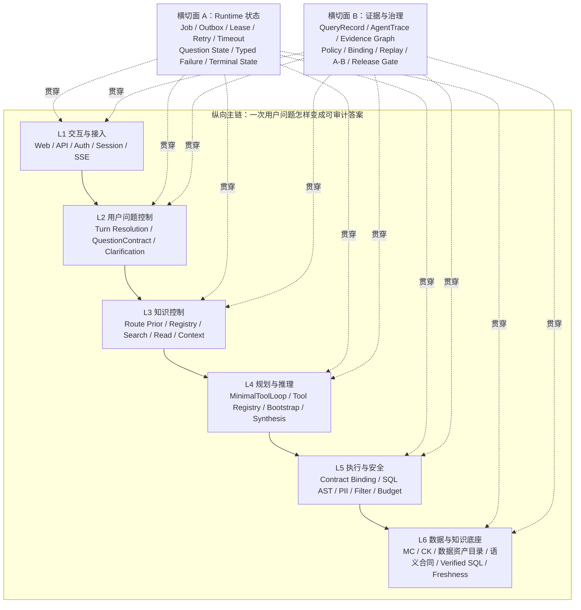

# Data Agent Runtime 与控制面架构分层及冻结边界

> 架构基线：`ARCH-FREEZE-2026-07-28-v1`
>
> 状态：`macro_boundary_frozen / L4_minimal_tool_loop_single_runtime`
>
> 冻结日期：2026-07-28
>
> 修订：2026-07-31 — L4 物理实现确定为进程内 Python `MinimalToolLoop`；六层责任边界与两类横切面不变
>
> 归位：2026-08-02 — 从已完成的 Runtime 实施 TODO 提升为 `data_agent_plan` 当前架构入口；历史任务书与验收流水已归档
>
> 适用范围：Data Agent Web/API、Runtime、MinimalToolLoop、知识控制面、只读查询执行面、数据与知识底座
>
> 命名（2026-08-06）：本文 **L1–L6 仅指架构层**。评测层统一称 **E1–E6**，见 [`图/评测六层与Runtime六层映射说明.md`](图/评测六层与Runtime六层映射说明.md)。
>
> 关联事故：`sessions/<提交标识>-3f5e-413f-ab1d-<提交标识>`
>
> 变更边界：本文只冻结逻辑架构、权力边界和迁移半径；不代表 P0～P3 全部已生产验证，不授权改代码或部署
>
> 直观架构图与阅读指南：[`图/README.md`](图/README.md)
>
> 可编辑源图：[`图/Runtime与控制面分层切面图.excalidraw`](图/Runtime与控制面分层切面图.excalidraw)

## 一、裁决

当前系统正式划分为：

> **6 个纵向主链层 + 2 个贯穿全链路的横切面。**

这不是把系统切成 8 个微服务，而是冻结 8 类不可混淆的逻辑责任。

现有宏观架构方向成立，不需要推倒重构。后续改造的性质是：

1. 为现有组件补齐明确合同；
2. 把散落在多个模块里的控制权收回到唯一责任层；
3. 用服务端状态和审计证据连接层与层；
4. 通过 shadow、灰度和回放逐步替换旧判断，不一次切断主链。

最大的改造点在 L4 规划主控：`MinimalToolLoop` 已成为唯一物理实现；逻辑上仍是**控制权归属**问题，不是重写数据资产目录、SQL Guard、任务系统或数据底座。

## 二、一张图看懂：为什么是“六层、两切面”

读图方式：

- **六层**回答“问题向下经过了哪些责任边界”；
- **Runtime 状态切面**回答“现在执行到哪里、能否恢复、谁能宣布终止”；
- **证据与治理切面**回答“每一步凭什么发生、最后凭什么相信答案”；
- 每一次跨层调用，都必须同时留下状态变化和证据记录；
- `MinimalToolLoop` 位于主链中的 L4，不覆盖整座系统，更不能绕开 L5 自行授权执行。

## 三、六个主链层

### L1 交互与接入层

**职责：接住用户与系统调用，不解释业务事实。**

| 小层 | 当前/目标能力 |
|---|---|
| 渠道与界面 | React Web、API 调用方 |
| 身份与会话 | SSO、machine auth、session |
| 任务接入 | 创建 job、返回 job/session 标识 |
| 结果传输 | SSE、job event、结果展示 |

冻结边界：

- L1 可以做鉴权、限流、协议转换和展示；
- L1 不决定 route、claim、SQL 授权或问题是否完成；
- 当前 Web、FastAPI、session/job/SSE 结构保留，不因本轮架构调整拆服务。

### L2 用户问题控制层

**职责：把自然语言输入收敛成 Runtime 可以管理的版本化问题合同。**

| 小层 | 当前基础 | 目标补齐 |
|---|---|---|
| 输入预处理 | preprocess、shortcut、问题拆分 | 统一规则来源 |
| 对话轮次解析 | follow-up、纠正、换题、TurnResolver | 明确 revision 关系 |
| 意图与路由 | route、fallback、clarification | route 提供软先验并收窄模型可见工具面，不授权资产或 SQL |
| 问题合同 | 当前主要隐含在 prompt/分支里 | `QuestionContract` |
| 完成条件 | 当前常被回答文本或工具停止替代 | claims、slots、ambiguity、completion rule |

冻结边界：

- Runtime 必须拥有 `QuestionContract`；
- route 不得静默删除用户 claim，也不得成为资产授权；
- 模型 / ToolLoop 可以建议拆解方式，但不能成为问题原文和完成条件的唯一保存者。

### L3 知识控制层

**职责：统一管理模型能发现、读取和引用哪些可信知识。**

| 小层 | 当前/目标能力 |
|---|---|
| 检索先验 | 业务 route、primary/runner-up、相关性排序 |
| 资产身份 | Registry、`AssetRef`、Allow/Deny/Status |
| 受控发现 | catalog/search |
| 受控读取 | 数据资产目录、policy、semantic contract、verified SQL |
| 上下文交付 | slim/fat context、budget、compaction、model-visible 标记 |

冻结边界：

- route 参与排序并收窄模型可见工具面，SafetyPolicy 才能拒绝资产；
- “retrieved”不等于“模型实际看见”，必须记录最终交付状态；
- 数据资产目录继续作为当前权威数据合同入口，不引入第二套真相源；
- 本层不执行 SQL，也不自行宣布 claim 已完成。

### L4 规划与推理层

**职责：提出如何回答、需要哪些证据，并综合证据形成解释。**

| 小层 | 当前基础 | 目标形态 |
|---|---|---|
| 确定性快路径 | verified SQL / analysis bootstrap | 保持有界 evidence seed，不升级为独立 provider |
| 开放规划 | 进程内 `MinimalToolLoop`（Registry 注册 10 工具；模型可见面通常 9，特定白名单 route 为 10） | 保持极简 loop，不引入 Coding Agent |
| 候选计划协调 | bootstrap 证据对模型可见，不短路最终回答 | 由 Runtime 直接编排，不新增 `PlanCandidate` / `PlanProvider` 控制面 |
| 证据综合 | Runtime finalizer 收口候选答案 | 受 QuestionContract/coverage 约束 |
| 答案表达 | Runtime-owned `AgentAnswer` | 不改变服务端事实 |

冻结边界：

- `MinimalToolLoop` 只负责开放规划、工具建议和证据综合候选；
- 它不负责 SQL 安全授权，不单方面宣布 `complete`；
- bootstrap 不能继续作为与 ToolLoop 并列的第二业务总控；
- 已退役的 Node 执行器 / provider registry 不得通过运行时开关恢复双栈；
- `PlanProvider` 方案已取消；bootstrap 只能提供有界 evidence/record/failure/context seed，不得重新成为第二业务总控。

### L5 执行与安全层

**职责：把候选计划变成可授权、可限制、可审计的只读执行。**

| 小层 | 当前/目标能力 |
|---|---|
| 工具边界 | Runtime Tool Registry 注册 10 工具 + 进程内 Python handler；模型可见面按 route、engine 与服务端事实收窄（通常 9，特定白名单 route 为 10），不构成 SQL 授权 |
| 合同绑定 | AST 物理表 → DataContract revision |
| SQL 安全 | sqlglot AST、只读、PII、must_filter、unknown table |
| 资源治理 | scan ✅、row ✅、timeout ✅、query budget ✅、TaskProfile token budget ✅（每个 model step 累加 input/output，超额清空候选并以 `token_budget_exceeded` 终止；本地单测已覆盖。环境启用与运行证据另计） |
| 数据执行 | MaxCompute / ClickHouse 只读查询（经 `runtime/tools/data_query.py`） |
| 执行记录 | tool_execution_id、policy_version + decision_reason、contract_binding（嵌 output_summary）、output_summary |

冻结边界：

- 模型提交的 asset/evidence ID 只能是候选，不是授权凭证；
- 服务端必须从 SQL AST 和本轮受控读取记录推导绑定；
- SQL Guard 继续保留，Contract Binding 是它之前的合同门，不是替代品；
- 本层保持只读，不扩展广告平台写操作。

### L6 数据与知识底座

**职责：提供可信事实、结构、口径和新鲜度。**

| 小层 | 当前/目标能力 |
|---|---|
| 数据存储 | MaxCompute、ClickHouse |
| 数据生产 | ETL、预聚合、预测与落表 |
| 数据合同 | 数据资产目录、schema baseline、join keys、query rules |
| 业务语义 | semantic contract、指标口径、policy |
| 可复用资产 | verified SQL、SOP、decision cases |
| 数据状态 | freshness ✅、catalog/index ✅、quality `not_built`、lineage `not_built` |

冻结边界：

- 本轮评审接受“数据底座和数据资产目录能力是强项”这一前提；
- 不借 Runtime 改造重写数据生产、数据资产目录体系或 semantic contract；
- 只有发现具体合同缺失时，按既有数据资产目录/知识治理流程补齐，不新建平行体系。

## 四、两个横切面

### 横切面 A：Runtime 状态面

它不是“第七层”，而是每一层都必须接入的运行状态脊柱。

| 状态域 | 负责内容 |
|---|---|
| 持久任务 | job、outbox、queue、worker |
| 并发正确性 | lease、heartbeat、fencing、幂等 |
| 生命周期 | queued、running、waiting、recovering、terminal |
| 预算 | turn、tool、query、token、wall clock |
| 恢复 | retry、timeout、breaker、resume |
| 问题状态 | QuestionContract revision、claim state |
| 失败语义 | typed failure 与对应恢复路径 |
| 终止权 | complete / partial / incomplete / user_input_required |

核心裁决：

> **只有 Runtime 能根据 QuestionContract、Evidence Graph 和执行状态宣布本轮终态。**

`MinimalToolLoop` 可以返回“我认为已经回答”，但那只是候选信号；工具停止、生成了文本、达到最大轮次，也都不能自动等价为 `complete`。

### 横切面 B：证据与治理面

它同样不是“第八层”，而是每一步的可证明性。

| 证据域 | 负责内容 |
|---|---|
| 运行审计 | AgentTrace、QueryRecord、job event |
| 知识证据 | 实际读取的 asset、revision、excerpt、model-visible |
| 执行证据 | SQL source tables、binding、policy decision、query id |
| 结果证据 | result summary、freshness、empty/error semantics |
| 问题证据 | claim → asset/query/result 映射 |
| 质量治理 | replay、regression、A/B、canary、release gate |
| 版本溯源 | commit、model、prompt、policy、registry、contract revision |

核心裁决：

> **答案不是一段文本，而是“QuestionContract 中每个 claim 都能回指证据”的可审计结果。**

## 五、四类控制权归属

| 控制权 | 唯一责任方 | 可提供建议者 | 明确禁止 |
|---|---|---|---|
| 用户到底问了什么 | Runtime / L2 | MinimalToolLoop、route resolver | prompt 临时改写后覆盖原合同 |
| 怎样寻找和组织证据 | MinimalToolLoop / L4 | bootstrap provider、Knowledge Broker | route 直接授权执行 |
| SQL 是否允许执行 | Execution & Safety / L5 | MinimalToolLoop、数据资产目录、策略 | 模型自报 evidence ID 即获授权 |
| 问题是否回答完成 | Runtime 状态面 | MinimalToolLoop、ClaimCoverage evaluator | 文本存在或工具停止即 `complete` |

这四种权力一旦重新混在一个类、一个 prompt 或一个 if/else 链里，就视为穿透冻结边界。

## 六、是否需要推倒重构

结论：**不需要，也禁止大爆炸式重构。**

### 6.1 保留的主体

- L1 的 Web、FastAPI、auth、session、job、SSE；
- L3 的 KnowledgeRouter、Registry、Allow/Deny/Status、知识工具；
- L4 的 `MinimalToolLoop`、Runtime Tool Registry、verified SQL 和现有 bootstrap 业务实现；
- L5 的进程内只读工具 handler、sqlglot guard、`data_query.py`；
- Runtime 的 job/outbox/worker/lease/fencing 基础；
- QueryRecord、AgentTrace 和现有回归框架；
- L6 的 MC/CK、数据资产目录、语义合同、freshness 和 verified SQL 资产。

> 2026-07-31 修订：已退役的 Node 执行器 / TypeScript extension 不在生产主链；保留的是 L4 的规划职责，而非外部进程实现。

### 6.2 新增或收敛的四个核心合同

| 合同 | 主要落层 | 目的 |
|---|---|---|
| `QuestionContract` | L2 + Runtime 状态面 | 管理用户问题与完成条件 |
| `BindingDecision` | L3 → L5 + 证据面 | 把模型所读 DataContract 与 SQL 授权绑定 |
| `TypedOutcome` | L4/L5 + Runtime 状态面 | 区分可修复、策略引导、基础设施和终态 |
| `ClaimCoverageResult` | L2 + 证据面 + Runtime 状态面 | 决定 complete/partial/incomplete |

`PlanCandidate` / `PlanProvider` 不进入目标架构。若未来出现具体维护问题，只按局部代码重构评审，不再新建规划主控阶段。

### 6.3 改造半径

| 阶段 | 主要影响 | 改造级别 | 是否推倒原实现 |
|---|---|---:|---|
| P0 问题合同与 trace | L2、两横切面 | 中低 | 否，新增为主 |
| P1 统一知识入口 | L3 与 L4 边界 | 中 | 否，收敛已有 Router/Registry/tools |
| P2 Contract Binding | L3、L5、证据面 | 中 | 否，在现有 Guard 前增加绑定门 |
| P3 Typed Failure / ClaimCoverage | L2、L4、L5、两横切面 | 中 | 否，替换通用计数和粗终态 |
| P3 Test 验收与灰度 | L2、状态面、证据面、发布 | 中低 | 只验证 P3 真实接线、回放与回滚，不再新增架构阶段 |

## 七、冻结边界

以下条目自 `ARCH-FREEZE-2026-07-28-v1` 起作为 P0～P3 及其 Test 验收的上游约束：

### F1. 架构形态冻结

系统采用“6 个纵向主链层 + 2 个横切面”的逻辑架构。首阶段不以此为理由拆分新微服务。

### F2. Runtime 权力冻结

Runtime 拥有问题状态、执行调度、预算、恢复和终止权；不得把终止权下放给 MinimalToolLoop 或某次工具调用。

### F3. L4 / ToolLoop 权力冻结

`MinimalToolLoop` 拥有开放规划、工具选择建议和证据综合候选能力；不拥有资产授权、SQL 授权和最终完成判定权。不得以运行时开关恢复已退役的双栈。

### F4. 知识与执行边界冻结

知识控制面负责可信资产的发现与读取；执行安全面负责 AST、DataContract binding 和 SQL 授权。route 是软先验，不是权限系统。

### F5. 数据底座保护冻结

数据资产目录、MC/CK、语义合同、verified SQL、freshness 体系继续作为既有基础，不因控制面收敛建立平行真相源。

### F6. 迁移方式冻结

P0～P3 必须可独立提交、独立回放、独立灰度；P3 完成后直接进入 Test 部署、真实回放与架构冻结，不再自动派生 P4/P5。

### F7. 禁止大爆炸冻结

禁止在一个 PR 中同时改 QuestionContract、知识检索、L4 ToolLoop 主控、SQL Guard、任务状态机和数据底座；禁止用换工作流框架掩盖业务合同缺失。

### F8. 可审计性冻结

跨层调用必须能关联到 session/job、QuestionContract revision、asset/contract revision、policy/binding decision、query id 和 claim coverage；敏感正文与结果行不得直接写入 trace。

## 八、业界与高活跃开源方案对照

本架构借鉴的是职责分离机制，不预设采购或替换平台。GitHub star 约数沿用 2026-07-28 的公开快照，详细来源见本目录 [`README.md`](README.md)。

| 本次架构选择 | 对照方案 | 借鉴点 | 不照搬的部分 |
|---|---|---|---|
| Runtime 状态面 | LangGraph（约 38k）、Temporal（约 22k） | 显式状态、checkpoint/replay、typed error、durable history | 不替换现有 job/outbox/worker |
| 知识控制与 DataContract | OpenMetadata（约 15k）、DataHub（约 12k）、dbt-core（约 14k） | 版本化资产身份、schema/semantic contract、变更门 | 不引入第二套 catalog |
| 执行授权 | OPA（约 12k） | policy decision 与 enforcement 分离 | 不预设 Rego 或 sidecar |
| 证据与治理面 | OpenTelemetry、OpenLineage、Langfuse（约 32k） | trace context、dataset/run facets、LLM evaluation | 不复制敏感 prompt、知识正文和 SQL rows |
| 渐进迁移 | Promptfoo（约 24k）、Argo Rollouts（约 3.5k） | 版本化 eval matrix、canary、promotion/rollback | 不把离线 judge 分数直接等价为生产放量 |

对照后的判断：

1. 当前 job/outbox/lease/fencing 已具备生产级 Runtime 骨架，缺的是业务状态语义，不是必须换 Temporal；
2. 当前数据资产目录/Registry 已具备强数据合同入口，缺的是在线 binding，不是必须换 OpenMetadata/DataHub；
3. 当前 QueryRecord/AgentTrace 已有审计基础，缺的是 claim、contract、binding 的关联，不是必须换 Langfuse；
4. 所以正确路线是先补四个合同和控制权，再评估是否有单点组件值得替换。

## 九、后续文档与实现的合规检查

每个 P0～P3 TODO、设计稿和 PR 必须回答：

1. 它落在哪一层、影响哪一个横切面？
2. 它是否把某项控制权放回唯一责任方？
3. 它是否穿透 F1～F8 中任一冻结边界？
4. 它是新增合同、包装旧实现，还是删除旧分支？
5. 它如何 shadow、回放、灰度和回滚？
6. 它留下了哪些不含敏感正文的审计证据？

若一项改动无法明确回答“落在哪一层”，或同时让多个模块成为同一控制权的 owner，应先停在设计评审，不进入实现。

## 十、规划主控决策收口

规划主控不再是未决事项：

- Runtime 是唯一流程控制主控；
- `MinimalToolLoop` 是唯一开放规划循环；
- bootstrap 只提供有界 evidence seed，不拥有父问题终止权；
- 已退役的 Node 执行器、多 Runtime Provider、`PlanCandidate` / `PlanProvider` 均不属于当前架构；
- P3 真实接线、Test 部署、真实回放和回滚证据完成后，本轮 Runtime 架构重构即冻结。
