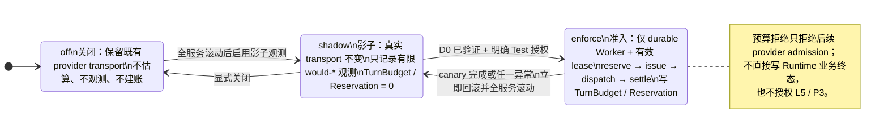
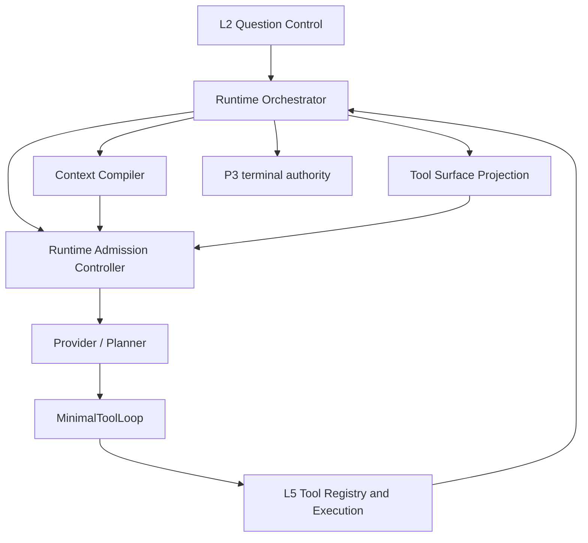

# Runtime 资源治理与工具编排设计（历史提案 v1）

> **历史状态**：本页保留 2026-08-10 的 D0/D1/D2 分阶段设计与 Test 采样事实，不能再作为当前 Runtime 行为或部署指引。
> 当前开发态主链已移除 `DATA_AGENT_PROVIDER_ADMISSION_MODE=off|shadow|enforce` 及未记账 provider 回退；唯一有效的设计与验收入口是：[Runtime 主链直接收敛改造方案](Runtime主链直接收敛改造方案.md)。
> 状态：`historical_D0_D1_D2_evidence / superseded_for_runtime_behavior`
> 日期：2026-08-10
> 范围：`DataAgentRuntime` 的 provider 请求准入、累计资源预算、上下文编译与工具可见面
> 前置问题：[Runtime 主链预算与工具编排质量问题](../../../../bugfix_doc/20260809_Runtime主链预算与工具编排质量问题.md)
> 非目标：本文件不修改 E3 门禁、不调整具体 token 数字、不改变 L2/L3/L5/P3 的授权或证据语义；D2 enforce 的 Test 启用和回滚必须按本页的独立受控步骤执行。
> 当前结论：外部架构审查已收口；D1 已完成 fake provider 的本地性质证明。D2 已完成最小本地接线，
> 并在独立复核后修正了“每 job 只能有一个 budget”与“后续调用不按已结算余额缩小输出 grant”两个实现偏差：
> `MinimalToolLoop` 在 durable Worker lease 上执行 reserve → issue → dispatch claim → Provider →
> settle，再把 `ModelTurn` 交给工具解释；D0 shadow 只输出安全的 would 字段，真实 transport 不变。
> 2026-08-10 已在用户明确的 Test-only 授权下完成一条无工具、无 SQL 的 D2 `enforce` durable provider canary：
> `enforce/settled_actual`、一次 provider 调用、TurnBudget=1、Reservation=1、SQL/工具记录=0；随后共享配置已恢复 `shadow`，
> Worker 与 API 已在同一 `<提交标识>` 滚动。恢复后的 D0 job 记录 `shadow/admitted/actual`，且同 job 的 TurnBudget/Reservation 均为零。
> Freshness 是独立的数据新鲜度发布职责；其本次滚动失败，按明确范围不参与 D2 provider-control-plane canary，也没有被下线、删定时或重试。
> 以上只证明资源准入的 Test 控制面与 shadow 回退，不推断业务链质量、成本策略或 E3 效果。
> GPT-Sol 最终红队已接受 D2 进入 Test shadow 的协议边界；其要求的零副作用 shadow、permit 非 receipt、
> current-owner recovery settlement、CAS retry 与 canonical hash 契约均已本地实现、回归并完成上述 Test control-plane 采样；
> 它们仍不等于代表性业务 ToolLoop、成本策略或 E3 质量证据。
> 初始接线只把既有 task profile 的 `token_budget` 当作 turn cap，尚未新增或调整 finalization reserve、
> safety margin 等数值策略；这些数值只能在 D0/Test 分账证据出来后单独决策。

## 一、结论

当前 Runtime 已具备上下文编译器、工具注册表、P2 ContractView、L5 执行授权、P3 终态裁决和安全观测；
缺的是把这些能力在**每次 provider 调用之前**编排起来的控制平面。本设计提出一个 Runtime
Admission Controller（资源准入控制器；下文简称 Admission Controller）：模型仍负责规划下一步，
Runtime 负责决定本轮是否可支付、可见哪些已授权工具、以及预算不足时怎样安全收口。

它不是自由探索 workflow engine，也不是把模型替换成规则。它只将当前“provider 返回后再检查累计
token”的事后保护，改为可解释的“估算 → 预留 → 准入 → 执行 → 记账 → 终态”循环。

### 1.1 Provider admission 三态开关（配置态，不是业务终态）

`DATA_AGENT_PROVIDER_ADMISSION_MODE` 只有三个合法取值：`off`、`shadow`、`enforce`。
它们是**整个 Runtime 的 provider 调用准入配置**，不表示 Job 成功/失败，也不替代 ToolLoop、L5 或 P3 的状态机。



| 模式 | provider transport | durable 账本 | 可验证内容 | 安全边界 |
|---|---|---|---|---|
| `off` | 完全沿用既有行为 | 不读、不写 | 仅既有 Runtime 行为 | 默认代码配置；不是“失败模式” |
| `shadow` | 不拦截、不改 `max_tokens` | 不读、不写 | `would_reserve / would_issue / would_settle` 与有限 token 计数 | 不能把影子结果当作预算强制或 E3 质量结论 |
| `enforce` | 仅获准的 durable Worker 调用可发送 | 写 `TurnBudget` 与 `Reservation` | reservation、settlement、degraded/no-admission 等有限事实 | 必须有当前 Job lease；inline/失租路径不得降级成未治理调用 |

当前 Test 位于 `shadow`。`enforce` 只可作为短时受控验证，不是常驻默认：本次已完成一条无工具、无 SQL canary 后立即恢复 `shadow`，并已滚动承担 provider control plane 的 Worker → API。Freshness 不属于该控制面；除非验证其自身的数据发布职责，不应把它的调度/部署故障混入本验收。



## 二、已知事实与问题边界

| 当前能力 | 现状 | 本设计的处理 |
|---|---|---|
| Context Compiler | 已在主链组装 provider payload，并为上下文窗口预留输出、schema 与 framing 空间 | 继续负责窗口适配；不承担累计成本决策 |
| Provider | 每次调用固定携带 `max_tokens` 上限 | 改为接收每次 `CallAdmission` 计算出的动态上限 |
| ToolLoop | provider 返回后累加 input/output，超过 profile token budget 才停止 | 改为调用前先申请 admission ticket；返回后交出有限 usage/outcome |
| Tool Registry / L5 | Runtime 已有 server-side allowed tools、binding 和 SQL 执行校验 | 继续是唯一授权来源；可见面只能是其子集 |
| P3 terminal | 有 coverage/typed outcome/RuntimeTurnIncomplete 等终态权威 | 继续裁决是否可回答；Admission Controller 不生成业务结论或 answerability |

本设计只处理已证实的预算模型不足以承载某些最小链路这一事实。它**不**把 E3 0/8 归因为唯一的
token 问题，也不掩盖 freshness contract、QuestionContract draft、资产/绑定或 SQL 本身的失败。

## 三、设计原则与非目标

1. **Model 是 planner，不是 controller**：模型可提议下一步；预算、工具可见性、授权和终态都由 Runtime
   决定。
2. **上下文窗口与累计成本分账**：前者回答“这次请求能否装进模型”，后者回答“这个 turn 还能支付几次
   调用”；两者不得共用一个含义不清的 token 数字。
3. **先准入、后调用**：绝不再出现“明知剩余不足仍发起大输出请求，返回后丢弃”的路径。
4. **可见性不等于授权**：Tool Surface Manager 只减少模型可选项；Tool Registry、ContractView、binding、
   SQL policy 和 P3 不得因可见面变化而放宽。
5. **不把业务事实压缩成自由文本**：当前问题、P2 durable state、证据和用户纠正仍遵循既有确定性
   Context Compiler/compaction 合同。
6. **不引入大而全 Artifact Store**：已有工具结果边界、QueryRecord 和 evidence refs 保持原状；“按需读取
   外部 artifact”是未来候选能力，不能作为 v1 前置。

## 四、资源模型

### 4.1 两套独立预算

| 预算 | owner | 用途 | 计量来源 |
|---|---|---|---|
| `context_window_budget` | Context Compiler | 约束单次 provider request 能装入模型窗口 | 最终 payload 的保守估算 + provider/schema reserve |
| `turn_provider_budget` | Admission Controller | 约束一个用户 turn 的累计 provider 成本 | provider usage；缺失时用保守预约量 |
| `tool_execution_budget` | 既有 Runtime/L5 | 工具次数、rows、扫描/超时、重试等执行资源 | 既有 tool progress / executor 记录 |

v1 只新增对 `turn_provider_budget` 的显式治理；不把 SQL 扫描量伪装为 token，也不改变现有 tool
failure、rows 或 freshness 保护。

### 4.2 预算策略合同

具体数值不在本设计冻结。每个 task profile 后续应声明语义化字段，而非只保留一个 `token_budget`：

```text
turn_provider_cap          一个 turn 的累计 provider 成本上限
finalization_reserve       始终留给合规收尾/澄清所需的最小生成空间
admission_safety_margin    tokenizer、协议与 usage 缺失时的保守余量
provider_min_output        provider 可接受的最小动态输出额度
stage_output_ceiling       各阶段单次输出的最大份额，不得超过 provider/model 上限
```

`finalization_reserve` 不是“必然允许回答”。它只避免链路在已具备终态条件时因没有生成空间而失败；
P3 coverage 未完成时，Runtime 仍不能形成业务结论。

初始 D2 接线尚未引入这些策略字段或数值；唯一的 `minimum_output_tokens=1` 是 provider transport 的正数
结构约束，不是新的产品预算策略。它不会替代后续基于 D0/Test 证据确定的 `provider_min_output`。

### 4.3 Call Admission

每次 provider 调用前生成不可变的 `CallAdmission`，至少含：

```text
turn_id, stage, accounting_quality,
estimated_input_tokens, consumed_tokens, reserved_finalization_tokens,
safety_margin_tokens, remaining_before_call, granted_max_output_tokens,
reservation_id, immutable_attempt_id, job_lease_epoch,
visible_tool_names, visible_tools_hash, denial_reason
```

其中 `granted_max_output_tokens` 满足：

```text
min(model_output_limit, stage_output_ceiling,
    remaining_before_call - estimated_input_tokens
    - finalization_reserve - admission_safety_margin)
```

其中 `remaining_before_call = cap - settled_runtime_consumption - active_provider_liability`，必须在持久化
`TurnBudget.revision` CAS 的同一 admission 尝试中重读并计算。实现不能把 turn cap 当成每一轮的独立上限：
前一轮实际结算后的剩余值必须直接缩小下一轮 grant；冲突时有界重读，但绝不复用已 `ISSUED` 的 attempt。

结果低于 provider 的最小可接受输出时，本次调用不准入。`CallAdmission` 是一次、不可变且带 fencing 的
capability ticket，不是可跨 Worker 复用的配置快照：issue 与 provider dispatch 前必须再次断言其中的
`reservation_id`、`immutable_attempt_id` 和父 Job `lease_epoch` 仍匹配。模型不能自行改写这个上限或工具面。
Admission Controller 只验证并冻结 Runtime 已推导的工具子集与资源额度；不推导业务阶段、不挑选下一工具、
不判断 answerability，也不取代 L5。

`CallAdmission` 是从 `ProviderCallReservation` 投影出的**短生命周期、不可变 capability view**，不是独立
durable object、不得落为 table 或建立 ticket FSM；`ProviderCallReservation` 是唯一 durable authority。
v1 不为 ticket 建立独立 durable FSM：`CallAdmission` 由 `RESERVED → ISSUED` 的同一 CAS 事务消费；随后再以
`dispatch_claimed_at` CAS 派生一次性 `ProviderDispatchPermit`，它是 adapter 唯一可接受的发送许可。接管后的
current owner 不能复用旧 epoch 的 ticket；如仍要处理未 issue 的 reservation，必须按当前 lease 重新派生 ticket
后再 CAS，或在确认未 issue 时取消 reservation。该 durable claim 防止 Runtime 重复**尝试**发送；在 provider
没有 idempotency key、receipt 或 status lookup 的 v1 中，不能宣称物理外部调用 exactly-once，claim 后崩溃仍按
`ISSUED` 的不可逆负债保守结算。

`ProviderDispatchPermit` 只授权 Runtime **发起一次外部副作用尝试**；它不证明 provider 已收到、执行或完成。
adapter 不得把 permit 当作 provider execution receipt，也不得据此重放请求。

### 4.4 记账规则

1. provider 在同一 current owner、未进入 timeout/lease-lost 不确定性前返回完整 usage 时，才以
   input/output 作为本次 Runtime budget 的实际 charge；
2. usage 缺失或格式无效时，以本次保守输入估算 + 已批准输出上限 charge，并标
   `accounting_quality=conservative_estimate`；
3. 只可增加已消费量，重试、Worker 重启和同一 durable turn 必须从已提交 ledger 继续；
4. 计费账本与 Context Compiler manifest 都只能保存计数、阶段和有限原因码，不保存正文。

### 4.5 Durable provider liability ledger

provider 调用不是可参与本地事务的普通函数。Runtime 不能对 provider 做两阶段提交；它只能在本地
以**写前债务记录 + 保守结算**避免预算超卖。因此 v1 需要两个内部 durable 对象，而不是新的
Agent 层或外部 receipt inbox：

```text
TurnBudget
  job_id, turn_id, cap, active_provider_liability, settled_runtime_consumption,
  admission_state, version

ProviderCallReservation
  reservation_id, turn_id, immutable_attempt_id, state,
  reserved_input_tokens, reserved_output_tokens, reserved_total_tokens,
  granted_max_output_tokens, issued_job_lease_epoch, dispatch_claimed_at,
  settled_runtime_consumption?, ambiguity_reason, row_version
```

二者都只保存计数、有限状态和本地 opaque ID。v1 不保存 prompt、response、SQL、rows、raw error、
provider 私有 payload，也不依赖 provider callback、status lookup 或幂等键。

D1 当前账本只持久化 reservation 上界、结算总量与有限原因码；D2 的 observation 可在当前调用内使用
input/output 分项计数来验证上界，但除非另行经过 migration 与持久化 allowlist 评审，不新增原始 response
或每次调用正文以外的持久化字段。

`immutable_attempt_id` 一次且只对应一次 durable dispatch claim；它不证明 provider 收到、执行或只执行一次。
Job lease epoch 只回答“当前谁拥有 turn”，attempt ID 只回答“这是哪一次外部副作用尝试”，reservation row version
只负责 CAS；三者不能互相替代。D2 不定义自动 retry；未来若需要 retry，必须单列设计、生成新的 attempt 与
reservation，并承担新的外部副作用风险，绝不能复用旧 reservation。

这里的 **Runtime budget accounting** 只回答“这个 turn 是否还能获准消耗资源”，可以采用保守估算；
**provider billing reconciliation** 则需要可信 receipt、账单或 status API，是 v1 明确不承担的另一系统。

#### 本地不变量与原子边界

```text
settled_runtime_consumption + active_provider_liability <= TurnBudget.cap
ISSUED reservation never silently releases
ISSUED liability may only reach available through an allowed settled state, never directly
durable_dispatch_claim_count(immutable_attempt_id) <= 1
only current job lease owner may mutate a reservation or TurnBudget
reservation settlement never directly transitions Runtime Turn or P3 terminal state
```

1. **Admission**：每个 durable `turn_id` 都有独立 budget；同一个可等待/恢复的 Job 可以顺序承载多个 turn，
   `job_id` 只作外键和索引，不能是 budget 唯一键。在一个事务中锁定或 CAS `TurnBudget.version`，确认
   `admission_state=OPEN` 与剩余额度，以当前持久化的 settled/liability 计算 grant，创建 `RESERVED`
   reservation 并增加 `active_provider_liability`。并发 admission 版本冲突必须重读，不能“先读余额、后写”。
2. **Issue（写前）**：仍持有当前 Job lease 的 Worker 在事务中把 `RESERVED` 改为 `ISSUED`，并记录
   `issued_job_lease_epoch`；**该提交成功后才可发送 provider 请求**。`ISSUED` 的精确定义是
   “provider 从现在起可能已经执行”，并不声称请求已被确认接收。
3. **Settlement**：当前 Job lease owner 才可把同一 reservation 的 liability 转为 actual 或 conservative
   Runtime budget consumption。`SETTLED_ACTUAL` 必须在同一个 linearization point 同时满足：当前 owner/lease
   仍有效、reservation 仍为 `ISSUED`、attempt identity 与 dispatch permit 匹配、dispatch claim 已存在、未记录
   timeout/lease-lost 不确定性，且 usage schema 完整、总量不超过 reservation、输出不超过批准上限。状态转换必须
   同时断言 reservation row version 与父 Job 的当前 lease epoch；
   仅比较一行旧 `issued_job_lease_epoch` 不足以 fencing 已被接管的 Worker。
4. **Recovery**：新 owner 接管后看到旧 `ISSUED`，若没有可验证、由当前 owner 取得的 provider status，
   只能转为保守结算；不能释放、不能以同一 reservation 重试，也不能让旧 Worker 迟到写回。
   保守结算是由 current valid lease owner 执行的 recovery authority，不绑定 issuing Worker；它仍须满足
   reservation row-version 与 current Job lease 的 fence。

最小状态如下：

| 状态 | 语义 | 是否可释放 liability |
|---|---|---|
| `RESERVED` | 已原子冻结额度，尚未使 provider 可能执行 | 仅在 CAS 证明尚未 issue 的取消路径可释放 |
| `ISSUED` | 写前记录已提交；provider 可能已执行 | 否 |
| `SETTLED_ACTUAL` | 仅在上述 same-owner linearization 条件同时成立时，以可验证 usage 结算 | 仅释放 `reservation - actual` 的差额 |
| `SETTLED_CONSERVATIVE` | 无法验证 provider execution/usage，按 reservation 全额结算 | 否 |
| `CANCELLED_PRE_ISSUE` | 取消已在 issue 前 CAS 成功 | 是 |

`ProviderCallReservation` 是独立、不可删除的 terminal FSM：每一个 `ISSUED` 最终只进入一个 settled 状态，
不会被 takeover 删除或被新 attempt 覆盖。retry 只能在旧 reservation 已 terminal 后，按当时剩余 budget 新建
新的 `immutable_attempt_id + reservation_id`；它不复用旧外部副作用，也不由账本决定下一步业务阶段。

v1 有意不增加 `UNKNOWN` 中间状态：它不会带来新的正确性保证，也不触发 lookup、callback 或等待策略；
不确定性的有限原因直接写入 `SETTLED_CONSERVATIVE.settlement_reason`。若未来引入可验证 provider lookup，
才可单独评估是否需要可观察、可恢复的中间态。

`ISSUED` 后的 timeout、cancel、lease lost 或 Worker crash 都不是“未执行”的证明。只要进入该不确定性路径，
v1 correctness 就不再依赖 provider response，直接走 `SETTLED_CONSERVATIVE`。若旧 Worker 此后收到迟到
response，它无权写账、推进 ToolLoop 或影响 P3；最多在**非权威 telemetry** 面记录有限的
`late_provider_response_seen=true`，该 telemetry 不是 ledger/domain event、不得被任何消费者用于改变 Runtime
state、P3 或业务行为，也不记录 usage、response 或 payload。未来只有在 provider 提供稳定身份、可信 status lookup（或经单独评审的
签名 callback）时，当前 owner 才可把 `SETTLED_CONSERVATIVE → RECONCILED_ACTUAL` 作为独立优化评审，
而非 v1 主状态机的一部分。

若 provider 返回的计量超过 reservation 的硬上界，账本仍以 reservation 全额作为
`settled_runtime_consumption`，并在同一 `TurnBudget` 事务写 `admission_state=DEGRADED_NO_ADMISSION`、记录有限的
`accounting_violation` 与观测计数。所有 Worker 的后续 admission 都必须读取此持久状态并拒绝新的 provider
调用；不得用无界 emergency bucket 继续运行。这保护的是 Runtime 的准入上界，不冒充 provider 最终账单
保证；该异常也不生成业务成功/部分成功结论。

### 4.6 D2 冻结合同：Provider observation、资源 outcome 与取消分流

D2 只在现有 ToolLoop 的真实 provider 调用边界增加 adapter wrapper；它不改 route、L5、P3、Context Compiler
或工具面。wrapper 在当前 `ProviderDispatchPermit` 的同一 await 路径内生成以下本地 observation：

```text
RuntimeObservedProviderCallOutcome
  reservation_id              # 来自本地 permit，不接受 provider 回填
  immutable_attempt_id        # 来自本地 permit，不接受 provider 回填
  dispatch_row_version        # 来自本地 permit
  observed_at
  usage_schema_status         # complete / missing / malformed
  input_tokens? / output_tokens?   # 仅有限计数
  transport_outcome           # returned / timeout / cancelled / transport_error
```

它证明的仅是“这个 Worker 在该 permit 对应 await 中观察到了一个返回或异常”；它**不是**
`ProviderExecutionResult`、`ModelCompletionFact`，不证明 provider 收到、执行成功、执行一次或接受全部 token。
Adapter 只生成 observation，不能自行 actual/conservative settlement；Accounting service 在自己的 lease、
reservation/version、permit 与 usage 边界校验都通过后，才决定结算。

Adapter 是 dumb executor：它必须原样使用 Admission Controller 已批准的 `granted_max_output_tokens`，不得因为
“剩余似乎不足”而自行降低、扩大或重算 `max_tokens`。`visible_tools_hash` 是创建 `CallAdmission` 时对已由
Tool Surface Projection 批准的可见面快照；dispatch 时若当前投影与 ticket hash 不一致，必须拒绝该 ticket
并走既有安全收口，不能静默用新的工具面发送。Tool Surface Projection 决定“允许展示什么”，Admission
仅冻结这一次调用的资源与已批准视图，二者不得合并为同一决策器。

任何 response、usage 或 callback 风格对象只要不能由当前本地 permit 的三元组
`reservation_id + immutable_attempt_id + dispatch_row_version` 关联，均不可 actual settle，必须进入 conservative
分流。D2 不接 provider callback/status lookup；此处的关联来自同一 local await 的 permit 封装，而不是把
provider payload 当作可信身份来源。

取消和不确定性必须按下表分流，禁止根据“请求大概未发出”猜测释放责任：

| 时点 / 事件 | D2 允许动作 | 禁止动作 |
|---|---|---|
| `RESERVED` 且未 issue 的取消 | 同 lease CAS `CANCELLED_PRE_ISSUE`，释放 liability | provider 调用 |
| `ISSUED` 后、dispatch claim 前取消或崩溃 | conservative settlement | 回到 `RESERVED` / 释放 liability |
| dispatch claim 后 timeout、async cancel、transport error、worker crash | conservative settlement | 自动重发同一 attempt |
| lease lost 后旧 Worker 收到 response | 至多 non-authoritative telemetry | settlement、ToolLoop mutation、P3 interaction |
| 新 owner 看到旧 `ISSUED` | 对旧债务 conservative settlement | 用旧 ticket/permit 调用 provider |

Admission / settlement 只向 Runtime Orchestrator 返回有限的**资源事实**：
`admitted`、`denied_cap`、`denied_degraded`、`settled_actual`、`settled_conservative` 与有限 reason code。
它们不得表达 `provider_succeeded`、`provider_failed`、answer status 或 business terminal；也不新增
`pending_uncertainty` 等混合资源/业务维度的状态。Orchestrator 可以读取资源事实来决定是否还可继续，但 P3
仍独立裁决 answer、wait、incomplete 或 terminal。

provider liability 必须在同一 current owner 收到并封装 observation 后，**先** actual/conservative settlement，
**再**由 ToolLoop 解释 assistant tool call 并交给既有 Registry/L5 执行。工具执行成功或失败都不得反向阻塞、
撤销或重开 provider settlement；反过来，settlement 也不授权工具执行，L5、binding 与当前 lease 仍是工具执行的
独立前置条件。

#### D0 最小影子模式

D2 enable 前先运行短期 D0 shadow。D0 只基于现有请求和返回生成以下安全字段：

```text
would_reserve
would_issue
would_settle_mode
would_settle_reason
estimated_input_tokens / granted_output_tokens / observed_usage_counts?
```

它不得拦截或重排真实 provider 调用、不得修改 `max_tokens`、工具面、P3、ToolLoop 控制流或任何 durable
业务状态；**不得调用 reserve、issue、dispatch claim、settlement、TurnBudget update 或 Reservation insert**。
它使用与 enforce 相同的纯 `derive_output_grant` 算法，但只传入明确的零负债 baseline，因此没有 ledger
读取或写入。目的只是观察 reservation 上界估算、usage 缺失率与理论 conservative 分流比例。D0 不能以
“shadow 绿”替代 D2 的 lease/timeout 或真实 provider Test 证据。

CAS 最多三次重读只属于数据库 contention retry：它只能重新计算同一尚未创建的 admission，绝不是 provider
retry、不是对 `ISSUED` reservation 的重发，也不得被 Runtime Orchestrator 解释为业务重试。

`visible_tools_hash` 使用 canonical JSON（对象 key 排序、紧凑编码），所以同一 schema 的 key 序差异不会造成
false mismatch；schema list 的顺序则保留，因为它是 provider prompt 投影的一部分。Job 级监控、清理或报表必须
按 `turn_id` 聚合或显式处理多个 budget row，不能假设一个 job 只有一个 TurnBudget。

## 五、工具面编排

### 5.1 不是硬编码工作流

阶段由 Runtime 已观察到的资产、合同、binding、执行与 P3 状态推导，不由模型声称“我已完成”触发。
模型仍可选择当前可见工具，也允许有界回退（例如合同读取失败后重新发现资产）。阶段只约束工具面、
预算策略和可观测性，不替模型规定唯一推理路径。

| 阶段 | 进入条件（服务端事实） | 模型可见工具类别 | 退出/回退 |
|---|---|---|---|
| `DISCOVERY` | 尚无可用于本题的受治理资产/表目标 | catalog、policy、registry、retrieval | 已识别目标则进合同；拒绝/找不到则保留安全说明 |
| `CONTRACT` | 已有目标但缺 ContractView、freshness 或 verified-SQL 关联事实 | ContractView、freshness、verified SQL、必要的发现工具 | 完整 binding 才能进入执行；失败可回 discovery |
| `EXECUTION` | 目标、engine、binding 和 route policy 均已满足 | 已绑定 query 工具 + 必要合同恢复工具 | 成功证据进入收尾；执行失败按既有恢复/熔断处理 |
| `FINALIZE` | Runtime/P3 已判断存在可收尾的候选与证据条件 | 保留现有 final-answer transport 语义 | P3 决定 complete/partial/waiting/incomplete |

v1 不强制把每个问题都走 SQL；纯知识、固定响应或澄清流可以直接进入适当终态。也不把 `FINALIZE`
简单等同于“隐藏所有工具”：当前 final-answer transport 与 P3 attribution 合同在实现前需保持兼容。

### 5.2 双层不变量

```text
visible_tools(stage) ⊆ runtime_visible_tool_names(route)
executed_tool          ∈ runtime_visible_tool_names(route) ∧ L5 authorize_and_execute(...)
```

第一行优化 prompt size 与选择空间；第二行才是安全边界。任意伪造的隐藏工具调用、缺 binding SQL 或越权
asset 均必须由现有 Runtime 拒绝。

## 六、主链位置与调用顺序

Admission Controller 位于 `DataAgentRuntime._run_runtime_turn` 与 `MinimalToolLoop` 的资源准入边界，而不是
放进 provider adapter：

- Runtime 层同时拥有 route、P2/P3 状态、Context Compiler manifest、tool progress 与 durable turn；
- provider adapter 只负责执行被批准的 `max_tokens`，不能决定业务阶段；
- ToolLoop 在每个模型回合前申请 `CallAdmission`，返回后交出有限 usage 与 tool outcome；
- Context Compiler 无副作用，只为 Admission Controller 提供最终 payload 的保守估算和分段计数；
- Reservation settlement 只产生有限 accounting outcome；Runtime Orchestrator 在独立的 turn-state 读取中决定
  是否派生下一工具面、继续、等待或交给 P3，二者不得合成一个状态转换事务。

```text
route + durable state + tool progress
  -> derive stage / base server-allowed tools
  -> compile context window payload
  -> Admission Controller atomically reserve TurnBudget liability
  -> Admission Controller durably mark provider call ISSUED
  -> atomically claim one ProviderDispatchPermit
  -> provider(dynamic max output, existing server-authorized tools)
  -> wrap local await as RuntimeObservedProviderCallOutcome
  -> current owner settles actual or conservative charge
  -> ToolLoop consumes tool call; Registry/L5 execute if requested
  -> Runtime Orchestrator separately reads turn facts / derives tool surface
  -> P3/Runtime independently owns terminal authority
```

v1 保持三份状态的边界，不把它们合成一个大控制器状态机：

```text
Job Lease FSM              Provider Reservation FSM           Runtime Turn / P3 FSM
OWNER / EXPIRED /          RESERVED / ISSUED /                RUNNING / WAITING /
TAKEN_OVER                 SETTLED_* / CANCELLED_PRE_ISSUE    INCOMPLETE / TERMINAL
       |                            |                                   |
       +-- fences mutation ---------+-- accounting outcome ---------------+
```

## 七、预算不足与终态

| 条件 | Runtime 动作 | 终态要求 |
|---|---|---|
| 可支付下一次调用 | 批准 `CallAdmission` | 继续 ToolLoop |
| 不可支付、但现有 P3 证据已允许收尾 | 仅允许受限 finalization 调用或既有终态提交 | 仍由 P3 决定 complete/partial/waiting |
| 不可支付、且未有足够证据 | Admission 只返回 `denied_cap` / `denied_degraded` resource reason，不调用 provider | Runtime Orchestrator 按既有合同交给 P3；只有 P3 可据此写 `RuntimeTurnIncomplete` 的有限原因码，例如 `budget_insufficient_before_generation` |
| `ISSUED` 后 usage/result 不可确认 | 当前 owner 保守全额结算，不静默释放 | 安全 observation 标示 `conservative_estimate`，不改变 P3 |
| 工具/合同失败 | 使用既有 recovery、binding 与熔断 | 不以预算为由吞掉原失败原因 |

`partial` 只能由既有 P3 typed outcome/coverage 明确允许，不能因为“已经做过几步”自动变成部分业务答案。
预算不足的用户可见说明必须是稳定的 Runtime 状态说明，不含未验证的指标、SQL 或模型私有推理。

## 八、安全观测与数据留存

每个 turn 仅持久化以下安全投影：

| 字段组 | 可记录 | 禁止记录 |
|---|---|---|
| budget | cap、reserve、input/output、remaining、accounting quality、有限 reservation state/reason | prompt/answer/reasoning 正文、provider 原始 ID/payload |
| context | 各 segment token count、snipped bool、manifest version | history、summary、state/evidence body |
| tool surface | stage、visible/executed tool count、有限工具名/拒绝码 | tool input、SQL、rows、raw error |
| terminal | 有限 stop reason、P3 terminal status、elapsed | 业务结论正文 |

现有 `runtime_observation`、Context Compiler manifest、QueryRecord 和 trace allowlist 应复用或扩展；新增字段
必须先通过持久化 allowlist，不能绕过安全投影直接写 metadata。

## 九、实施切片与验收顺序

本文件不是 D2 及以后启用授权。D1/D2 的本地实现已完成；之后仍按以下顺序验证，且每步可独立回退：

1. **D0 分账影子模式（Test 单 provider 已验证）**：仅记录 `would_reserve / would_issue / would_settle` 与有限计数，
   不改变 provider `max_tokens`、工具面、P3 或 ToolLoop 行为；用于观察估算误差、usage 缺失与理论保守分流比例。
   当前受控证据仅覆盖一次无工具、无 SQL 的真实 provider 调用：`shadow/admitted`、理论 actual settlement、账本行数=0。
   它证明 shadow 零副作用和安全投影，不替代后续代表性 ToolLoop 或 E3 复验。
2. **D1 Durable liability 本地切片（本地完成）**：新增 `DataAgentTurnBudget`、
   `DataAgentProviderCallReservation`、`runtime_admission` 及迁移 `0024`；以 fake provider 验证 `RESERVED → ISSUED → settlement`、并发
   admission CAS、`ISSUED` 后“未实际发送/已实际发送”同一恢复路径、crash/takeover、迟到 response 丢弃
   和无 usage 保守结算；同时覆盖初始化 insert 的 lease 线性化、实际 usage 的批准输出硬上界、一次 durable
   dispatch claim 以及代表性的 reserve/issue/takeover/late-response/retry 交错。定向回归为
   `test_runtime_admission_d1.py`、`test_job_leases.py`、`test_alembic_revision_ledger.py`，共 28 项通过；
   尚不改变真实 provider 请求，也不把代表性交错称为穷尽枚举。
3. **D2 动态输出准入（本地实现与一次 Test enforce canary 完成）**：ToolLoop 仅在 reserve、`ISSUED` 与一次 durable dispatch
   claim 后调用 provider；Adapter 只能生成绑定本地 permit 的 `RuntimeObservedProviderCallOutcome`，Accounting
   service 才能 actual/conservative settlement。D2 不定义自动 retry、不改工具面/P3/L5，补 permit/result mismatch、
   claim 后 crash、old-worker delayed result、usage/output 超限、取消与接管的负向回归。

   实施前必须新增以下最小负向矩阵：

   - `reserve → tool surface change → dispatch`：ticket 的 `visible_tools_hash` 不匹配时不得静默发送；
   - provider 已返回 assistant tool call、L5 尚未执行：provider settlement 必须已经完成，L5 失败不得影响它；
   - 同一 turn 的 attempt A 保守结算后申请 attempt B：B 只能按真实剩余额度 admission，不能靠 A 的未对账状态释放额度；
   - settlement callback 试图写 P3 terminal：必须被边界测试拒绝；
   - permit/result mismatch 与 old-worker delayed result：只能 conservative 或 non-authoritative telemetry，不能 actual settle。

   2026-08-10 的 Test-only 受控启用只覆盖 provider control plane：Worker 与 API 在同一 source revision 后，运行一条无工具、
   无 SQL durable job，得到 `enforce/settled_actual`、非零 TurnBudget/Reservation、零 SQL/工具记录；随后立即恢复共享变量组
   `shadow` 并滚动 Worker → API，恢复后 D0 断言账本行数=0。Freshness 被显式排除，因为它不参与 provider dispatch；这不是其
   数据发布职责已验证、也不改变正常 `mc_governed` Cron 需要独立受控证据的要求。今后的全服务发布仍遵循全服务收敛规则；本次例外不得泛化。
4. **D3 阶段化可见面**：先对知识/合同/执行三个通用能力包做子集投影；服务端 authorization 回归必须
   与旧行为一致或更严。
5. **D4 Test 受控复验**：同模型、同配置、单次无重试运行代表性知识、单表、绑定 SQL case；记录成本与
   终态，不宣称 E3 通过。
6. **D5 E3 全量复验**：仅当前述 invariants 与代表 case 稳定后执行 8 条；结果继续如实记录。

必须新增的 D2 本地证明包括：动态上限公式、带 lease/attempt fencing 的单次 `CallAdmission` 与 durable
dispatch claim、写前 `ISSUED`、`ISSUED` 后即使请求实际未发出也走同一保守恢复路径、usage 缺失或
permit/result mismatch 保守 charge、并发 admission 不超卖、接管后旧 Worker/迟到 response 不可写账、
推进 ToolLoop 或更新 P3、取消不释放 `ISSUED` liability、usage/output 超限全局 degrade、P3/L5 不变量、
trace 不泄漏正文，以及 20/50/100 turn 的确定性预算轨迹。

D1 不以“成功率”作为通过标准，而以以下不可违反性质为准：

```text
settled_runtime_consumption + active_provider_liability <= cap
stale lease owner cannot mutate reservation / TurnBudget
durable_dispatch_claim_count(immutable_attempt_id) <= 1
ISSUED timeout/crash never releases liability
```

`runtime_admission` 对 ToolLoop 与 P3 没有依赖，D1 只证明该账本模块不会写入它们；D2 必须另行证明 adapter
发送前的 lease 检查、ToolLoop continuation 与 P3 authority 边界。没有 provider 端幂等能力前，不把这条边界写成
物理外部请求 exactly-once。

## 十、明确不做

- 不把 E3 case ID、题目词汇、表名或预期 SQL 写入阶段规则；
- 不提高 token budget、max turns、失败阈值作为首个修复；
- 不关闭 `consecutive_tool_failures`、binding、freshness 或 P3 fail-closed；
- 不引入新的外部 Agent 框架、向量库或大规模 artifact store；
- v1 不引入 provider receipt inbox、callback 或 status-lookup 依赖；它们只可作为独立的 reconciliation 优化评审；
- 不用 LLM 摘要替代用户纠正、ContractView、QueryRecord 或 P3 证据。

## 十一、外部参考与调研纪律

以下参考用于理解机制，不能作为“外部产品一定如此实现”的断言；实现前应在固定日期、版本/commit 下
复核并补入评审记录。

| 来源 | 当前可借鉴的机制 | 本项目的限制 |
|---|---|---|
| [OpenAI Tools 指南](https://example.invalid/已脱敏链接) | 官方支持延迟加载相关工具定义以优化 token；工具选择与调用由 API/runtime 配置承载 | 不引入其 hosted tool stack；仍用本地 Registry/L5 作为执行权威 |
| [OpenAI Responses API](https://example.invalid/已脱敏链接) | 单次输出上限、工具调用上限、上下文/会话配置是分离控制面 | 不把 API 参数等同于完整 turn 成本治理 |
| [Claude Code 文档](https://example.invalid/已脱敏链接) | 调研 context compaction、权限与工具 loop 的公开机制 | coding-agent 工具面不能直接复制到数据查询授权面 |
| [Cursor 文档](https://example.invalid/已脱敏链接) | 调研 task-scoped context selection 与工具暴露 | 仅采纳有公开、可复现说明的机制 |
| [Pi mono](https://example.invalid/已脱敏链接) | 调研最小 loop 与 provider abstraction 的职责边界 | 不能把 provider abstraction 当 Runtime control plane |
| [OpenHands condenser](https://example.invalid/已脱敏链接) | append-only 事实与可压缩模型视图分离 | 本项目的 P2/P3 结构化事实不可交给自由摘要 |
| [Cline compaction](https://example.invalid/已脱敏链接) | 完整请求预算、protected tail、source hash 失效 | 不引入 agentic summary 作为业务权威 |
| [Aider history](https://example.invalid/已脱敏链接) | 近端 tail、摘要失败保留原历史 | 历史裁剪必须保持工具/证据边界，不可只按字符切割 |

用户提供的 GPT 架构建议是本设计的启发输入，不是可引用的实现证据；它与本文件的差异、取舍和未决项
必须以本 Runtime 源码、测试和上述可验证来源为准。
