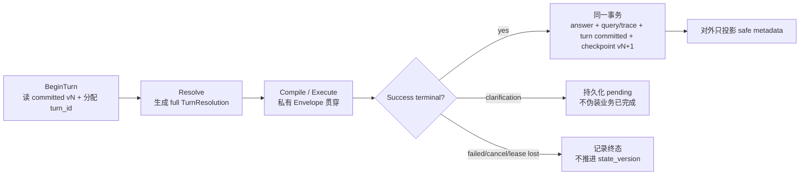

# 多轮对话与上下文压缩工程设计

> 状态：active_architecture / P0_as_built_local_verified / P1_local_replay_verified / Test_pending
> 更新日期：2026-08-13
> 适用范围：Data Agent Runtime 的 durable job、SSE job stream、Runtime Worker 和后续长会话
> 执行待办：[多轮对话建设](../../../../TODO/多轮对话建设.md)、[上下文工程与Runtime下一步规划](../../../../TODO/上下文工程与Runtime下一步规划.md)
> 当前上下文边界以本设计、`AGENT_RETRIEVAL_MAP.yaml` 与 Runtime 源码为准；旧执行器时代基线已移除。
> 配图：[会话状态Checkpoint与执行恢复边界](../图/会话状态Checkpoint与执行恢复边界.excalidraw)（PNG 为预览；以可编辑源图和本文件为准）。

## 一、结论

多轮对话和上下文压缩必须作为同一套工程建设，不能分成两个互不相干的功能。

- 多轮对话解决“当前这句话依赖了哪些上一轮事实、纠正和未决项”。
- 上下文压缩解决“在模型输入预算固定时，哪些内容必须原样保留，哪些可以变成结构化状态、摘要或证据指针”。
- 两者共同依赖同一个版本化 ConversationState、同一个 append-only 会话事实源、同一个上下文编译器和同一个成功终态提交协议。
- 原始消息、工具事件和查询证据是审计事实；摘要只是可重建的派生视图，永远不能成为业务口径、数值、freshness 或用户纠正的权威 owner。
- 模型客户端或 ToolLoop 是否长驻不决定多轮能力。应用层必须每轮从 committed state 确定性编译 provider context，才能支持 Worker 重启、扩容、重试、回滚和审计；进程内对象不能成为唯一状态 owner。

因此，本项目不采用“先把全部历史塞给模型，快超限时再总结”的临时路径。目标是建设一个可版本化、可预算、可回放、可降级的 Context Compiler。

## 二、截至 2026-08-13 的 as-built 事实与边界

### 2.1 结论与证据口径

本节是对当前代码与本地测试的 **as-built** 描述，不用设计草案替代实现证据。

| 平面 | 当前结论 | 不应外推为 |
|---|---|---|
| **P0 会话状态 checkpoint** | 已进入 durable Worker 成功/失败终态：pending ledger、`base_state_version`、session fence、CAS checkpoint、turn ledger 与 answer/query 事务一起落库 | Test 或生产验收已经完成 |
| **P1 长会话压缩** | Context Compiler/reducer、accepted artifact、source hash 失效和 20/50/100 本地 replay 已接入并有本地证据 | 真实 Provider、真实数据源、多 Pod 并发已验证 |
| **入口** | `/api/chat` 已退役；`/api/jobs` 与 `/api/chat/stream` 仅创建/订阅 durable job，实际执行由 Worker 完成 | 仍有独立 inline/sync Agent 主链 |
| **执行恢复** | Job/outbox/lease 负责重新调度；会话从最后一个 committed checkpoint 恢复 | 能从 LLM token、ToolLoop 步骤或工具调用中点继续 |

本地执行了 `test_conversation_state.py`、`test_conversation_orchestrator.py` 与 `test_long_conversation_replay.py`：**41 passed、1 skipped**。其中 Provider 和 SQL 是 deterministic fixture；这是一条本地主链证据，不是 Test/Prod 真实链路留证。

### 2.2 checkpoint 的实际对象

这里的 checkpoint 是每个 session 的**已成功完成轮次的业务工作状态**，不是完整执行栈快照。

| 持久化对象 | 保存内容 | 权威性与恢复语义 |
|---|---|---|
| `data_agent_conversation_turns` | `turn_id`、父轮次、冻结的 `base_state_version`、用户消息 hash、`pending/committed/failed` 和安全 metadata | append-only 轮次账本；失败有记录，但不产生新状态版本 |
| `data_agent_conversation_state_checkpoints` | `state_version`、`last_committed_turn_id`、allowlisted `state_json`、`source_prefix_hash` | 当前任务的权威状态；下一轮只从最新 committed 版本读取 |
| `data_agent_conversation_compactions` | 可验证的 `turn_summary` / `task_card`、来源范围与 hash | 派生视图，可失效、可重建，不能覆盖 ConversationState |
| `data_agent_sessions` 指针 | `current_state_version`、`last_committed_turn_id`、`conversation_busy` | CAS 和同 session fence；指针指向的 checkpoint 缺失时 fail-closed，不能退回 v0 |

`ConversationState` 的核心业务分组为 `topic / entities / time / metrics / constraints`，另带 corrections、pending、evidence refs、summary refs 与 source prefix hash。它回答“当前任务已经确认什么、改过什么、还缺什么、证据在哪里”；原始消息历史仍是审计事实，但不是 slot 的唯一 owner。

### 2.3 一轮的提交与失败语义

1. **Begin（Provider 前）**：`begin_conversation_turn()` 原子占用 `conversation_busy`，读取 latest committed state，写 `pending` turn，并提交固定的 `turn_id + base_state_version`。
2. **Execute（进程内）**：`TurnResolution` 只通过服务端私有 `ConversationTurnContext` 传递完整 patch；不能从对外 safe metadata 回推。
3. **Success（一个外层事务）**：`commit_started_turn_state()` 处理 patch / clear / correction / pending，写 compaction artifact；`commit_state_checkpoint()` 用开始时版本 CAS 更新 session 指针、插入 vN+1 checkpoint、标记 turn committed。Worker 随后一次 `db.commit()` 才同时提交 answer、query/trace、job event 和上述状态。
4. **Fail / cancel / lease lost**：标记 turn failed，释放 session fence，不推进版本；重试从最后一份 committed checkpoint 开始。
5. **Corruption / conflict**：CAS 冲突或 pointer 缺 checkpoint 立即 fail-closed，成功答案不能单独留下而状态静默丢失。

### 2.4 明确不覆盖的执行 checkpoint

本设计**没有**保存 Provider token 流位置、`MinimalToolLoop` 当前第几步、未完成的工具调用栈、进程内对象或中间结果行。这样做是有意的边界：这些对象可能已失租、过期或不再被 L5 授权；恢复时重新进入受控 Runtime 链，而不是恢复一段可能越权的执行栈。

如果未来需要“长任务从第 K 个工具步骤续跑”，必须单独设计 attempt/checkpoint：输入/授权/lease 版本、每步幂等键、artifact ownership、L5 re-authorization、失败原子性和清理回收都要明确。不得把 ConversationState checkpoint 误当成这项能力。

### 2.5 “结构化多轮状态”的三个不同状态空间

“多轮状态有多少种”必须先区分三个概念：

| 概念 | 当前代码数量 | 含义 |
|---|---:|---|
| TurnKind | 6 | 当前用户这一轮与历史的关系 |
| ConversationState 顶层字段 | 13 | 当前会话的版本化业务工作状态；其中 5 个核心业务分组 |
| ConversationTurn 生命周期 | 3 | `pending → committed / failed` 的持久化终态 |

ConversationState 没有有限的“总状态个数”。它像一张持续更新的业务表单，五个核心分组可以组合出任意业务状态：

- `topic`：当前 route、目标和主题状态；
- `entities`：产品、平台、国家、媒体、campaign 等对象；
- `time`：时间窗口和对比周期；
- `metrics`：请求指标、实际/预估、SDK/AF 等语义；
- `constraints`：拆分维度、segment、过滤和输出限制。

其余字段保存 session/version/last turn、append-only corrections、pending、evidence refs、summary refs 和 source prefix hash。原始聊天记录回答“用户说过什么”；ConversationState 回答“当前任务已经确认什么、改过什么、还缺什么、证据在哪里”。

## 三、GitHub 高 Star 项目调研

### 3.1 调研方法

调研时间为 2026-07-17。Star 数来自当日 GitHub 公共仓库元数据，只用于筛选社区影响力，会随时间变化。设计结论来自固定 commit 的源码或仓库文档，不以 README 宣传语代替实现证据。

本轮没有决定引入任何新框架。若后续复制代码或增加依赖，仍需单独做 license、供应链、安全和升级成本评审。

| 项目 | 调研时 Star | 深读主题 | 对本项目最有价值的做法 |
|---|---:|---|---|
| Open WebUI | 145,645 | 消息分支与历史重建 | 原始历史需要图/分支语义，不能默认永远是一条线 |
| OpenHands | 81,005 | event log、View、Condenser | append-only 事实源和压缩投影视图分离 |
| Cline | 64,723 | token budget、compaction state | 按完整请求预算、source prefix hash、失败不覆盖旧状态 |
| Mem0 | 60,985 | entity-scoped memory | session、user、agent、app/run scope 必须显式隔离 |
| AutoGen | 59,775 | state、buffer、token reducer | state 显式保存；窗口和工具消息边界需要结构化处理 |
| LlamaIndex | 50,885 | FIFO + memory blocks | 短期历史与长期块分层，最高优先级块不可被裁剪 |
| Aider | 47,434 | 递归摘要与失败 fallback | 保留近端 tail；摘要失败继续使用完整历史 |
| LangGraph | 37,440 | thread、checkpoint、并发 | thread 是版本化状态边界；同 thread 并发需显式策略 |
| Semantic Kernel | 28,320 | truncation / summary reducer | system/developer 与 tool/function 配对边界不可破坏 |
| Mastra | 26,233 | recent、semantic、working memory | working state、近期历史、语义召回不是同一种记忆 |

### 3.2 OpenHands：事实日志和模型视图必须分开

证据：

- [OpenHands condenser 说明](https://example.invalid/已脱敏链接)
- [LLM summarizing condenser](https://example.invalid/已脱敏链接)
- [OpenHands 主仓 condenser 配置](https://example.invalid/已脱敏链接)

OpenHands 的会话是 append-only event log。压缩不会删除原事件，而是新增 Condensation 事件，由 View 应用“忘记哪些事件、在哪里插入摘要”的投影规则。

值得采用：

1. 原始日志和 LLM 当前可见 View 分离；
2. 保留最早任务事件和最近一半历史，中间部分被摘要；
3. token 超限、事件数超限和人工请求是不同触发原因；
4. soft trigger 压缩失败可以跳过，下轮再试；
5. hard trigger 无法继续时才执行更激进的 hard context reset；
6. 操作边界按 atomic event group 计算，不能切断工具调用结构。

不直接照搬：

- 本 Data Agent 的 confirmed slot、freshness、needs_decision 和证据指针比普通 coding event 更重要，不能只按事件数量对半切。
- hard reset 也不能把权威状态全部交给 LLM summary；必须由结构化 ConversationState 兜底。

### 3.3 Cline：按完整请求预算，并给压缩视图绑定源历史

证据：

- [Auto Compact 说明](https://example.invalid/已脱敏链接)
- [Compaction pipeline](https://example.invalid/已脱敏链接)
- [Basic compaction](https://example.invalid/已脱敏链接)
- [Agentic compaction](https://example.invalid/已脱敏链接)
- [Session compaction state](https://example.invalid/已脱敏链接)

Cline 的当前实现比“消息 token 超限就总结”完整得多：

- 触发判断使用 system prompt + API messages + tools 的完整 request input，而不是只数历史消息。
- request overhead 和 message budget 分开计算，并为压缩后目标值预留空间。
- basic 与 agentic compaction 可切换；近端 turn 被保护。
- tool use/result 按关联 ID 原子删除，避免产生孤儿消息。
- agentic summary 可以增量折叠前一版 summary，并继续保留最近消息。
- compaction state 保存 version、source_message_count、source_prefix_hash 和 compacted messages。
- 只有 source prefix hash 匹配时才把旧摘要投影到新历史；用户编辑过旧消息后摘要自动失效。
- 压缩没有结果时不覆盖已保存 sidecar state，并记录 skipped telemetry。

本项目直接采用的原则：

1. 预算以最终 provider request 为准；
2. compaction artifact 必须绑定 source turn range + source prefix hash；
3. 摘要成功并通过验证后才能提交；
4. 最新 turn 和工具调用对属于 protected tail；
5. 记录 tokens_before、tokens_after、tokens_saved、strategy、reason 和 duration，但安全投影不记录正文。

### 3.4 Aider：递归折叠可以用，但失败必须保留原历史

证据：

- [ChatSummary](https://example.invalid/已脱敏链接)
- [调用侧失败 fallback](https://example.invalid/已脱敏链接)
- [摘要单元测试](https://example.invalid/已脱敏链接)

Aider 将旧 head 摘要，保留约一半预算给新 tail；摘要与 tail 仍超限时递归压缩。它也会尝试多个摘要模型，所有模型都失败才报错。调用侧切换 coder 时，摘要失败会警告并继续使用完整历史。

值得采用：

- 保留近端 tail；
- 摘要模型可以有 fallback；
- 递归压缩必须有深度上限；
- 摘要失败不允许静默丢掉历史。

本项目需要更严格：

- 不使用一个自由文本 summary 承担全部事实；
- 不为凑齐 user/assistant 交替而插入伪回答；
- hard budget 下完整历史也放不进去时，要进入显式 BLOCKED 或更低级别的确定性裁剪，不能继续调用造成 provider overflow。

### 3.5 Semantic Kernel 与 AutoGen：消息结构是压缩边界

证据：

- [Semantic Kernel truncation reducer](https://example.invalid/已脱敏链接)
- [Semantic Kernel summarization reducer](https://example.invalid/已脱敏链接)
- [AutoGen buffered context](https://example.invalid/已脱敏链接)
- [AutoGen token-limited context](https://example.invalid/已脱敏链接)
- [AutoGen AssistantAgent state](https://example.invalid/已脱敏链接)

共同结论：

- system/developer 消息应独立保留；
- function/tool call 与 result 必须按安全边界整体保留或整体去除；
- reducer 的 target 与 threshold 应配置化；
- stateful agent 不能被并发调用；状态必须 save/load；
- 简单“从中间不断 pop 直到够小”不适合直接用于业务状态丰富的 Data Agent。

### 3.6 LangGraph、LlamaIndex、Mastra、Mem0：四种记忆必须分开

证据：

- [LangGraph checkpoint](https://example.invalid/已脱敏链接)
- [LangGraph multitask strategy](https://example.invalid/已脱敏链接)
- [LlamaIndex memory guide](https://example.invalid/已脱敏链接)
- [LlamaIndex memory implementation](https://example.invalid/已脱敏链接)
- [Mastra memory types](https://example.invalid/已脱敏链接)
- [Mem0 entity-scoped memory](https://example.invalid/已脱敏链接)

本项目据此明确四种不同对象：

| 对象 | 作用 | 当前阶段 |
|---|---|---|
| ConversationState | 当前任务的权威结构化状态 | P1 必须 |
| Recent turns | 近期原始措辞、指代和交互连续性 | P1 必须 |
| Task summary | 已闭环旧 turn 的有损派生视图 | P1 压缩阶段 |
| Long-term memory | 跨 session 偏好或可检索记忆 | P2，默认关闭 |

向量召回适合找长期相关信息，不适合替代“换成 iOS”这种当前会话状态 patch。跨 session memory 也不能默认与 session state 混用。

### 3.7 Open WebUI：重生成后，会话不一定是一条线

证据：

- [Open WebUI message graph utilities](https://example.invalid/已脱敏链接)

Open WebUI 的消息结构包含 parentId、childrenIds 和 currentId，并从当前叶子回溯重建正在查看的分支。这说明 message edit、regenerate 或重新选择回答后，简单按 created_at 取“最后 N 条”可能把不同分支混进同一个上下文。

本项目 P1 可以先保持线性 turn，但 CompactionArtifact 必须预留 branch_id/parent_turn_id，并用 source prefix hash 校验投影。后续一旦支持编辑或重生成，不需要推翻压缩协议。

### 3.8 调研后的统一结论

1. raw log、state、summary、provider context 必须是四个不同层。
2. 压缩应追加派生 artifact，不应修改或删除原始会话。
3. 压缩必须绑定源历史版本或 hash，否则消息编辑、重生成和分支会让摘要失真。
4. 预算必须覆盖 system、tools、knowledge、history、当前问题和输出 reserve。
5. 最近 turn、最早任务、用户纠正、未决项、工具调用对和证据指针必须有保护规则。
6. soft trigger 与 hard trigger 的失败语义不同，但两者都不能提交空摘要或半成品状态。
7. stateful session 默认串行；跨 session 才并行。
8. 摘要只是检索和续接辅助，不是 confirmed business fact。

## 四、目标分层

### 4.1 六层对象

| 层 | Canonical owner | 内容 | 是否可丢 |
|---|---|---|---|
| L0 原始事实层 | Message / job event / query record / trace | 用户原话、回答、工具调用、错误、证据记录 | 不可丢；受保留与删除策略治理 |
| L1 会话状态层 | ConversationState checkpoint | 当前任务、slots、纠正、未决、证据 refs、freshness | 不可被摘要覆盖 |
| L2 压缩派生层 | CompactionArtifact | Snip、turn summary、task card、global summary | 可重建、可失效 |
| L3 召回层 | KnowledgeRouter / verified assets | 当前任务需要的 route、policy、table、SQL 证据 | 每轮按需选择 |
| L4 编译视图层 | ContextPlan / ContextManifest | 本轮各 segment、预算、来源、reducer 决策 | 一次性派生，可审计 |
| L5 Provider 输入层 | Python MinimalToolLoop / model provider request | 最终稳定 prefix + 动态内容 | 不持久化正文，只记安全计量 |

P2 才考虑第七层“跨 session 长期记忆”。它必须独立 scope、独立删除、独立 freshness，不得偷偷进入 P1。

### 4.2 权威优先级

发生冲突时按以下顺序解释：

~~~
当前用户显式纠正
> 当前 turn 明确参数
> latest committed ConversationState
> confirmed policy / semantic contract
> verified evidence pointer
> task summary
> 历史 assistant 文本
~~~

历史 assistant 回答可能错误，不能因为被摘要重复一次就升级为事实。

## 五、核心数据合同

以下同时表达目标合同与当前实现。`ConversationTurn`、`ConversationStateCheckpoint` 和 `ConversationCompaction` 的持久化模型及 migration 已存在；示例中某些细粒度 provenance 字段仍是需要收口的目标 schema，不得将示例误报为当前全部已落库。

### 5.1 ConversationState

~~~yaml
schema_version: 1
session_id: sess_xxx
state_version: 12
last_committed_turn_id: turn_012
topic:
  route_task_id: mi_分析平台_analysis
  goal: 分析近期 示例产品 的 分析平台 预估偏差
  status: active
entities:
  product: 示例产品
  bundle_id:<已脱敏>
  platform: ios
  country: US
  media_source:<已脱敏>
  campaign_ids: []
time:
  range:
    start: 2026-07-01
    end: 2026-07-16
  comparison: previous_period
metrics:
  requested:
    - roi_360_forecast
  semantics:
    roi_360_forecast:
      kind: forecast
      source: MI_D360
      confidence: confirmed
corrections:
  - turn_id: turn_010
    field: metrics.semantics.roi_360_forecast.kind
    from: actual
    to: forecast
    source: user_explicit
pending:
  - id: pending_01
    field: attribution_scope
    reason: insufficient_evidence
    needs_decision: true
evidence_refs:
  - kind: query_record
    id: qr_xxx
    freshness_status: fresh
    source_turn_id: turn_011
summary_refs:
  - compaction_id: cmp_004
    kind: task_card
~~~

硬约束：

- state_version 单调递增。
- 每个字段保留 source turn、confidence 或 provenance；不能只有最终字符串。
- correction 是 append-only patch 记录，不能抹掉“用户改过口径”这一事实。
- freshness_status、needs_decision、confirmed semantics 和 evidence_refs 属于 pinned state。
- summary 不得写回并覆盖这些 pinned 字段。

### 5.1.1 当前 schema 与演进约束

当前 `ConversationState` 共有 13 个顶层字段，五个核心业务分组是 `topic / entities / time / metrics / constraints`。当前分组内部仍以字典承载，因此演进时必须满足：

1. checkpoint 必须带 `schema_version`；未知版本或不合法字段 fail closed，不得静默丢弃。
2. 每个可继承 slot 最终要有 source turn / provenance / confidence；只存最终值无法审计纠正来源。
3. state checkpoint 可以保存受限结构化值；对外 metadata 只允许 ID、版本、枚举、count、hash、reason code 和 patch key，不得带问题、回答、SQL、rows 或 state patch value。
4. 自由文本、用户级标识和超长 correction 不能直接写入 state；必须经字段 allowlist、长度限制和 PII 策略。
5. schema migration 必须能重放旧 checkpoint；不允许为适配新 resolver 就覆盖原始状态。

### 5.2 TurnResolution

~~~yaml
schema_version: 1
turn_id: turn_013
base_state_version: 12
turn_kind: follow_up
confidence: 0.97
resolved_question: 按 media_source 拆分 示例产品 iOS 美国 2026-07-01 至 2026-07-16 的 分析平台 预估偏差
state_patch:
  constraints.dimensions:
    op: append_unique
    value: media_source
state_clear: []
inherited_fields:
  - entities.product
  - entities.platform
  - entities.country
  - time.range
  - metrics.semantics.roi_360_forecast
clarification:
  required: false
  missing_fields: []
reason_codes:
  - short_dimension_follow_up
  - active_topic_compatible
~~~

turn_kind 必须至少包含：

- standalone：独立问题，不继承旧主题；
- follow_up：继承并补充；
- correction：用户纠正旧状态；
- topic_switch：切换主题并清理不兼容 slots；
- clarification_answer：回答上一轮反问；
- cancel_or_restart：显式取消或重新开始。

### 5.2.1 六类 TurnKind 的状态迁移合同

TurnKind 是“本轮和已提交状态的关系”，不是回答是否成功的枚举。六类必须具有不同的确定性迁移：

| TurnKind | 目标迁移 | 当前主链现状 | 必要验收 |
|---|---|---|---|
| `standalone` | 从本轮问题生成完整新 state，不继承不兼容旧主题 | 能分类，但普通首轮缺完整 slot 生产者 | 首轮 product/platform/time/metric 可入 checkpoint，旧 state 不污染 |
| `follow_up` | 继承已确认 slot，只 patch 本轮显式增补/替换 | 规则能产生部分 patch，未提交 | `v0 → v1 → v2` 中继承和 patch value 可在 DB 核对 |
| `correction` | patch 新值，并 append correction 保留 old/new/source | orchestrator 的 `from_value` 当前固定为 `None` | 从 base state 取旧值，correction 压缩后仍保留 |
| `topic_switch` | 清除不兼容主题字段，保留全局安全/身份边界，建新 topic | 默认只清 `metrics/constraints` | 有 route 明确的 clear policy，产品/时间/证据不会误继承 |
| `clarification_answer` | 只能消费当前 durable pending 的绑定答案，然后清 pending | 枚举和规则存在，主解析器未注入真实 pending | pending ID、问题和答案一一绑定，不将孤立“是”误套到旧问题 |
| `cancel_or_restart` | 终止当前执行，清理业务 state/pending，记录 restart 边界 | resolver 可输出 `state_clear=["*"]`，但消费端未完整实施 | 已经开始的 job 取消、state reset 和新 turn 边界一致 |

state 值的优先级固定为：当前用户显式纠正 > 确定性解析 / Question Contract > latest committed state > 经 schema 验证的 model proposal。历史 assistant 自由文本只能辅助理解，不能直接产生 authoritative patch。

### 5.3 CompactionArtifact

~~~yaml
schema_version: 1
compaction_id: cmp_005
session_id: sess_xxx
base_state_version: 12
kind: task_card
strategy: deterministic_plus_llm
source:
  first_turn_id: turn_001
  last_turn_id: turn_008
  turn_count: 8
  source_prefix_hash: sha256:...
  source_message_count: 16
protected_tail:
  first_turn_id: turn_009
  last_turn_id: turn_012
summary:
  goal: 分析 示例产品 分析平台 的含义和近期表现
  confirmed_slots: {}
  user_corrections: []
  completed_steps: []
  unresolved: []
  evidence_refs: []
  freshness: []
validation:
  schema_valid: true
  pinned_state_preserved: true
  evidence_refs_exist: true
  tool_pairs_intact: true
  status: accepted
metrics:
  input_tokens: 6200
  output_tokens: 650
  saved_tokens: 5550
created_by:
  reducer_version: context-reducer-v1
  model: summarizer-model-id
  prompt_version: summary-contract-v1
~~~

硬约束：

- accepted artifact 才能进入下一轮 ContextPlan。
- source prefix hash 不匹配时 artifact 立即失效并重新构建。
- summary 中的 confirmed_slots 是 state 投影，不是新的事实来源。
- rejected、timeout、empty、schema_invalid 必须留安全状态码，但不能替换上一版 accepted artifact。

### 5.4 ContextSegment 与 ContextPlan

~~~yaml
plan_version: 1
session_id: sess_xxx
turn_id: turn_013
state_version: 12
model_context_limit: 128000
output_reserve_tokens: 8000
request_overhead_tokens: 3500
input_budget_tokens: 116500
segments:
  - id: safety_floor
    kind: system
    priority: 0
    pinned: true
    estimated_tokens: 2800
  - id: current_state
    kind: state_card
    priority: 1
    pinned: true
    estimated_tokens: 500
  - id: route_knowledge
    kind: retrieved_knowledge
    priority: 2
    pinned: false
    estimated_tokens: 4200
  - id: recent_turns
    kind: raw_turns
    priority: 3
    pinned: false
    estimated_tokens: 6200
  - id: task_card
    kind: summary
    priority: 4
    pinned: false
    estimated_tokens: 700
reducer:
  selected_level: L2_microcompact
  actions: []
  warnings: []
final_estimated_input_tokens: 23400
~~~

ContextPlan 是“为什么本轮给模型这些内容”的安全清单。持久化时只保存 segment 类型、token、source IDs、hash、动作和状态，不保存 prompt 正文。

## 六、统一执行链路

### 6.1 每轮状态机

~~~
接收用户消息
  → 认证 session，分配 turn_id
  → 同 session enqueue；跨 session 可并行
  → 加载 latest committed state、原始 tail、accepted compaction
  → 校验 source prefix hash，失效则丢弃派生视图
  → Turn Resolver 输出 TurnResolution
  → 生成 provisional state，但不提交
  → 用“当前问题 + authoritative state projection”进行 route
  → 按 route 召回 knowledge / evidence
  → Context Compiler 生成候选 segments
  → Budget Allocator 计算完整 request 预算
  → Reducer 选择最低必要压缩级别
  → 组装稳定 prefix + 动态 provider context
  → Python MinimalToolLoop / model provider 执行
  → 校验回答、工具记录、query records 与终态
  → 在同一成功终态事务提交 answer + state checkpoint + compaction refs
  → 失败、取消、lease lost：保留错误证据，不推进 state_version
~~~

### 6.1.1 TurnExecutionEnvelope 与三入口接线合同

sync、SSE 和 durable Worker 必须共用同一个**内部执行信封**，而不能通过对外 answer metadata 偶然传递完整对象。目标合同：

~~~text
TurnExecutionEnvelope
  turn_id
  base_state_version
  committed_state_snapshot / state_hash
  full TurnResolution          # 含 patch value，仅进程内或受控 job payload
  ContextPlan / compaction refs
  runtime answer / query refs
~~~

不变量：

1. BeginTurn 时就固定 `turn_id` 和 `base_state_version`；不得在回答结束后重新读最新版本代替。
2. full `TurnResolution` 仅在私有 envelope 中传递；`to_safe_metadata()` 只是审计投影，不能被反向当作 state patch。
3. answer / query record / turn ledger / checkpoint 必须处于同一成功终态事务；CAS 冲突不能“回答成功但静默丢状态”，应显式重排或返回 `state_conflict`。
4. failed / cancelled / lease-lost turn 不推进版本；clarification 必须持久化 pending 指针，不依赖下一轮猜测。
5. Worker 重启后只从 DB / 受控 job payload 恢复 envelope 所需的 ID、版本和结构化状态；不依赖上一轮 Python 对象。

当前 as-built 差距：`agent.py` 只在 answer metadata 写 safe projection，`main.py` 和 `runtime_worker.py` 却尝试读取未生产的 `_turn_resolution_obj`；同时已有 `_p3_envelope` 证明私有同进程信封可行。实施时应建立明确的 `TurnExecutionEnvelope` 或扩展现有私有 envelope，不应将 patch value 塞入公开 metadata。

### 6.2 Router context 和 Provider context 分开

Router 只读取：

- 当前用户原话；
- TurnResolution.resolved_question；
- active topic、关键 entity、metric semantics 的小型 state projection；
- topic switch / correction 等 reason code。

Provider 才读取：

- 固定安全与只读规则；
- route 召回的知识；
- authoritative state card；
- accepted task summary；
- 近期原始 turns；
- 当前用户原话与 resolved question 的明确区分；
- 必要 evidence pointers。

这样同时避免 route 被旧问题关键词污染，以及 provider 因上下文太少而无法理解“换成 iOS”。

### 6.3 固定 prefix 与动态 suffix

为兼顾 KV cache：

- 最前放版本稳定的 system safety floor、只读边界和工具 schema；
- route policy 使用稳定排序和稳定模板；
- state card、summary、recent turns、当前问题放在动态后缀；
- L1–L3 优先改动旧段或大工具结果，不频繁重写固定前缀；
- L4 会改变大段 summary，应是低频最后手段。

## 七、预算模型

### 7.1 完整请求预算

每轮先计算：

~~~
input_budget
= model_context_limit
- output_reserve
- provider_hidden_overhead_reserve
- tool_loop_reserve
~~~

实际待装载内容：

~~~
request_input
= system_prompt
+ tool_definitions
+ route_knowledge
+ state_card
+ compaction_summaries
+ recent_raw_turns
+ current_question
+ provider_format_overhead
~~~

只有 request_input 接近或超过 trigger 时才升级压缩。不能只数 recent_raw_turns，因为 system、tools 和 knowledge 可能已经占据大部分窗口。

### 7.2 优先级

| 优先级 | Segment | 处理 |
|---:|---|---|
| P0 | safety、PII、密钥、freshness、不自动投放、工具契约 | 永不压缩 |
| P1 | 当前用户消息、TurnResolution、authoritative state card | 永不丢；只允许稳定结构化 |
| P2 | 用户纠正、confirmed semantics、needs_decision、未决 blocker、evidence refs | 永不由 LLM 自由改写 |
| P3 | route 必需 policy、table/metric 边界 | 按命中召回，不整包 |
| P4 | 最近完整 turn 与当前 tool pair | 保留 protected tail |
| P5 | 已闭环旧 turns | 可 L2/L3 |
| P6 | 大工具输出、重复 trace、历史解释文本 | 优先 L1 或删除派生副本 |
| P7 | 额外背景知识 | 预算不足时先减少召回 |

### 7.3 地板超限

若 P0–P2 加当前问题本身已经超过 input budget：

- 不允许继续压缩安全规则或 confirmed state；
- 返回明确 context_floor_over_budget；
- trace 记录各 pinned segment token 数；
- 进入工程修复或模型窗口升级，不用“删掉规则后能跑”制造假绿。

## 八、四级压缩

压缩器每轮选择“能进入预算的最低级”，够用就停止。

### L0：NoCompact

- 完整 request 低于 trigger；
- 只做去重、稳定排序和无损格式化；
- 使用上一版 accepted artifact + 新 tail；
- 不生成新摘要。

### L1：Snip

- query rows 换成 query_record_id、row_count、schema、status、freshness 和安全摘要；
- 超长 SQL 换成 sql_hash、query_record_id 和语义说明；
- 工具输出正文保留在权威 trace/query record，不复制到多轮 prompt；
- tool use/result 按原子 group 处理。

它对可回查证据近似无损，是默认常开层。

### L2：MicroCompact

- 每次只折叠最旧 1–2 个完整 turn group；
- 输出结构化 turn summary；
- 最近 N 个 turn、当前未闭环 tool group 和所有用户纠正原文保留；
- accepted summary 可增量折叠，但必须绑定新 source hash。

它是局部有损、低成本的高频滚动层。

### L3：Collapse

- 把一个闭环 task cluster 变成 task card；
- 固定字段为 goal、confirmed state projection、completed steps、evidence refs、freshness、unresolved、user corrections；
- 原始 turns 仍留在 L0 事实层，不再进入 provider view；
- active topic 未闭环的 cluster 不允许 Collapse。

### L4：AutoCompact / Hard Context Recovery

- 保留 P0–P2 地板；
- 保留当前问题和最近 1–2 个完整 turn；
- 把其余 accepted summaries 和旧 task cards 折叠为 global continuation note；
- hard trigger 时可以缩小待摘要事件的单项长度并有限重试；
- 超过重试上限仍失败则显式 BLOCKED。

L4 最有损、会破坏较多 cache，只能作为最后手段。

### 8.5 Soft trigger 与 Hard trigger

| 类型 | 示例 | 失败行为 |
|---|---|---|
| soft | 达到预警阈值，但本轮完整请求仍能发送 | 跳过新压缩，继续使用上一版 accepted view；记录 skipped |
| hard | 预测必超限、provider 已报 context exceeded、人工强制 compact | 依次升级 reducer；仍失败则 BLOCKED，不提交摘要或 state |

无论 soft 还是 hard，空摘要、schema invalid、source hash mismatch 和 pinned-state validation failure 都不能被接受。

## 九、摘要合同与验证

### 9.1 摘要必须回答什么

每份 task/turn summary 必须包含：

1. 用户当前目标；
2. 已确认 entities、time、metrics 和 metric semantics；
3. 用户明确纠正及其 source_turn_id；
4. 已完成步骤，只写可验证状态；
5. evidence refs 和 freshness；
6. 未解决问题、needs_decision 和 blockers；
7. 下一步续接点；
8. source turn range、source prefix hash 和版本。

禁止包含：

- 从图表或结果中重新猜测的精确数值；
- 未在 state/evidence 中出现的新结论；
- token、cookie、AK/SK、用户级明细；
- 原始 SQL、行数据或完整 prompt 副本；
- 把历史 assistant 说法标为 confirmed。

### 9.2 确定性校验

LLM summary 返回后至少执行：

- schema validation；
- source turn range 存在；
- source prefix hash 未变化；
- pinned state 字段全部可在 state projection 中重建；
- user corrections 没有反转或丢失；
- evidence refs 存在且属于本 session/turn 权限范围；
- freshness 与 needs_decision 未丢；
- tool call/result group 完整；
- estimated tokens_after 小于目标预算；
- summary 没有敏感字段。

校验器不要求摘要逐字复述 raw history；它要求摘要不得改变权威状态。

### 9.3 提交协议

~~~
读取 base_state_version
→ 生成 provisional state 和 candidate compaction
→ 调用 Python MinimalToolLoop / model provider
→ answer / tool / query 校验成功
→ 开启数据库事务
→ CAS 校验 session.state_version == base_state_version
→ 写 answer、state checkpoint、accepted compaction、turn completion
→ state_version + 1
→ commit
~~~

CAS 失败时任务不得 last-write-wins。默认回到 session 队列重新基于最新 state 解析，或标记 state_conflict。

## 十、持久化与并发

### 10.1 建议持久化对象

| 对象 | 关键字段 | 约束 |
|---|---|---|
| conversation_turns | turn_id、session_id、parent_turn_id、base_state_version、status | session + turn 唯一 |
| conversation_state_checkpoints | session_id、state_version、state_json、last_committed_turn_id | session + version 唯一 |
| conversation_compactions | compaction_id、source hash、source range、kind、status、safe metrics | accepted artifact 可查询 |
| sessions 扩展 | current_state_version、last_committed_turn_id、busy/queue marker | CAS 更新 |

不建议继续把所有状态塞进 Message.metadata：

- 无版本；
- 难做唯一约束和 CAS；
- 难分 accepted/rejected；
- 无法清楚表达 message edit、branch 和 compaction invalidation。

### 10.2 并发默认

- 同 session：enqueue。
- 跨 session：并行。
- cancel：取消当前执行但不撤销上一版 committed state。
- retry：复用原 turn_id 或建立明确 retry_of，不能重复推进 state。
- Worker lease lost：新 Worker 从 committed checkpoint 恢复，不相信进程内状态。
- message edit / regenerate：建立 branch 或让旧 source hash 失效，不能偷偷改写已压缩历史。

## 十一、可观测性与隐私

### 11.1 安全 trace 字段

建议记录：

~~~yaml
context_compilation:
  plan_version: 1
  state_version: 12
  turn_kind: follow_up
  resolver_reason_codes:
    - short_dimension_follow_up
  compaction_level: L2
  compaction_reason: history_budget
  source_turn_count: 8
  recent_turn_count: 4
  segment_tokens:
    safety_floor: 2800
    state_card: 500
    route_knowledge: 4200
    summary: 700
    recent_turns: 6200
    user: 30
  tokens_before: 20800
  tokens_after: 14430
  tokens_saved: 6370
  summary_status: accepted
  source_hash_match: true
  state_commit_status: committed
~~~

### 11.2 禁止进入安全投影

- 用户原问题和回答正文；
- resolved question 正文；
- summary 正文；
- SQL 和结果行；
- raw tool payload；
- cookie、token、IP、user_agent；
- provider 完整 prompt。

调试正文仍受原有受控 debug 权限、数据留存和删除规则治理，不能借“上下文工程”扩大可见范围。

## 十二、代码落点

| 路径 | 目标职责 |
|---|---|
| runtime/backend/app/models.py | turn、state checkpoint、compaction artifact 或等价模型 |
| runtime/backend/alembic/versions/ | 可回滚 migration、唯一约束、索引 |
| runtime/backend/app/schemas.py | ConversationState、TurnResolution、ContextPlan 安全 schema |
| runtime/backend/app/services/conversation_context.py | P0 兼容层，逐步退役固定短语主逻辑 |
| runtime/backend/app/services/turn_resolver.py | turn 分类、state patch/clear、standalone rewrite |
| runtime/backend/app/services/conversation_state.py | load、provisional patch、CAS commit、checkpoint |
| runtime/backend/app/services/conversation_orchestrator.py | 严格的 begin → terminal 状态编排、turn ledger 与 checkpoint 原子 staging |
| runtime/backend/app/services/context_compiler.py | segment 生成、router/provider 双视图、稳定排序 |
| runtime/backend/app/services/context_budget.py | 完整请求预算、output/tool reserve、触发判定 |
| runtime/backend/app/services/context_reducer.py | L0–L4、source hash、摘要校验与 fallback |
| runtime/backend/app/services/context_metrics.py | 扩展 count-only segment/reducer metrics |
| runtime/backend/app/services/persistence.py | 成功终态事务、失败不推进 state |
| runtime/backend/app/main.py | durable job submit 与 SSE job stream；不再执行 inline Runtime |
| runtime/backend/app/workers/runtime_worker.py | durable job 恢复 checkpoint、CAS 终态 |
| runtime/backend/tests/ | resolver、reducer、并发、端到端与隐私测试 |
| eval/agent_regression/ | 多轮 golden conversation 与压缩 replay |

当前主链已在 `DataAgentRuntime` 调用 `compile_provider_payload()` 编译实际 Provider payload；Worker 在 Begin 后加载 committed prior slots 与 accepted compactions；成功终态由 `conversation_orchestrator` 在 checkpoint CAS 同一事务中 stage deterministic compaction。这个结论仅有本地主链/replay 证据，尚不代表 Test 或生产环境已验证。

## 十三、分阶段实施

以下是设计时的实施顺序，不能把所有条目当作当前开放缺口。截至 2026-08-13：**CX-1 已完成本地 P0 主链；CX-3 至 CX-5 已有 P1 本地主链与 20/50/100 replay；CX-6 的三服务 Test 部署与无重试真实会话验收仍未关闭。**

### CX-0：先建评测，不扩充短语表

- 建 multi_turn_cases.yaml 或等价会话格式；
- 覆盖原 分析平台 四轮、自然短追问、纠正、topic switch、跨领域和失败恢复；
- 建 20/50/100 turn 的合成长会话；
- 为每轮标 expected_turn_kind、state_patch、route、must_keep 和 must_not_inherit。

退出标准：评测能稳定复现当前 P0 漏判和长会话丢状态。

### CX-1：state/checkpoint + session enqueue

- 落 ConversationState 和 turn/checkpoint 持久化；
- 成功终态事务提交；
- 同 session enqueue + CAS；
- 暂不改变 provider context，先证明恢复与并发正确。

退出标准：Worker 重启、retry、cancel、并发不产生状态倒退或静默覆盖。

### CX-2：Turn Resolver shadow

- 新 resolver 只写安全 metadata；
- 对比 P0 heuristic 与人工标签；
- 复杂指代允许结构化模型判断，但必须超时、schema 和 fallback；
- 高精度 correction/topic switch 先达到 hard golden 100%。

退出标准：shadow 报告达到门槛，再逐类 enforce。

### CX-3：Context Compiler + L0/L1

- router/provider context 分离；
- 预算覆盖完整 request；
- 工具输出、SQL、rows 换证据指针；
- segment count-only trace。

退出标准：答案和路由不回退，request token 有可解释下降，trace 无正文泄漏。

### CX-4：L2/L3

- 实现 source hash、protected tail、turn summary、task card；
- 摘要 schema + pinned-state validator；
- soft trigger 失败保留旧 accepted artifact。

退出标准：压缩前后 golden conversation 的 state、route、证据和最终回答语义一致。

### CX-5：L4 与 hard recovery

- provider context exceeded 分类；
- 有限重试、缩小 summary input、fallback reducer；
- 地板超限与 hard failure 显式 BLOCKED；
- 人工 compact 与自动 compact 使用同一 artifact 合同。

退出标准：没有无限重试、空摘要提交、规则裁掉或 context overflow 假绿。

### CX-6：灰度与全服务部署

- resolver 先 shadow，再按能力分层 enforce；
- reducer 独立 kill switch；
- 同一 commit 部署 API、Worker、Freshness；
- 新 session 单次无重试重放，再决定是否 N=3；
- 首次失败基线保留。

## 十四、评测与门禁

### 14.1 Golden conversation 格式

~~~yaml
id: 分析平台_forecast_followup_001
initial_state: {}
turns:
  - user: 看下近期 示例产品 的 分析平台
    expect:
      turn_kind: standalone
      route_task_id: mi_分析平台_analysis
      state_patch:
        entities.product: 示例产品
        metrics.semantics.roi_360.kind: forecast
  - user: 换成 iOS
    expect:
      turn_kind: follow_up
      inherited:
        - entities.product
        - metrics.semantics.roi_360
      state_patch:
        entities.platform: ios
  - user: 分析平台 我说的是预估，不是实际
    expect:
      turn_kind: correction
      must_preserve_after_compaction:
        - corrections
        - metrics.semantics.roi_360
  - user: 现在查一下素材生产表字段
    expect:
      turn_kind: topic_switch
      must_not_inherit:
        - metrics.semantics.roi_360
~~~

### 14.2 必测场景

1. 对象替换：换成 iOS、只看美国、改成 示例产品。
2. 维度追加：媒体拆一下、按 campaign 看。
3. 时间 patch：时间改到上周、和前一周期比。
4. 口径纠正：预估不是实际、SDK 不是 AF。
5. 指代：这个、刚才那个、它为什么降。
6. clarification answer：回答 Agent 上一轮反问。
7. topic switch：ROI 问题后切到表字段或实验配置。
8. 长会话：纠正在第 3 轮，压缩发生在第 20 轮，50 轮后仍保留。
9. message edit / regenerate：旧 summary 因 hash mismatch 失效。
10. tool pair：压缩不能产生孤立 tool_result。
11. 并发：同 session 两个 turn 默认串行。
12. 失败：summary timeout、schema invalid、provider/tool timeout、lease lost、CAS conflict。
13. 隐私：安全 trace 不含问题、答案、SQL、rows 或 summary 正文。

### 14.3 核心指标

| 指标 | 定义 | 首期门槛 |
|---|---|---|
| turn_kind_accuracy | turn 类型与 golden 一致 | hard golden 100% |
| slot_carry_precision | 继承 slot 的正确比例 | hard golden 100% |
| slot_patch_accuracy | state patch 正确比例 | hard golden 100% |
| stale_context_contamination_rate | standalone/topic switch 被旧状态污染 | hard golden 0 |
| pinned_state_loss_rate | 压缩后纠正/口径/freshness/未决项丢失 | 0 |
| orphan_tool_pair_rate | 压缩后孤立 tool call/result | 0 |
| invalid_compaction_commit_rate | 失败 artifact 被 accepted | 0 |
| state_conflict_silent_overwrite | CAS 冲突被静默覆盖 | 0 |
| context_budget_overflow_rate | 编译后仍超预算 | 必须显式分类 |
| compression_ratio | tokens_after / tokens_before | 报分布，不单独追求越低越好 |
| answer_semantic_regression | 压缩前后答案语义回退 | hard golden 0 |

不能只用 compression ratio 判断成功。把重要上下文删光会获得最好压缩率，却是最差产品。

### 14.4 必跑门禁

- resolver/state/reducer 单元测试；
- `/api/jobs` durable job submit + MySQL + Runtime Worker 端到端（`/api/chat` 已退役，不再作为验收入口）；
- `/api/chat/stream` SSE job stream 端到端；
- enqueue、cancel、retry、lease lost、CAS conflict；
- backend 全量 pytest；
- route golden、真实问题集、clarification policy、route confusion；
- Agent regression，freshness blocker 单列；
- metadata-only 隐私测试和 AST fail-closed。

### 14.5 As-built 主链验收证据

组件单测不能作为本专项的主链完成证据。每个入口至少保留一份可重放证据：

| 验收面 | 必须能直接观察到 |
|---|---|
| durable API job submit | API 只创建 job；Worker 的同一 session 必须能观察到 `v0 → v1 → v2`，checkpoint 包含首轮完整 slot 与第二轮 patch value |
| SSE job stream | 客户端断开/取消时 job/turn 终态正确，未成功终态不推进 version |
| durable Worker | Worker 重启后能从持久化状态恢复，answer/query/turn/checkpoint 在成功事务中一致 |
| 六类 TurnKind | 每类都有独立 DB checkpoint / ledger 断言，不只验 turn_kind metadata |
| 并发 | 同 session 串行或 CAS 显式冲突；不存在静默覆盖、答案已发送但状态丢失 |
| Context Compiler | trace 能证明实际 provider request 使用了哪些 safe segment、预算和 reducer 决策 |
| 隐私 | 公开 metadata 不含 patch value / raw text，DB state 只有 allowlisted 结构化值 |
| 部署 | API / Worker / Freshness 同 commit、image/build provenance 可核对，再做真实单次无重试会话验收 |

验收原始记录应包含 session ID、turn IDs、state versions、safe checkpoint diff、query/trace IDs、终态和 resolved deployment provenance；不记录 token、cookie、原始 SQL/rows 或用户级明细。

## 十五、架构决策

| ADR | 决策 | 原因 |
|---|---|---|
| CX-ADR-001 | 多轮和压缩共用一个 Context Compiler | 防止两套状态和预算互相矛盾 |
| CX-ADR-002 | raw log append-only，summary 是派生 artifact | 可审计、可回滚、可重建 |
| CX-ADR-003 | ConversationState 是当前任务权威状态 | 不依赖自由文本历史寻找关键 slot |
| CX-ADR-004 | compaction 绑定 source prefix hash | 防止编辑/分支后沿用陈旧摘要 |
| CX-ADR-005 | router/provider 使用不同 context view | 降低旧主题污染并保留 provider 连续性 |
| CX-ADR-006 | 同 session enqueue + CAS | 禁止静默 last-write-wins |
| CX-ADR-007 | 成功终态才提交 state 和 accepted artifact | 失败/取消不污染会话 |
| CX-ADR-008 | 完整 request token 决定压缩 | system/tools/knowledge 也消耗窗口 |
| CX-ADR-009 | L0–L4 选择最低必要级别 | 降低有损和 cache 抖动 |
| CX-ADR-010 | LLM summary 不拥有业务事实 | 防止幻觉覆盖 confirmed 状态 |
| CX-ADR-011 | P1 不默认做跨 session memory | 控制隐私、陈旧事实和删除治理风险 |
| CX-ADR-012 | 不整体迁移高 Star 框架 | 复用原则，保留现有 job/lease/trace/Python ToolLoop 链路 |

## 十六、明确不做

P1 不包括：

- 自动停投、放量、改预算等写操作；
- 用向量库替代当前会话 coreference；
- 默认跨 session 用户画像；
- 让模型客户端或 ToolLoop 常驻进程成为唯一状态 owner；
- 把全部 raw history 每轮都塞给模型；
- 为每个漏判句子继续增加固定短语；
- 只为了更低 token 而删安全规则、confirmed state 或 evidence refs；
- 整体重写为 LangGraph、AutoGen、OpenHands 或 Cline。

## 十七、完成定义

只有以下条件全部满足，才可以说“多轮对话与上下文压缩建设完成”：

1. ConversationState、TurnResolution、CompactionArtifact 和 ContextPlan 有版本化 schema、迁移、回滚和测试。
2. 原 分析平台 会话和自然追问无需逐句硬编码即可正确继承、纠正和切题。
3. 20/50/100 turn 压缩后不丢用户纠正、confirmed semantics、freshness、needs_decision 和 evidence refs。
4. message edit、regenerate、branch 会让不匹配的 summary 失效。
5. tool call/result 从不被切断。
6. 同 session enqueue/CAS 在 Worker 重启、retry、cancel、lease lost 下仍正确。
7. soft/hard compaction 失败都不提交空 summary 或半成品 state。
8. 编译后输入受预算约束，地板超限会显式 BLOCKED。
9. 安全 trace 只有 count、状态、ID/hash 和 reason code，没有问题、答案、SQL、rows、summary 正文。
10. backend、route、clarification、真实问题、多轮 replay 和 Agent regression 无新增 hard failure。
11. test 三服务同 commit 部署并完成单次无重试验收；需要稳定性结论时再做严格 N=3。
12. 人工 review 确认系统没有把“页面保存了历史”或“某个四轮样例通过”误报为通用多轮能力。

在完成之前，实施状态由 [多轮对话建设](../../../../TODO/多轮对话建设.md) 跟踪；本文件只维护统一架构和不变量。
