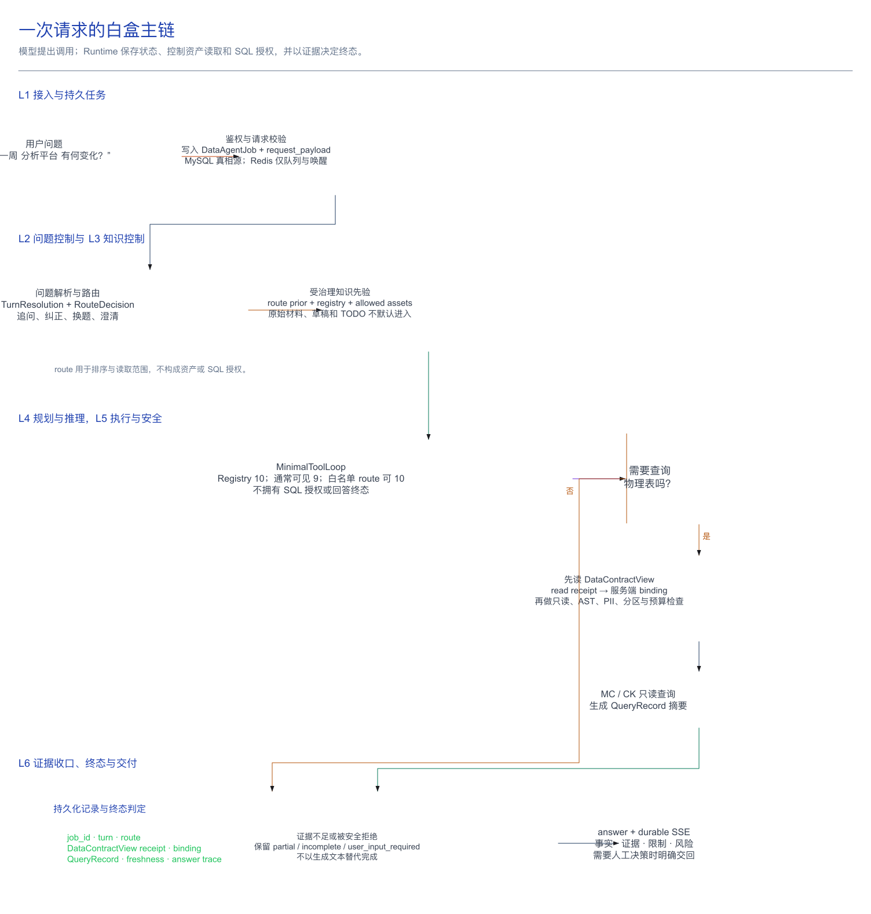

# 从一个问题看懂 Data Agent

> 目的：用一次真实的输入问题，把 Data Agent 的责任边界、运行对象、持久化状态和证据链白盒化。
>
> 状态：当前实现说明；不是实时部署状态面板。代码默认值、Test/Production 实际配置与最新门禁结果必须分别核验。
> 架构权威：[Runtime 与控制面架构分层及冻结边界](../../data_agent_plan/架构/在线/架构分层与冻结边界.md)。

## 系统定位

Data Agent 是由 Runtime 控制的只读分析系统。模型可以提出工具调用和候选解释；资产读取、SQL 授权和回答终态由 Runtime 决定。

审阅一次请求时，需要同时检查：

- **状态**：这次请求由哪个 Job、哪个 turn、哪个终态记录承接；能否恢复、重试或取消。
- **证据**：回答引用了哪些受控资产、合同读取、查询记录和新鲜度事实。
- **授权**：谁决定 route，谁允许读取，谁允许 SQL；模型的建议在哪一层必须被服务端拒绝或接受。

## 展示视图与运行架构

[`当前系统架构图.md`](当前系统架构图.md) 的「知识 → 控制 → 运行 → 评测」用于汇报展示，不对应 Runtime 层号。运行时责任边界以六层主链和两个横切面为准：

| 展示视图 | 白盒架构中的责任 |
|---|---|
| 知识基座 | L6 数据与知识底座，以及 L3 的资产身份和读取入口 |
| 控制面 | L2 用户问题控制 + L3 知识控制 |
| 运行层 | L1 接入 + L4 `MinimalToolLoop` + L5 执行与安全 |
| 评测闭环 | 证据与治理横切面 |

横切面：

- **Runtime 状态面**：Job、Outbox、Lease、重试、预算、终态和恢复。
- **证据与治理面**：读取的资产、DataContract binding、QueryRecord、trace、回放、回归和发布证明。

## 一次问题的白盒主链

以下以“Game Top 最近一周 iOS 美国媒体 分析平台 有何变化，归因是什么？”为例。问题内容只是示意，关键是每一步的责任归属。

```text
用户输入
  → 接入与持久任务
  → 问题解析、追问识别与路由
  → 受治理知识先验 / 受控读取
  → MinimalToolLoop 提议工具调用
  → DataContract binding + SQL 安全检查
  → MC / CK 只读执行
  → 证据收口、终态、持久化与 SSE 返回
```



图中按 Runtime 的控制权划分：route 决定初始读取范围，`DataContractView` receipt 才能形成 SQL binding；无 SQL 的知识回答与 MC/CK 查询最终都回到同一组持久化证据和终态判定。

| 站点 | Runtime 做什么 | 关键对象 / 真相源 | 白盒入口 | 谁不能越权 |
|---|---|---|---|
| 1. 接入 | 接收请求、鉴权、写完整请求负载、Job 和 outbox | `ChatRequest`、`DataAgentJob`、MySQL；Redis 仅做队列与唤醒 | `runtime/backend/app/api/`、Job/Outbox 服务 | API 不决定业务 route、SQL 授权或回答终态 |
| 2. 问题控制 | 预处理、拆题、追问/纠正/换题识别、route 和澄清判断 | 原始问题、`TurnResolution`、`RouteDecision` | `agent.py`、`turn_resolver.py`、`knowledge.py` | route 不能删除用户问题中的 claim，更不是资产授权 |
| 3. 知识控制 | 根据 route 组装初始 prior；模型后续只能通过登记工具搜索或读取允许资产 | `RetrievalContext`、Registry、allow/deny/status、预算 | `knowledge.py`、`knowledge_tools.py`、`task_routes/` | 模型不能搜任意文件；raw、draft、TODO 和越界路径不能默认进入 |
| 4. 规划与推理 | 单一 Python `MinimalToolLoop` 在受控模型可见工具面内提出读取、freshness 或 SQL 调用，并综合候选答案 | `RuntimeToolRegistry`、`AgentAnswer` | `agent.py`、`runtime_tool_registry.py` | ToolLoop 不拥有 SQL 授权和最终完成判定权 |
| 5. 执行与安全 | 对模型 SQL 做只读、AST、PII、分区、表绑定和预算检查 | `DataContractView` read receipt、binding decision、`QueryRecord` | `knowledge_tools.py`、`data_query.py` | 模型自报的表名、asset ID 或“我已取证”不构成授权 |
| 6. 数据与交付 | 执行 MC/CK 只读查询，持久化安全摘要、答案、trace、Job 终态和 SSE event | MC/CK；MySQL 中的 Job/事件/查询记录 | Worker、Job/事件持久化服务、SSE API | Redis、模型文本或单次工具成功都不是真相源 |

### SQL 授权

模型若需要查询一张物理表，必须先经 `read_data_contract_view` 成功读取该表的受控合同视图。服务端才会把本轮 read receipt 转成 binding；随后 SQL AST 中每一张物理表都必须命中该 binding。缺少合同读取、跨引擎借用或表不在合同内，查询会 fail-closed。

因此“数据资产目录被检索到”不等于“SQL 已获授权”；“模型说自己有证据”也不等于“可执行”。

### 工具面

无论探索模式为 `off`、`shadow` 还是 `on`，模型可见工具面都是同一组九个受治理工具：

`query_maxcompute`、`query_clickhouse`、`check_data_freshness`、`search_catalog`、`read_data_contract_view`、`read_policy`、`retrieve_semantic_contract`、`retrieve_verified_sql`、`read_verified_sql`。

模式的差异是初始 prior、prompt 和审计/评测策略，不是把文件系统或额外未治理工具交给模型。当前物理实现见 [`runtime/README.md`](../../runtime/README.md)。

## 中断与转向

请求不一定需要 SQL。无法继续时，Runtime 应保留可解释、可恢复且不越权的状态。

| 观察到的情况 | Runtime 应做的事 | 绝不能做的事 | 排查证据 |
|---|---|---|---|
| route 不明确，或用户问题缺少关键条件 | 保留原问题，走澄清/低置信路径或受限通用回答 | 假设业务对象、日期、地区或指标 | `TurnResolution`、`RouteDecision`、澄清事件 |
| 追问、纠正或换题 | 只在高置信条件下带入有限历史；换题重新路由 | 把旧问题的口径或筛选条件静默带入新题 | 历史注入文本、turn 分类、最终 route |
| 找到数据资产目录但尚未读取合同 | 允许继续读 `DataContractView`，等待 receipt | 将“表被检索到”当作 SQL 授权 | tool trace、DataContractView receipt |
| SQL 不在 binding、涉及写操作/PII/无分区/超预算 | fail-closed，返回明确的受限或不足状态 | 放宽表、引擎、权限或把拒绝伪装成已查询 | binding decision、SQL guard、QueryRecord failure |
| 数据未到、查询失败或结果为空 | 明确披露数据限制，必要时转向 freshness 检查或待人工确认 | 把空值当作业务为零，或用猜测补全因果 | freshness 结果、QueryRecord 摘要、答案中的限制 |
| Worker 中断、租约丢失或可恢复投递失败 | 依据 durable Job/Outbox/Lease 恢复或重试 | 只依赖 Redis 内存状态，或重复写终态 | Job 版本、lease、outbox、事件序列 |
| 工具都停止但证据覆盖不足 | 保持 `partial` / `incomplete` / `user_input_required` 的业务语义 | 因“模型已有一段文字”就标记完成 | QuestionContract、claim coverage、终态判定依据 |

工具成功只证明一个步骤成功。回答完成需要同时满足问题、证据、授权和状态要求。

## 实现范围

| 能力 | 当前可以如实说 | 还不能宣称 |
|---|---|---|
| 单 Runtime 主链 | Python `DataAgentRuntime` + `MinimalToolLoop` + Runtime Tool Registry（10；通常可见 9，白名单 route 可 10；不授权 SQL）已是当前代码主链 | 仅凭代码不能证明某个环境已完成同 commit 部署和 smoke |
| 追问理解 | 原始历史文本注入与重路由能支持一部分 follow-up/correction | 结构化状态 checkpoint 已在所有 API/SSE/Worker 入口闭环 |
| 知识授权 | route allowlist、全局拒绝、DataContract binding 和 SQL guard 都存在 | 数据资产目录、catalog、exploration registry 对同一资产的状态语义已完全一致 |
| 问题完成度 | 架构已明确应由 QuestionContract、执行状态和证据覆盖共同决定 | 任何生成文本或工具停止都等价于 `complete` |
| 按需知识取证 | 单一 Runtime 主链可调用受治理知识工具，revision/hash 漂移 fail-closed | 不能把旧 exploration off/on 结论继续当作当前发布证据 |

组件存在不等于主链接线完成。多轮状态、授权状态一致性和环境发布需按真实入口、真实数据和持久化记录验收。

## 架构演进目标的验收要求

每个架构目标应明确下列四项。缺少任一项的证据时，不应标记为完成。

| 必答问题 | 合格的写法 | 不合格的写法 |
|---|---|---|
| 改哪一站？ | “在第 2→6 站把完整 TurnResolution 与 checkpoint 原子提交。” | “补一下多轮状态。” |
| 由谁掌权？ | “Runtime 生成并校验 state patch；模型只提供候选解析。” | “让模型记住上下文。” |
| 成功留下什么？ | “同一 turn 有 answer、query record、turn ledger、checkpoint 版本与 trace。” | “页面能连续聊两句。” |
| 失败如何安全退出？ | “CAS 冲突、取消、lease lost 不推进 checkpoint，且可从 Job 证据重放。” | “失败时再试一次。” |

新改动应先在上表确定受影响站点、控制权边界和验收证据，再修改代码或更新状态。

## 异常排查

当某次回答不可信、没答全或追问失忆时，按这个顺序检查：

1. 请求是否拥有稳定的 `session_id`、完整 request payload 和 Job？
2. 原始问题、`TurnResolution` 和最终 `RouteDecision` 分别是什么？是否错误继承或错误切题？
3. Runtime 实际交付给模型的 prior、读取资产和预算是什么？
4. 模型调用了哪一个固定工具？工具是拒绝、失败、空结果还是成功？
5. SQL 是否先有 DataContractView read receipt，并产生 allow binding？
6. QueryRecord 的 source table、freshness、结果摘要和失败原因是什么？
7. Runtime 为什么判为 `complete`、`partial`、`incomplete` 或 `user_input_required`？
8. API、Worker、Freshness 是否为同一 resolved commit，且有对应 smoke 证据？

## 待收口项

下一步只应补齐主链中仍断开的合同：

1. **结构化多轮状态闭环**：让完整 `TurnResolution` 穿过 sync、SSE 和 Worker 的成功事务，原子提交 answer/query/turn/checkpoint，并把 Context Compiler 接入真实 provider 输入。详见 [`TODO/多轮对话建设.md`](../../TODO/多轮对话建设.md)。
2. **知识状态授权一致性**：让数据资产目录成为状态权威，catalog 变为索引投影；所有入口得到同一 queryability/trust 判断。详见 [`TODO/归档/2026-08-07_知识状态Runtime授权收口/知识状态与Runtime授权一致性收口.md`](../../TODO/归档/2026-08-07_知识状态Runtime授权收口/知识状态与Runtime授权一致性收口.md)。
3. **终态与证据验收**：把 QuestionContract、claim coverage、binding、query result 和 release provenance 连成可重放证据链；不把“有文本”误报为完成。

这些是收口控制权和可证明性的工作，不涉及自动停投、放量、改预算或广告平台写操作；系统始终是只读分析与预警助手。

## 推荐阅读顺序

1. 本文：先得到一条可检查的问题主链。
2. [`Runtime 与控制面架构分层及冻结边界`](../../data_agent_plan/架构/在线/架构分层与冻结边界.md)：理解六层和两个横切面的责任边界。
3. [`runtime/README.md`](../../runtime/README.md)：核对当前物理运行方式与部署形态。
4. [`意图识别与任务路由.md`](../02-控制面与检索/意图识别与任务路由.md)：理解 route prior 如何产生。
5. [`多轮对话与上下文继承.md`](../02-控制面与检索/多轮对话与上下文继承.md)：理解当前可用边界与待闭环项。

## 权威来源与适用边界

- 架构责任边界：`data_agent_plan/架构/在线/架构分层与冻结边界.md`。
- 当前实现与工具面：`runtime/README.md`、`runtime/backend/app/services/agent.py`、`exploration_config.py`、`runtime_tool_registry.py`。
- 当前回归、freshness 和部署是否通过：以本次实际运行产生的门禁报告与实时核验为准，不能由本文替代。
