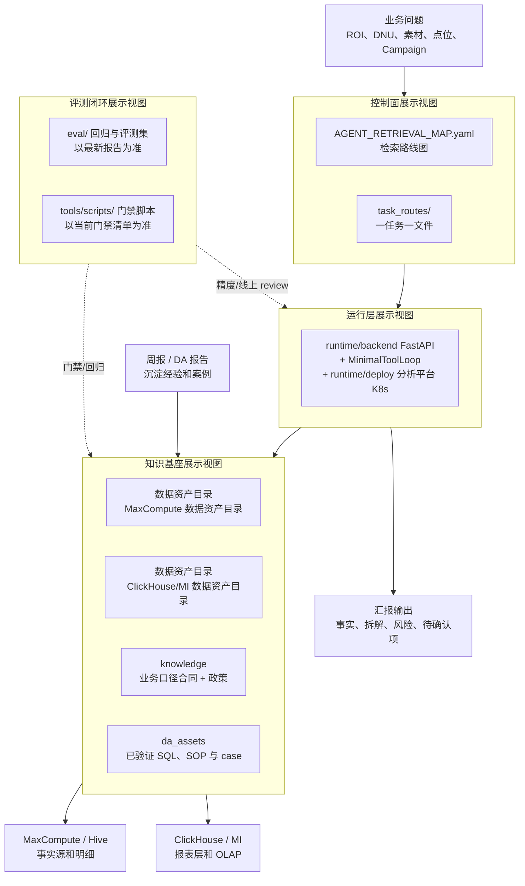
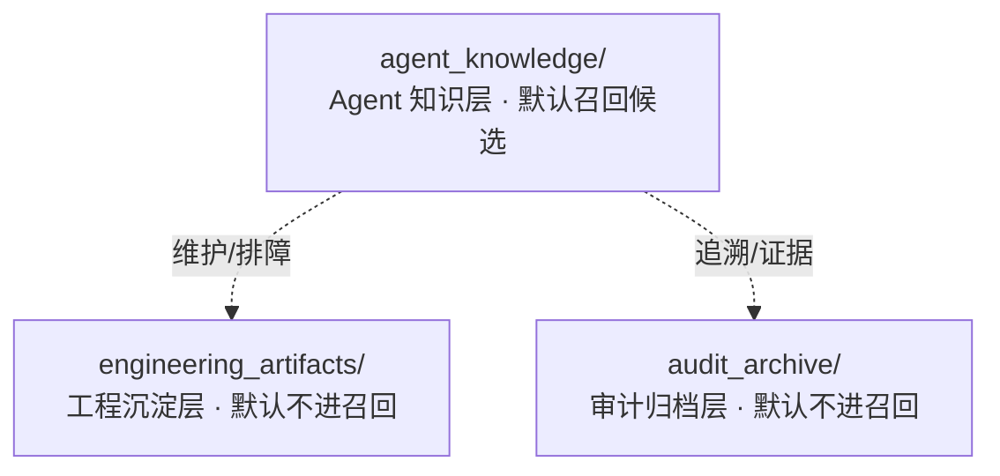
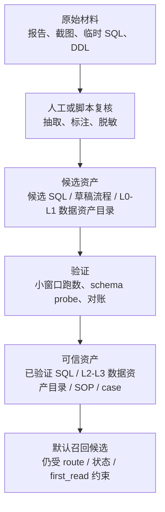
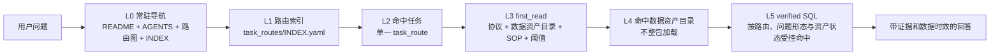
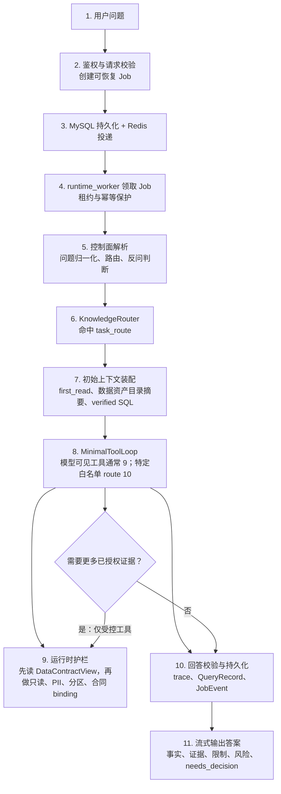
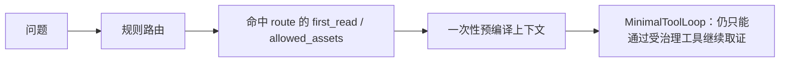
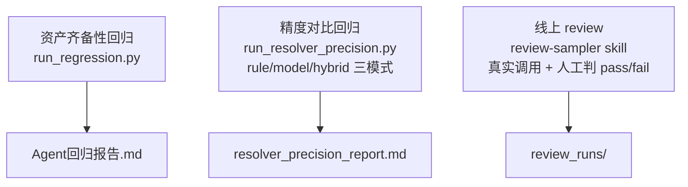

# 当前系统架构图 · mermaid 备份

> 备份自 [`当前系统架构图.md`](当前系统架构图.md)。
> 正文已改用手绘 Excalidraw PNG；本文件仅保留原始 mermaid 源，便于 diff / 文本检索。
> 备份日期：2026-07-31（单一 Python Runtime 主链）。
> 说明：图 1 的四块是展示视图，不是 Runtime 权威架构的 L1–L6；白盒主链见 [`从一个问题看懂Data Agent.md`](从一个问题看懂Data%20Agent.md)。

## 图1 · §1 系统全景（四层栈）

## 图2 · §2 知识基座三层模型

## 图3 · §3 知识晋升通道

## 图4 · §4 控制面按需加载

## 图5 · §5 运行层问答主路径

## 图6 · §5.2 默认 off 主路径

## 图7 · §6 评测闭环三线评测

