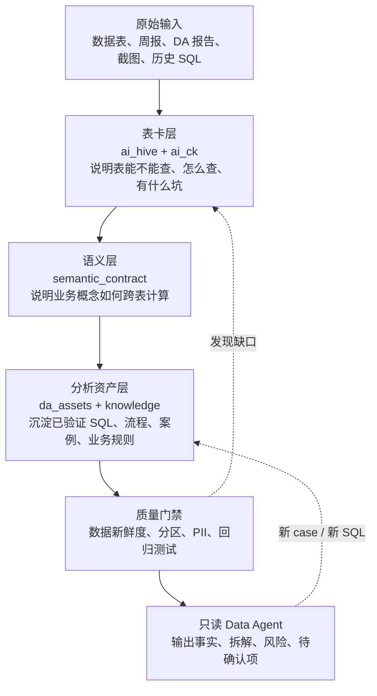
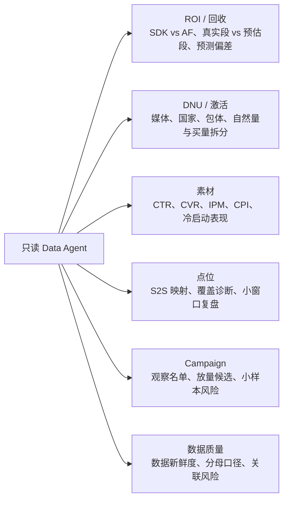
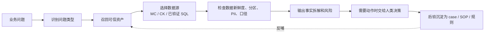

# Data Agent 数据基座汇报稿

> 面向汇报：这份材料用来说明“我们为什么要建设 Data Agent 数据基座、现在做到什么程度、下一步应该补什么”。  
> 展示边界：只讲脱敏架构、能力和流程；不展示凭证、用户级明细或广告平台操作人。

## 先给结论

当前工程已经形成一套面向投放分析的 Data Agent 数据基座。它把原本分散在表、SQL、周报、口径文档和人工经验里的信息，整理成 Agent 可以读取、校验和复用的知识体系。

一句话说，它解决的是：

> 当业务问“ROI 为什么掉了、DNU 从哪里变了、某个 campaign 是否值得继续观察”时，Agent 不再临场猜表、猜口径、猜 SQL，而是先走一条可追溯的分析链路。

当前适合做只读分析 POC：解释发生了什么、怎么拆、风险在哪里、还缺什么确认。  
当前不适合自动做投放动作：停投、放量、降预算、迁预算仍需要人类拍板和后验评估。

## 为什么需要这个基座

| 没有基座时 | 有基座后 |
|---|---|
| 表很多，Agent 容易选错表 | 表卡告诉 Agent 哪张表能查、怎么查、有什么坑 |
| 同一个指标可能有多种口径 | 语义层把默认口径和对照口径写成机器可读合同 |
| SQL 复用靠人记忆 | 已验证 SQL、分析流程、复盘案例变成可召回资产 |
| 数据没到时容易误判业务劣化 | 数据新鲜度和回归门禁先判断“数据是否成熟” |
| 阈值和动作边界容易被 Agent 误下结论 | “待拍板”状态明确告诉 Agent 哪些必须交给人 |

## 系统分层

## 每一层负责什么

| 层 | 给业务的解释 | 内部载体 |
|---|---|---|
| 表卡层 | 给每张表写“使用说明书” | `ai_hive/`、`ai_ck/` |
| 语义层 | 把 ROI、LTV、DNU、留存等概念写成统一合同 | `knowledge/agent_knowledge/semantic_contract/` |
| 分析资产层 | 把跑通过的分析方法沉淀成可复用资产 | `da_assets/verified_sql/`、分析流程、复盘案例 |
| 业务知识层 | 保存确认过的业务规则、分析协议和阈值说明 | `knowledge/` |
| 质量门禁层 | 防止错用旧数据、错跑大表、输出敏感字段 | `tools/`、`eval/` |
| 规划与待办层 | 管理还缺什么、谁来确认、什么时候推进 | `TODO/`、`data_agent_plan/` |

## 当前可以支持的问题

这些问题的共同输出不是“直接给动作”，而是：

1. 事实结果：查到什么。
2. 口径说明：用了什么分母、时间窗、数据源。
3. 拆解路径：变化由哪些维度贡献。
4. 风险提示：数据是否未到、样本是否太小、口径是否待确认。
5. 待确认项：哪些需要 DA、UA 或业务 owner 拍板。

## 当前阶段判断

| 模块 | 当前判断 | 汇报时怎么讲 |
|---|---|---|
| 表卡与数据目录 | 主链路已经成型 | Agent 已经有“找表地图” |
| 语义层 | 具备跨表合同和回归 | Agent 不再只靠散文推断指标 |
| 已验证 SQL | 已能覆盖一批高频问题 | 复用跑通过的 SQL，减少临场风险 |
| 数据新鲜度 | 已有 MC / CK 检查机制 | 避免把“数据没到”误判成“业务变差” |
| 回归测试 | 已有问答和语义回归 | 变更后可以检查 Agent 是否仍按正确路径工作 |
| 决策闭环 | 仍待建设 | 人类动作、广告平台日志和后验还没完全结构化 |

## 只读分析工作流

## 下一步建设路线

| 优先级 | 建设重点 | 目标 |
|---|---|---|
| P0 | 跑稳只读 POC | 选 3 类高频问题，完整跑通问题识别、查数、解释、风险输出 |
| P1 | 结构化人类经验 | 把冷启动、小样本、观察期、红线、达标线写成明确状态和待决项 |
| P2 | 接入只读操作记录 | 解释预算、bid、状态变化，但不自动执行动作 |
| P3 | 建立后验闭环 | 每个动作沉淀 D+1 / D+3 / D+7 后验，形成策略记忆 |

## 汇报时最重要的一句话

这个基座的价值不是让 Agent 立刻替人做投放动作，而是先让 Agent 的分析变得可追溯、可复用、可校验。  
只有当“问题、证据、判断、人工动作、后验结果”连成闭环后，才适合进一步讨论更高阶的投放治理自动化。
