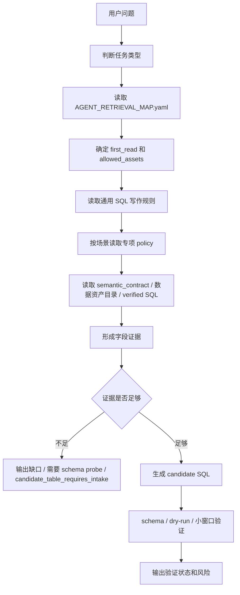

# Text2SQL 当前能力说明

> 状态：beginner_guide
> 创建日期：2026-06-19
> 读者：刚接触本仓 Data Agent / Text2SQL 能力的人。
> 目的：解释“现在新增的 Text2SQL 能力是什么、材料沉淀在哪里、Agent 每次如何检索、数据链路如何走、上下文应加载什么”。
> 边界：本文是解释文档，不新增业务口径，不替代 `AGENT_RETRIEVAL_MAP.yaml`、数据资产目录、语义层或 SQL 晋升门禁。

## 一句话解释

当前的 Text2SQL 不是一个独立自动写 SQL 的大程序。

它更像一条受控工作流：

```text
用户一句业务问题
  -> 先理解业务场景
  -> 再找该读哪些规则和表
  -> 再证明字段和口径有依据
  -> 再写 candidate SQL
  -> 最后通过 schema / dry-run / 小窗口验证后，才可能晋升
```

所以它的核心能力不是“敢写 SQL”，而是：

```text
能把一句业务话，变成有证据、有边界、可验证的 SQL 草案。
```

## 现在已经有了什么

这次新增 DA 认证知识后，本仓多了一层“业务问题编译能力”。

以前更像是：

```text
有数据资产目录
有语义层
有 verified SQL
```

现在补上了：

```text
用户说一句话后，Agent 知道怎么理解场景、怎么选规则、怎么避免乱写 SQL。
```

当前已经具备：

| 能力 | 当前体现 |
|---|---|
| 需求标准化 | 能把“看实验效果 / 查留存 / 看广告链路”拆成产品、端、时间、维度、指标、限制条件 |
| 场景识别 | 能区分产品实验、商业化实验、白名单事件、AB3.0、小包、用户行为、局轮出块、MB 看板等 |
| 选表路由 | 能先判断该走哪类表、哪些表只是候选、哪些必须先做 intake |
| 指标口径提醒 | 能提醒“留存”在实验和大盘里不是一个口径，收入 / ECPM 是否含 banner 也要说明 |
| 字段证据要求 | 新写 SQL 前必须说明字段来自哪里、证据是什么、验证到哪一步 |
| 候选边界 | 未验证 SQL 只能是 `candidate_sql`，不能当 verified |
| 验证门禁 | 继续使用现有 schema、dry-run、小窗口、SQL 晋升、回归门禁 |

当前还没有：

| 尚未具备 | 说明 |
|---|---|
| 完整自动 planner | 还没有一个自动 runtime 负责全流程编排 |
| 自由 Text2SQL 引擎 | 不允许自然语言直接跳到 SQL |
| 自动 verified 晋升 | SQL 必须经过门禁，不会因为看起来对就自动成为 verified |
| 自动业务决策 | 停投、放量、预算、阈值仍然需要 owner 拍板 |

## 材料沉淀在哪里

你可以把本仓想成几层。Text2SQL 每次都会跨这些层拿材料。

| 层 | 目录 / 文件 | 放什么 | Text2SQL 怎么用 |
|---|---|---|---|
| 路由控制面 | `AGENT_RETRIEVAL_MAP.yaml` | 任务类型、先读文件、允许资产、输出护栏 | 第一步判断要走哪条路线 |
| 业务规则层 | `knowledge/agent_knowledge/policies/` | SQL 写作规范、商业化、实验、白名单、AB3.0、小包、用户行为、MB 等规则 | 理解用户话术和业务场景 |
| 语义契约层 | `knowledge/agent_knowledge/semantic_contract/model.json` | 跨表实体、指标、维度、join 契约 | 确认指标和 join 关系，不靠散文猜 |
| 数据资产目录层 | `数据资产目录/agent_knowledge/tables/`、`数据资产目录/agent_knowledge/tables/` | 表字段、分区、PII、freshness、join key、known pitfalls | 证明字段存在、表能不能用 |
| SQL 资产层 | `da_assets/verified_sql/` | 已验证可复用 SQL | 能复用就优先复用 |
| 候选 SQL 层 | `da_assets/candidate_sql/` | 未完成 verified 门禁的 SQL | 新写 SQL 先落这里，不默认召回 |
| 字段证据模板 | `da_assets/Text2SQL字段证据模板.md` | 字段证据结构 | 新写 candidate SQL 前必须按它说明依据 |
| 晋升门禁 | `da_assets/SQL晋升治理.md` | candidate -> verified 的规则 | 决定 SQL 能不能晋升 |
| 待办队列 | `TODO/SQL写作链候选表准入积压清单.md` | 还没纳入 数据资产目录的候选表 | 告诉 Agent 哪些表还不能当稳定事实 |
| 建设计划 | `TODO/Text2SQL保守建设计划.md` | 保守建设路线 | 说明当前不做大而全 runtime |
| 回归门禁 | `eval/`、`tools/scripts/check_*` | consistency、数据资产目录、路由、SQL 晋升、回归 | 防止把候选当事实、把草稿当 verified |

这次 DA 认证资料不是被放进一个新目录里，而是被拆进了项目原有层级：

```text
业务规则 -> knowledge/agent_knowledge/policies/
候选表 -> TODO/SQL写作链候选表准入积压清单.md
已 probe 表 -> 数据资产目录/agent_knowledge/tables/
字段证据模板 -> da_assets/
候选 SQL -> da_assets/candidate_sql/
verified SQL -> da_assets/verified_sql/
```

## Agent 每次检索是怎么产生的

Agent 不应该一上来全仓乱搜。正确流程是：



以 `text2sql_or_sql_planning` 为例，`AGENT_RETRIEVAL_MAP.yaml` 现在会让 Agent 先读：

```text
AGENT_RETRIEVAL_MAP.yaml
knowledge/agent_knowledge/policies/SQL写作业务协议.md
knowledge/agent_knowledge/policies/SQL表路由协议.md
knowledge/agent_knowledge/policies/游戏核心指标口径语义.md
TODO/Text2SQL保守建设计划.md
da_assets/Text2SQL字段证据模板.md
knowledge/agent_knowledge/semantic_contract/model.json
da_assets/index.yaml
数据资产目录/agent_manifest.yaml
数据资产目录/agent_manifest.yaml
```

然后再按问题内容追加专项材料。

例如用户说“看商业化实验”：

```text
商业化SQL协议.md
白名单事件表查询协议.md
实验配置与方案查询规则.md
示例产品商业化埋点查询规则.md
相关 数据资产目录 数据资产目录
```

用户说“看 AB3.0 fs / rv / ba”：

```text
AB3实验ID提取规则.md
白名单事件表查询协议.md
示例产品商业化埋点查询规则.md
相关数据资产目录
```

用户说“看 MB 看板指标”：

```text
示例产品BI看板查询规则.md
游戏核心指标口径语义.md
SQL表路由协议.md
相关数据资产目录或 backlog
```

## 整个数据链路是什么样

完整链路可以拆成 8 步。

### 1. 用户问题进入

例子：

```text
帮我看下 示例产品 GP 145 期商业化实验的插屏 ready 和收入。
```

### 2. 需求标准化

Agent 先把自然语言变成标准需求：

```yaml
product: Game Top
platform: GP
scenario: 商业化实验
experiment_batch: "145期"
metrics:
  - 插屏 ready
  - 插屏收入
dimensions:
  - 方案号
  - 天
time_window: 需要从实验配置补
```

这一步主要依赖：

```text
SQL写作业务协议.md
游戏核心指标口径语义.md
```

### 3. 场景 policy 命中

Agent 判断这是商业化实验，不是普通大盘，也不是用户画像。

因此读取：

```text
商业化SQL协议.md
白名单事件表查询协议.md
实验配置与方案查询规则.md
示例产品商业化埋点查询规则.md
```

### 4. 表路由

Agent 找候选表：

```text
实验配置表：补 145 期对应方案号和起止时间
商业化实验汇总表或白名单事件表：取 ready / 收入
```

这一步要判断：

- 表是否已经在 `数据资产目录/agent_knowledge/catalog.yaml`。
- 是否有数据资产目录。
- 分区字段是什么。
- 是否需要 `hour`。
- 是否必须过滤 `app_name`。
- 白名单事件表是否必须过滤 `event_name`。

### 5. 字段证据

写 SQL 前必须形成字段证据。不是“我觉得这个字段像收入”，而是：

```text
需求项 -> 字段 -> 表 -> 证据来源 -> 验证状态
```

例子：

```yaml
field_evidence:
  - requirement_item: 插屏收入
    item_type: metric
    source_table: IAA Game Studio.xxx
    source_field: inter_revenue
    evidence_source:
      type: da_metadata
      path: 数据资产目录/agent_knowledge/tables/xxx.yaml
    validation_status: schema_probe
```

模板在：

```text
da_assets/Text2SQL字段证据模板.md
```

### 6. 生成 candidate SQL

证据足够时，Agent 才能写 SQL。

这时 SQL 状态是：

```text
candidate_sql
```

不能默认召回，也不能说“这是 verified”。

### 7. 验证

候选 SQL 需要继续验证：

| 验证 | 说明 |
|---|---|
| schema probe | 字段存在 |
| dry-run | SQL 可编译 / 可执行 |
| 小窗口验证 | 小范围跑数，检查行数、聚合值、空值、异常 |
| verified 晋升 | 补齐验证记录和风险后进入 `verified_sql/` |

### 8. 回写

验证后按结果回写：

| 结果 | 回写位置 |
|---|---|
| 表字段有新证据 | `数据资产目录/agent_knowledge/tables/` 或 `数据资产目录/agent_knowledge/tables/` |
| SQL 未验证 | `da_assets/candidate_sql/` |
| SQL 小窗口通过 | 仍在 candidate 或标 validated |
| SQL 稳定可复用 | `da_assets/verified_sql/` |
| 发现新规则 | `knowledge/agent_knowledge/policies/` |
| 需要 DA / owner 确认 | `TODO/` |

## 每次上下文应该加载什么

不是每次把全仓都塞进上下文。推荐按层加载。

### 必读：判断路线

```text
AGENT_RETRIEVAL_MAP.yaml
README.md
```

作用：知道这次任务属于哪类，哪些目录不能默认召回。

### Text2SQL 通用必读

```text
knowledge/agent_knowledge/policies/SQL写作业务协议.md
knowledge/agent_knowledge/policies/SQL表路由协议.md
knowledge/agent_knowledge/policies/游戏核心指标口径语义.md
TODO/Text2SQL保守建设计划.md
da_assets/Text2SQL字段证据模板.md
```

作用：标准化需求、选表、确认指标语义、要求字段证据。

### 有跨表指标时

```text
knowledge/agent_knowledge/semantic_contract/model.json
knowledge/agent_knowledge/semantic_contract/README.md
```

作用：看指标、维度、join 是否已有机器可读契约。

### 需要复用 SQL 时

```text
da_assets/index.yaml
da_assets/verified_sql/
da_assets/SQL晋升治理.md
```

作用：优先找 verified SQL；不要重复写。

### 需要查表字段时

```text
数据资产目录/agent_knowledge/catalog.yaml
数据资产目录/agent_knowledge/tables/<相关表>.yaml
数据资产目录/agent_knowledge/catalog.yaml
数据资产目录/agent_knowledge/tables/<相关表>.yaml
```

作用：确认字段、分区、PII、freshness、join key。

### 场景专项再加载

| 用户问题 | 追加读取 |
|---|---|
| 商业化 / 广告链路 | `商业化SQL协议.md`、`白名单事件表查询协议.md`、`示例产品商业化埋点查询规则.md` |
| 产品实验 / 方案号 | `实验配置与方案查询规则.md` |
| AB3.0 | `AB3实验ID提取规则.md` |
| 小包广告单元 | `小包广告单元映射.md`、配套 CSV |
| 用户行为 / 留存 / 画像 | `用户行为留存画像查询规则.md` |
| 示例产品 局 / 轮 / 出块 | `局轮出块粒度查询规则.md` |
| MB 看板 | `示例产品BI看板查询规则.md` |
| 模型特征 / 埋点元数据 | `特征工程与埋点元数据查询规则.md` |
| UA / ROI / 投放 | `投放与ROI预估SQL协议.md` |

## 小白怎么判断 Agent 有没有走对

看 Agent 输出里有没有这些东西：

1. 有没有说明这是哪个场景。
2. 有没有标准化产品、端、时间、维度、指标。
3. 有没有说用哪些表，为什么。
4. 有没有字段证据。
5. 有没有分区、`app_name`、`event_name`、`hour` 等过滤。
6. 有没有说明验证状态：未跑、schema_probe、dry_run、small_window、verified。
7. 有没有说明 PII / freshness / 口径风险。
8. 有没有把 candidate 和 verified 分清楚。

如果 Agent 直接给 SQL，但没有字段证据、没有验证状态，就不算合格。

## 常见误区

### 误区 1：Text2SQL 就是自动写 SQL

不是。

当前 Text2SQL 是“受控写 SQL”。它必须先走规则、数据资产目录、语义层和字段证据。

### 误区 2：DA 认证资料里的 SQL 可以直接 verified

不能。

DA 认证资料可以作为高质量业务线索，但 SQL 仍要经过数据资产目录、schema、dry-run、小窗口和晋升门禁。

### 误区 3：有表名就能写 SQL

不能。

必须确认字段、分区、粒度、PII、freshness 和 join key。

### 误区 4：candidate SQL 放进仓库就能默认召回

不能。

`candidate_sql` 明确不是默认召回。只有通过治理进入 `verified_sql` 或 `semantic_promoted` 后，才是稳定路径。

### 误区 5：Text2SQL 需要一个 `text2sql/` 顶层目录

当前不需要。

Text2SQL 是跨层工作流，不是独立资产目录。它消费 `knowledge`、`semantic_contract`、`数据资产目录`、`数据资产目录`、`da_assets`、`TODO`、`eval`。

## 当前最重要的下一步

保守建设的下一步不是做大模型 runtime，而是选一个小场景压实证据链。

建议第一条：

```text
实验配置补元信息 + 商业化实验候选 SQL
```

目标不是立刻 verified，而是做到：

- 能标准化问题。
- 能命中正确 policy。
- 能找到配置表和事实表候选。
- 能形成字段证据。
- 能写出 candidate SQL。
- 能说清验证状态和下一步。

做到这一条后，再复制到其他场景。

## 快速查找

| 想知道 | 看哪里 |
|---|---|
| Text2SQL 保守路线 | `TODO/Text2SQL保守建设计划.md` |
| Text2SQL 当前能力解释 | `showoff/Text2SQL当前能力说明.md` |
| 字段证据怎么写 | `da_assets/Text2SQL字段证据模板.md` |
| Agent 怎么检索 | `AGENT_RETRIEVAL_MAP.yaml` |
| SQL 怎么晋升 | `da_assets/SQL晋升治理.md` |
| 候选表还有哪些 | `TODO/SQL写作链候选表准入积压清单.md` |
| 已验证 SQL 在哪 | `da_assets/verified_sql/` |
| 候选 SQL 在哪 | `da_assets/candidate_sql/` |
| 表字段和分区在哪 | `数据资产目录/agent_knowledge/tables/`、`数据资产目录/agent_knowledge/tables/` |
| 指标和 join 契约在哪 | `knowledge/agent_knowledge/semantic_contract/model.json` |
