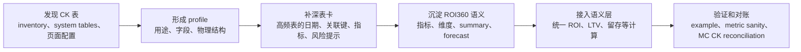
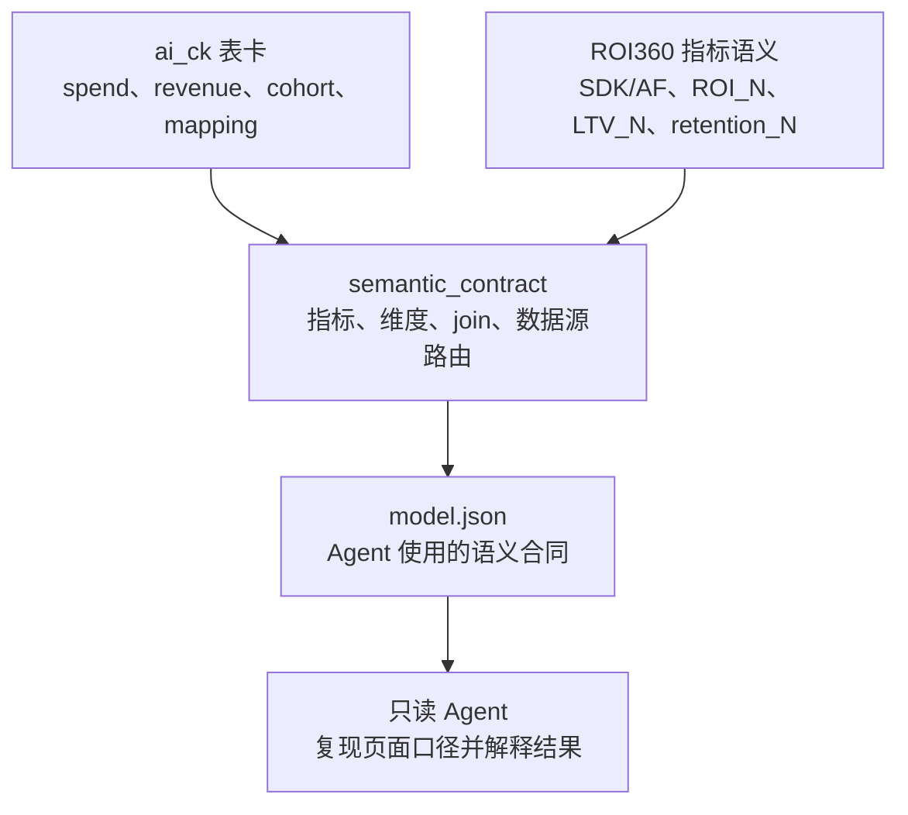
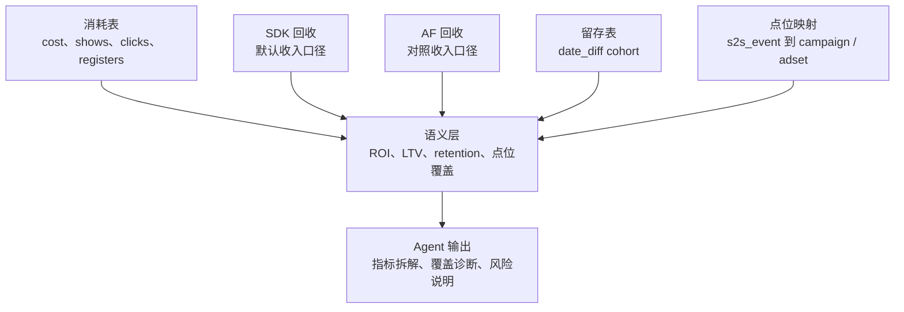
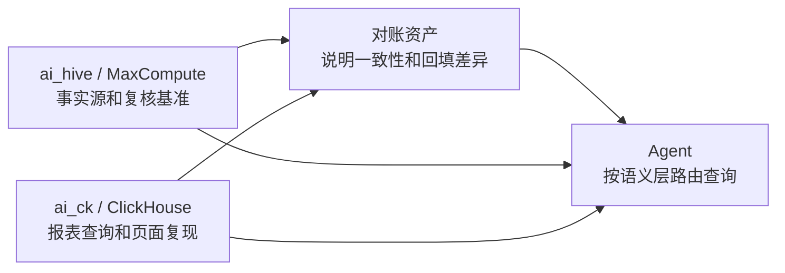

# ai_ck 建设思路与语义层关系

> 汇报定位：解释 ClickHouse / MI 报表知识库如何支撑 ROI360、投放报表和点位诊断。  
> 适合听众：投放、DA、数仓、BI、需要理解“MI 页面和底层数据如何对齐”的同学。

## 一句话说明

`ai_ck/` 是 ClickHouse / MI 报表层的知识库。它告诉 Agent：MI 页面背后有哪些表，哪些字段代表消耗、回收、留存，ROI360 的默认口径是什么，campaign 应该怎么匹配，哪些查询必须带日期条件。

它的定位是高频报表查询和页面口径复现，不替代 MaxCompute / Hive 事实源。

## 为什么需要 ai_ck

投放同学最常看的很多指标来自 MI / ROI360。要让 Agent 解释这些指标，不能只知道“有一张 CK 表”，还要知道：

| 问题 | ai_ck 的回答 |
|---|---|
| 页面指标来自哪里 | CK 表、view、ROI360 字段配置 |
| 指标怎么汇总 | cost、revenue 可累加；ROI、CPI、CTR 等比率要重算 |
| campaign 怎么匹配 | 当前 MI 兼容路径以 `campaign_name` 为主，`campaign_id` 是稳定备选 |
| 数据是否能用 | 数据新鲜度、日期字段、`date_diff`、页面视图 / 物理表差异 |
| 和 MC 是否一致 | 通过 spend、revenue、cohort 等对账资产说明 |

## 建设主线

## CK 表成熟度

| 阶段 | 对外解释 | Agent 能做什么 |
|---|---|---|
| 阶段 0：发现 | 只在清单或原始留档中出现 | 不默认使用 |
| 阶段 1：有画像 | 知道字段、结构、大致用途 | 可按需参考 |
| 阶段 2：可查询 | 有日期、关联键、指标、样例和风险说明 | 可生成受限查询 |
| 阶段 3：已验证 | 有连通探测、指标校验、对账或 MI 证据 | 可用于高频召回和语义层 |

## ai_ck 如何连接语义层

语义层从 `ai_ck/` 继承的关键规则：

| 规则 | 为什么重要 |
|---|---|
| 消耗和回收通常按 `active_date` 看 | 避免把 cohort 日期和报表日期混用 |
| 留存 / 回收要处理 `date_diff` | ROI7、LTV7 不是简单取一列 |
| SDK 是 ROI360 默认回收源，AF 是对照 | 避免把两套收入口径混用 |
| 比率指标跨维度要重算 | 避免把 ROI、CTR、CPI 直接相加 |
| `campaign_name` 精确匹配不能随意 trim | 保持和 MI 页面筛选一致 |

## ROI360 主链路

## 和 ai_hive 的关系

汇报时可以这样说：

- 查页面、报表、ROI360 快速聚合，优先用 CK。
- 查事实争议、训练、标签、明细复核，优先回 MC。
- 两边同源但可能有回填时差，所以需要对账资产说明差异。
- Agent 不能直接把 CK 和 MC 放进一条 SQL join；要分别查，再在应用层对齐。

## 维护时要守住的底线

- `_local`、temp、test、staging 和原始留档默认不召回。
- CK 查询必须带日期范围。
- 留存和回收要同时处理 cohort 日期和 `date_diff`。
- 不输出 CK、MI、SSO 凭证或敏感明细。
- 数据延迟时先提示“数据可能未到”，不直接判断业务变差。
