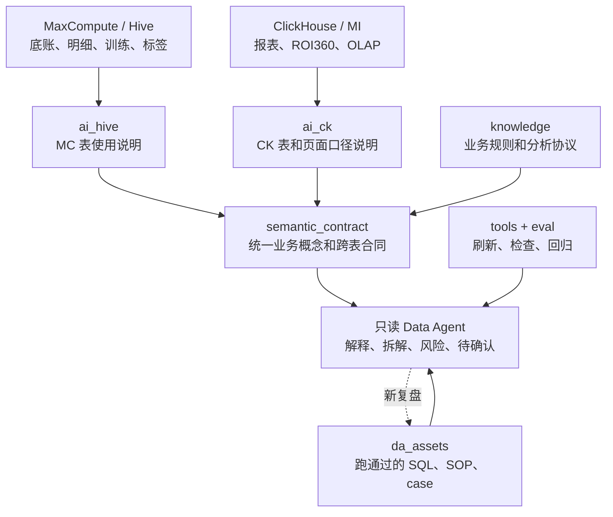
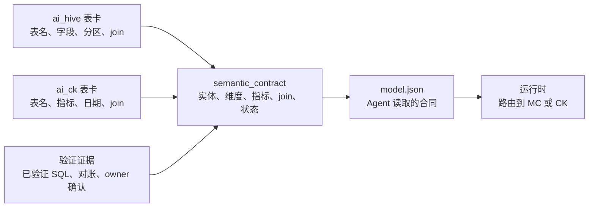
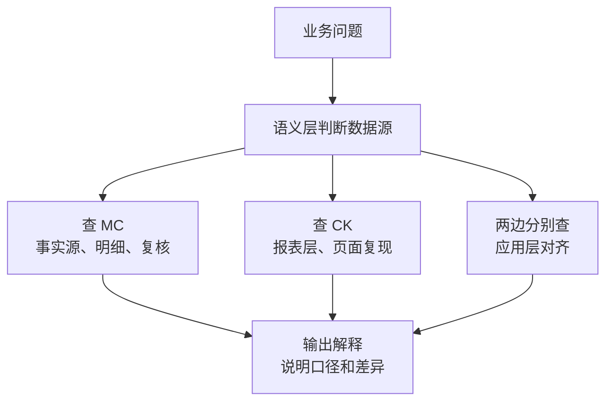
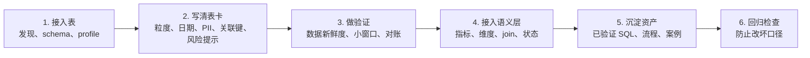

# ai_hive 与 ai_ck 关系及语义层接入总览

> 汇报定位：用一份总览材料讲清楚 MC 事实源、CK 报表层、语义层、分析资产层之间的关系。  
> 适合场景：当听众问“为什么要同时建 ai_hive 和 ai_ck，它们和语义层到底是什么关系”时使用。

## 先给答案

`ai_hive` 和 `ai_ck` 都是表卡层，但服务不同数据源：

- `ai_hive` 管 MaxCompute / Hive，更接近底账、明细、训练、标签和事实复核。
- `ai_ck` 管 ClickHouse / MI，更接近看板、ROI360、OLAP 聚合和页面口径复现。
- `semantic_contract` 不替代它们，而是站在它们上面，把“ROI、LTV、留存、DNU、campaign、点位”等业务概念统一成机器可读合同。

## 总体架构

## 两套表卡层怎么分工

| 维度 | ai_hive | ai_ck |
|---|---|---|
| 面向数据 | MaxCompute / Hive | ClickHouse / MI |
| 更像什么 | 事实底账说明书 | 看板查询说明书 |
| 适合问题 | 明细复核、标签、训练、S2S、AF ODS、预测偏差 | ROI360、消耗、回收、留存、campaign 映射、页面复现 |
| 风险重点 | 大表分区、PII、字段注释误导、join 证据不足 | 日期范围、比率汇总、view 差异、campaign 字符串匹配 |
| 语义层贡献 | MC 侧表、字段、分区、事实证据 | CK 侧表、指标、页面口径、报表 join |

## 语义层怎么使用二者

可以把语义层理解成“业务口径说明书的机器版”：

| 业务问法 | 语义层要回答 |
|---|---|
| ROI7 怎么算 | 用哪个收入源、哪个成本、哪个 date_diff、是否真实段 |
| LTV 分母是什么 | 默认用 AF 注册设备还是媒体安装 |
| campaign 怎么 join | 当前用 `campaign_name` 还是 `campaign_id` |
| 能不能按国家拆 | 相关表是否都有国家字段，没有时如何处理 |
| 数据源查哪边 | 走 MC、CK，还是两边分别查后对齐 |

## 跨源查询原则

核心原则：

- 能在同一数据源内完成，就不要跨源拼。
- 需要同时看 MC 和 CK 时，两边分别查，再在应用层对齐。
- MC 与 CK 同源表要有对账资产说明一致性和回填差异。
- 数据延迟、口径待确认、样本过小，都要在输出里显式说明。

## 共同建设路线

## 汇报中要讲清楚的边界

| 边界 | 说明 |
|---|---|
| 表卡层 | 解决“表能不能查、怎么查、有什么坑” |
| 语义层 | 解决“业务概念怎么统一计算” |
| 资产层 | 解决“哪些分析已经跑通过、可以复用” |
| 知识层 | 解决“哪些业务规则已经确认、哪些仍在试运行” |
| 门禁层 | 解决“数据没到、字段敏感、SQL 危险时怎么办” |
| 人工决策 | 解决“停投、放量、阈值、预算动作谁拍板” |

## 最小闭环

每次新增一张表、一个指标或一个分析 case，都要能回答四个问题：

1. 物理来源在哪里。
2. Agent 该如何安全查询。
3. 它在语义层里对应哪个业务概念。
4. 有没有验证证据和回归门禁。
