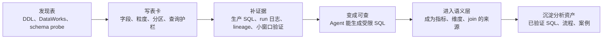
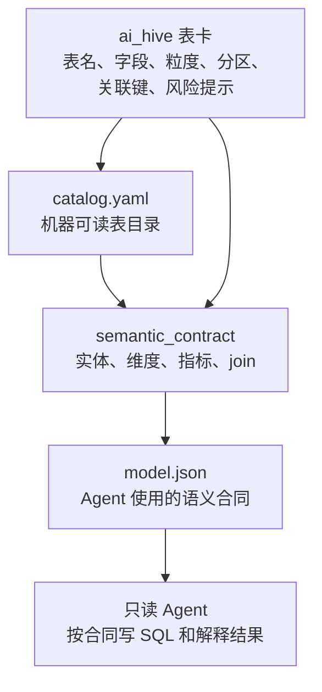
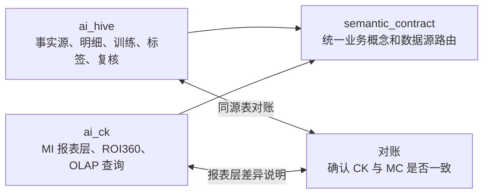

# ai_hive 建设思路与语义层关系

> 汇报定位：解释 MaxCompute / Hive 表知识库为什么重要、怎么建设、怎样把底层事实源连接到语义层。  
> 适合听众：DA、数仓、投放分析同学，以及需要理解“Agent 为什么不会乱查表”的业务同学。

## 一句话说明

`ai_hive/` 是 MaxCompute / Hive 表的“使用说明书集合”。它告诉 Agent：这张表解决什么问题、按什么粒度记录、必须带哪些分区、哪些字段不能输出、可以和哪些表关联、有哪些常见误用。

它的作用不是替代语义层，而是给语义层提供可靠的事实来源。

## 为什么先建设 ai_hive

MaxCompute / Hive 侧承载的是事实源、明细、训练、标签和规则发现。如果这里的表说明不清楚，Agent 后面写 SQL、做分析、判断 ROI 或 DNU 时都会变成猜。

`ai_hive/` 要先解决四个问题：

| 问题 | ai_hive 的回答 |
|---|---|
| 表在哪里 | `catalog.yaml` 和 `tables/*.yaml` 给出完整表目录 |
| 怎么安全查 | 表卡写明分区、日期、PII、扫描窗口 |
| 怎么和别的表连 | `join_keys` 写清推荐关联键和证据 |
| 哪些地方容易错 | 常见误用说明提醒日期、分母、归因、字段注释等风险 |

## 建设主线

## 表卡成熟度

| 阶段 | 对外解释 | Agent 能做什么 |
|---|---|---|
| 阶段 0：发现 | 只知道有这张表 | 不能默认使用 |
| 阶段 1：可识别 | 知道字段、分区和大致用途 | 可以作为线索 |
| 阶段 2：可查询 | 有查询护栏、PII、关联键、样例 SQL | 可以生成受限 SQL |
| 阶段 3：已验证 | 有小窗口跑数、对账或 owner 确认 | 可以进入高频召回或语义层 |

## ai_hive 如何连接语义层

举例说明：

| ai_hive 提供 | 语义层使用方式 |
|---|---|
| 表的完整名称 | 告诉 Agent 该查哪张表 |
| 字段和类型 | 校验指标公式引用的列是否存在 |
| 分区和日期规则 | 防止 Agent 无界扫描大表 |
| join_keys | 固化同源表之间的关联关系 |
| 常见误用 | 在输出里提示口径风险 |

## 和 ai_ck 的关系

简单说：MC 更像底账，CK 更像看板查询层。  
当两边都能回答一个问题时，语义层负责告诉 Agent 应该查哪边，以及什么时候需要两边对账。

## 维护时要守住的底线

- 不靠字段名猜业务含义。
- 不把原始材料、草稿、截图抽取直接写成已验证事实。
- `join_keys` 必须有证据；证据不足就写待确认。
- 大表必须带分区或日期过滤。
- PII 字段只能按规则聚合或 join，不能输出明细。
- 表卡变更后要跑表卡质量检查。
