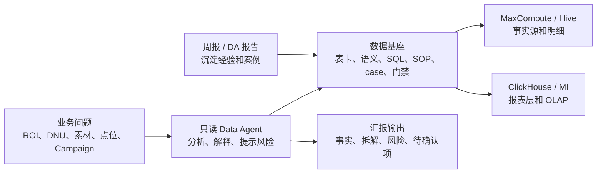
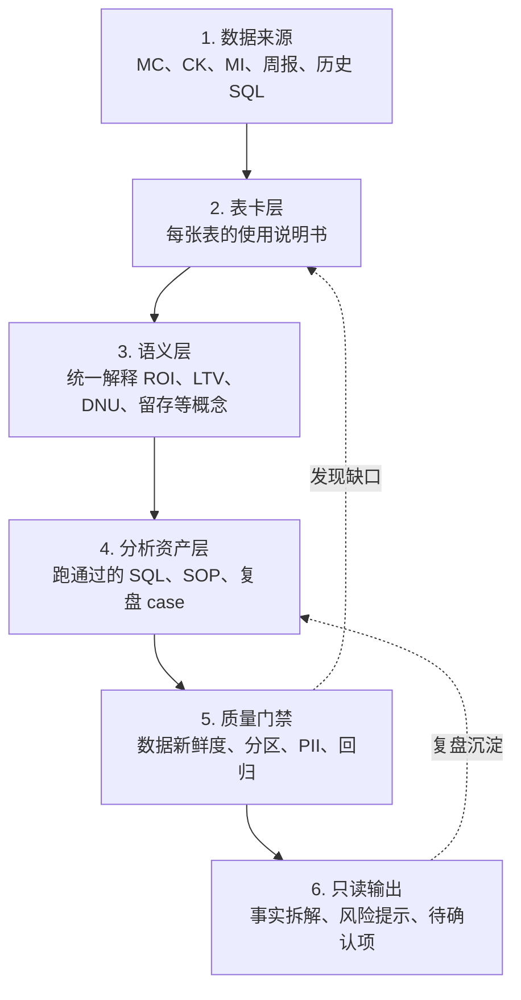
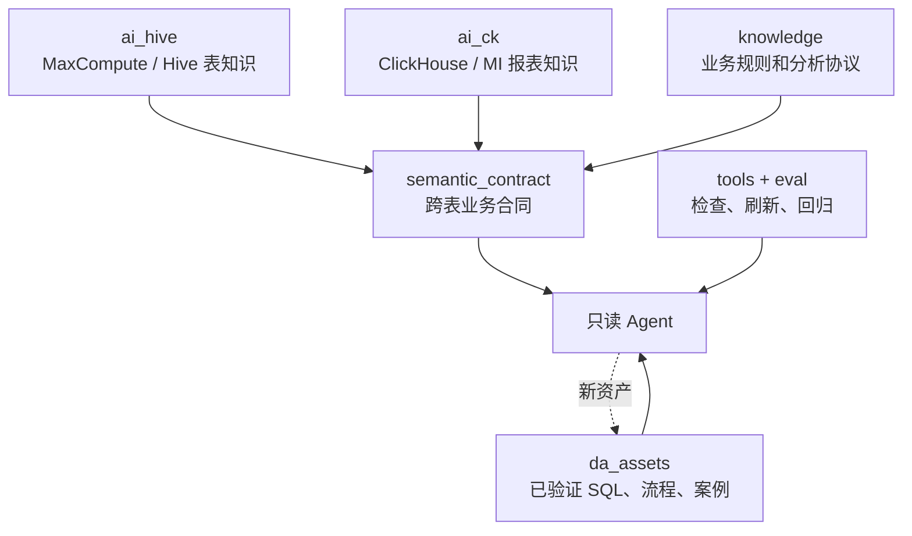
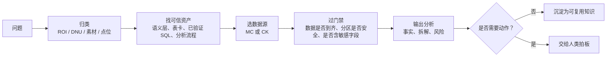
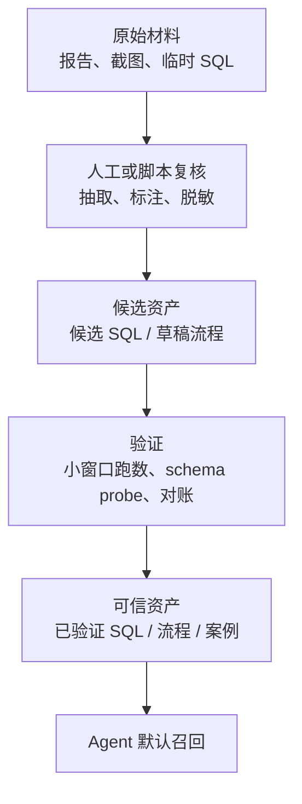

# 当前系统架构图

> 这份文档适合作为汇报附录。它不展开字段和脚本细节，只解释系统从“数据源”到“Agent 输出”的主路径。  
> 注意：这里画的是架构关系，不是实时数据状态。实时状态以刷新脚本和最新报告为准。

## 一句话说明

Data Agent 数据基座像一套“投放分析导航系统”：表卡告诉 Agent 去哪里查，语义层告诉 Agent 怎么算，分析资产告诉 Agent 哪些方法已经跑通过，质量门禁告诉 Agent 什么情况下不能下结论。

## 1. 系统全景

## 2. 数据到结论的分层

## 3. 核心目录关系

## 4. Agent 处理一个问题的路径

## 5. 资产如何变得可信

## 6. 这套架构的边界

| 边界 | 对外表达 |
|---|---|
| 只读优先 | 当前系统先做分析和解释，不自动改预算、停投或放量 |
| 数据成熟度 | 数据未到时先提示延迟，不把空结果当业务变差 |
| 证据分层 | 原始材料、草稿只能作线索，已验证 / 已确认内容才能作默认事实 |
| 跨源处理 | MC 和 CK 分别查询，应用层对齐，不直接跨库 SQL join |
| 人类拍板 | 阈值、动作和策略仍由业务 owner 确认 |
